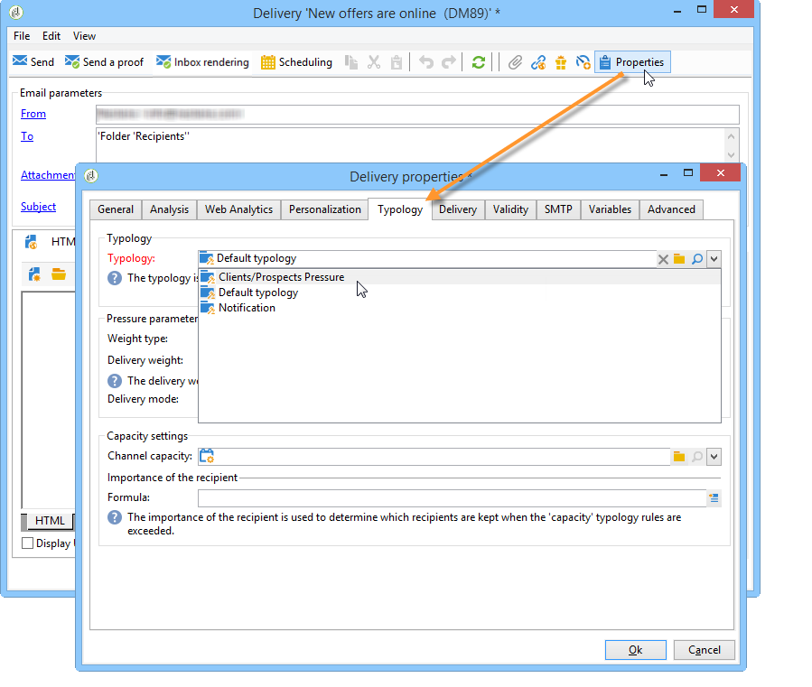
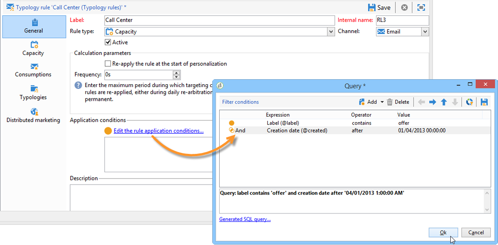
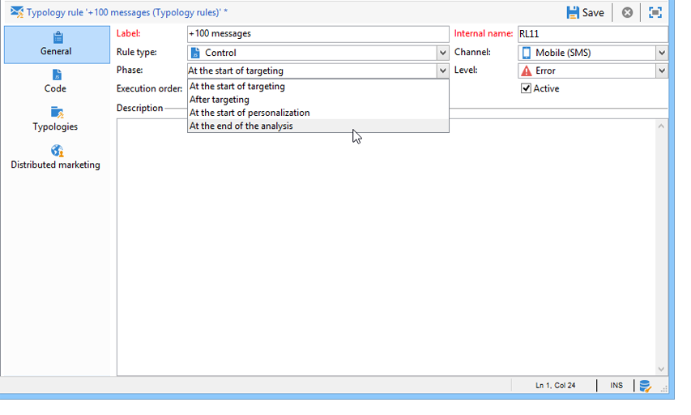
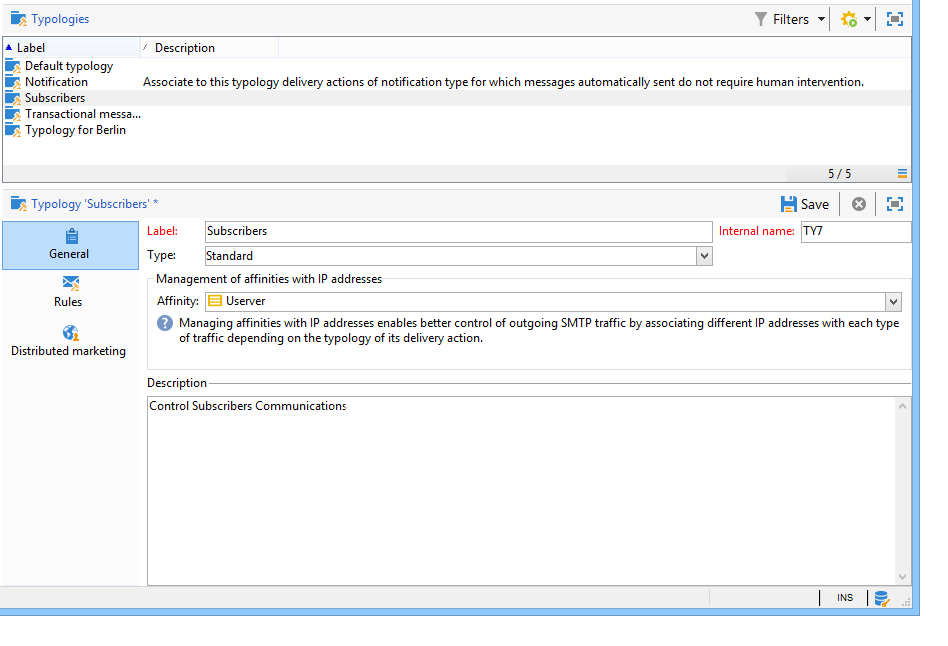
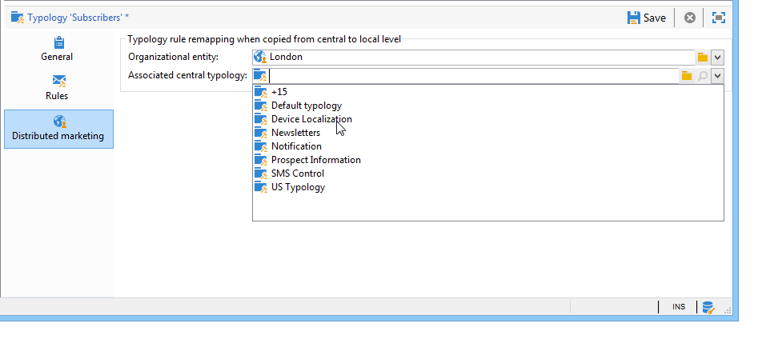

# Applying rules{#applying-rules}

## Applying a typology to a delivery {#applying-a-typology-to-a-delivery}

In order to apply the typology rules you created, you need to associate it to a typology and then reference this typology in your delivery. To do this:

1. Create a campaign typology.

   Typologies are accessed via the **[!UICONTROL Administration > Campaign Management > Typology management]** > **[!UICONTROL Typologies]** node. 

1. Go to the **[!UICONTROL Rules]** tab, click the **[!UICONTROL Add]** button and select the rules to apply with this typology.

   

1. Save the typology: is it added to the list of existing typologies.
1. Open the delivery you want to apply the rules to.
1. Open the delivery properties and access the **[!UICONTROL Typology]** tab.
1. Select the typology in the drop-down list.

   

   >[!NOTE]
   >
   >The typology can be defined in the delivery template, to be applied automatically to all deliveries created using this template.

## Defining application conditions {#defining-application-conditions}

You can restrict the application field of a rule according to your needs (except for control rules).

It is possible to configure typology rules so that they concern only certain deliveries which they are linked to, or certain recipients among the target of a delivery.

To define the application conditions of a rule, click the **[!UICONTROL Edit the rule application conditions...]** link in the **[!UICONTROL General]** tab.

Then use the query editor to define filtering conditions. In the following example, the capacity rule concerns only deliveries with the word 'offer' in their label or deliveries created before April 1st 2013.

>[!NOTE]
>
>For filtering rules, you can select the application condition of filtering criteria: they can depend on the delivery or the delivery outline. For more on this, refer to [Conditioning a filtering rule](filtering-rules.md#conditioning-a-filtering-rule).

## Adjusting calculation frequency {#adjusting-calculation-frequency}

Arbitrations are re-executed automatically every night via the database cleansing workflow. However, values can be saved beyond this period.

Indeed, some calculations use values which do not change on a daily basis. It would therefore be irrelevant to re-calculate data every day and overload the database for nothing. For example, if a process enriches the marketing database with customer propensity scores and purchase information on a weekly basis, the data based on these values doesn't need to be re-calculated every day.

To do this, the **[!UICONTROL Frequency]** field of the **[!UICONTROL General]** tab lets you define a maximum period during which targeting is saved. By default, the value **0** indicates that calculation remain valid until the next execution of daily re-arbitration.

To save the results beyond this period, enter a value greater than 12 in the **[!UICONTROL Frequency]** field: once this period expires, all rules are re-applied.

The **[!UICONTROL Re-apply the rule at the start of personalization]** option lets you apply the rule automatically during the personalization phase, including if the period stated in the **[!UICONTROL Frequency]** field is still valid.

## Selecting the rule application phase {#selecting-the-rule-application-phase}

Typology rules are applied in a specific sequence during the targeting, analysis and personalization phases of the deliveries they concern.

### Execution order {#execution-order}

In standard operation mode, the rules are applied in the following sequence:

1. Control rules, if they are applied at the start of targeting.
1. Filtering rules:

    * Native application rules for address qualification: defined address / non-verified address / address on the denylist / quarantined address / address quality.
    * Filtering rules defined by the user.
    * Deduplication rule on the address or the identifier (applied if necessary).

1. Pressure rules.
1. Capacity rules.
1. Control rules, if they are applied at the end of targeting.
1. Control rules, if they are applied at the start of personalization. If users rules (filtering / pressure / capacitive) have expired and need recalculating, they will be applied during this step.
1. Control rules, if they apply at the end of personalization.

>[!NOTE]
>
>If you are working with Campaign Interaction module, offer eligibility rules are applied at the same time as filtering rules (for offers found in the delivery outlines) or during the personalization phase, during the call to the offer engine.

You can adapt the execution sequence of rules which have the same type using the appropriate field in the **[!UICONTROL General]** tab of the rule. When several rules are executed during the same message processing phase, you can configure their execution sequence in the **[!UICONTROL Execution sequence]** field.

For example, a pressure rule with an execution order of 20 will be executed before a pressure rule with an execution order of 30.

### Control rules {#control-rules}

For **[!UICONTROL Control]** rules, you can decide at which point of the delivery life cycle the rule will be applied (before or after targeting, at the start of personalization, at the end of the analysis). Select the value to apply in the drop-down list of the **[!UICONTROL Phase]** field, in the **[!UICONTROL General]** tab of the typology rule.

Possible values are:

* **[!UICONTROL At the start of targeting]**

  To prevent the personalization step from being executed in case of errors, you can apply the control rule here. 

* **[!UICONTROL After targeting]**

  If you need to know the volume of the target in order to apply the control rule, select this phase.

  For example, the **[!UICONTROL Check proof size]** control rule applies after each targeting stage: this rule prevents message personalization if there are too many proof recipients.

* **[!UICONTROL At the start of personalization]**

  This phase must be selected if the control concerns the approval of message personalization. Message personalization is carried out during the analysis phase.

* **[!UICONTROL At the end of the analysis]**

  When a check requires message personalization to be complete, select this phase.

## Additional configurations {#additional-configurations}

### Control outgoing SMTP traffic {#control-outgoing-smtp-traffic}

As an option, you can use the **[!UICONTROL Managing affinities with IP addresses]** field to link deliveries to the delivery server (MTA) this affinity. This lets you restrict the number of emails for specific deliveries towards machines or output addresses. 

>[!NOTE]
>
>Affinity management does not apply for **[!UICONTROL Filtering]** typologies.  
>Affinities are defined in the instance configuration file, on the Adobe Campaign server. For more on this, refer to [this section](../../installation/using/about-initial-configuration.md).

### Campaign Optimization and Distributed Marketing {#campaign-optimization-and-distributed-marketing}

The **[!UICONTROL Distributed Marketing]** tab lets you define the re-mapping of typologies and/or rules which applies when a shared campaign is ordered and/or reserved. Typologies/rules defined for a local entity (linked to those defined for the central entity) replace rules/typologies linked to the central entity. Re-mapping lets you adapt central entity rules to the local entities who order the campaign.

>[!NOTE]
>
>In typologies and typology rules, the **[!UICONTROL Distributed Marketing]** tab is added if your license includes this option: please check you license agreement.  
>For more information on Distributed Marketing, refer to [About distributed marketing](../../distributed/using/about-distributed-marketing.md).
