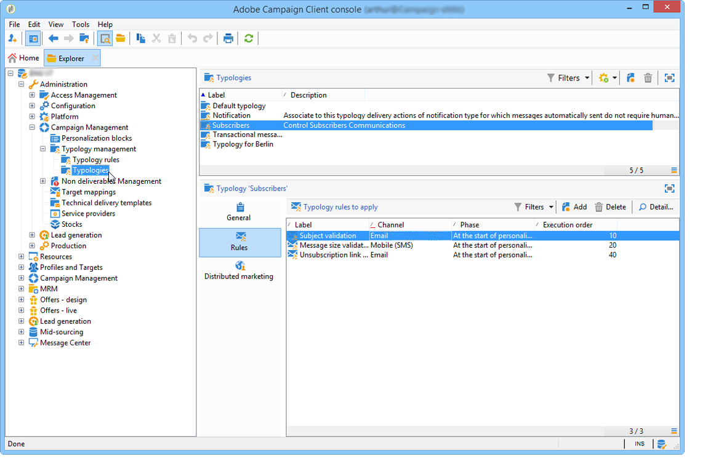

# About campaign typologies{#about-campaign-typologies}

Campaign Optimization is the Adobe Campaign module which lets you to control, filter and monitor the sending of deliveries. To avoid conflicts between campaigns, Adobe Campaign can test various combinations by applying specific constraint rules. This guarantees that the messages sent best meet the needs and expectations of customers, in keeping with company communication policies.

>[!NOTE]
>
>Depending on your offering, Campaign Optimization can be included or an add-on. Please check your license agreement.

## Typology rules {#typology-rules}

With Adobe Campaign you can design and apply four types of typology rules:

1. **Filtering** rules which let you exclude part of the target based on criteria. For more on this, refer to [Filtering rules](../../campaign/using/filtering-rules.md).
1. **Pressure** rules which let you control marketing fatigue. For more on this, refer to [Pressure rules](../../campaign/using/pressure-rules.md).
1. **Capacity** rules which let you limit loads to guarantee optimal processing conditions. For more on this, refer to [Controlling capacity](../../campaign/using/consistency-rules.md#controlling-capacity).
1. **Control** rules which let you check the validity of messages before they are sent. For more on this, refer to [Control rules](../../campaign/using/control-rules.md).

Once they have been created, typology rules are grouped in campaign typologies which are referenced in deliveries. See [Applying typologies](../../campaign/using/about-campaign-typologies.md#applying-typologies).

## Typologies {#typologies}

A campaign typology can contain several [typology rules](../../campaign/using/about-campaign-typologies.md#typology-rules), but a delivery can only reference one typology.

The **[!UICONTROL Rules]** tab lets you add, delete or view the typology rules to apply.

## Applying typologies {#applying-typologies}

Steps to create and apply a typology to your deliveries are listed below:

1. Create typology rules.

   Typology rules are found in the **[!UICONTROL Administration > Campaign management > Typology management > Typology rules]** node.

   Different rules available in Campaign are described in the following sections: [sales pressure rules](../../campaign/using/pressure-rules.md), [capacity rules](../../campaign/using/consistency-rules.md#controlling-capacity), [control rules](../../campaign/using/control-rules.md) and [filtering rules](../../campaign/using/filtering-rules.md).

1. Create a typology and reference the rules you created into it.

   Typologies are accessed via the **[!UICONTROL Administration > Campaign Management > Typology management]** > **[!UICONTROL Typologies]** node. 

1. Configure your delivery to use the typology you created. For more on this, refer to [this section](../../campaign/using/applying-rules.md#applying-a-typology-to-a-delivery).
1. Test and control the behavior through campaign simulations. For more on campaign simulations, refer to [this section](../../campaign/using/campaign-simulations.md).

During delivery preparation, recipients are excluded when criterion is met. You can check logs to monitor exclusions. Sample use cases on pressure typology rules are available in [this page](../../campaign/using/pressure-rules.md#use-cases-on-pressure-rules).
