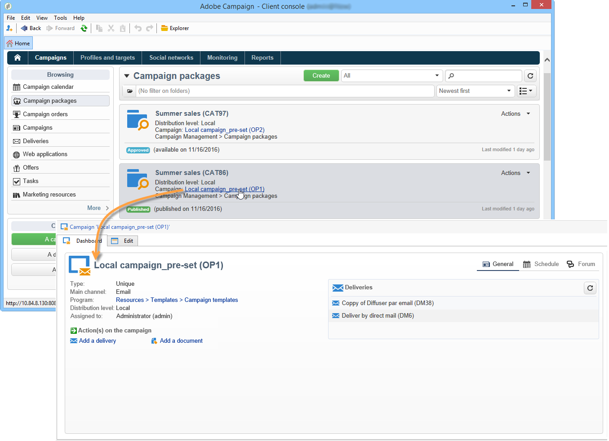

# Accessing campaigns{#accessing-campaigns}

Once a campaign has been ordered, the order has been approved, and the availability date reached, it can be executed.

Depending on the campaign type and the options selected, the campaign is executed locally or centrally.

## Accessing the campaign {#accessing-the-campaign}

Once the order is approved and the availability date reached, the campaign is created locally and can be used. Local operators are notified of its availability.

It is added to the detail of the matching order and can be edited. The complete dashboard lets you manage it on a local level.

The campaign remains accessible in the Campaign overview, located via the **[!UICONTROL Campaigns]** link on the home page.

## Available settings {#available-settings}

Local entities can adapt the campaign content to suit their needs, using all campaign dashboard elements. Their main task will be to adapt the targeting workflow and possibly personalize delivery content.

## Campaign execution {#campaign-execution}

Each local entity may execute the campaign workflow and perform the necessary approvals based on the process defined in the campaign's template.
