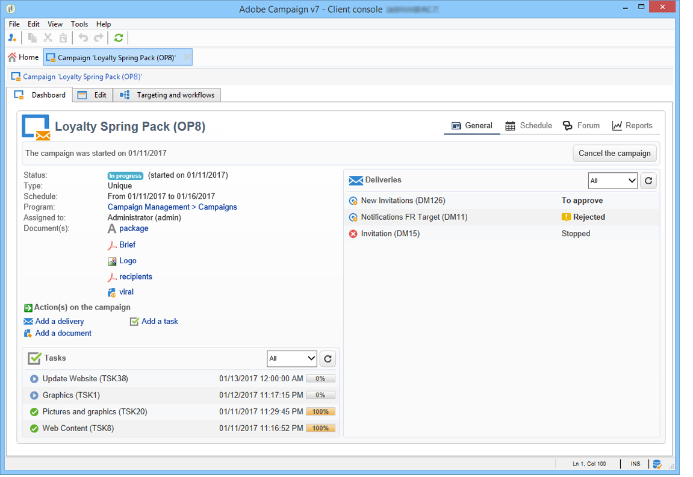

# Accessing marketing campaigns{#accessing-marketing-campaigns}

Adobe Campaign lets you create, configure, execute and analyze marketing campaigns. All marketing campaigns can be managed from a unified control center.

## Workspace basics {#workspace-basics}

### Home page {#home-page}

Once you connect to Adobe Campaign, you will see the home page.

Click the links in the navigation bar to access the various capabilities.

Campaign elements are found in the **[!UICONTROL Campaigns]** tab: here you can see an overview of the marketing programs and campaigns as well as their sub-sets. A marketing program is made up of campaigns, which are made up of deliveries, tasks, linked resources, etc. In the context of marketing campaign management using Campaign, the information concerning deliveries, budgets, reviewers and linked documents are found in the campaigns.

The **[!UICONTROL Browsing]** block of the **[!UICONTROL Campaigns]** tab offers various entries, depending on modules installed on the instance. As an example, you can access:

* **Campaign calendar**: calendar of plans, marketing programs, deliveries and campaigns. Refer to [Campaign calendar](#campaign-calendar).
* **Campaigns**: access to the campaigns contained in all marketing programs.
* **Deliveries**: access to the deliveries linked to the campaigns.
* **Web Applications**: access to web applications (forms, surveys, etc.).

>[!NOTE]
>
>For more on the overall Adobe Campaign ergonomics, permissions and on profile management functionalities, refer to [this section](../../platform/using/adobe-campaign-workspace.md).
>
>All functionalities related to channels and deliveries are detailed in [this section](../../delivery/using/steps-about-delivery-creation-steps.md).

### Campaign calendar {#campaign-calendar}

Each campaign belongs to a program which in turn belongs to a plan. Plans, programs and campaigns are accessed via the **[!UICONTROL Campaign calendar]** menu in the **Campaigns** tab.

To edit a plan, program, campaign or delivery, click its name in the calendar and then click **[!UICONTROL Open...]**. It is then displayed in a new tab, as shown below:

You can filter the information displayed in the campaign calendar. To do this, click the **[!UICONTROL Filter]** link and select the filtering criteria.

>[!NOTE]
>
>When you filter on a date, all campaigns with a start date that is later than the specified date and/or with an end date earlier than the specified date are displayed. Dates need to be selected using the calendars to the right of each field.

You can also use the **[!UICONTROL Search]** field to filter the displayed items.

The icons linked to each item let you view its status: finished, in progress, being edited, etc.

### Browsing in a marketing program {#browsing-in-a-marketing-program}

Campaign allows you to manage a set of programs made up of various marketing campaigns. Each campaign contains deliveries and the associated processes and resources.

#### Browsing a program {#browsing-a-program}

When editing a program, use the tabs described below to browse and configure it.

* The **Schedule** tab displays the calendar of programs for a month, week or day depending on which tab you click in the calendar header.

  If necessary, you can create a campaign, a program, or a task via this page.

  

* The **Edit** tab lets you personalize the program: name, start and end dates, budget, linked documents, etc.

  

#### Browsing campaigns {#browsing-campaigns}

Campaigns can be accessed via the campaign calendar, the **[!UICONTROL Schedule]** tab of the program, or the list of campaigns.

1. Via the campaign calendar, select the campaign you want to display, then click the **[!UICONTROL Open]** link. 

   

   The campaign is edited in a new tab, as shown below:

   

1. Via the **[!UICONTROL Schedule]** tab of the program, the edit mode is the same as via the campaign calendar.
1. Via the **[!UICONTROL Campaigns]** link of the **[!UICONTROL Campaigns]** tab, click the name of the campaign you want to edit.

   

### Controlling a campaign {#controlling-a-campaign}

#### Dashboard {#dashboard}

For each campaign, jobs, resources and deliveries are centralized in a single screen - the dashboard - which lets you manage marketing actions in collaboration with others.

The dashboard of a campaign is used as a control interface. It accesses the main campaign creation and management stages directly: deliveries, extraction files, notifications, budgets, etc.

With Adobe Campaign you can set up collaborative processes for the creation and approval of the various stages of marketing and communication campaigns: approval of the budget, target, content, etc.

>[!NOTE]
>
>The configuration of campaign templates is presented in [Campaign templates](../../campaign/using/marketing-campaign-templates.md#campaign-templates).

#### Schedule {#schedule}

A campaign centralizes a set of deliveries. For each campaign, the schedule offers a global view of all components: this lets you display the tasks and deliveries and access them easily.

#### Forum {#forum}

For each campaign, operators can exchange messages via a dedicated forum.

For more on this, refer to [Discussion forums](../../campaign/using/discussion-forums.md).

#### Reports {#reports}

The **[!UICONTROL Reports]** link lets you access the campaign reports.

>[!NOTE]
>
>Reports are detailed in [this section](../../reporting/using/about-adobe-campaign-reporting-tools.md).

#### Configuration {#configuration}

Campaigns are created via campaign templates. You can configure reusable templates for which some options are selected and other settings are already saved. For each campaign, the following functionality is offered:

* Referencing of documents and resources: you can associate documents with the campaign (brief, report, images, etc.). All document formats are supported. See [Managing associated documents](../../campaign/using/marketing-campaign-deliveries.md#managing-associated-documents). 
* Defining costs: for each campaign, Adobe Campaign lets you define cost entries and cost calculation structures which can be used when creating the marketing campaign. For example: printing costs, use of an external agency, room rental, etc. See [Defining cost categories](../../campaign/using/providers--stocks-and-budgets.md#defining-cost-categories).
* Defining objectives: you can define quantifiable objectives for a campaign, e.g. number of subscribers, business volume, etc. This information is later used in campaign reports.
* Managing seed addresses (for more on this, refer to [this section](../../delivery/using/about-seed-addresses.md)) and control groups (refer to [Defining a control group](../../campaign/using/marketing-campaign-deliveries.md#defining-a-control-group)).
* Managing approvals: you can select the treatments to be approved and, if necessary, select the reviewing operators or groups of operators. See [Checking and approving deliveries](../../campaign/using/marketing-campaign-approval.md#checking-and-approving-deliveries).

>[!NOTE]
>
>To access the campaign configurations and make changes to them, click the **[!UICONTROL Advanced campaign parameters...]** link in the **[!UICONTROL Edit]** tab. For more information on setting parameters at the campaign level so deliveries inherit values automatically, see [our Technote](https://helpx.adobe.com/campaign/kb/simplifying-campaign-management-acc.html#Setparametersatthecampaignlevelsodeliveriesinheritvaluesautomatically).

## Using the web interface {#using-the-web-interface-}

You can access the Adobe Campaign console screens via an internet browser to view all campaigns and deliveries as well as reports and information on the profiles in your database. This access does not enable record creation. Depending on operator rights, you may view and/or act on the data in the database. For example, you can approve campaign contents and targeting, re-start or stop a delivery, etc.

1. Log on as usual via https://`<your instance>:<port>/view/home`.
1. Use the menus to access the overviews.

   

Approvals (of a target or a delivery content, for instance) can be carried out via web access.

You can also use the link contained in the notification messages. For more on this, refer to [Checking and approving deliveries](../../campaign/using/marketing-campaign-approval.md#checking-and-approving-deliveries).
