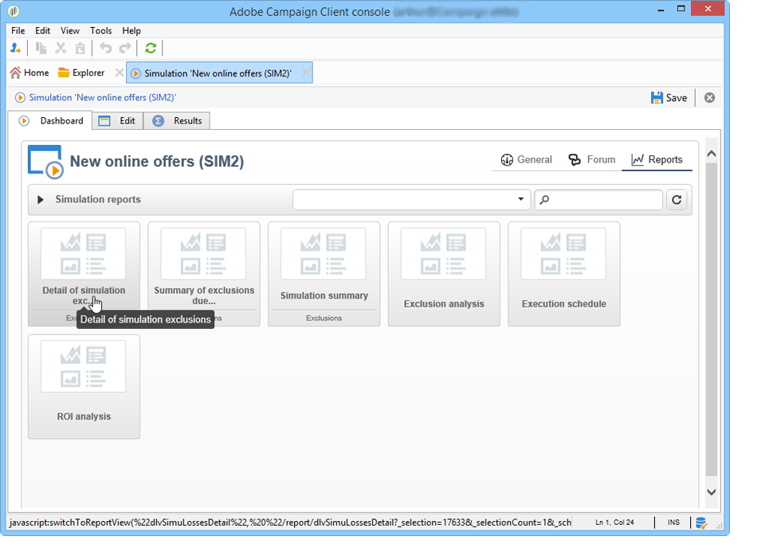

# Campaign simulations{#campaign-simulations}

## About simulations {#about-simulations}

Campaign Optimization lets you test the efficiency of a campaign plan using simulations. This lets you measure the potential success of a campaign: generated revenue, target volume based on the typology rules applied, etc.

Simulation lets you monitor and compare the impact of deliveries.

>[!NOTE]
>
>Deliveries prepared in Test mode have no impact on each other, for example when assessing a campaign in distributed marketing, or as long as the deliveries aren't scheduled in the provisional calendar.  
>This means that pressure and capacity rules are only applied to deliveries in **Target estimation and message personalization** mode. Deliveries in **Estimation and approval of the provisional target** and in **Target evaluation** mode are not taken into account.  
>The delivery mode is chosen in the **Typology** sub-tab of the delivery properties.

## Setting up a simulation {#setting-up-a-simulation}

### Creating a simulation {#creating-a-simulation}

To create a simulation, apply the following steps:

1. Go to the **Campaigns** universe, click the **More** link within the **Create** section and select the **Simulation** option.

   

1. Enter the template and the name of the simulation. Click **Save** to create the simulation.

   

1. Click the **Edit** tab to configure it.

   

1. In the **Scope** tab, specify the deliveries you want to consider for this simulation. To do this, click the **Add** button and specify the delivery selection mode to take into account.

   

   You can either select each delivery one by one or sort them by campaign, program or plan.

   >[!NOTE]
   >
   >If you select deliveries via a plan, program or campaign, Adobe Campaign can automatically refresh the list of deliveries to take into account whenever a simulation is started. To do this, check the **Refresh the selection of deliveries each time the simulation is started** option.  
   >If you don't do this, any deliveries that are not available in the plan, program, or campaign when the simulation is created will not be taken into account: deliveries added later will be ignored.

1. Select the elements to include in the simulation scope. If necessary, select multiple elements using the SHIFT and CTRL keys.

   

   Click **Finish** to approve the selection.

   You can manually combine selected deliveries and deliveries belonging to plans, programs or campaigns.

   

   If necessary, you can use a dynamic condition via the **Edit the dynamic condition...** link

   Click **Save** to approve this configuration.

   >[!CAUTION]
   >
   >Only deliveries whose target has been calculated are taken into account when calculating simulations (statuses: **Target ready** or **Ready to deliver**).

1. In the **Calculations** tab, select an analysis dimension such as the recipient schema for example.

   

1. You can then add expressions.

   

### Execution settings {#execution-settings}

The **General** tab of the simulation lets you enter execution settings:

* The **Schedule execution for down-time** option defers the simulation launch to a less busy time period, based on the chosen level of priority. Simulations use significant database resources, that's why non-urgent simulations should be scheduled to run at night, for example.
* The **Priority** is the level applied to the simulation to delay its triggering.
* **Save SQL queries in the log**. SQL logs let you diagnose a simulation if it ends with errors. They can also help you find out why a simulation is too slow. These messages will be visible after the simulation in the **SQL logs** sub-tab of the **Audit** tab.

## Executing a simulation {#executing-a-simulation}

### Starting a simulation {#starting-a-simulation}

Once the simulation scope is defined, you can execute it.

To do this, open the simulation dashboard and click **Start simulation**.

Once execution is complete, open the simulation and click the **Results** tab to view the targets calculated for each delivery.

1. The **Deliveries** sub-tab lists all deliveries taken into account by the simulation. It shows two counts:

    * The **Initial count** is the target as it was calculated during its estimation in the delivery. 
    * The **Final count** is the number of recipients counted after simulation.

      The difference between initial and final counts reflects the application of the various rules or filters configured prior to the simulation.

      To learn more about this calculation, edit the **Exclusions** sub-tab.

1. The **Exclusions** sub-tab lets you view the exclusion break-down.

   

1. The **Alerts** sub-tab groups all alert messages generated during the simulation. Alert messages can be sent in case of capacity overload (if the number of recipients targeted exceeds the set capacity, for instance).
1. The **Exploration of the exclusions** sub-tab lets you create a result analysis table. The user needs to indicate variables in the abscissa/ordinates axes.

   For an example of analysis table creation, refer to the end of [Exploring results](../../campaign/using/campaign-simulations.md#exploring-results).

### Viewing results {#viewing-results}

#### Audit {#audit}

The **Audit** tab lets you monitor simulation execution. The **SQL Logs** sub-tab is useful for expert users. It lists execution logs in SQL format. These logs are only displayed if the **Save SQL queries in the log** option has been selected in the **General** tab before simulation execution.

#### Exploring results {#exploring-results}

The **Exploration of the exclusions** sub-tab lets you analyze the data resulting from a simulation.

Descriptive analysis is detailed in [this section](../../reporting/using/about-adobe-campaign-reporting-tools.md).

## Results of a simulation {#results-of-a-simulation}

The indicators in the **Log** and **Results** tabs provide a first overview of simulation results. For a more detailed view of results, open the **Reports** tab.

### Reports {#reports}

To analyze the result of a simulation, edit its reports: they show exclusions and causes.

The following reports are provided by default:

* **Detail of simulation exclusions**: this report provides a detailed chart of exclusion causes for all concerned deliveries.
* **Simulation summary**: this report shows the populations excluded from the simulation throughout the various deliveries. 
* **Summary of exclusions linked to the simulation**: this report shows a chart of exclusions caused by the simulation along with the applied typology rule and a chart showing the exclusion ratio per rule.

>[!NOTE]
>
>You can create new reports and add them to the ones offered. For more on this, refer to [this section](../../reporting/using/about-adobe-campaign-reporting-tools.md).

To access reports, click the **Reports** link of the targeted simulation via its dashboard.

You can also edit reports using the **Reports** link accessible from the simulation dashboard.

### Comparing simulations {#comparing-simulations-}

Each time a simulation is executed, the result replaces any previous results: you cannot display and compare results from one execution to another.

To compare results, you need to use reports. Indeed, Adobe Campaign lets you save a report history to view it again later. This history is saved throughout the simulations' life-cycle.

**Example:**

1. Create a simulation on a delivery which typology **A** is applied to.
1. In the **Reports** tab, edit one of the available reports, such as **Detail of simulation exclusions** for example.
1. In the upper right-hand section of the report, click the icon to create a new history.

   

1. Close the simulation and change the configuration of typology **A**.
1. Execute the simulation again and compare the result with the one displayed in the report for which a history was created.

   

   You can save as many report histories as necessary.

### Reporting axes {#reporting-axes}

The **Calculations** tab lets you define reporting axes on the target. Theses axes will be used during result analysis (refer to [Exploring results](../../campaign/using/campaign-simulations.md#exploring-results)).

>[!NOTE]
>
>We recommend defining calculation axes in the simulation templates rather than individually for each simulation.  
>Simulation templates are saved in the **Resources > Templates > Simulation templates** node of the Adobe Campaign tree.

**Example:**

In the example below, we want to create an additional reporting axis based on the recipients' status ("Customer", "Prospect" or none).

1. To define a reporting axis, select the table which contains the information to be processed in the **Analysis dimension** field. This information is mandatory.
1. Here, we want to select the Segment field of the recipient table.

   

1. The following options are available:

    * **Generate target overlap statistics** lets you recover all overlap statistics in the simulation report. Overlaps are recipients targeted in at least two deliveries within one simulation.

      >[!CAUTION]
      >
      >Selecting this option considerably increases simulation execution time.

    * **Keep the simulation work table** lets you keep simulation traces.

      >[!CAUTION]
      >
      >The automatic saving of these tables requires a significant storage capacity: make sure the database is big enough.

When the simulation results are displayed, the information on the selected expression will be displayed in the **Overlaps** sub-tab.

Delivery target overlaps indicate the targeted recipients in at least two deliveries of a simulation.

>[!NOTE]
>
>This sub-tab is only displayed if the **Generate target recovery statistics** option has been enabled.

The information on reporting axes can be processed in exclusion analysis reports created in the **Exploring exclusions** sub-tab. For more on this, refer to [Exploring results](../../campaign/using/campaign-simulations.md#exploring-results).
