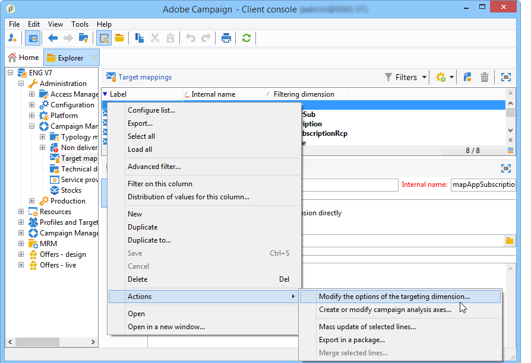

# Configuration{#configuration}

This section is intended for persons responsible for configuring response management. It assumes a certain amount of knowledge about extending schemas, defining workflows, and SQL programming.

This lets you understand how to adapt the standard data model to the specific nature of a transaction table external to Adobe Campaign with the table of individuals. This table of individuals can coincide with the table of available individuals in Adobe Campaign or with a different table

The measurement hypothesis is launched by the operation process workflow ( **[!UICONTROL operationMgt]** ). Each hypothesis represents a separate process executed asynchronously with an execution status (Being edited, Pending, Finished, Failed, etc.) and controlled by a scheduler that manages priority constraints, restriction of the number of simultaneous processes, the low activity page and automatic execution with frequency.

## Configuring schemas {#configuring-schemas}

>[!CAUTION]
>
>Do not modify the standard schemas of the application, but rather use the schema extension mechanism. Otherwise, modified schemas will not be updated at the time of future upgrades of the application. This can lead to malfunctions while using Adobe Campaign.

Application integration is required before using the reaction module, in order to define the various tables (transactions, transaction details) to be measured as well as their relationship with deliveries, offers and individuals.

### Standard schemas {#standard-schemas}

The out-of-the-box **[!UICONTROL nms:remaMatch]** schema contains the reaction log table, i.e. the relation between individuals, hypothesis and transaction table. This schema shall be used as an inheritance schema for the reaction logs' final destination table.

The **[!UICONTROL nms:remaMatchRcp]** schema also comes as a standard, it contains the storage of reaction logs for Adobe Campaign recipients ( **[!UICONTROL nms:recipient]** ). In order to be used, it will need to be extended to be mapped to a transaction table (containing purchases, etc.).

### Transaction tables and transaction details {#transaction-tables-and-transaction-details}

The transaction table must include direct links towards individuals.

You can also add a table containing transaction details. This is not directly linked to individuals.

If we take a receipt for example, a transaction table is linked to a contact (receipt table) and a receipt lines table is only linked to the receipt table (detail table). You can then configure the hypothesis directly at the level at which the receipt line table is linked to the receipt table.

>[!NOTE]
>
>If you would like to keep the receipt identifier that describes the expected behavior in the hypotheses, you can extend the nms:remaMatchRcp table template to add the identifier to it (in this case, no ROI calculation is linked to these fields).

We highly recommend adding an event date.

The following schema shows joins between the different tables once configuration is complete:


### Response management with Adobe Campaign recipients {#response-management-with-adobe-campaign-recipients}

In this example, we will integrate a table of purchases in our response management module using the Adobe Campaign recipient table ( **[!UICONTROL nms:recipient]** ).

The table of response logs on a **[!UICONTROL nms:remaMatchRcp]** recipient is extended to add a link to the purchase table schema. In the following example, the purchase table is called **demo:purchase**.

1. Via the Adobe Campaign explorer, select the **[!UICONTROL Administration]** > **[!UICONTROL Campaign management]** > **[!UICONTROL Target mappings]**.
1. Right-click **Recipient** then select **[!UICONTROL Actions]** and **[!UICONTROL Modify the options of the targeting dimensions]**.

   

1. You can personalize the **[!UICONTROL Extension namespace]** in the next window, then click **[!UICONTROL Next]**.

   

1. In the **[!UICONTROL Response management]** category, make sure that the **[!UICONTROL Generate a storage schema for reactions]** box is checked.

   Then click **[!UICONTROL Define additional fields...]** to select the related transaction tables and add the desired fields to the extension of the nms:remaMatchRcp schema.

   

The created schema looks as follows:

```
<srcSchema _cs="Reactions (Recipients) (cus)" entitySchema="xtk:srcSchema" extendedSchema="nms:remaMatchRcp" 
img="nms:remaMatch.png" implements="xtk:persist" label="Reactions (Recipients)" mappingType="sql"
name="remaMatchRcp" namespace="cus">  
 <element label="Reactions (Recipients)" name="remaMatchRcp">    
  <key internal="true" name="match">      
   <keyfield xlink="hypothesis"/>      
   <keyfield xlink="broadLog"/>      
   <keyfield xlink="proposition"/>    
  </key>    
  <attribute label="Quantity" name="quantity" type="long"/>    
  <element name="purchase" target="demo:purchase" type="link"/>    
  <element name="hypothesis" revLabel="Reactions (Recipients)" revLink="remaMatchRcp"/>    
  <element applicableIf="HasPackage('nms:coreInteraction')" label="Proposition" name="proposition" target="nms:propositionRcp" type="link"/>   
  <element desc="Message (Delivery log)" label="Message" name="broadLog" target="nms:broadLogRcp" type="link"/>    
  <element label="Respondent" name="responder" target="nms:recipient" type="link"/>  
 </element>  
 <createdBy _cs="Administrator (admin)"/>  
 <modifiedBy _cs="Administrator (admin)"/>
</srcSchema>
```

### Response management with a personalized recipient table {#response-management-with-a-personalized-recipient-table}

In this example, we will integrate a purchase table in our response management module using a table of individuals other than the recipient table available in Adobe Campaign.

* Creating a new response log schema derived from the **[!UICONTROL nms:remaMatch]** schema.

  Since the table of individuals is different from the table of Adobe Campaign recipients, it is necessary to create a new schema of the response logs based on the **[!UICONTROL nms:remaMatch]** schema. Then complete it with links towards the delivery logs and the purchase table.

  In the following example, we will use the **demo:broadLogPers** schema and the **demo:purchase** transaction table:

  ```
  <srcSchema desc="Linking of a recipient transaction to a hypothesis"    
  img="nms:remaMatch.png" label="Responses on persons" labelSingular="Responses on a person" name="remaMatchPers" namespace="nms">
    <element name="remaMatchPers" template="nms:remaMatch">
      <key internal="true" name="match">
        <keyfield xlink="hypothesis"/>
       <keyfield xlink="purchase"/>
      </key>
  
      <element name="hypothesis" revLabel="Response logs for persons" revLink="remaMatchPers"/>
      <element applicableIf="HasPackage('nms:interaction')" label="Proposition" name="proposition"
               target="demo:propositionPers" type="link"/>
      <element label="Delivery log" name="broadLog" target="demo:broadLogPers" type="link"/>
    </element>
  </srcSchema>
  ```

* Modifying the hypothesis form in the **[!UICONTROL nms:remaHypothesis]** schema.

  By default, the list of response logs is visible in the recipient logs. You must therefore modify the hypothesis form in order to view the new response logs created during the previous step.

  For example:

  ```
   <container type="visibleGroup" visibleIf="[context/@remaMatchStorage]= 'demo:remaMatchPers'">
                <input hideEditButtons="true" img="nms:remaMatch.png" nolabel="true" refresh="true"
                 toolbarCaption="Responses generated by the hypothesis" type="linklist"
                 xpath="remaMatchPers">
            <input xpath="[.]"/>
            <input xpath="@controlGroup"/>
          </input>
     </container> 
  ```

## Managing indicators {#managing-indicators}

The Response Manager module comes with a list of predefined indicators. However, you can add other personalized measurement indicators.

To do this, you must extend the hypothesis table by inserting two fields for each new indicator:

* the first for the target population,
* the second for the control group.

For example:

```
<srcSchema entitySchema="xtk:srcSchema" extendedSchema="nms:remaHypothesis" label="Measurement hypothesis" 
md5="1D4DED54FF8EC2432AED6736EDE6F547" name="remaHypothesis" namespace="demo" xtkschema="xtk:srcSchema">  
    <element name="remaHypothesis">    
        <element name="indicators">      
            <!-- Quantity -->      
            <attribute label="Total contacted" name="contactReactedTotalQuantity" type="long"/>
            <attribute label="Total number of people in the control group" name="proofReactedTotalquantity" type="long"/> 
        </element> 
    </element>
</srcSchema>
```
