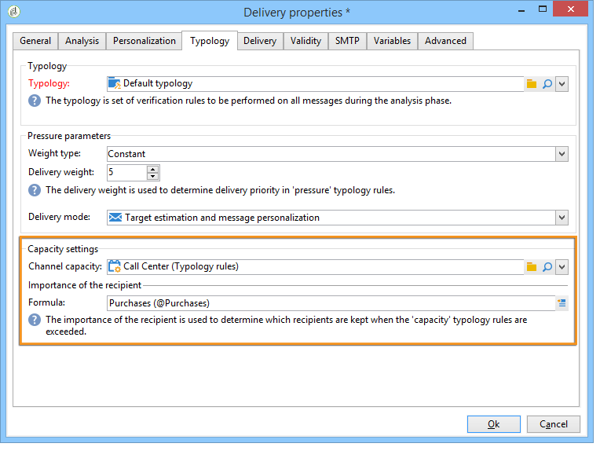

# Consistency rules{#consistency-rules}

## About consistency rules {#about-consistency-rules}

Adobe Campaign guarantees consistent communications thanks to a set of rules contained in campaign typologies. Their aim is to control the deliveries sent to recipients, such as volume, nature, relevance, etc.

**Capacity** rules, for example can avoid overloading the platform concerned by the delivery of messages. As an example, special offers which contain a download link must not be sent to too many people at once, to avoid saturating the server; phone campaigns must not exceed the processing capacity of call centers, etc. For more on this, refer to [Controlling capacity](#controlling-capacity).

## Controlling capacity {#controlling-capacity}

Before delivering messages, you need to make sure your organization has the capacity to process the delivery (physical infrastructure), the responses which the delivery may generate (inbound messages), and the number of calls to be made to contact subscribers (call center processing capacity), for example.

To do this, you need to create **[!UICONTROL Capacity]** typology rules.

In the following example, we create a typology rule for a phone loyalty campaign. We restrict the number of messages to 20 per day, i.e. the daily processing capacity of a call center. Once the rule applied to two deliveries, we can monitor consumption through logs.

To design a new capacity rule, follow the steps below:

1. Under the **[!UICONTROL Administration > Campaign management > Typology management > Typology rules]** node, click **[!UICONTROL New]**.
1. Select a **[!UICONTROL Capacity]** rule type.

   

1. In the **[!UICONTROL Capacity]** tab, create the availability lines: in our example, these are time periods during which calls can be made. Select a 24 hours period and enter 150 in the initial quantity, which means that the call center can handle 150 calls per day.

   

   >[!NOTE]
   >
   >Availability lines are for information purpose only. If you need to exclude messages when the capacity limit is reached, refer to [this section](#exclude-messages-when-capacity-limit-reached).

1. Associate this rule to a typology and then reference the typology into your delivery to apply this capacity rule. For more on this, refer to [this section](../../campaign/using/applying-rules.md#applying-a-typology-to-a-delivery).
1. You can monitor consumption from the rule **[!UICONTROL Consumptions]** and **[!UICONTROL Capacity]** tabs.

   When a rule is used in a delivery, the **[!UICONTROL Consumed]** and **[!UICONTROL Remaining]** columns provide information on the load, as shown below:

   

   For more on this, refer to [this section](#monitoring-consumption).

## Defining the maximum load {#defining-the-maximum-load}

To define the maximum load, you need to define availability lines. To do this, two options are available: you can manually create one or more availability lines (refer to [Adding availability lines one by one](#adding-availability-lines-one-by-one)) or create availability ranges. The frequency of these time periods can be automated (refer to [Add a set of availability lines](#add-a-set-of-availability-lines)).

### Adding availability lines one by one {#adding-availability-lines-one-by-one}

To create an availability line, click the **[!UICONTROL Add]** button and select **[!UICONTROL Add an availability line]**. Enter the availability period and the available load.

Add as many lines as necessary to suit your processing capacity.

### Add a set of availability lines {#add-a-set-of-availability-lines}

To define availability periods for a given time, click the **[!UICONTROL Add]** button and select the **[!UICONTROL Add a set of availability lines]** option. Indicate a duration for each time period and the number of periods to create.

To automate the frequency of page creation, click the **[!UICONTROL Change]** button and define time period scheduling.

For example, let's define a schedule to create availability periods for all work days at a rate of 10 calls per hour between 9AM and 5PM. To do this, apply the following steps:

1. Select the type of periodicity and the days and hours during which it is valid:

   

1. Indicate the validity dates:

   

1. Check the schedule before you approve it:

   

The **[!UICONTROL Forecasting]** workflow automatically creates all matching lines.

>[!NOTE]
>
>We recommend creating availability lines via file imports. This tab lets you view and check consumption lines.

## Exclude messages when capacity limit reached {#exclude-messages-when-capacity-limit-reached}

Availability lines are for information purposes only. To exclude excess messages, check the **[!UICONTROL Exclude from the target messages in excess of capacity]** option. This prevents the capacity from being exceeded. For the same population as in the previous example, the consumption and remaining capacity may not exceed the initial quantity:

The number of messages to be processed is broken down evenly over the defined availability range. This is particularly relevant for call centers since their maximum number of calls per days is limited. In the case of email deliveries, the **[!UICONTROL Do not limit instantaneous delivery capacity]** option lets you ignore this availability range and send your emails at the same time.

>[!NOTE]
>
>In case of an overload, the saved messages are selected according to the formula defined in the delivery properties.

## Monitoring consumption {#monitoring-consumption}

By default, capacity rules are for indication purposes only. Select the **[!UICONTROL Exclude messages in excess of capacity from the target]** option to prevent the defined load from being exceeded. In this case, excess messages will be automatically excluded from the deliveries using this typology rule.

To monitor consumptions, view the values displayed in the **[!UICONTROL Consumed]** column of the **[!UICONTROL Capacity]** tab in the typology rule.

To view consumption lines, click the **[!UICONTROL Consumptions]** tab in the rule.
