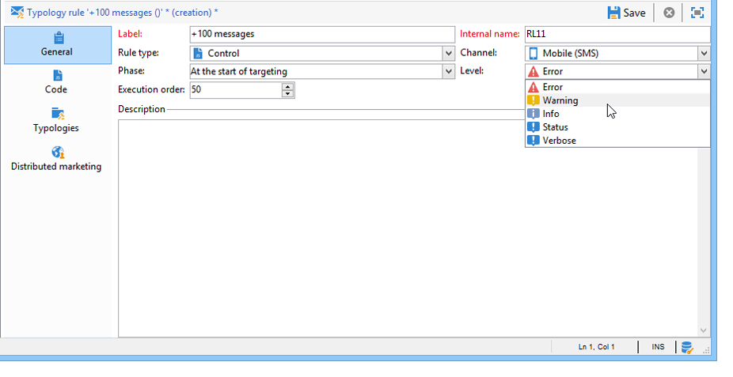
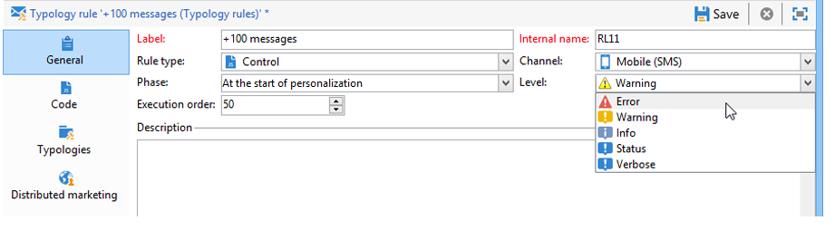

# Control rules{#control-rules}

## Analysis and arbitration control rules {#analysis-and-arbitration-control-rules}

Control rules let you guarantee the validity and quality of messages prior to delivery: character display, SMS size, address format, etc.

A set of out-of-the-box rules lets you carry out usual checks. These checks (shown in bold in the interface) are:

* **[!UICONTROL Object approval]** (email): checks that the sender object and address do not contain special characters which may cause problems on certain mail agents.
* **[!UICONTROL URL label approval]** (email): checks that each tracking URL has a label.
* **[!UICONTROL URL approval]** (email): checks the tracking URLs (presence of the "&" character).
* **[!UICONTROL Message size approval]** (mobile): checks the size of SMS messages.
* **[!UICONTROL Validity period check]** (email): checks that the validity period of the delivery is long enough to send all messages.
* **[!UICONTROL Proof size check]** (all channels): generates an error message if the proof target population exceeds 100 recipients.
* **[!UICONTROL Wave scheduling check]** (email): checks that the last wave of deliveries is scheduled to start before the end of the validity period, if the delivery is broken down into several waves.
* **[!UICONTROL Unsubscription link approval]** (email): checks for the presence of at least one unsubscription (opt-out) URL in each content (HTML and Text).

## Creating a control rule {#creating-a-control-rule}

It is possible to create new control rules to suit your needs. To do this, create a **[!UICONTROL Control]** typology rule and enter the control formula in SQL in the **[!UICONTROL Code]** tab.

**Example:**

In the following example, we are going to create a rule to prevent an SMS offer from being sent to more than 100 recipients. This rule will be linked to a campaign typology, then to the SMS deliveries for which the concerned offer is available.

Apply the following steps:

1. Create a **[!UICONTROL Control]** typology rule. Select a **[!UICONTROL Warning]** alert level. 

   

1. In the **[!UICONTROL Code]** tab, enter the script to apply the desired threshold, as shown below:

   

   This script will trigger a warning if the delivery target exceeds 100 contacts:

   ```
   if( delivery.FCP == false && delivery.properties.toDeliver > 100 ) { logWarning("Significant number of SMS to deliver (" + delivery.properties.toDeliver + "). Please make sure the target is correct.") return false; } return true
   ```

1. Link this rule to a campaign typology and reference the typology in the concerned SMS delivery.

   

1. During delivery analysis, the rule is applied and a warning is created if applicable.

   

   However, the delivery will still be ready for sending.

   If you increase the alert level, this will prevent the delivery from starting.

   

   At the end of the analysis, the **[!UICONTROL Confirm delivery]** button will not be available.

   
