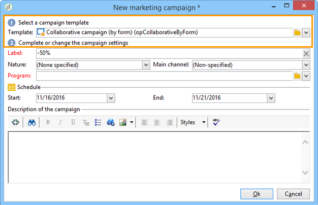
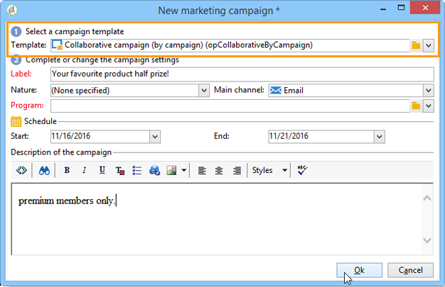
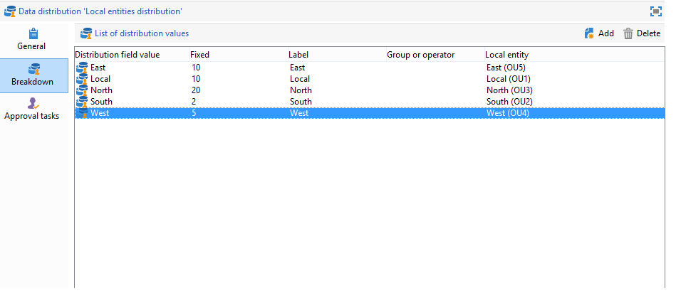
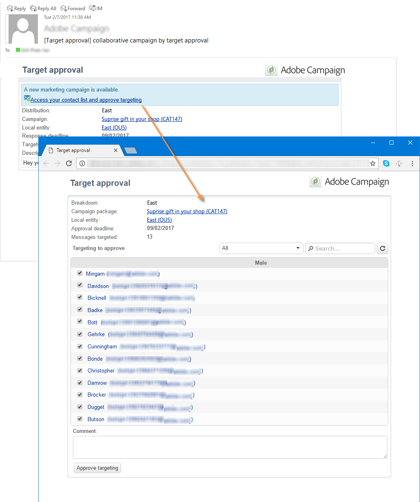
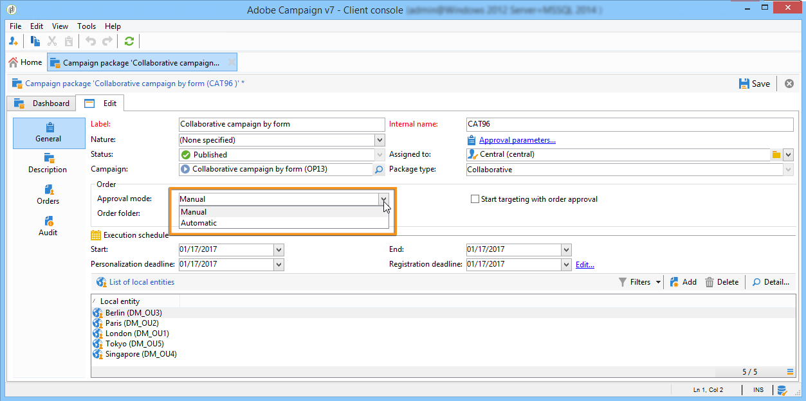
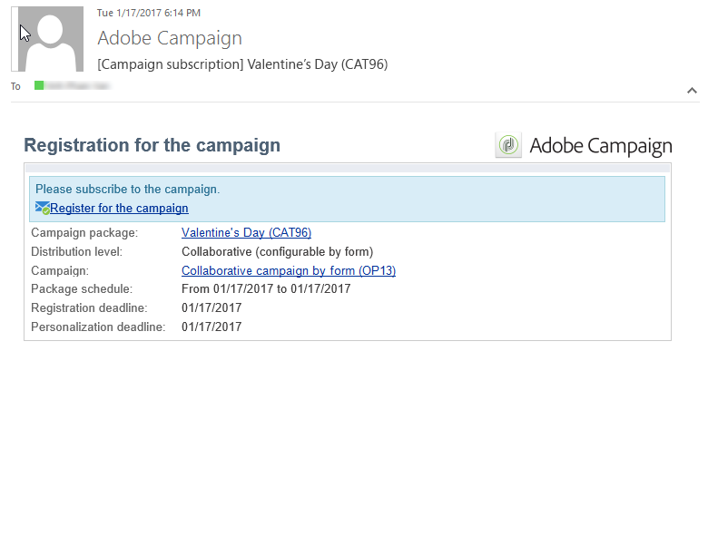

# Creating a collaborative campaign{#creating-a-collaborative-campaign}

The central entity creates collaborative campaigns from **Distributed Marketing** campaign templates. Refer to [this page](../../campaign/using/about-distributed-marketing.md#collaborative-campaign).

## Creating a collaborative campaign {#-creating-a-collaborative-campaign}

To configure a collaborative campaign, click the **Campaign management > Campaigns** node, then the **New** icon.

>[!NOTE]
>
>Apart from **collaborative campaigns (by campaign)**, these campaigns can be configured and executed via a web interface.

The configuration process for a collaborative campaign database is similar to that of a local campaign template. The specifications of the different types of collaborative campaigns are detailed below.

### By form {#by-form}

To create a collaborative campaign (by form), the **Collaborative campaign (by form)** template must be selected.

In the **Edit** tab, click the **Advanced campaign settings...** link to access the **Distributed Marketing** tab.

Select the **By form** Web interface. This type of interface lets you create personalization fields that will be used by local entities when ordering a campaign. Refer to [Creating a local campaign (by form)](../../campaign/using/creating-a-collaborative-campaign.md#creating-a-local-campaign--by-form-).

Save your campaign. You can now use it from the **Campaign packages** view in the **Campaign** universe, by clicking the **Create** button.

The **Campaign Package** view allows you to use local campaign templates (out-of-the-box or duplicated), as well as reference campaigns for collaborative campaigns, with the aim of creating campaigns for your different organizational entities.

### By campaign {#by-campaign}

To create a collaborative campaign (by campaign), the **Collaborative campaign (by campaign) (opCollaborativeByCampaign)** template must be selected.

When ordering the campaign, the local entity can complete the criteria predefined by the central entity, and evaluate the campaign before ordering it.

Once an order for a **Collaborative campaign (by campaign)** is approved by the central entity, a child campaign is created for the local entity. Once available to them, the local entity can then modify:

* the campaign workflow,
* typology rules,
* and personalization fields.

The local entity executes the child campaign. The central entity executes the parent campaign.

The central entity can view all child campaigns linked with a **Collaborative campaign (by campaign)** from this dashboard (via the **List of associated campaigns** link).

### By target approval {#by-target-approval}

To create a collaborative campaign (by target approval), the **Collaborative campaign (by target approval)** template must be selected.

>[!NOTE]
>
>In this mode, the central entity doesn't need to specify the local entities.

The campaign workflow must integrate **Local approval** type activity. The activity parameters are as follows:

* **Action to perform**: Target approval notification.
* **Distribution context**: Explicit.
* **Data distribution**: Local entity distribution.

**Local entity distribution** type data distribution must be created. The data distribution template lets you limit the number of records from a list of grouping values. In **Resources > Campaign management > Data distribution**, click the **New** icon to create a new **Data distribution**. For more information on data distribution, refer to the [Workflows](../../workflow/using/using-the-local-approval-activity.md#step-1--creating-the-data-distribution-template-) guide.

Select the **Targeting dimension** and the **Distribution field**. For the **Assignment type**, select **Local entity**.

In the **Distribution** tab, add a field for each local entity and specify the value.

You can add a second **Target approval** after the **Delivery** type activity to configure a report on it.

In the campaign creation notification message, the local entity receives a contact list that has been predefined by the central entity parameters.

The local entity can delete certain contacts based on the campaign content. 

### Simple {#simple}

To create a simple collaborative campaign, the **Collaborative campaign (simple)** template must be selected.

## Creating a collaborative campaign package {#-creating-a-collaborative-campaign-package}

To make a campaign available to local entities, the central entity must create a campaign package.

Apply the following steps:

1. In the **Navigation** section on the **Campaigns** page, click the **Campaign packages** link.
1. Click the **Create** button.
1. The section at the top of the window lets you select the **New collaborative package (mutualizedEmpty)** template.
1. Select the reference campaign.
1. Specify the label, folder and execution schedule for the campaign package.

### Dates {#dates}

The start and end dates define the campaign's visibility period in the list of campaign packages.

For **collaborative campaigns**, the central entity must specify the registration and personalization deadline.

>[!NOTE]
>
>The **Personalization deadline** allows the central entity to choose a deadline by which the local entities must have delivered the documents (spreadsheets, images) to be used to configure the campaign. This is not a mandatory option. Side-stepping this date will not affect campaign implementation.

### Audience {#audience}

The central entity must specify the local entities involved per campaign as soon as the collaborative campaign is created. 

>[!CAUTION]
>
>**Simple, by form and by campaign collaborative campaign kits** cannot be approved unless the relevant local entities have been specified.

### Approval modes {#approval-modes}

For **collaborative campaigns**, you can specify the order approval mode.

In manual mode, the local entity needs to subscribe for the campaign in order to participate.

In automatic mode, the local entity is pre-subscribed for the campaign. It may cancel campaign subscription or modify its parameters without needing approval from the central entity.

### Notifications {#notifications}

Configuration for notifications is identical to notifications for a local entity. Refer to [this section](../../campaign/using/creating-a-local-campaign.md#notifications).

## Ordering a campaign {#ordering-a-campaign}

When a collaborative campaign is added to the list of campaign packages, the local entities belonging to the audience defined by the central entity are notified (the **collaborative campaigns (by target approval)** do not have a predefined audience). The message sent contains a link that lets you register for the campaign, as shown below:

This message also enables local entities to view the description entered by the central operator that created the package, as well as documents linked to the campaign. These do not belong to the campaign itself, although they provide additional information on it.

Once local operators have logged on via a web interface, they can enter personalized information to the collaborative campaign they wish to order:

After a local entity has completed their registration, central entities are notified by email to approve their order.

For more on this, refer to the [Approval process](../../campaign/using/creating-a-collaborative-campaign.md#approval-process) section.

## Approving an order {#approving-an-order}

The process for approving a collaborative campaign package order is the same as when doing so for a local campaign. Refer to [this section](../../campaign/using/creating-a-local-campaign.md#approving-an-order).
