# Creating and managing tasks{#creating-and-managing-tasks}

## About tasks {#about-tasks}

Adobe Campaign lets you create tasks and manage their complete life cycle directly within the application. Program and campaign implementation can be broken down into tasks which are assigned to Adobe Campaign operators or external service providers. This mode of operation lets you create an open collaboration environment that includes all program participants and external participants.

Tasks can be created, viewed, and monitored from the list of tasks or the campaign dashboard. They can also be viewed and tracked in the schedules of the marketing plan, programs and campaigns.

Tasks are attached to campaign and can have dependencies, i.e. associated tasks. Each task has a status, priority, estimated load, and related costs.

All the tasks are grouped in a list accessible via the **Campaigns** tab. For more on this, refer to [Accessing tasks](#accessing-tasks).

They can be displayed in the schedule of the program to which they belong.

## Accessing tasks {#accessing-tasks}

### Displaying tasks {#displaying-tasks}

The tasks are displayed in the task list accessible via the **[!UICONTROL Campaigns]** tab.

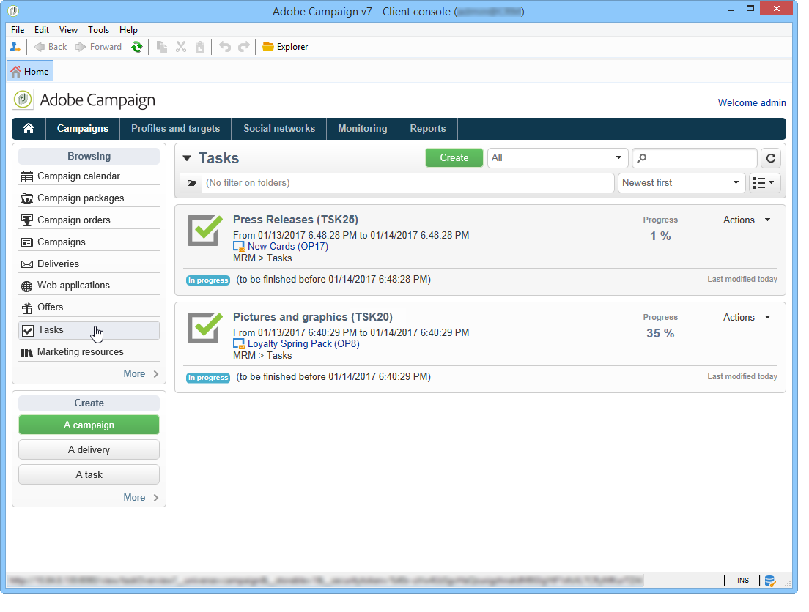

You can view all tasks of the connected operator there.

For more on this, refer to [Execution status of a task](#execution-status-of-a-task) and [Progress status of a task](#progress-status-of-a-task).

### Filtering tasks {#filtering-tasks}

When you display this view, it is automatically filtered in order to display only **[!UICONTROL operator tasks]**. You can also filter the tasks using the fields in the upper section of the window.

### Editing tasks {#editing-tasks}

Click on a task to edit it.

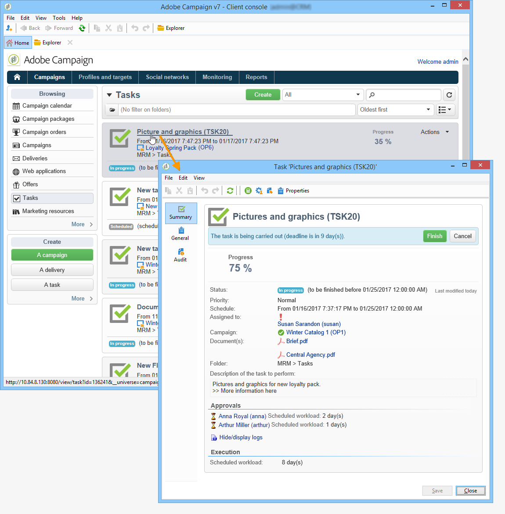

## Creating a new task {#creating-a-new-task}

To create a task, click the **[!UICONTROL Tasks]** link in the **[!UICONTROL Campaigns]** tab and select **[!UICONTROL Create]**.

Enter at least the name of the task and select the campaign which is it linked to. You must also specify the start and end dates. These three pieces of information are mandatory.

Click **[!UICONTROL Save]** to create the task.

You can also create a task via the dashboard of a campaign: in this case, it is automatically linked to the campaign which it was created from.

After a task is created, it is added to the campaign schedule and the list of tasks. To edit a task, select it from the schedule or click its name in the task overview, and click the **[!UICONTROL Open]** link.

To configure it, you must indicate:

* The manager and participants: refer to [Manager and participants](#manager-and-participants).
* The creation schedule: refer to [Execution schedule](#execution-schedule).
* The costs committed: refer to [Expenses and revenues](#expenses-and-revenues).

It is also possible to ad reviewers (refer to [Reviewers](#reviewers)) and referenced documents (refer to [Documents referenced](#documents-referenced)).

Task life cycle is presented in [Life cycle](#life-cycle).

### Manager and participants {#manager-and-participants}

Only the operator in charge of a task is authorized to close it.

By default, when an Adobe Campaign operator creates a task, it is assigned to them automatically. To select a different operator, use the **[!UICONTROL Assigned to]** field. 

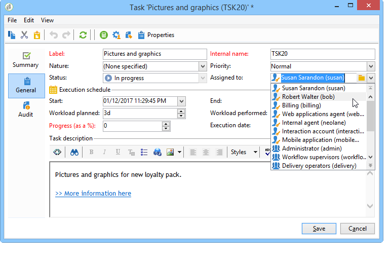

>[!NOTE]
>
>Operator management is presented in [this section](../../platform/using/access-management.md).

You may specify the operators involved in carrying out the task. These operators aren't authorized to close the task. They may only approve the task assigned to them.

They are selected using the **[!UICONTROL Resources]** icon in the task toolbar. Click **[!UICONTROL Add]** and select the concerned operators.

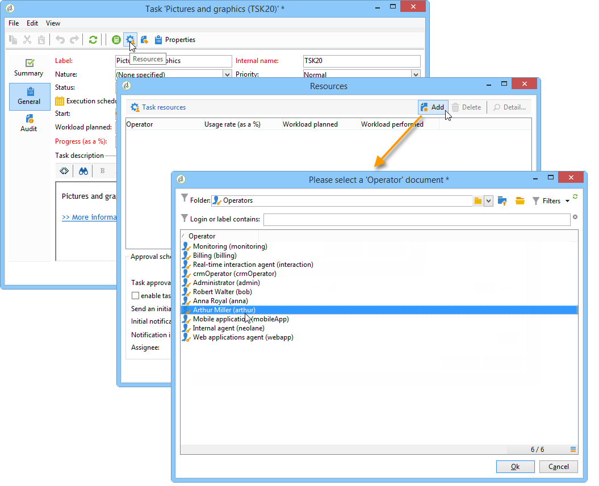

Click **[!UICONTROL Ok]** and then input the usage rate: this represents the load assigned to the operator for the duration of task execution. This rate is an indication only and is expressed as a percentage.

For example, for a task whose execution schedule is set at 10 days, an operator whose usage rate is 50% will be mobilized on this task for half of his working time for the 10 days.

For each operator, you can enter a scheduled workload and an actual workload. These durations are also for information purposes only.

It's possible to configure a reminder, which will be sent automatically to all operators involved in the task before its end date.

You can view the Adobe Campaign operator profile via the **[!UICONTROL Edit link]** icon.

The operator dashboard lets you check their workload (other tasks in progress).

### Reviewers {#reviewers}

In addition to the participants, you can define operators who will review the task once it has been closed by the person in charge of it. To do this, click the **[!UICONTROL Enable task approval]** option in the lower left-hand section of the **[!UICONTROL Resources]** window. This can be an individual operator, a group of operators or a list of operators. 

To specify a list of operators, click the **[!UICONTROL Edit...]** link to the right of the first reviewer and add as many operators as necessary, as shown below:

You can define an approval schedule for the task in the lower section of the reviewer configuration window. By default, reviewers have three days starting from the submission date to approve the task. It's possible to configure a reminder, which will be sent to the concerned operators automatically before the approval deadline.

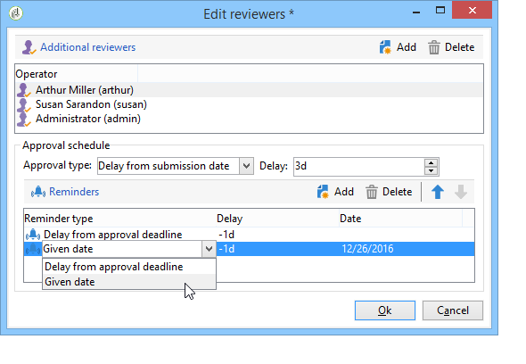

The person in charge of the task can assign themselves the task of approving it, even if other operators have already been assigned to do this. If no reviewer has been defined, the notifications will be sent to the person in charge of the task. All other Adobe Campaign operators with **[!UICONTROL Administrator]** rights can also approve the task. However, they won't receive notifications.

### Documents referenced {#documents-referenced}

It's possible to add documents and marketing resources to a task (for more on this, refer to [Managing marketing resources](../../campaign/using/managing-marketing-resources.md)). To do so, open the task and click the **[!UICONTROL Documents]** icon in the task toolbar.

Click **[!UICONTROL Add]** and select the document to be added to your task. Apply the same process for marketing resources. 

Referenced documents will appear in the notifications sent to the operators involved in the task, as well as on the task dashboard.

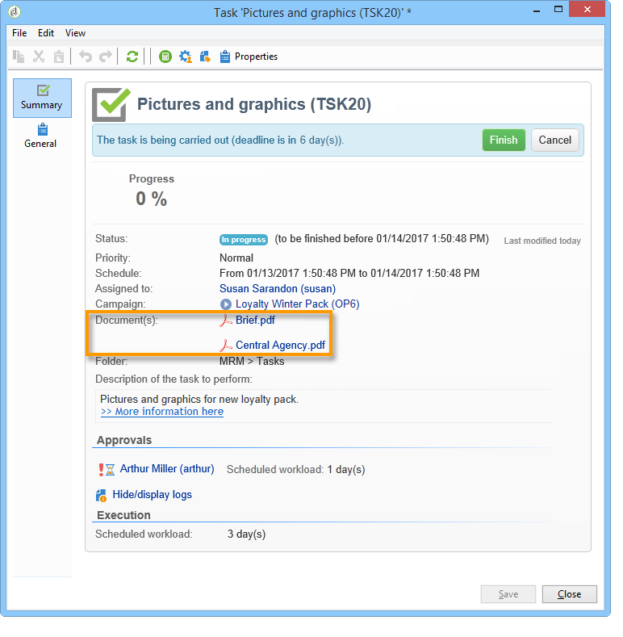

### Execution schedule {#execution-schedule}

The validity period of a task is indicated in the **[!UICONTROL Start]** and **[!UICONTROL End]** fields. The scheduled load expresses the workload to be performed during the period. It is expressed in days or hours.

>[!NOTE]
>
>The life cycle of a task is presented in [Life cycle](#life-cycle).

The **[!UICONTROL Workload performed]** field also expressed in days and hours, lets you manually update the progress of the task with respect to the scheduled workload.

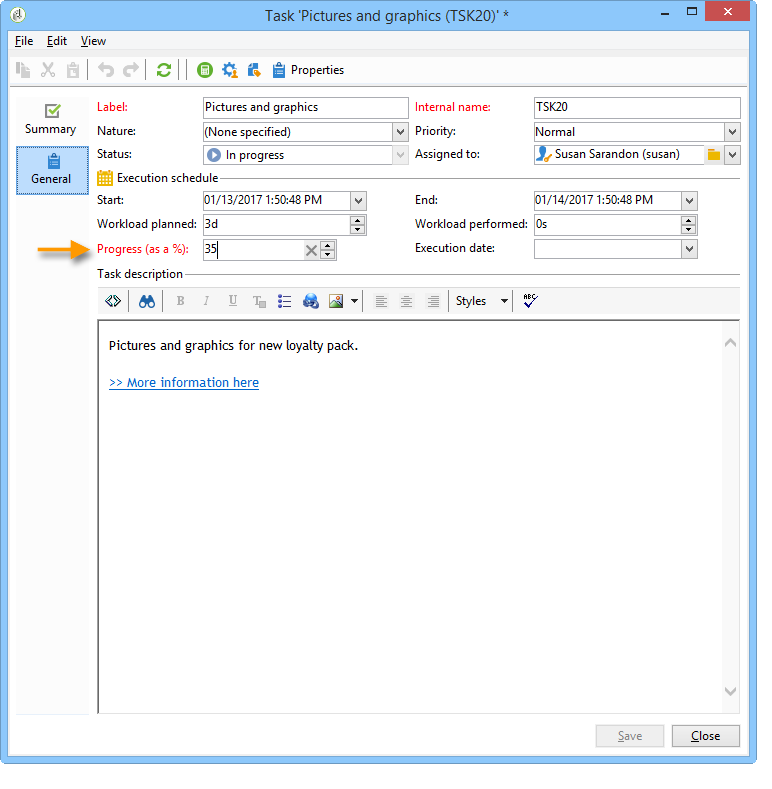

The **[!UICONTROL Progress status]** of the task, expressed as a percentage, is updated automatically based on the tasks carried out by the operators involved. It can be input manually.

This information can be viewed in the task dashboard.

It is also visible in the campaign tab.

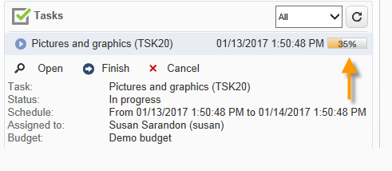

If the task execution schedule end date has been reached but the task is not completed, the task will be **[!UICONTROL Late]**. A warning message will also be displayed to alert operators.

For more on this, refer to [Progress status of a task](#progress-status-of-a-task).

### Expenses and revenues {#expenses-and-revenues}

You can define related expenses and forecast revenue for each task. These will be calculated and then consolidated for the campaign to which the task is attached.

To specify this information, click the **[!UICONTROL Expenses and revenue]** icon in the task toolbar.

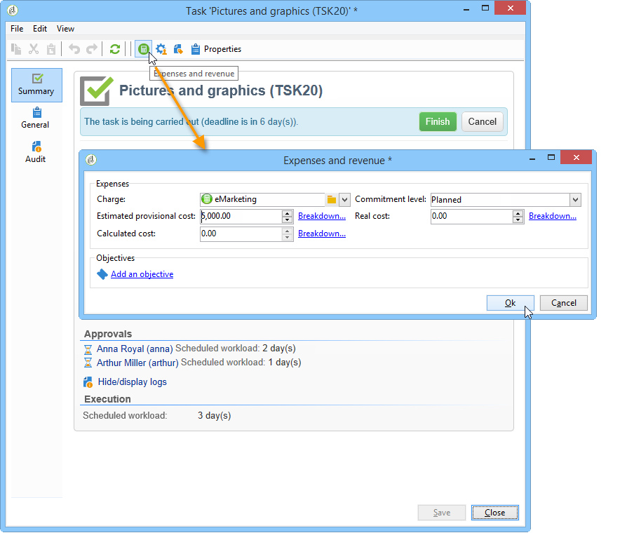

By default, the budget charged is the budget of the campaign to which the task is attached. It is displayed in the task details.

>[!NOTE]
>
>For further information about expenses and budgets, see [Cost commitment, calculation and charging](../../campaign/using/controlling-costs.md#cost-commitment--calculation-and-charging).

In this window, you can also define the objectives to be reached. Objectives are expressed in terms of forecast revenue for the task.

### Service providers {#service-providers}

An external service provider can be involved in the management of a task.

To do this, edit the task properties and select the service provider concerned. The cost categories associated with the service provider are automatically listed in the central section of the window.

For more on this, refer to [Creating a service provider and its cost categories](../../campaign/using/providers--stocks-and-budgets.md#creating-a-service-provider-and-its-cost-categories).

Select the cost categories related to the execution of the task. To do this, select the type of cost and, if necessary, add an amount to surcharge.

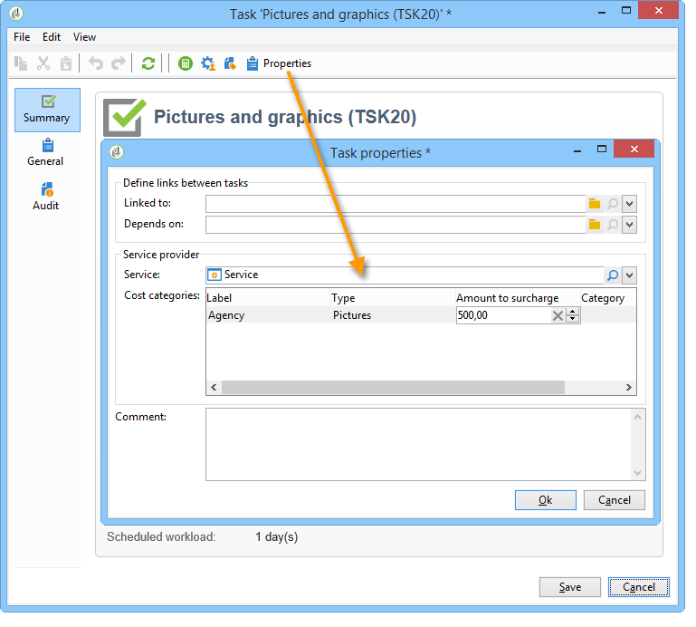

>[!NOTE]
>
>The method for managing budgets and costs is presented in [Controlling costs](../../campaign/using/controlling-costs.md).

When a service provider is selected, it is displayed in the task dashboard:

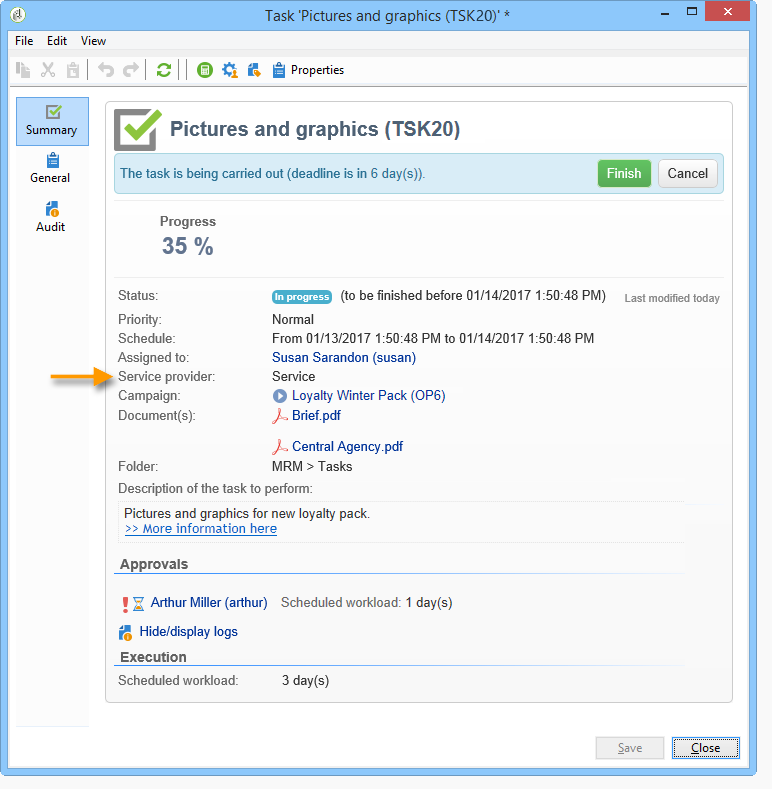

### Late tasks {#late-tasks}

A task is late if it has reached its end date without its status changing to **[!UICONTROL Finished]**. By default, no operator is warned when a task is late. You can configure the delivery of a notification email: all operators can be notified even if they are not involved in the task.

Go to the **[!UICONTROL Resources]** box and add the operator to the **[!UICONTROL Assignation]** field. To notify several people, select a group of operators.

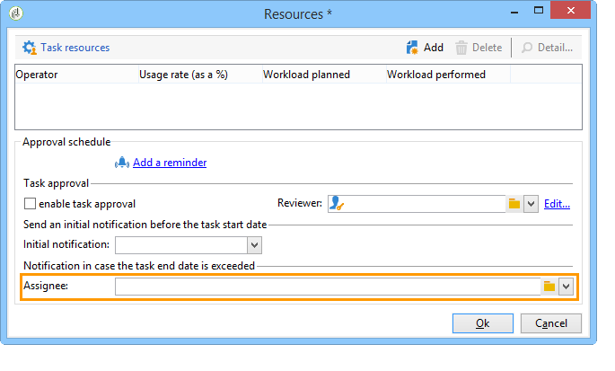

### Initial notifications {#initial-notifications}

When you create or modify a task with a start date in the future, Adobe Campaign offers to send an email to the person in charge of the task to let them know when it starts.

However, if the task you are creating is a long way off, it may be preferable to schedule the notification to be sent before the task starts. For instance, if the task starts in one month, you can notify the person in charge of it one week before it starts.

To schedule a notification, go to the **[!UICONTROL Resources]** box and use the **[!UICONTROL Initial notification]** field.

* For tasks within campaigns, select a specific date and time.
* For tasks within campaign templates, the notification time is expressed as the time remaining before the task starts (for instance, if you enter 2d in the **[!UICONTROL Initial notification]** field, the email will be sent 2 days before the task start date).

If you have scheduled a notification, when you save the task, Adobe Campaign stills offers to send a notification immediately. You can decide to send it and this won't replace the scheduled notification.

### Task linked to a program {#task-linked-to-a-program}

You can create tasks directly in a program to manage actions pertaining to their overall organization and not to a specific campaign (for instance, a meeting to discuss the theme of upcoming campaigns within the program). The task will appear in the program schedule.

To create a task linked directly to a program:

1. Open the program schedule: on the home page, go to **[!UICONTROL Campaigns > Browse > Other choices > Programs]**. The overall program schedule opens in the right-hand section of the window.
1. In the schedule, click the desired program: a window comes up with the program in it.
1. In this window, click **[!UICONTROL Open]**. The program schedule opens.
1. Click the **[!UICONTROL Add]** button above the schedule on the right, then click **[!UICONTROL Add a task]**.

### Operator availability {#operator-availability}

In the task dashboard, an icon next to the operator's name indicates that they are already working on another task or event during the period covered by the task. (Task which the operator is in charge of or involved in: he appears in the **[!UICONTROL Assigned to]** field or in the task **[!UICONTROL Resources]** box).

### Task in a workflow {#task-in-a-workflow}

Using a **[!UICONTROL Task]** element in a campaign workflow enables you to define two scenarios depending on whether or not the task is approved.

In the campaign workflows, the **[!UICONTROL Task]** activity is found in the **[!UICONTROL Flow control]** tab.

## Types of task {#types-of-task}

When you create tasks via a campaign, you can create specific tasks. The type of task is defined in the selected template.

The following tasks can be scheduled:

* [Control tasks](#control-tasks),
* [Grouping task](#grouping-task),
* [Grouping task](#grouping-task),
* [Notification task](#notification-task).

>[!NOTE]
>
>**[!UICONTROL Control task]** and **[!UICONTROL Grouping]** tasks can be created **only** via the campaign dashboard.  
>They are displayed in the task map of the operator to whom they are assigned. See [Accessing tasks](#accessing-tasks).

### Control tasks {#control-tasks}

A **[!UICONTROL Control task]** is linked to delivery approval: approval of targeting, content, extraction file, budget or proof.

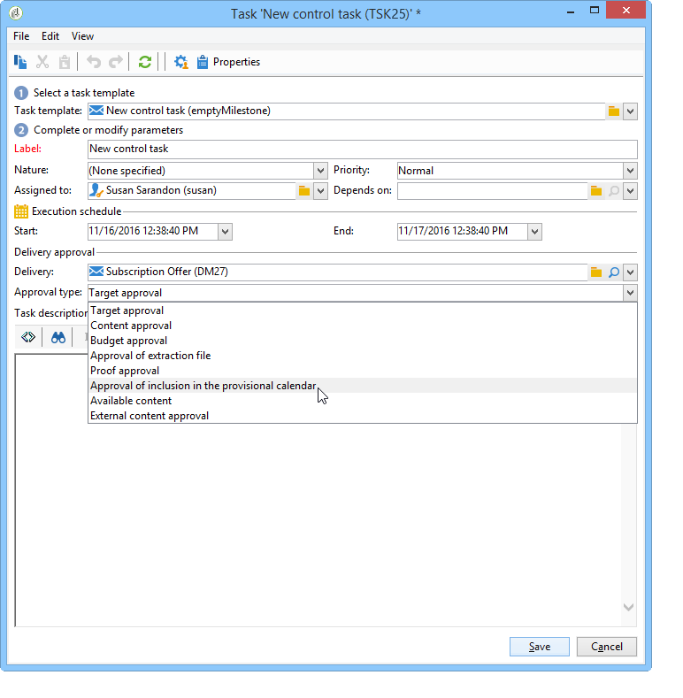

Once it is created, the task is added to the campaign dashboard.

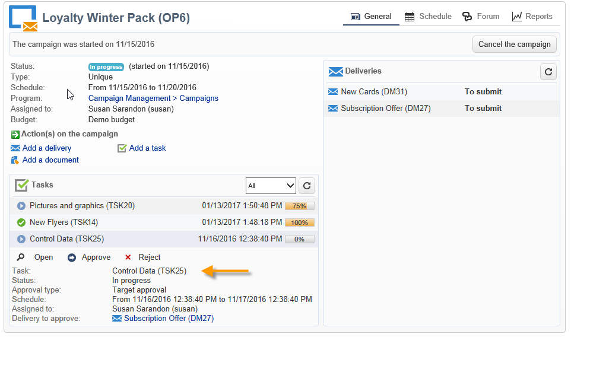

You can then edit it and specify its parameters.

### Marketing resource creation task {#marketing-resource-creation-task}

A marketing resource creation task can be used to manage the creation and publishing of a marketing resource. If you are managing a resource via a task and not via the resource itself, you can:

* Control the resource creation process via a campaign.
* View the resource creation process in a schedule.
* Manage the resource creation process (reminders, notifications).
* Calculate and control the costs linked to resource creation.
* Approve and publish the resource via the task (if the relevant option is enabled).

#### Interaction between the task and its linked resource {#interaction-between-the-task-and-its-linked-resource}

The marketing resources creation task interacts with the resource linked to it. This means:

* The resource creation schedule and the costs linked to it are managed via the task.
* Operators can work on the resource like normal (download or upload, lock and unlock): this does not affect the task.
* Resource approval and publication can be carried out via the task: if the **[!UICONTROL Publish the marketing resource]** option is enabled, the resource is approved and published automatically once the task is finished. If the option isn't enabled, the task and the resource don't interact: acting on one won't affect the other.

  You can use a series of linked tasks to define a full approval cycle. Check the **[!UICONTROL Publish the marketing resource]** option only for the last task: all tasks will need to be finished in order for the resource to be published. Moreover, when you create a child marketing resource task, the resource will be selected automatically in the child task.

    * **Via the resource**: if you submit the resource for approval or approve it, these actions will not impact the task.
    * **Via the task**: if the **[!UICONTROL Publish the marketing resource]** option is checked in the task, the resource is approved and published automatically once the task is finished (see above). If the option isn't checked, the task and the resource won't interact: acting on one won't affect the other.

#### Configuring a marketing resource creation task {#configuring-a-marketing-resource-creation-task}

The person who reviews the task isn't necessary the same person who reviews the content defined in the resource. However, if the **[!UICONTROL Publish the marketing resource]** option is checked (see below), the task reviewer is authorized to approve the resource content, as finishing the task automatically approves the resource (or, if no reviewer is defined, the task manager).

In the **[!UICONTROL Marketing resource]** field, define the resource you want to manage via this task. You can:

* Select an existing resource: the drop-down list offers all resources with the status **[!UICONTROL Being edited]**.
* Creating a resource: click the **[!UICONTROL Select the link]** icon, then click the **[!UICONTROL Create]** icon.

The **[!UICONTROL Publish the marketing resource]** option lets you automate resource publishing: once the task is **[!UICONTROL Finished]**, the status of the resource automatically switches to **[!UICONTROL Published]**, even if it was neither submitted for approval or approved, including if the reviewer who completes the task isn't the content reviewer defined in the resource.

The **[!UICONTROL Publish the resource]** button is made available and the resource publishing reviewer receives a notification email to let him know that it is ready to be published. In the **[!UICONTROL Edit > Tracking]** tab, reviewing and publishing by the task reviewer become visible. If a resource post-processing workflow has been defined, it is executed now.

### Grouping task {#grouping-task}

The **[!UICONTROL Grouping task]** type task lets you group several tasks and synchronize the management of their progress and their approval.

Grouping tasks have no linked expenses or resources.

All the tasks grouped to a grouping task can be seen on its own dashboard. This lets you filter the list of tasks to display only the ones that interest you.

Grouping tasks have a link that lets you easily create a grouped task.

To create a grouped task based on a grouping task, go to the campaign dashboard and click the name of the grouping task to display its description, then click **[!UICONTROL Add a task]**.

However, if you have already created a task that you want to link to a grouping task, you can do it via the **[!UICONTROL Linked to]** field of the **[!UICONTROL Properties]** box.

### Notification task {#notification-task}

Notification tasks enable you to schedule email deliveries (to an operator, a group of operators, a service provider, etc.). This lets you schedule reminders, for instance to notify someone that a campaign is finishing soon, or to send documents before a campaign starts so that operators can prepare it. This means you can keep track of your communications within your campaign or program and a closer eye on the actions carried out.

#### Life cycle {#life-cycle}

Notification tasks don't require approval. This means their life cycle is simpler than that of a standard task:

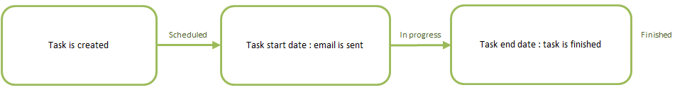

A notification task can have the following statuses:

* **[!UICONTROL Scheduled]** until the email has been sent
* **[!UICONTROL In progress]** once the email is sent and until the end date is reached
* **[!UICONTROL Finished]** once the end date is reached.

#### Configuration {#configuration}

During creation, the following elements must be entered in the task:

* **[!UICONTROL Assigned to]** : the operator or the group of operators who will receive the email. If you re-assign the task once the email has been sent, the email will not be sent to the new operator (for this to happen, you need to re-initialize the task and change its start date).
* **Task start date**: date which the notification email will be sent on. This date must take place in the future at the time of recording of the task.
* **Task end date**: date on which the task status changes to **[!UICONTROL Finished]**. By default, the end date is identical to the start date. However, assigning a duration to the task lets you symbolize the amount of time which the operator has to act in the schedule, if necessary.
* **[!UICONTROL Description]** : the text entered here will appear in the body of the notification email.

  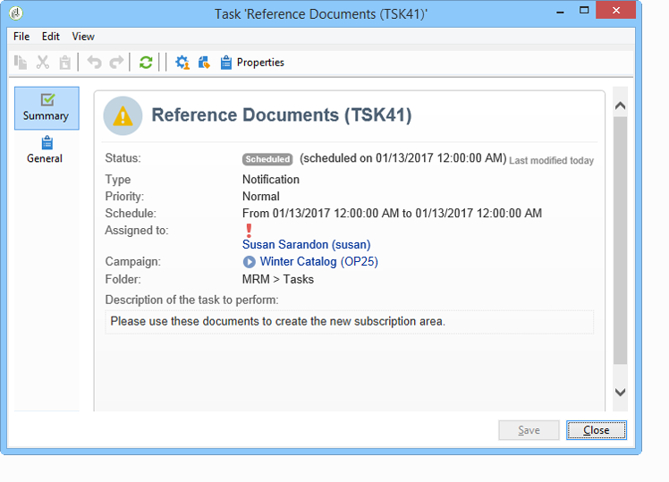

You can add an attachment to the task and to the notification email. To do this, click the **[!UICONTROL Documents]** icon in the toolbar in the upper right-hand corner.

## Life cycle {#life-cycle-1}

### Links between tasks {#links-between-tasks}

The **[!UICONTROL Properties]** button in each task enables you to define the links between tasks in a campaign. You can split tasks into subtasks using a grouping task (see [Linked tasks](#linked-tasks)), or define dependencies between the tasks (see [Grouping tasks](#grouping-tasks)).

#### Linked tasks {#linked-tasks}

Use the **[!UICONTROL Linked task]** field to associate tasks with a grouping task. See [Types of task](#types-of-task).

In the following example, the approval of targeting is broken down into four sub-tasks. 

Each sub-task is a standard task linked to the main task.

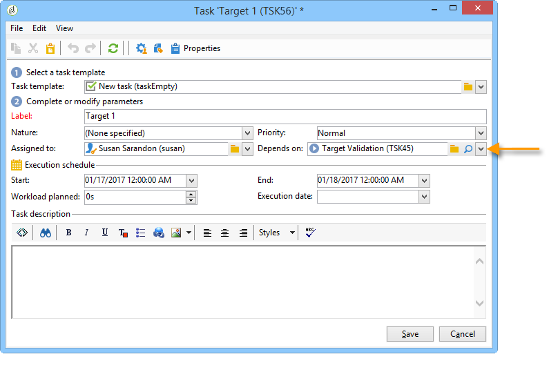

#### Grouping tasks {#grouping-tasks}

Use the **[!UICONTROL Grouped to]** field to make the execution of a task depend on the execution of another task. 

The dependency between tasks is represented by arrows in the campaign dashboard.

In the case of grouped tasks, Adobe Campaign automatically assigns the end date of the parent task to the child task as a start date. For instance if a **Create invitation** task ends on October 15 at 3:30PM, the **Send invitation email** child task will start on October 15 at 3:30PM.

Moreover, if you postpone the end of a parent task, some of its child tasks may be affected: these are the child tasks whose status is **[!UICONTROL Scheduled]** and whose start date is earlier than the new end date of the parent task. The duration of the task remains the same. If the start date of a child task is later than the new end date of the parent task, the child task isn't affected.

**Example**

A parent task scheduled to end on October 9 at 5PM has two child tasks, task A and task B. Task A is scheduled to start on October 10 at 2PM and task B is scheduled to start on October 12 at 8AM.

Let's postpone the parent task: it now ends on October 11 at 1PM. Only task A is postponed and will start on October 11 at 1PM.

### Execution status of a task {#execution-status-of-a-task}

Task statuses can be view in the task map. The execution status of a task is updated automatically according to operator actions.

A task can be: **[!UICONTROL Scheduled]**, **[!UICONTROL In progress]**, **[!UICONTROL Finished]**, **[!UICONTROL Canceled]**, **[!UICONTROL Pending approval]** or **[!UICONTROL Rejected]**.

* When a task is created, it is **[!UICONTROL Scheduled]** if its start date is in the future. It keeps this status until its start date is reached.
* Once it has been started, the task is **[!UICONTROL In progress]**. When the person in charge of the task closes it, it changes to **[!UICONTROL Finished]**.
* If a reviewer has been defined, the task will be **[!UICONTROL Pending approval]** once the person in charge of it closes it and until the reviewer approves it. If the reviewer rejects it, the task will be **[!UICONTROL Rejected]**.
* A task can be canceled by the person responsible for it via the dashboard or the **[!UICONTROL Task map]** by clicking the **[!UICONTROL Cancel]** button.
* To schedule a task, input a start date in the future. You can then send a first notification to the Adobe Campaign operators involved in performing the task. See [Complete task life cycle](#complete-task-life-cycle).

>[!NOTE]
>
>* The task status is updated automatically.
>* Even if the validity period is finished, tasks which were not closed still appear in the list of tasks in progress. A warning notifies operators that the task is late.
>

### Progress status of a task {#progress-status-of-a-task}

In addition to its execution status, a task can be associated with a progress status: **[!UICONTROL Late]**, **[!UICONTROL To approve]**, **[!UICONTROL To do today]** or **[!UICONTROL To do this week]**. This information is entered automatically according to the task schedule.

You can filter the list of tasks by process or progress status.

For more on this, refer to [Accessing tasks](#accessing-tasks).

### Complete task life cycle {#complete-task-life-cycle}

Below are the stages of a complete task life cycle for which the person in charge has defined participants and reviewers.

1. The person in charge creates the task and enters the various fields. For more on this, refer to [Creating a new task](#creating-a-new-task).

   When creating and editing a task **scheduled in the future** (as long as the task start date isn't reached), it's possible to send a notification to participants and managers to let them know that a new task has been scheduled. 

   

   To send this first notification, click **[!UICONTROL Yes]**. This notification tells them about the next task and includes details on content and the number of days remaining until its deadline.

   When a task is created and scheduled for the future, its status is **[!UICONTROL Scheduled]**.

1. On the task start date, the person responsible and the participants receive a notification telling them that the task is started. Its status changes to **[!UICONTROL In progress]**.
1. After completing the section assigned to them, participants can approve the task, either:

    * via the notification email.
    * via the console or the web interface, in the task dashboard.
    
      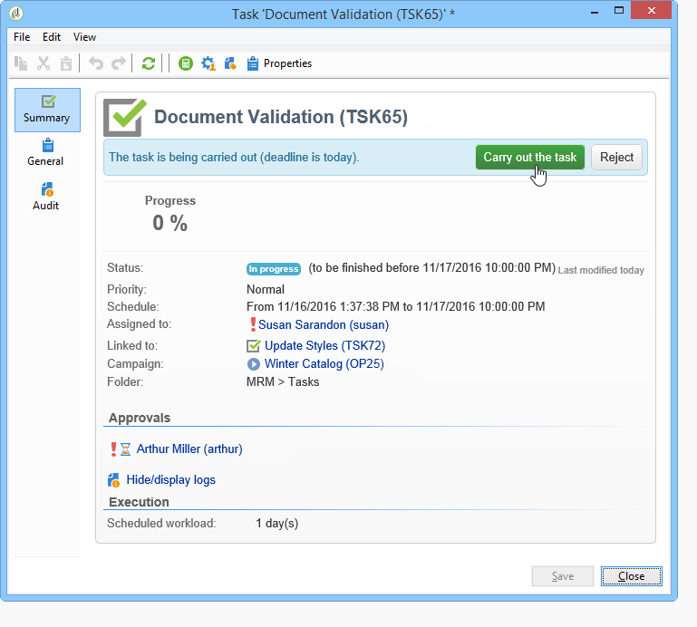

1. Each time a participant approves a job, the progress status of the task is updated.

   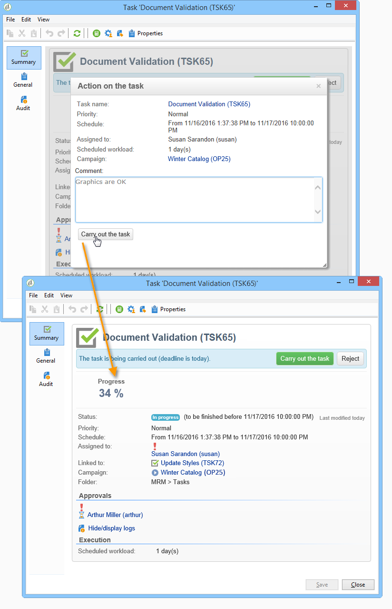

1. The reviewer receives a notification email telling him that the operator has completed the section assigned to them.

   They can follow the progress on the task dashboard.

   

1. Once the person in charge of the task decides that it is finished, they can close it, using either the link in the notification email sent when the task was started, the console, or the interface.

   

   >[!NOTE]
   >
   >The person in charge of a task can close it at any time, even if approvals are missing. The progress status changes to 100% automatically.

1. The task status changes to **[!UICONTROL To approve]**, and a notification is sent to the reviewer.

   They approve the task via the notification email, the console or the web interface.

   They can act via the campaign dashboard:

   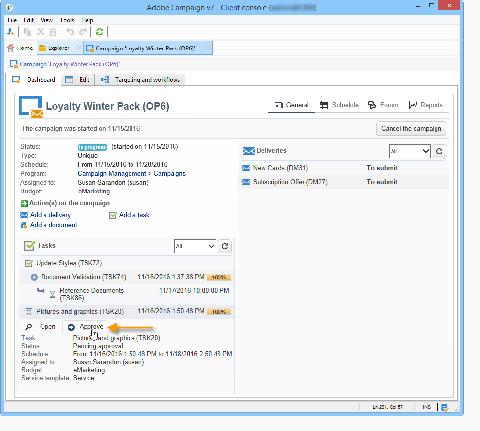

   They can also use the task approval button:

   

   >[!NOTE]
   >
   >The task status will only change to **[!UICONTROL To approve]** if you have enabled the **[!UICONTROL Enable task validation]** option in the **[!UICONTROL Resources]** window of the task.  
   >If the reviewer rejects the task, its status changes to **[!UICONTROL Rejected]**, and the task life cycle starts again automatically.

1. The task status changes to **[!UICONTROL Finished]**. A notification is sent to everyone involved.

   >[!NOTE]
   >
   >Once a task is finished, its life cycle can be reinitialized by the person in charge of it. To do this, open the task and click the **[!UICONTROL Reset task to execute it again...]** link at the bottom of the dashboard.
