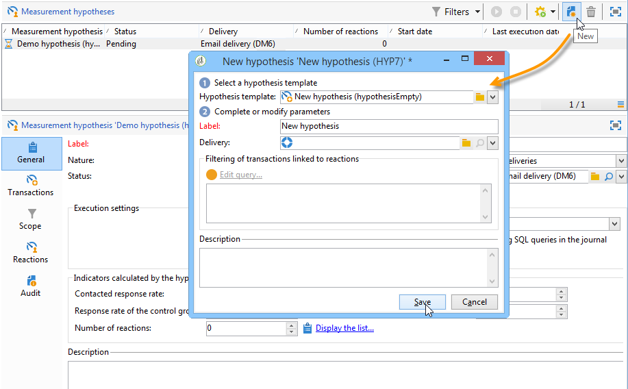
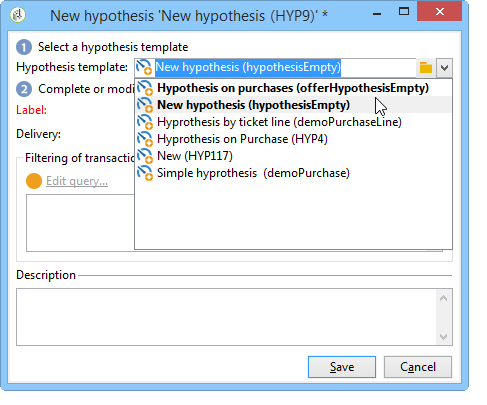
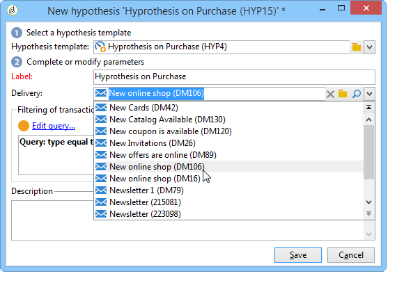
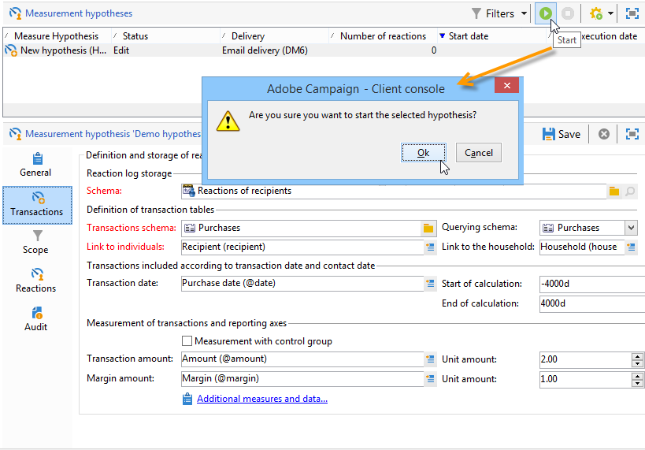
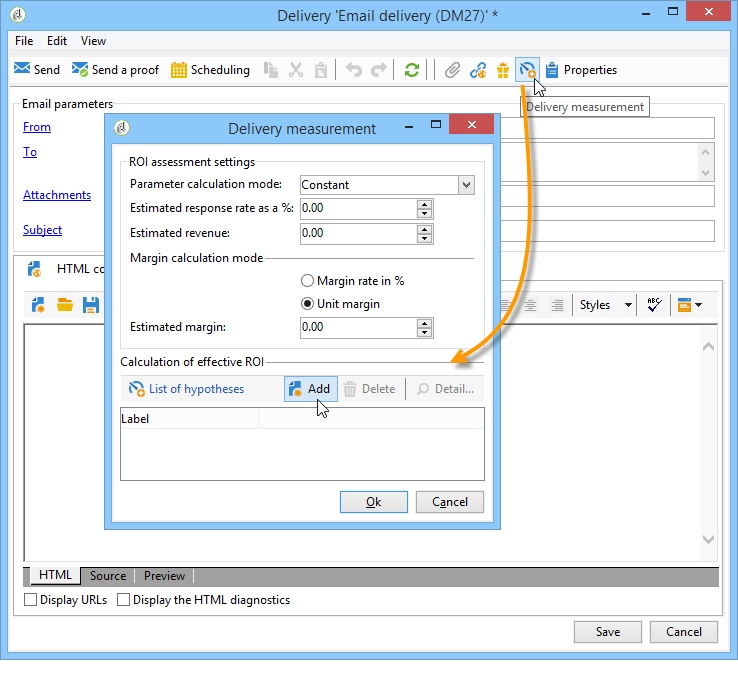
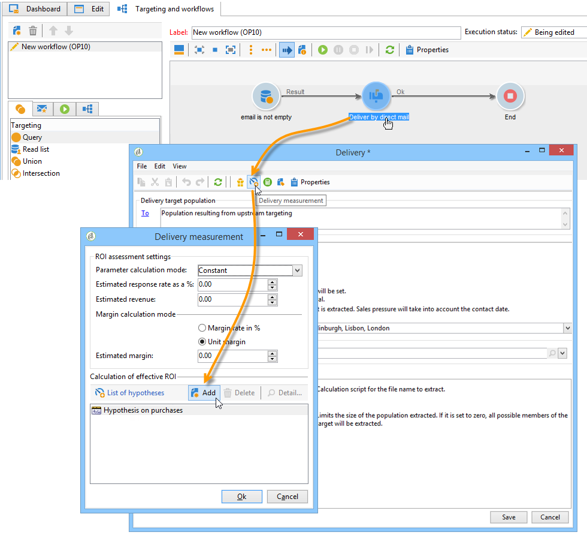
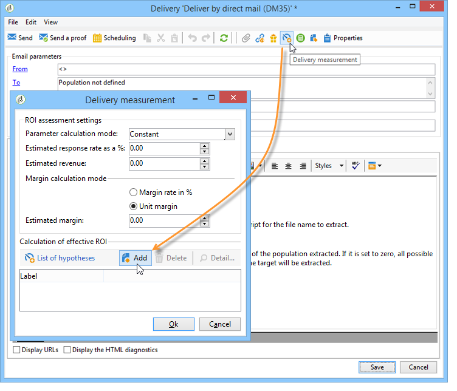
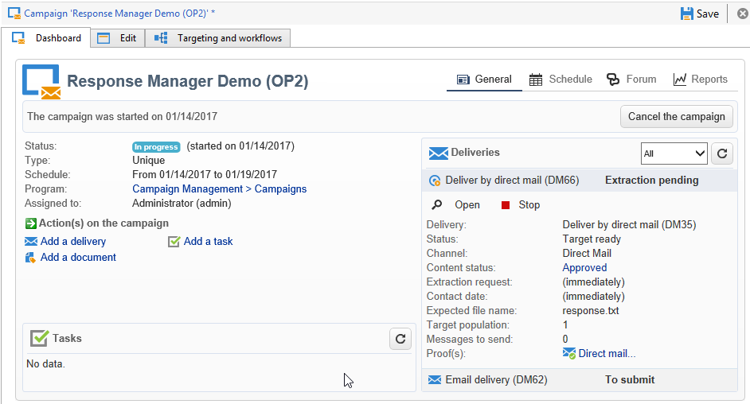
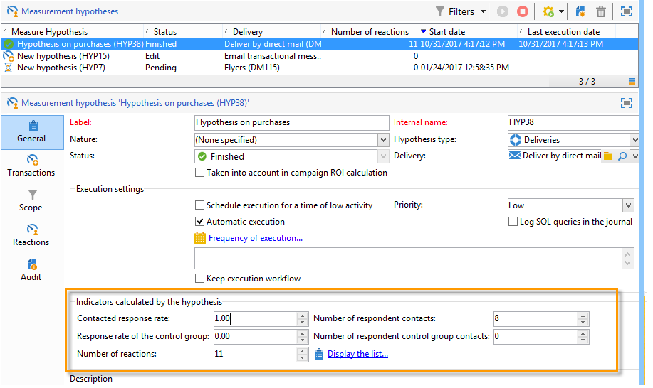

# Create hypotheses{#creating-hypotheses}

There are various possibilities for creating/linking hypotheses to a campaign offer or delivery:

* Via the **[!UICONTROL Measurement hypotheses]** folder by creating a new hypothesis based on an existing template and linking it to an existing delivery.
* Via the **[!UICONTROL Edit]** > **[!UICONTROL Measurement]** tab in a campaign.
* Via the **[!UICONTROL Measurement]** option of a delivery created from a campaign.

Hypotheses can only be calculated once the marketing campaign has been launched and recipients have received the delivery. If the hypothesis is based on an offer proposition, the latter needs to at least be presented and still be active. Offer and delivery hypotheses are created via the **[!UICONTROL Measurement hypotheses]** folder and are based on a hypothesis template. However, it is possible to reference a hypothesis directly in the delivery or the campaign before the campaign starts. In this case, the hypotheses will be calculated automatically once the marketing campaign is launched, based on execution settings (for more on this, refer to [Hypothesis template execution settings](../../campaign/using/hypothesis-templates.md#hypothesis-template-execution-settings)).

## Create a hypothesis on the fly on a delivery {#creating-a-hypothesis-on-the-fly-on-a-delivery}

To create a hypothesis on an existing delivery, apply the following process:

>[!NOTE]
>
>This operation is only possible for pending deliveries.

1. In the Adobe Campaign tree, go to **[!UICONTROL Campaign management > Measurement hypotheses]**.
1. Click the **[!UICONTROL New]** button or right-click on the list of hypotheses and select **[!UICONTROL New]** in the drop-down list.

   

1. In the hypothesis window, select a previously created template (refer to [Hypothesis templates](../../campaign/using/hypothesis-templates.md)).

   

   The hypothesis context as it was defined in the selected model is displayed in the window.

   >[!NOTE]
   >
   >Settings defined in the template and not visible at this step are also kept in the memory and reassigned to the hypothesis in progress.

   

1. Select the delivery for which you want to create a hypothesis.

   

1. You can personalize your hypothesis by editing the **[!UICONTROL General]**, **[!UICONTROL Transactions]** and **[!UICONTROL Scope]** tabs. For more on this, refer to [Creating a hypothesis model](../../campaign/using/hypothesis-templates.md#creating-a-hypothesis-model).
1. Start the hypothesis by clicking **[!UICONTROL Start]**.

   A workflow is automatically created to perform the measurement. The name is automatically defined depending on the hypothesis configuration.

   >[!CAUTION]
   >
   >You can access this if you have checked the **[!UICONTROL Keep execution workflow]** box.  
   >This option must be activated for debugging purposes only, in case of error while running the hypothesis. Workflows generated automatically are saved in the **[!UICONTROL Administration]** > **[!UICONTROL Production]** > **[!UICONTROL Objects created automatically]** > **[!UICONTROL Campaign workflows]** folder in the Adobe Campaign explorer. 
   > 
   >In addition, workflows generated automatically must not be modified. Any eventual modification would not be taken into account elsewhere for later calculations. 
   >
   >If you have checked this option, delete the workflow after it has executed.

   

   Once calculation is complete, measurement indicators are updated automatically.

   

1. If necessary, change the settings and re-start the hypothesis.

## Reference a hypothesis in a campaign delivery {#referencing-a-hypothesis-in-a-campaign-delivery}

You can reference a hypothesis in a marketing campaign before it is started. In this case, the hypothesis will be launched automatically once the delivery is sent, based on the execution settings defined in the hypothesis template. To create a hypothesis in a delivery, apply the following process:

1. Depending on your needs, you can create one or more **[!UICONTROL Delivery]** type templates, as described in [this section](../../campaign/using/hypothesis-templates.md#creating-a-hypothesis-model)
1. Create a marketing campaign and targeting workflows.
1. In the delivery window, click the **[!UICONTROL Delivery measurement]** icon.
1. Select the hypothesis template (the query configured in the model is displayed in the hypothesis window).

   The hypothesis will be calculated automatically once the campaign is finished, based on the dates configured in the model (refer to [Hypothesis template execution settings](../../campaign/using/hypothesis-templates.md#hypothesis-template-execution-settings)).

   

## Add a default hypothesis to deliveries for a campaign {#adding-a-default-hypothesis-to-deliveries-for-a-campaign}

You can directly reference a hypothesis at campaign level. In this case, the hypothesis will be automatically linked to all the deliveries created in the campaign. To do this:

1. Go to the **[!UICONTROL Edit]** tab of the campaign.
1. In the measurement section, click the **[!UICONTROL Default hypotheses]** tab.

   

1. Click **[!UICONTROL Add]** and select a hypothesis template.

   

   A hypothesis based on this template will now be referenced by default in each new delivery for the campaign.

   

The hypothesis results can be viewed in the **[!UICONTROL General]** and **[!UICONTROL Reactions]** tabs of the hypothesis (refer to [Hypothesis tracking](../../campaign/using/hypothesis-tracking.md))

For more information, you can also refer to [this sample](#example--creating-a-hypothesis-linked-to-a-delivery).

## Create a hypothesis on an offer {#creating-a-hypothesis-on-an-offer}

Creating a hypothesis on an offer proposition is similar to creating an on the fly delivery hypothesis. The hypothesis can be executed as long as the offer is active. The calculation period is based on the offer proposition date. When the hypothesis lets you link a recipient to a purchase, the status of the offer proposition likely to be accepted can be changed automatically (for more on this, refer to [Transactions](../../campaign/using/hypothesis-templates.md#transactions)).

1. Create one or more **[!UICONTROL Offer]** type models as described in [this section](../../campaign/using/hypothesis-templates.md#creating-a-hypothesis-model).
1. Go to the **[!UICONTROL Campaign management > Measurement hypotheses]** node.
1. Create an **[!UICONTROL Offers]** type hypothesis by selecting the model created previously.

   

   The query created in the model appears in the window.

   

1. Choose the offer for which you want to create a hypothesis.

   

1. Refine the query if necessary.
1. Click **[!UICONTROL Start]** to run the hypothesis.
1. The hypothesis results can be viewed in its **[!UICONTROL General]** and **[!UICONTROL Reactions]** tabs (refer to [Hypothesis tracking](../../campaign/using/hypothesis-tracking.md)).

   Hypotheses made on an offer are referenced in the **[!UICONTROL Measurement]** tab.

   

   If the **[!UICONTROL Update offer proposition status]** option was enabled in the hypothesis template, the status of the offer proposition is changed automatically, thereby providing feedback on the impact of the campaign (for more on this, refer to [Transactions](../../campaign/using/hypothesis-templates.md#transactions)).

## Example: create a hypothesis linked to a delivery {#example--creating-a-hypothesis-linked-to-a-delivery}

In this example, we want to create a hypothesis linked to a delivery. This hypothesis will be based on the model created previously (refer to [this sample](../../campaign/using/hypothesis-templates.md#example--creating-a-hypothesis-template-on-a-delivery)). We will then refine the query inherited from the model to make a hypothesis on a specific article of the purchase table.

1. Create a campaign and a delivery (For more on this, refer to [Create marketing campaigns](../../campaign/using/setting-up-marketing-campaigns.md#creating-a-campaign)).

   In our example, we will use a direct mail type delivery.

1. Configure a seed address: the previously created hypothesis template was configured to take a control group into account in the reaction results.

   

   >[!NOTE]
   >
   >For more information, refer to [Define a control group](../../campaign/using/marketing-campaign-deliveries.md#defining-a-control-group).

1. Open the **[!UICONTROL Direct mail delivery]** and click the **[!UICONTROL Delivery measurement]** icon, then click **[!UICONTROL Add]**.

   

1. Choose the previously created hypothesis template from the drop-down list.

   

   The query created in the model is displayed.

   

1. Click **[!UICONTROL Edit query...]** and refine the query by entering the product that the hypothesis will concern.

   

   You can check that the hypothesis is linked to the delivery in the **[!UICONTROL Edit]** > **[!UICONTROL Measurement]** tab of the campaign.

   

1. Launch your targeting workflow and run the necessary checks until the campaign is finished (for more on this, refer to [this section](../../campaign/using/marketing-campaign-deliveries.md#starting-a-delivery)).

   

1. In the Adobe Campaign tree, go to the **[!UICONTROL Campaign management > Measurement hypotheses]** node to check the indicators calculated by the hypothesis.

   
