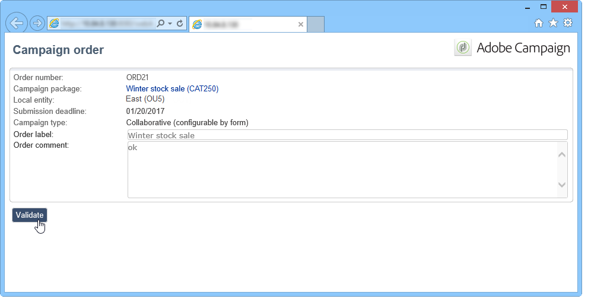

# Examples{#examples}

## Creating a local campaign (by form) {#creating-a-local-campaign--by-form-}

The **By form** type web interface involves using a **web application**. Depending on its configuration, this web application can contain any type of defined personalized elements. For example, you can suggest links to evaluate the target, the budget, the content, etc. via dedicated APIs.

>[!NOTE]
>
>APIs are detailed in a dedicated document, access to which is dependent on your contract. Refer to [API](../../configuration/using/about-web-services.md).
>
>The Web application used in this example is not a Web app that comes out-of-the-box with Adobe Campaign. To use a form in a campaign, you must create the dedicated web application.

When creating the campaign template, click the **[!UICONTROL Zoom]** icon within the **[!UICONTROL Web interface]** option of the **[!UICONTROL Advanced campaign settings...]** link to access details of the web application.


>[!NOTE]
>
>Web application parameters are only available in the campaign template.

In the **[!UICONTROL Edit]** tab, select the **Campaign order** activity and open it to access its content.


In this example, the **Campaign order** activity includes:

* fields to be entered by the local entity during the order,

  

* links that will allow the local entity to evaluate the campaign (e.g. the target, budget, content, etc.),

  

* scripts that allow you to calculate and display the result of these evaluations.

  

In this example, the following APIs are used:

* For the target evaluation,

  ```
  var res = nms.localOrder.EvaluateTarget(ctx.localOrder);
  ```

* For the budget evaluation,

  ```
  var res = nms.localOrder.EvaluateDeliveryBudget(ctx.@deliveryId, NL.XTK.parseNumber(ctx.@compt));
  ```

* For the content evaluation,

  ```
  var res = nms.localOrder.EvaluateContent(ctx.localOrder, ctx.@deliveryId, "html", resSeed.@id);
  ```

## Creating a collaborative campaign (by target approval) {#creating-a-collaborative-campaign--by-target-approval-}

### Introduction {#introduction}

You are the marketing manager for a large clothing brand that has an online store and several boutiques all over the US. Now that spring has arrived, you decide to create a special offer that will give your best clients 50% off all dresses in your catalog.

This offer is aimed at the best clients of your US stores, meaning those who have spent more than $300 since the beginning of the year.

You therefore decide to use Distributed Marketing to create a collaborative campaign (by target approval) which will allow you to select your stores' best clients (grouped by region), who will receive the email delivery containing the special offer.

The first part of this example illustrates your local entities receiving the campaign creation notification, and how they can use it to evaluate the campaign and order it.

The second part of this example explains how to create your campaign.

The steps are as follows:

**For the local entity**

1. Use the campaign creation notification to access the list of contacts selected by the central entity.
1. Select the contacts and approve participation.

**For the central entity:**

1. Create a **[!UICONTROL Data distribution]** activity.
1. Create the collaborative campaign.
1. Publish the campaign.

### Local entity side {#local-entity-side}

1. The local entities that have been chosen to participate in the campaign will receive an email notification.

   

1. By clicking the **[!UICONTROL Access your contact list and approve targeting]** link, the local entity is given access (via web browser) to the list of clients selected for the campaign.

   

1. The local entity unchecks certain contacts from the list because they have already been contacted for a similar offer since the start of the year.

   

Once the checks have been approved, the campaign can start automatically.

### Central entity side {#central-entity-side}

#### Creating a data distribution activity {#creating-a-data-distribution-activity}

1. To set up a collaborative campaign (by target approval) you must first create a **[!UICONTROL Data distribution activity]**. Click the **[!UICONTROL New]** icon in the **[!UICONTROL Resources > Campaign management > Data distribution]** node.

   

1. In the **[!UICONTROL General]** tab, you must specify:

    * the **[!UICONTROL Targeting dimension]**. Here the **Data distribution** is carried out on the **Recipients**.
    * the **[!UICONTROL Distribution type]**. You can choose a **Fixed size** or a **Size as a percentage**.
    * the **[!UICONTROL Assignment type]**. Select the **Local entity** option.
    * the **[!UICONTROL Distribution type]**. Here, it is the **[!UICONTROL Origin (@origin)]** field present in the Recipient table that lets you identify the relationship between the contact and the local entity.
    * The **[!UICONTROL Approval storage]** field. Select the **Local approval of recipient** option.

1. In the **[!UICONTROL Breakdown]** tab, specify:

    * the **[!UICONTROL Distribution field value]**, which corresponds to the local entities involved in the upcoming campaign.
    * the local entity **[!UICONTROL label]**.
    * the **[!UICONTROL Size]** (fixed or as a percentage). The **0 default value** involves selecting all the recipients linked to the local entity.

   

1. Save your new data distribution.

#### Creating a collaborative campaign {#creating-a-collaborative-campaign}

1. From the **[!UICONTROL Campaign management > Campaign]** node, create a new **[!UICONTROL collaborative campaign (by target approval)]**.
1. In the **[!UICONTROL Targeting and workflows]** tab, create a workflow for your campaign. This must contain a **Split** activity in which the **[!UICONTROL Record count limitation]** is defined by the **[!UICONTROL Data distribution]** activity.

   

1. Add a **[!UICONTROL Local approval]** action where you can specify:

    * the message content that will be sent to the local entities in the notification,
    * the approval reminder,
    * the expected processing for the campaign.

   

1. Save your record.

#### Publishing the campaign {#publishing-the-campaign}

You can now add a **campaign package** from the **[!UICONTROL Campaigns]** tab.

1. Choose your **[!UICONTROL Reference campaign]**. In the **[!UICONTROL Edit]** tab of your package, you can select the **[!UICONTROL Approval mode]** to use for your campaign:

    * in **Manual** mode, the local entities participate in the campaign if they accept the invitation from the central entity. They can delete pre-selected contacts if they want to and approval from the manager is necessary to confirm their participation in the campaign.
    * in **Automatic** mode, the local entities must participate in the campaign, unless they unregister themselves from it. They can delete contacts without needing approval.

   

1. In the **[!UICONTROL Description]** tab, you can add a description for your campaign as well as any documents to be sent to the local entities.

   

1. Approve your campaign package then start your workflow to publish the package and make it available to all the local entities in list of packages.

   

## Creating a collaborative campaign (by form) {#creating-a-collaborative-campaign--by-form-}

### Introduction {#introduction-1}

You are the marketing manager for a large makeup brand that has an online store and several boutiques all over the US. To unload your winter stock and make room for your new stock, you decide to create a special offer that will target two client categories: the over 30s, to whom you will offer age sensitive skin care products, and the under 30s, to whom you will offer the more basic skin care products.

You therefore decide to use Distributed Marketing to create a collaborative campaign (by form) which will allow you to select clients from your different stores by the age ranges. These clients will receive an email delivery with a special offer that will have been personalized according to their age range.

The first part of this example illustrates your local entities receiving the campaign creation notification, and how they can use it to evaluate the campaign and order it.

The second part of this example explains how to create your campaign.

The steps are as follows:

**For the local entity**

1. Use the campaign creation notification to access the online form.
1. Personalize the campaign (target, content, delivery volume).
1. Check these fields and change them if necessary.
1. Approve your participation.
1. The manager of the local entity (or the central entity) approves your configuration and participation.

**For the central entity:**

1. Create the collaborative campaign.
1. Configure the **[!UICONTROL Advanced campaign settings...]** as you would for a local campaign.
1. Configure the campaign workflow and the delivery as you would for a local campaign.
1. Update the web form.
1. Create the campaign package and publish it.

### Local entity side {#local-entity-side-1}

1. The local entities selected to take part in the campaign receive an email notification informing them of their participation in the campaign.

   

1. The local entities complete the personalized form, then they:

    * evaluate the target and the budget, 
    * preview the delivery content,
    * approve their participation.
    
      

1. The operator in charge of validating orders approves their participation.

   

### Central entity side {#central-entity-side-1}

1. To implement a collaborative campaign (by form), you must create a campaign using the **Collaborative campaign (by form)** template.

   

1. In the campaign's **[!UICONTROL Edit]** tab, click the **[!UICONTROL Advanced campaign settings...]** link to configure it as a local campaign. Refer to [Creating a local campaign (by form)](#creating-a-local-campaign--by-form-).

   

1. Configure the campaign workflow and the web form. Refer to [Creating a local campaign (by form)](#creating-a-local-campaign--by-form-).
1. Create your campaign package by specifying the execution schedule and the local entities involved.

   

1. Finalize the package configuration by selecting the approval mode in the **[!UICONTROL Edit]** tab.

   

1. From the **[!UICONTROL Description]** tab, you can enter a campaign package description, a notification message to be sent to local entities when the package is published, and attach any informative documents to your campaign package.

   

1. Approve the package to publish it.

   
