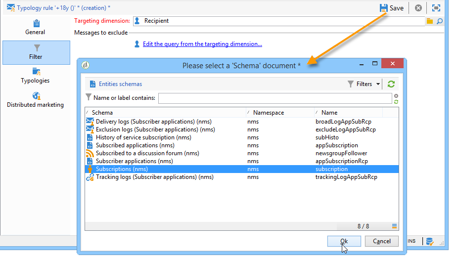
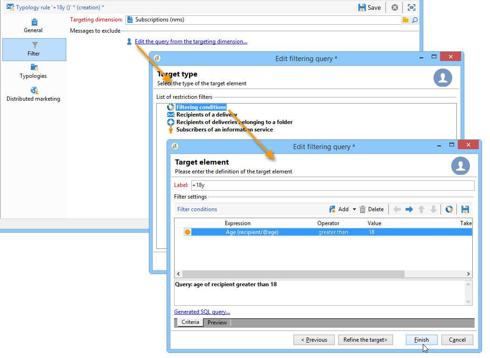
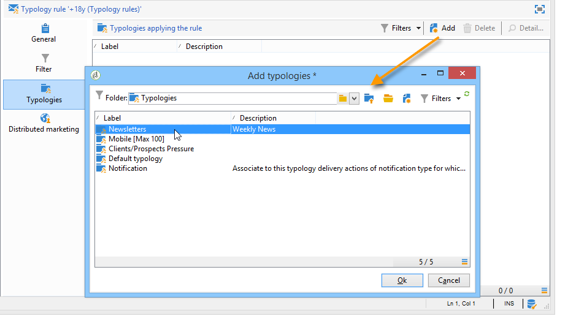
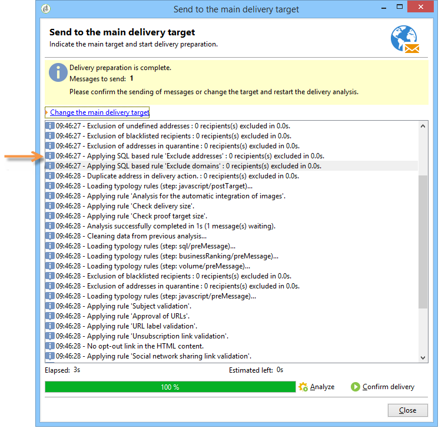
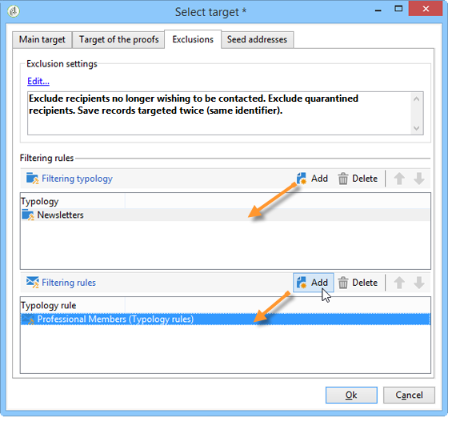

# Filtering rules{#filtering-rules}

Filtering rules let you define the messages to exclude based on criteria defined in a query. These rules are linked to a targeting dimension.

Filtering rules can be linked to other types of rules (control, pressure, etc.) in typologies, or grouped in a dedicated **Filtering** typology. For more on this, refer to [Creating and using a filtering typology](#creating-and-using-a-filtering-typology).

## Creating a filtering rule {#creating-a-filtering-rule}

For example, you can filter your newsletter subscribers to prevent communications from being sent to recipients who are underage.

To define this filter, apply the following steps:

1. Create a **[!UICONTROL Filtering]** typology rule applicable to all communication channels.

   

1. Change the default targeting dimension and select the subscriptions (**nms:subscription**).

   

1. Create the filter using the **[!UICONTROL Edit the query from the targeting dimension...]** link.

   

1. Link this rule to a campaign typology and save it.

   

When this rule is used in a delivery, underage subscribers are excluded automatically. A specific message indicates rule application:

## Conditioning a filtering rule {#conditioning-a-filtering-rule}

You can restrict the application field of the filtering rule based on the linked delivery or delivery outline.

To do this, go to the **[!UICONTROL General]** tab of the typology rule, select the type of restriction to apply and create the filter, as shown below:

In this case, even if the rule is linked to all deliveries, it will only be applied to those which match the criteria of the defined filter.

>[!NOTE]
>
>Typologies and filtering rules can be used in a workflow, in the **[!UICONTROL Delivery outline]** activity. For more on this, refer to [this section](../../workflow/using/delivery-outline.md).

## Creating and using a filtering typology {#creating-and-using-a-filtering-typology}

You can create **[!UICONTROL Filtering]** typologies: they only contain filtering rules. 

These specific typologies can be linked to a delivery when the target is selected: in the delivery wizard, click the **[!UICONTROL To]** link, then click the **[!UICONTROL Exclusions]** tab. 

Then select the filtering typology to be applied to the delivery. To do this, click the **[!UICONTROL Add]** button and select the typologies to apply.

You can also link filtering rules directly via this tab, without them being grouped in a typology. To do this, use the lower section of the window. 

>[!NOTE]
>
>Only typologies and filtering rules are available in the selection window.
>
>These configurations can be defined in the delivery template to be applied automatically to all new deliveries created using the template.
>

## Default deliverability exclusion rules {#default-deliverability-exclusion-rules}

Two filtering rules are available by default: **[!UICONTROL Exclude addresses]** ( **[!UICONTROL addressExclusions]** ) and **[!UICONTROL Exclude domains]** ( **[!UICONTROL domainExclusions]** ). During the email analysis, these rules compare the recipient email addresses with the forbidden addresses or domain names contained in an encrypted global suppression list managed in the deliverability instance. If there is a match, the message is not sent to that recipient.

This is to avoid being added to the denylist due to malicious activity, especially the use of a Spamtrap. For example, if a Spamtrap is used to subscribe via one of your web forms, a confirmation email is automatically sent to that Spamtrap, and this results in your address being automatically added to the denylist.

>[!NOTE]
>
>The addresses and domain names contained in the global suppression list are hidden. Only the number of excluded recipients is indicated in the delivery analysis logs.
