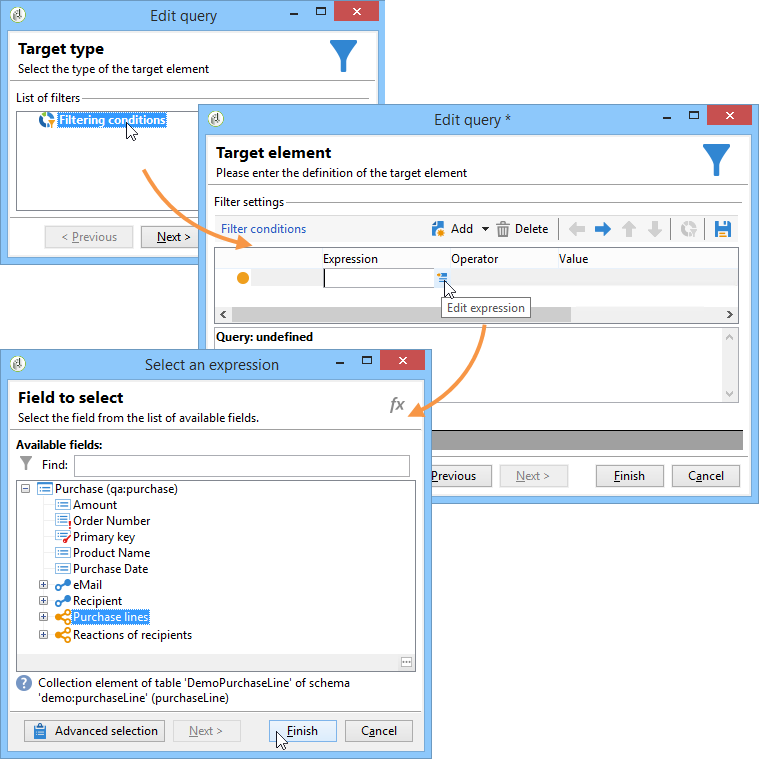

# Hypothesis templates{#hypothesis-templates}

## Creating a hypothesis model {#creating-a-hypothesis-model}

Configuring the hypothesis template lets you define the context for measuring reactions, whether for a delivery or for an offer. This is where the various measuring tables are referenced, including those for defining relations between individuals, hypotheses and the transaction table.

To create a hypothesis template, apply the following steps:

1. In the Adobe Campaign explorer, click **Resources>Templates>Hypothesis templates**.

   

1. Click **New** or right-click in the list of templates and choose **New** in the drop-down list.
1. Enter the hypothesis label.
1. Specify whether the template is destined for hypotheses on offers or deliveries via the **Hypothesis type**.
1. For **Delivery** type templates, specify whether measurements should be carried out with or without a control group (for more on this, refer to [Properties of a hypothesis template](../../campaign/using/hypothesis-templates.md#properties-of-a-hypothesis-template)).
1. For **Delivery** type templates, you can choose a specific channel or decide to apply the template to all available channels in Adobe Campaign using the **Channel** drop-down list (for more on this, refer to [Properties of a hypothesis template](../../campaign/using/hypothesis-templates.md#properties-of-a-hypothesis-template)).
1. Select the **Execution folder** in which you wish to create and automatically execute the hypotheses that will be created from this template.
1. Choose the execution settings (for more on this, refer to [Hypothesis template execution settings](../../campaign/using/hypothesis-templates.md#hypothesis-template-execution-settings)).
1. Specify the hypothesis calculation period (for more on this, refer to [Hypothesis template execution settings](../../campaign/using/hypothesis-templates.md#hypothesis-template-execution-settings)).

   >[!CAUTION]
   >
   >This period is determined from the contact date.

1. In the **Transactions** tab, specify the tables and fields required for the hypothesis calculation (for more on this, refer to [Transactions](../../campaign/using/hypothesis-templates.md#transactions)).
1. If your template is configured for **Offer** type hypotheses, you can enable the **Update offer proposition status** option: in this case, select the status of the offer proposition you want to change.
1. Specify the scope of the hypothesis application (for more on this, refer to [Hypothesis perimeter](../../campaign/using/hypothesis-templates.md#hypothesis-perimeter)).
1. If necessary, use a script to complete filtering (for more on this, refer to [Hypothesis perimeter](../../campaign/using/hypothesis-templates.md#hypothesis-perimeter)).

### Properties of a hypothesis template {#properties-of-a-hypothesis-template}

The template's **General** tab lets you specify the general template options. The available fields are:

* **Hypothesis type**: lets you determine whether the template should be destined for hypotheses on deliveries or offers.

  You can also choose to create a hypothesis that will apply to both deliveries and offers.

  >[!NOTE]
  >
  >If the template applies to offers, the **Update offer proposition status** option is available in the **Transactions** tab.

* **Measurement with control group**: lets you state whether a control group has been defined for the delivery or the campaign and include it in measurement indicators. The control group, which doesn't receive deliveries, lets you measure the impact of the campaign after the delivery, by comparing it with the target population which did receive the delivery.

  >[!NOTE]
  >
  >If the template is configured to take a control group into account, but no group is defined in the delivery which the hypotheses concern, the results will be based on targeted recipients only.

  For more on defining and configuring a control group, refer to [Defining a control group](../../campaign/using/hypothesis-templates.md#defining-a-control-group).

* **Channel**: you can choose a specific channel or make the hypothesis template available to all channels in the Adobe Campaign console by selecting **All channels** in the drop-down list. If you configure the template for a specific channel, this lets you automatically filter deliveries per channel when creating the hypothesis (refer to [Creating hypotheses](../../campaign/using/creating-hypotheses.md)). 

  

* **Execution folder**: lets you specify the execution folder for the hypothesis.
* **Taken into account in campaign ROI calculation**: takes the hypothesis result into account in the ROI calculation for the related campaign.

### Hypothesis template execution settings {#hypothesis-template-execution-settings}

The template's **General** tab also lets you specify the hypothesis execution parameters. The options available are as follows:

* **Schedule execution for a time of low activity**: lets you schedule the hypothesis launch to optimize Adobe Campaign performances. When this option is checked, the processing workflow on campaigns executes hypothesis calculation during downtime.

  

* **Priority**: level applied to the hypothesis to space out the hypothesis calculation orders if there are simultaneous executions.

  

* **Automatic execution**: if necessary, lets you schedule hypothesis recalculation (for example, if you want to update indicators regularly until the end of the delivery). 

  

  To specify a schedule, apply the following process:

    1. Click the **Frequency of execution...** link, then the **Change...** button. 
    
       

    1. Configure the frequency, the related events and the validity period.
    
       

    1. Click **Finish** to save the schedule.
    
       

* **Log SQL queries in journal**: this function is reserved for expert users. It lets you add a tab to the measuring hypothesis audit to show SQL queries. This enables the detection of possible malfunctions if a simulation finishes with errors.
* **Keep execution workflow**: lets you keep the workflow that was automatically generated at the start of the hypothesis calculation. In the hypotheses created from a template that has this option checked, the generated workflow is available to follow the process.

  >[!CAUTION]
  >
  >This option must be activated for debugging purposes only, in case of error while running the hypothesis.   
  >In addition, workflows generated automatically must not be modified. Any eventual modification would not be taken into account elsewhere for later calculations.  
  >If you have checked this option, delete the workflow after it has executed.

### Transactions {#transactions}

This tab contains the various fields and tables which let you save the history of recipient reactions in terms of transactions. Refer to the [Configuration](../../configuration/using/about-schema-reference.md) guide for more information on the tables dedicated to response management.

* **Schema (reaction log storage)**: select the recipient reaction table. The out-of-the-box table in Adobe Campaign is **NmsRemaMatchRcp**.
* **Transaction schema**: choose the table that the hypotheses will concern, i.e. the transaction or the purchase table.
* **Querying schema**: choose the criteria for filtering the hypothesis. 
* **Link to individuals**: choose the link between individuals and the table used as a transaction schema.
* **Link to the household**: select the link to the household in the transactions schema if you wish to include all members of a household in a hypothesis. This field is optional.
* **Transaction date**: this field is optional but recommended since it lets you define a scope for hypothesis calculation. 
* **Measurement period**: lets you configure start and end dates during which hypotheses are executed and purchase lines are recovered.

  When the hypothesis is linked to a delivery, measurement is automatically triggered a few days after the contact date for direct mail deliveries, or after the delivery date for email or SMS deliveries.

  

  If the hypothesis is launched on the fly, it can be forced if would like to trigger it immediately. Otherwise, it is triggered automatically based on the configured end of calculation date, which is based on the hypothesis creation date (refer to [Creating a hypothesis on the fly on a delivery](../../campaign/using/hypothesis-templates.md#creating-a-hypothesis-on-the-fly-on-a-delivery)).

* **Transaction/Margin amount**: these fields are optional and enable you to calculate turnover indicators automatically (refer to [Indicators](../../campaign/using/hypothesis-templates.md#indicators)).
* **Unit amount**: lets you set an amount for calculating revenue (refer to [Indicators](../../campaign/using/hypothesis-templates.md#indicators)). 

  

* **Additional measures and data**: lets you specify additional reporting measures or axes from fields in the different tables.
* **Update offer proposition status**: lets you change the status of the offer proposition if an offer recipient is identified by the hypothesis. 

  

### Hypothesis perimeter {#hypothesis-perimeter}

Once you have defined the transaction table and the fields which the hypothesis will concern, you can refine the scope of your hypotheses by specifying the targeted transactions and deliveries using filters. You can also use a JavaScript script to explicitly point to a product referenced in the transaction table.

* **Filtering on transactions**: in the **Scope** tab, you can configure a filter on the hypothesis. To do this:

    1. Click the **Edit query** link.
    
       

    1. Specify your filtering conditions.
    
       

    1. Select the transaction which the hypothesis will concern.
    
       

* **Filter on recipients**: in the **Scope** tab, you can limit your hypothesis to any information linked to a message (delivery, recipient, email address, service, etc.):

    1. Click the **Add a filter** link, then **Edit query**.
    
       

    1. Specify your filtering conditions.
    
       

    1. Click **Finish** to save your query.
    
       

* **Script**: you can use a JavaScript script to dynamically overload the hypothesis settings during its execution.

  To do this, click the **Advanced settings** link then enter the desired script.

  >[!NOTE]
  >
  >This option is for expert users.

  

## Example: creating a hypothesis template on a delivery {#example--creating-a-hypothesis-template-on-a-delivery}

In this example, we are going to create a hypothesis template on a direct mail type delivery. The transaction table (**Purchases** in our example) which the hypotheses will be based on contains purchase lines linked to articles or products. We want to configure our model to create hypotheses on articles or products in the purchase table.

1. In the Adobe Campaign explorer, go to the **Resources > Templates > Hypothesis templates** node.
1. Click **New** to create a template.

   

1. Change the template label.

   

1. Select **Deliveries** as a hypothesis type.
1. Specify that the delivery can contain a control group by checking the relevant box.
1. Choose the **Direct mail** channel.

   >[!NOTE]
   >
   >Since the template is specific to direct mail deliveries, hypotheses created using this model may not be linked to any other delivery types.

1. In the **Transactions** tab, select the recipient reactions table.

   

1. In the **Transactions schema** field, choose your purchase table.

   

1. Select purchase lines in the **Querying schema** field.

   

1. Choose the recipients linked to the purchase table.

   

1. Select the field linked to the purchase date.

   This lets you define a time frame for hypotheses. This stage isn't mandatory but it is recommended.

   

1. Configure the calculation period for 5 to 25 days.

   

1. In the **Scope** tab, click **Edit query** to create a filter on hypotheses.

   

   The template created thus enables you to run hypotheses on the products or articles in the purchase table.

1. Click **Save** to record your template.

