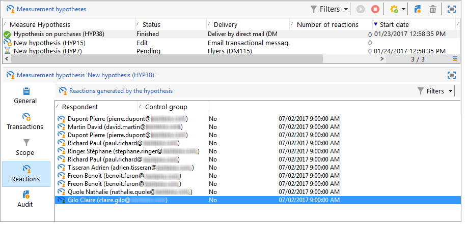

# Hypothesis tracking{#hypothesis-tracking}

The result of hypothesis calculations is available at various levels of the Adobe Campaign platform: indicators calculated by hypotheses and the target populations reactions are visible via the actual hypothesis, as well as in the hypotheses reports available via campaigns and deliveries.

## Hypothesis results {#hypothesis-results}

### Indicators {#indicators}

Once the hypothesis has been calculated, several measurement indicators are updated automatically. These are available in the **General** tab of the hypothesis.

These indicators are:

* **Number of respondent contacts**: number of contacted individuals who match the hypothesis.
* **Contacted response rate**: number of respondent contacts / total people contacted during the delivery.
* **Number of respondent control group contacts**: number of control groups that match the hypothesis.
* **Response rate of the control group**: number of respondent control groups / total number of delivery control groups.
* **Number of reactions**: number of records in the table which contains the relationship between individuals, the hypothesis and the transaction table.

For the full list of indicators, click the **Display the list** link:

The following information is provided by the indicators:

* **Total revenue of population contacted**: total amounts over the number of individuals contacted.
* **Total revenue of the control group**: total amounts over the number of control groups.
* **Average revenue per contact**: total amounts / contacted.
* **Average revenue of control group**: total amounts / control group.
* **Total margin per contact**: total margin over contacted.
* **Total margin of control group**: total margin over control group.
* **Average margin per contact**: total margin / contacted.
* **Average margin of control groups**: total margins / control group.
* **Additional revenue**: (Average revenue of contacted-Average revenue of control group)&#42;Number of contacted
* **Additional margin**: (Average margin of contacted-Average margin of control group) / number of contacted
* **Average cost per contact**: calculated delivery cost / Number of contacts.
* **ROI**: calculated cost of the delivery / Total margin per contact
* **Effective ROI**: calculated delivery cost / Additional margin.
* **Significance**: contains values 0 to 3 depending on campaign significance.

### Reactions {#reactions}

You can view recipients' reactions to the hypotheses via the **Reactions** tab.

1. Once hypothesis calculation is complete, go to the **Campaign management > Measurement hypotheses** node of the Adobe Campaign tree.
1. Select the desired hypothesis and click the **Reactions** tab to view the list of recipients likely to purchase something following the marketing campaign.

   

## Reports {#reports}

The **Hypothesis report** lets you view the results of the hypotheses performed on campaigns and deliveries. This report contains the indicators calculated by the hypothesis (for more on this, refer to [Indicators](../../campaign/using/hypothesis-tracking.md#indicators)).

* **At campaign level**: click the **Reports** link of the relevant campaign and select the **Hypothesis report**. This report contains the list of campaign deliveries and the hypotheses calculated for each delivery. 

  

* **At delivery level**: to access the report, open the concerned delivery, click the **Reports** in the **Summary** tab and select the **Hypothesis report**. If several hypotheses were calculated for the same delivery, the report will contain all hypotheses.

  

