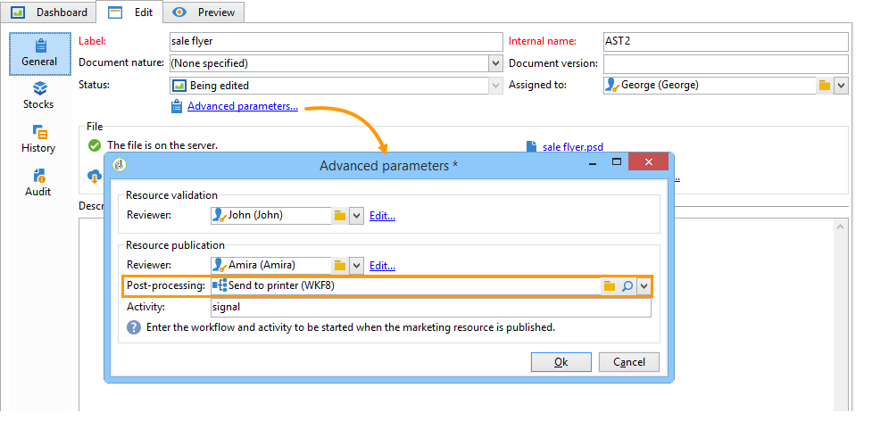
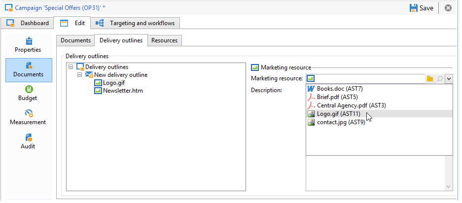

# Managing marketing resources{#managing-marketing-resources}

Adobe Campaign lets you manage and track the marketing resources involved in the campaign life cycle. These marketing resources can be a brochure, a visual aid, or any other communication medium involving several operators.

For each marketing resource managed via Adobe Campaign, you can track its status and history at any time and view the current version.

## Adding a marketing resource {#adding-a-marketing-resource}

Marketing resources are accessed via the **[!UICONTROL Campaigns]** tab.

To add a resource, click the **[!UICONTROL Create]** button.

To make a resource available on the Adobe Campaign server, you must add the desired resource by dragging and dropping it in the middle area of the editor. You can also click the **[!UICONTROL Upload file to server...]** link.

A confirmation message lets you launch the upload.

When upload is complete, the resource is added to the list of available resources. It is accessible to Adobe Campaign operators. They can view it (via the **[!UICONTROL Preview]** tab), make a copy to modify it, or update the file on the server (using the **[!UICONTROL Edit]** tab).

Click the **[!UICONTROL General]** tab to select the operators or groups of operators in charge of monitoring, tracking and approving this resource. Selecting the reviewer is done via the **[!UICONTROL Advanced parameters]** link.

* The operator to whom the resource is assigned is responsible for tracking it.
* The approving operator is responsible for approving the marketing resource. They will be notified when the resource validation process is launched.

  If no reviewer is selected, the resource **[!UICONTROL cannot be]** subject to approval.

* If necessary, you can also specify a proofreader.

You can specify an (indicative) availability date for the resource. Beyond this date, it will appear with **[!UICONTROL Late]** status.

## Collaborative work on resources {#collaborative-work-on-resources}

You can modify and update a marketing resource and, if necessary, inform other Adobe Campaign operators of this. You can:

* Download the resource locally in order to modify it.
* Update the file on the server and make it accessible to other operators.
* Lock a resource in order to prohibit its modification by other operators.

>[!NOTE]
>
>The **[!UICONTROL History]** tab contains the download and update log for the resource. The **[!UICONTROL Details]** button lets you view the selected version:

### Locking/unlocking a resource {#locking-unlocking-a-resource}

Once created, resources are available in the marketing resource dashboard, and operators can edit and modify them.

When an operator wishes to work on a resource, it is preferable to lock it before starting work, to prevent other operators from modifying it at the same time. The resource is then reserved; it remains accessible, but cannot be published or updated on the server by another operator.

A special message notifies any operators who try to access it:

The **[!UICONTROL Tracking]** tab indicates the name of the operator who locked the resource and the planned update date.

To lock a resource, you must click the resource followed by the **[!UICONTROL Lock]** button in the resource dashboard.

You can indicate the planned return date in the **[!UICONTROL Tracking]** tab of the resource.

This information lets you inform other Adobe Campaign operators of the date on which the resource will be unlocked.

When the resource has been updated, it is automatically unlocked and made available to all operators again.

If necessary, you can also unlock it manually from the dashboard.

>[!NOTE]
>
>Only the operator who locked the resource and operators with Administrator rights are authorized to unlock a resource.

### Discussion forums {#discussion-forums}

For each resource, the **[!UICONTROL Forum]** tab lets participants exchange information.

[Discussion forums](../../campaign/using/discussion-forums.md) explains how discussion forums operate in Adobe Campaign.

## Life cycle of a marketing resource {#life-cycle-of-a-marketing-resource}

When the resource is created, Adobe Campaign operators are appointed to design, proofread, approve and publish the resource. A duration can be determined for these campaigns.

The **[!UICONTROL Tracking]** tab lets you monitor any actions carried out on the resource: approvals, approval refusals, related comments, or publications.

The **[!UICONTROL History]** tab displays file transfers carried out for this resource.

### Approval process {#approval-process}

The expected availability date is displayed in the resource details, if it was specified in the **[!UICONTROL Tracking]** tab. Once this date is reached, you can execute the approval process using the **[!UICONTROL Submit for approval]** button in the resource dashboard. The resource status then changes to **[!UICONTROL Approval in progress]**.

A resource can be approved via the **[!UICONTROL Approve resource]** button on its dashboard.

Authorized operators can then accept or reject approval. This action is possible either: via the email message sent (by clicking the link in the notification message) or via the console (by clicking the **[!UICONTROL Approve]** ) button.

The approval window lets you enter a comment.

The **[!UICONTROL Tracking]** tab enables all operators to track the various stages of the approval process.

>[!NOTE]
>
>In addition to the reviewer specified for each marketing resource, operators with administrator rights and the resource manager are authorized to approve a marketing resource.

### Publishing a resource {#publishing-a-resource}

When approved, the marketing resource must be published. The publication process must be subject to specific implementation according to company requirements. This means that resources can be published on an extranet or any other server, specific information can be sent to an external service provider, etc.

To publish a resource, click the **[!UICONTROL Publish]** button in the editing zone of the marketing resource dashboard.

You can also automate the publishing of a resource via a workflow.

Publishing a resource means making it available for use (by another task, for instance). Publication as such varies depending on the nature of your resource: for a flyer, publishing can mean sending the file to a printer, for a web agency, it can mean publishing it to a website, etc.

In order for Adobe Campaign to publish, you need to create an adequate workflow and link it to the resource. To do this, open the **[!UICONTROL Advanced settings]** box of the resource, then select the desired workflow in the **[!UICONTROL Post-processing]** field.

The workflow will be executed:

* When the reviewer clicks the **[!UICONTROL Publish resource]** link (or, if no reviewer was defined, the person in charge of the resource).
* If the resource is managed via a marketing resource creation task, it will be executed when the task is set to **[!UICONTROL Finished]**, as long as the **[!UICONTROL Publish the marketing resource]** box is checked in the task (Refer to [Marketing resource creation task](../../campaign/using/creating-and-managing-tasks.md#marketing-resource-creation-task))

If a workflow isn't started immediately (if the workflow is stopped for instance), the status of the resource changes to **[!UICONTROL Pending publication]**. Once the workflow is started, the status of the resource changes to **[!UICONTROL Published]**. This status does not take into account possible errors in the publishing process. Check the status of your workflow to make sure it has executed properly.

## Linking a resource to a campaign {#linking-a-resource-to-a-campaign}

### Referencing a marketing resource {#referencing-a-marketing-resource}

Marketing resources can be associated with campaigns, provided that this feature was selected in the campaign template.

>[!NOTE]
>
>For details on how to create and configure campaign templates, refer to [Campaign templates](../../campaign/using/marketing-campaign-templates.md#campaign-templates).

Click the **[!UICONTROL Documents > Resources]** tab in the campaign dashboard, then click **[!UICONTROL Add]** to select the resource concerned.

You can filter resources by status, nature or type, or apply a personalized filter.

Click **[!UICONTROL OK]** to add the resource to the list of marketing resources referenced for this campaign.

The **[!UICONTROL Details]** button lets you edit and view it.

The resources added are displayed in the dashboard. They can also be edited there.

### Adding a marketing resource to a delivery outline {#adding-a-marketing-resource-to-a-delivery-outline}

Marketing resources can be associated with deliveries via delivery outlines.

>[!NOTE]
>
>For more information on delivery outlines, refer to [Associating and structuring resources linked via a delivery outline](../../campaign/using/marketing-campaign-deliveries.md#associating-and-structuring-resources-linked-via-a-delivery-outline).

## Stock management {#stock-management}

You can associate a marketing resource with one or more stocks in order to manage your supplies and to display a warning on the dashboard in the event of insufficient stock.

>[!NOTE]
>
>For more information on stock management in Adobe Campaign, refer to [Stock management](../../campaign/using/providers--stocks-and-budgets.md#stock-management).

To associate a marketing resource with a stock, edit the stock map and edit or create a stock. Add a stock line and select the corresponding marketing resource.

If necessary, you can edit the selected resource via the **[!UICONTROL Edit the link]** icon (magnifying glass) located to the right of the resource once it has been selected.

Specify the initial stock and the alert stock, and then save.

The stock is indicated in the resource details.

When the stock is insufficient, a warning is sent to the concerned operators.

## Advanced functions {#advanced-functions}

The marketing resources dashboard lets you carry out the usual types of operations: add, edit, lock/unlock, approve, publish. You can create other types of marketing resources and access advanced functionality via the Adobe Campaign tree. To do this, click **[!UICONTROL Explorer]** in the Adobe Campaign home page.

By default, marketing resources are stored in the **[!UICONTROL MRM > Marketing resources]** node of the tree.

You can add the following resources from this view:

* File 
* HTML 
* Text
* URL
