---product: campaign
title: Set up and manage the approval process
description: Learn how to manage approvals of marketing campaigns
language: en
role: User
feature: Approvals, Campaigns
hide: yes
hidefromtoc: yes
exl-id: 8cbb2445-f5e4-4a25-ba7e-56e39ca9d3ce
---
# Set up and manage the approval process {#approving-marketing-campaigns}

Each step of a delivery can be subject to approval to ensure full monitoring and control of campaign processes. These include targeting, content, budget, extraction, and sending a proof.

Notification messages are sent to the [!DNL Adobe Campaign] operators who are designated reviewers to inform them of an approval request. Check that the reviewers have the **appropriate permissions** for approving, and that their security zone is correctly defined. [Learn more about selecting reviewers](#selecting-reviewers).

The approval procedure is presented in [approval procedure overview](#checking-and-approving-deliveries).

>[!NOTE]
>
>Only the delivery owner can start a delivery. For another operator (or operator group) to be able to start a delivery, you have to add them as reviewers in the **[!UICONTROL Delivery start:]** field.  
>[Learn more about selecting reviewers](#selecting-reviewers).

## Operating principle {#operating-principle-}

For example, the standard message for budget approval is as follows:

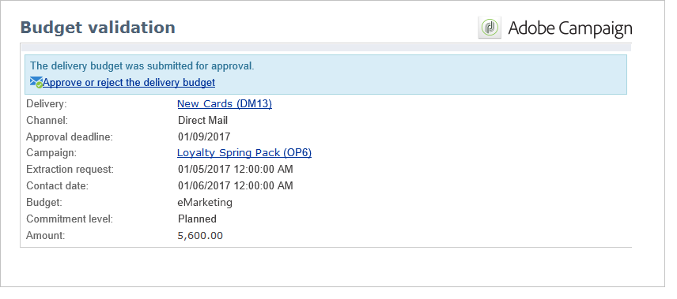

The reviewer operators can then choose to approve the budget or not.

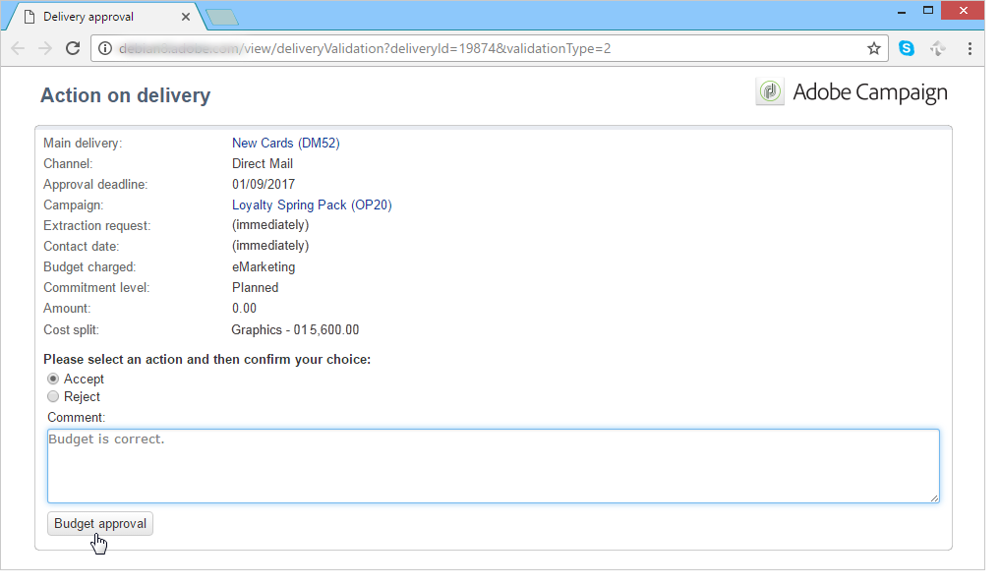

Once the operator validates, approval or rejection of the job is forwarded to the delivery dashboard. 

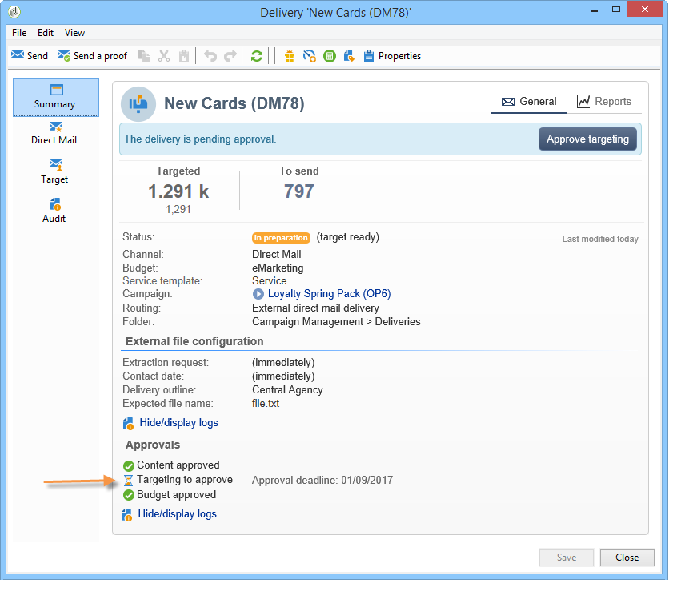

The information is also available in the approval logs of the campaign. These logs are accessed via the **[!UICONTROL Edit > Tracking > Approvals]** tab.

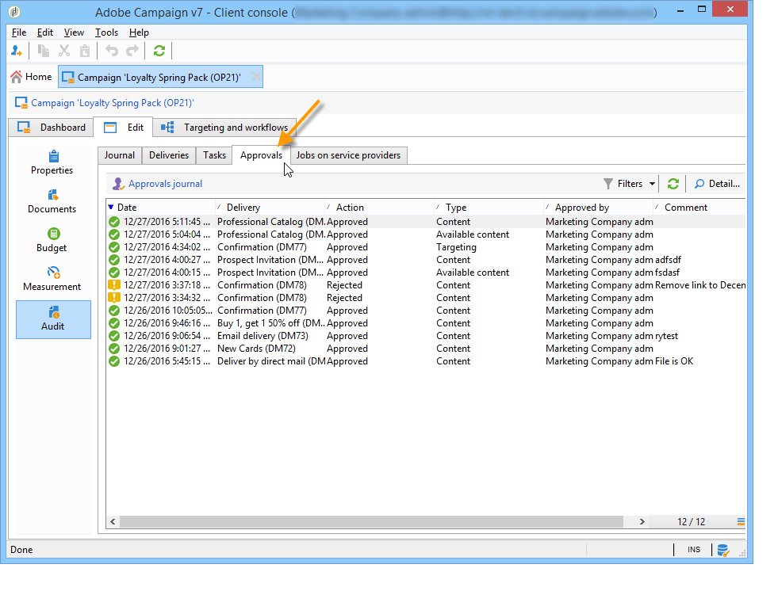

These notifications are sent to the operators affected to each process for which approval was enabled.

Approvals can be enabled for the campaign template, for each campaign individually, or for a delivery.

All jobs requiring approval are selected in the campaign template ( **[!UICONTROL Properties]** > **[!UICONTROL Advanced campaign settings...]** > **[!UICONTROL Approvals]** tab). The operators in charge of approval are also selected there and receive notifications unless this option is disabled. For more on this, refer to [steps to approve a delivery](#approving-processes).

These settings can be overridden for each campaign created using this template, and individually for each campaign delivery: click the **[!UICONTROL Properties]** button, then the **[!UICONTROL Approvals]** tab.

In the following example, the delivery content will not require approvals:

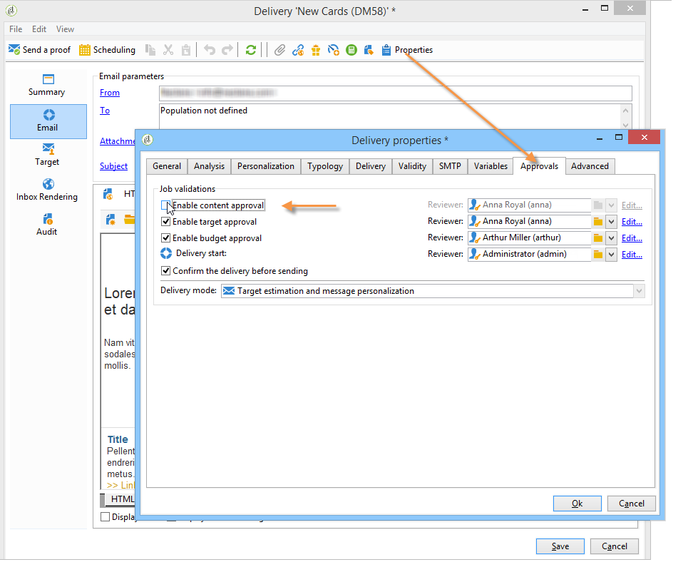

## Select reviewers {#selecting-reviewers}

For each type of approval, the operators or operator groups in charge of approval are selected from the drop-down list in the delivery. More operators can be added using the **[!UICONTROL Edit...]** link. This window also lets you edit the approval deadline. 

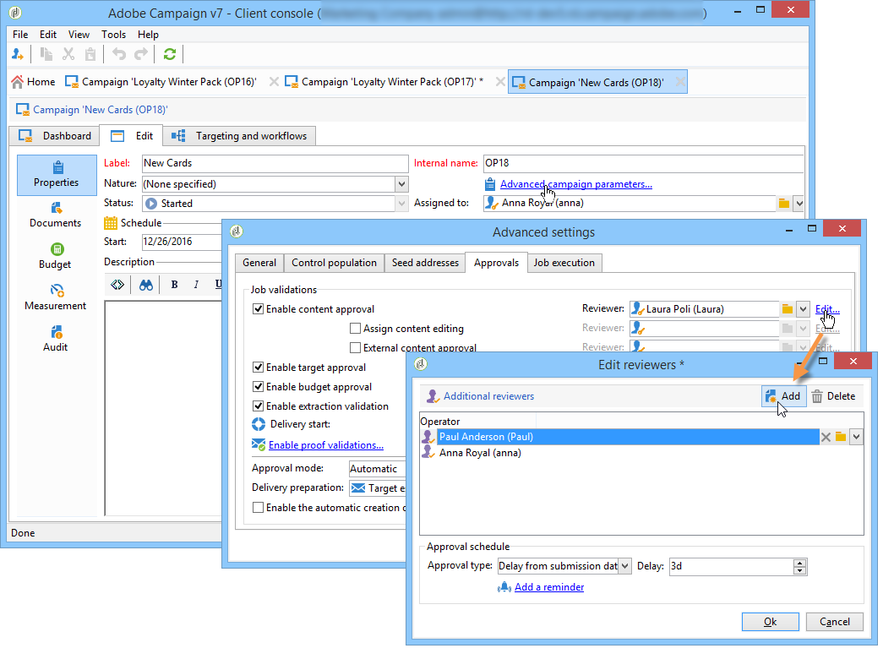

If no reviewer is specified, the campaign manager will be responsible for approval and will receive the notifications. The campaign manager is specified in the **[!UICONTROL Edit > Properties]** tab of the campaign: 

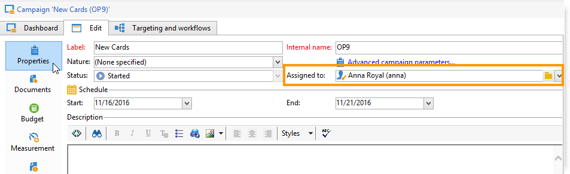

>[!NOTE]
>
>All other [!DNL Adobe Campaign] operators with **[!UICONTROL Administrator]** rights can also approve jobs, but they will not receive notifications.  
>By default, the campaign manager cannot carry out the approval or start the deliveries if approval operators have been defined. You can modify this behavior and authorize the campaign manager to approve/start deliveries by creating the **NmsCampaign_Activate_OwnerConfirmation** option with **1** as a value.

## Approval modes {#approval-modes}

### Approval via the dashboard {#approval-via-the-dashboard}

To approve a job via the console or the web interface, click the appropriate link on the campaign dashboard. Jobs can also be approved via delivery tracking or via the delivery dashboard.

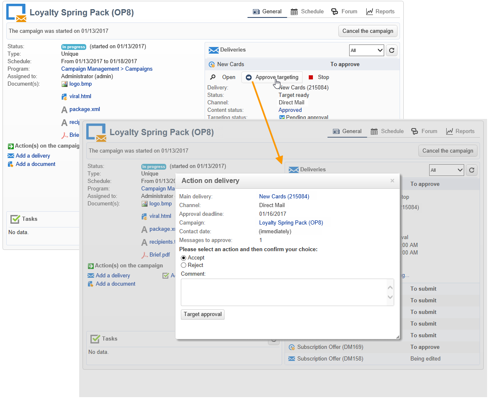

Check the information to be approved, choose whether to accept or reject approval and, if necessary, enter a comment. Click **[!UICONTROL Ok]** to save.

>[!NOTE]
>
>If a process has already been approved by another operator, the approval link is not available.

### Approval via notification messages {#approval-via-notification-messages}

Click the link available in the notification message (see [Notifications](#notifications)). You need to log in, as shown below:

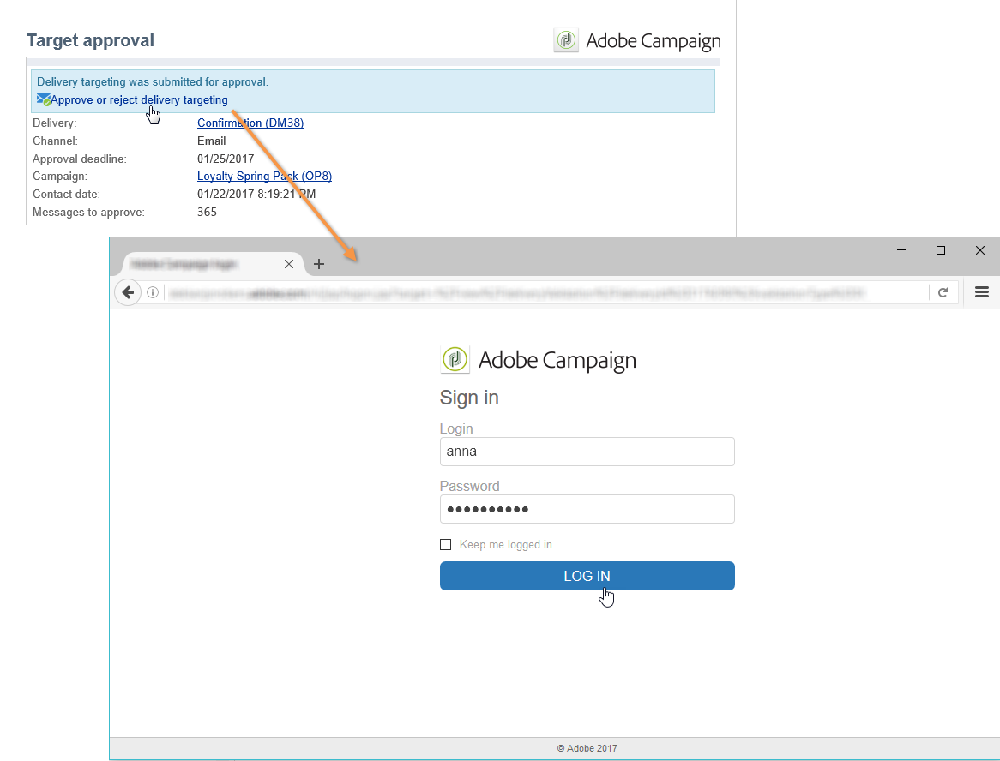

Select **[!UICONTROL Accept]** or **[!UICONTROL Reject]** and enter a comment if necessary.

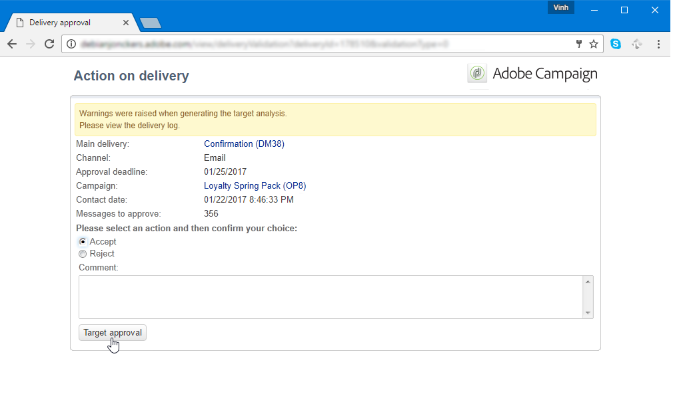

Click **[!UICONTROL Validate]**.

>[!NOTE]
>
>If warnings were raised during the process, a warning is displayed in the notification.

### Approval tracking {#approval-tracking}

The information is available in several places:

* In the campaign approval log, **[!UICONTROL Approvals]** sub-tab of the **[!UICONTROL Edit > Tracking]** tab: 

  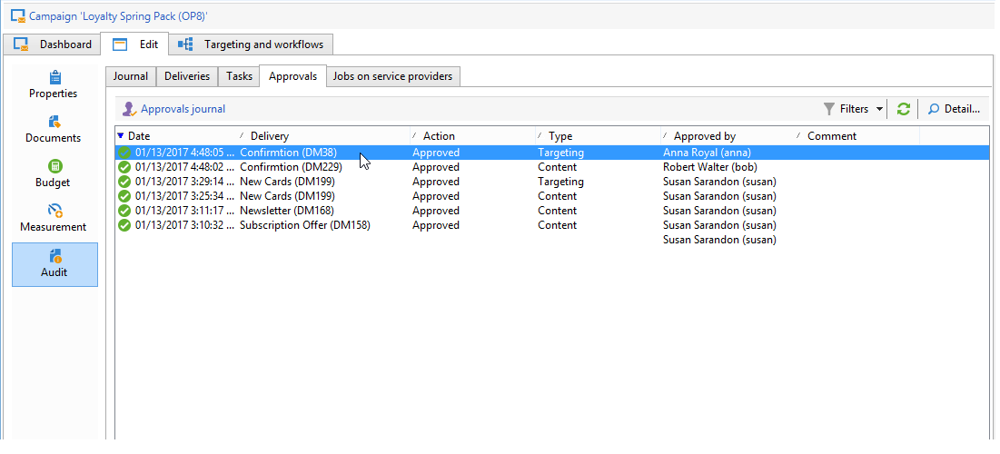

* In the campaign delivery log, **[!UICONTROL Deliveries]** sub-tab of the **[!UICONTROL Edit > Tracking]** tab:

  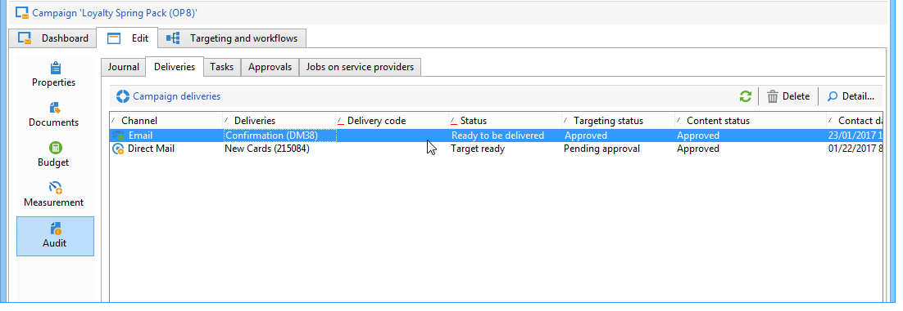

* The approval status for each delivery can be viewed by clicking the **[!UICONTROL Hide/show log]** option of the **[!UICONTROL Summary]** tab.

  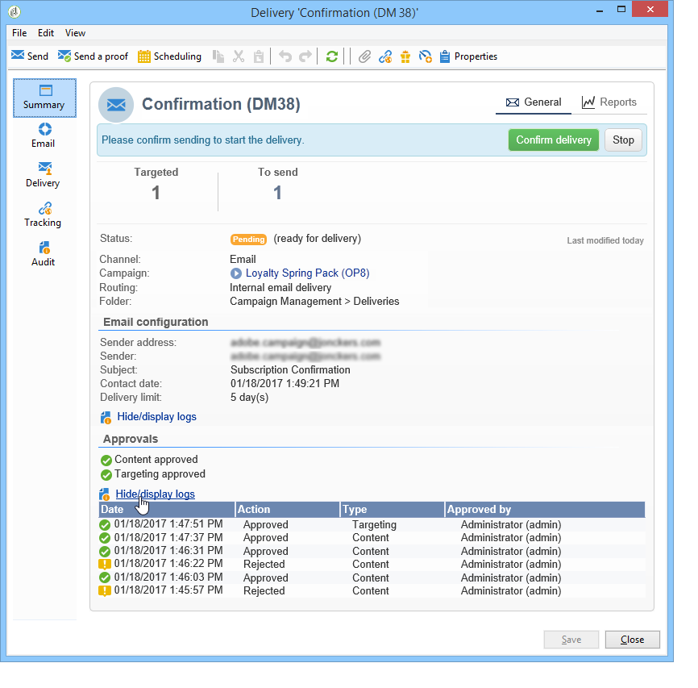

* This information can also be accessed via the **[!UICONTROL Tracking > Approvals]** tab of each delivery:

  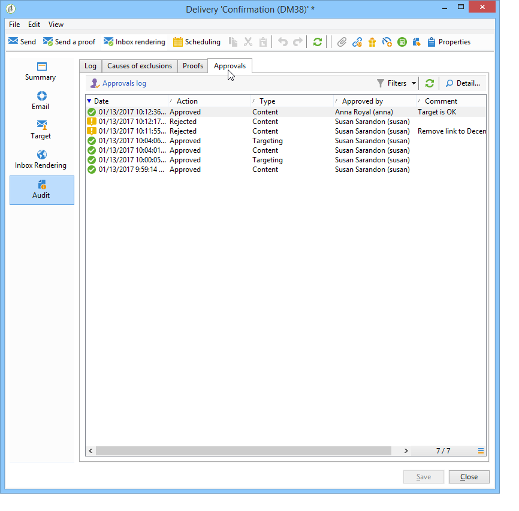

>[!NOTE]
>
>Once an operator has approved or rejected a job, the other reviewing operators can no longer act on the approval.

### Automatic and manual approval {#automatic-and-manual-approval}

When creating a targeting workflow, if approval is automatic (default mode), [!DNL Adobe Campaign] displays the approval link or sends a notification as soon as an approval is required.

To choose the approval mode (manual or automatic), click the **[!UICONTROL Edit > Properties]** tab of the campaign or campaign template, then click **[!UICONTROL Advanced campaign settings...]** and finally the **[!UICONTROL Approvals]** tab.

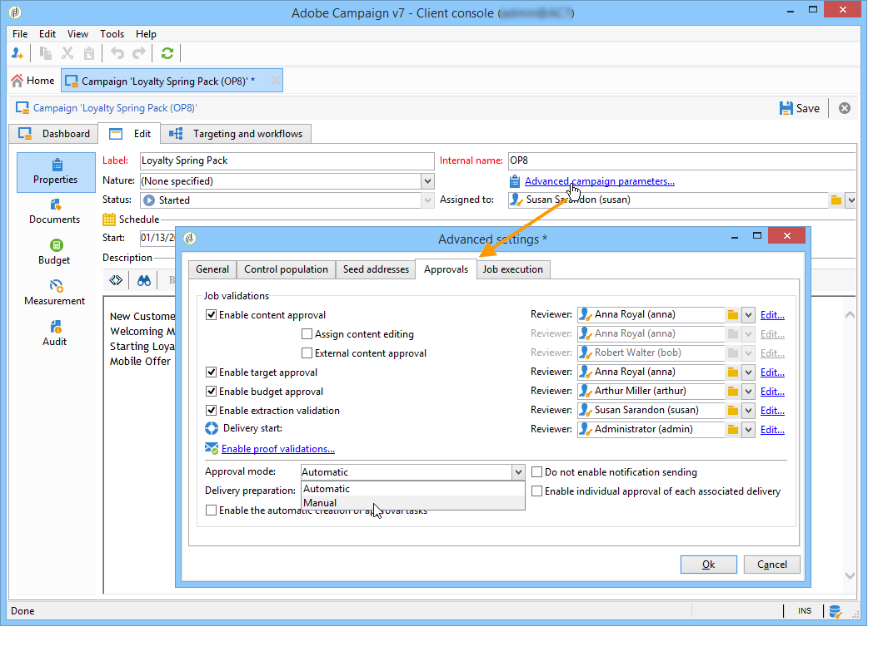

>[!NOTE]
>
>The selected approval mode will apply to all deliveries of the campaign.

When a targeting workflow is being built, manual approval lets you avoid creating approval links or sending notifications automatically. The campaign dashboard then offers a **[!UICONTROL Submit targeting for approval]** link to launch the approval process manually.

A confirmation message lets you authorize approvals on the jobs selected for this delivery.

The approval buttons are then displayed on the campaign dashboard (for this delivery), on the delivery dashboard and in delivery tracking. If notifications are enabled, they will be sent in parallel.

This method of enabling approvals lets you work on targeting without sending spurious notifications to reviewers.

## Notifications {#notifications}

Notifications are specific email messages sent to reviewers to inform them that a process is pending approval. When the operator clicks the link in the message, an authentication page appears and, after logging in, the operator can view the information and approve or reject the job. A comment can also be entered in the approval window.

The content of notification emails can be personalized. See [Notification content](#notification-content).

### Enable/Disable Notification {#enabling-disabling-notification}

By default, notification messages are sent if the approval of the related job is enabled in the campaign template, the campaign, or the delivery. Notifications can, however, be disabled in order to authorize approvals from the console only.

To do this, edit the approval window of the campaign or campaign template ( **[!UICONTROL Edit > Properties]** > **[!UICONTROL Advanced campaign settings...]** > **[!UICONTROL Approvals]** tab) and select **[!UICONTROL Do not enable notification sending]**.

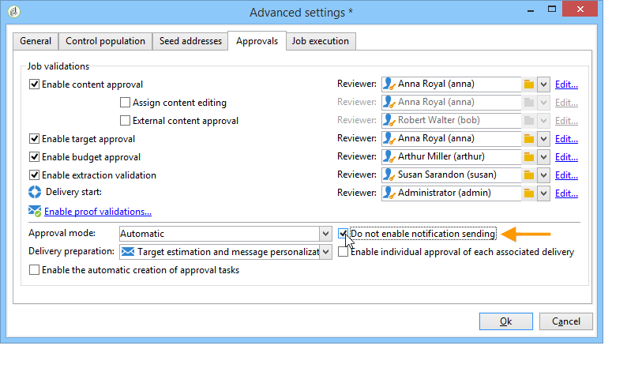

### Notification content {#notification-content}

Notification content is defined in a specific template: **[!UICONTROL Notification of validations for the marketing campaign]**. This template is saved in the **[!UICONTROL Administration > Campaign management > Technical delivery templates]** folder of the [!DNL Adobe Campaign] tree.

## Review and approve deliveries {#checking-and-approving-deliveries}

[!DNL Adobe Campaign] lets you set up approval processes for the main stages of the marketing campaign in collaborative mode.

For direct mail deliveries, [!DNL Adobe Campaign] operators can view the extraction file before it is sent to the router, and if necessary they can change the format and re-launch extraction. See [Approve an extraction file](#approving-an-extraction-file).

For each campaign, you can approve the delivery target, content (see [Approve content](#approving-content)), and costs. [!DNL Adobe Campaign] operators in charge of approval can be notified by email and can accept or reject approval from the console or via a web connection. See [Steps to approve a delivery](#approving-processes).

When these validation phases are complete, the delivery can be launched. [Learn more about starting a delivery](../../campaign/using/marketing-campaign-deliveries.md#starting-a-delivery).

### Steps to approve a delivery {#approving-processes}

The stages requiring approval appear on the campaign dashboard (via the console of the web interface). They also appear in the delivery tracking table and on the delivery dashboard.

At this point, the status of the campaign is **[!UICONTROL To validate]**.

>[!NOTE]
>
>To select the processes which require an approval, modify the campaign template. For more on this, refer to [Campaign templates](../../campaign/using/marketing-campaign-templates.md#campaign-templates).
>

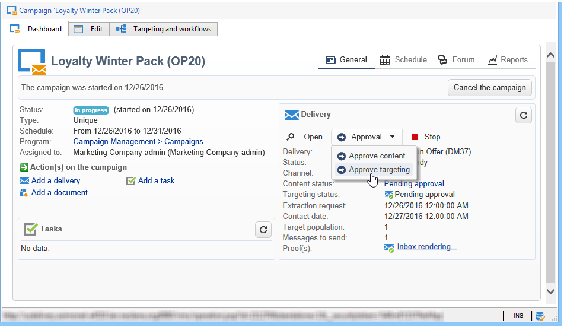

>[!NOTE]
>
>In a targeting workflow, if an error linked to a configuration issue occurs during message preparation, the **[!UICONTROL Restart message preparation]** link is shown on the dashboard. Correct the error and click this link to restart message preparation while bypassing the targeting stage.

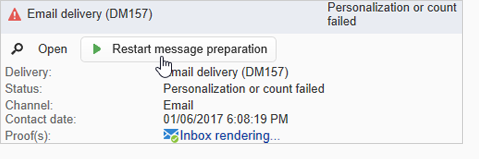

For each delivery in the campaign, you can approve the following processes:

* **Targeting, content and budget**

  When the **[!UICONTROL Enable target approval]**, **[!UICONTROL Enable content approval]** or **[!UICONTROL Enable budget approval]** options are selected in the job approval settings window, the relevant links are shown in the campaign dashboard for the concerned deliveries.

  >[!NOTE]
  >
  >Budget approval is only available if targeting approval is enabled in the approval settings window. The link for budget approval is only displayed once the target has been analyzed. Also, this link is displayed along with the link for target approval.

  If the **[!UICONTROL Assign content editing]** or **[!UICONTROL External content approval]** options are selected in the approval settings window, the dashboard will show the **[!UICONTROL Available content]** and **[!UICONTROL External content approval]** links.

  Content approval lets you access the proofs sent.

* **Extraction approval (direct mail delivery)**

  When **[!UICONTROL Enable extraction approval]** is selected in the approval settings window, the extracted file must be approved before the router can be notified.

  An **[!UICONTROL Approve content]** link is available on the campaign dashboard as shown below:

  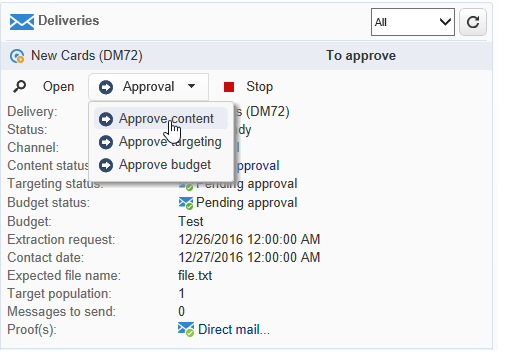

  Extraction files can be previewed via the approval box, and then accepted or rejected.

  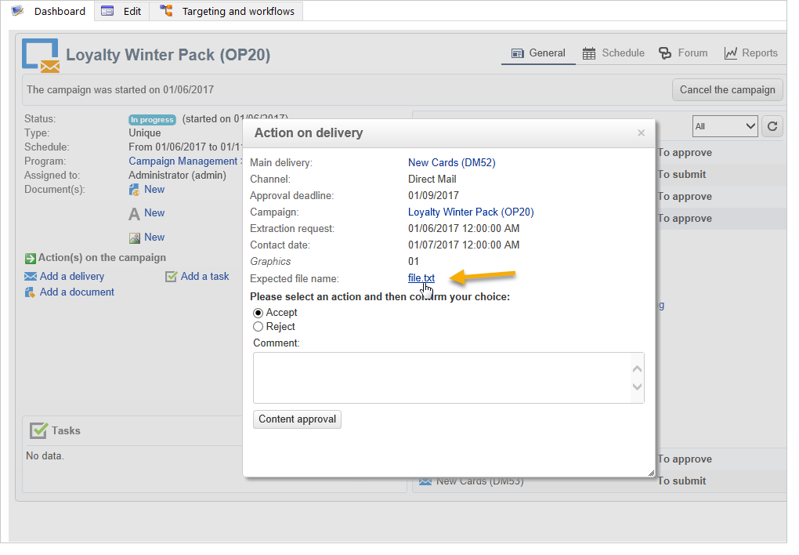

  >[!NOTE]
  >
  >The extraction file preview concerns a data sample only. The entire output file is not loaded.

* **Approving associated deliveries**

  The **[!UICONTROL Enable individual approval of each associated delivery]** option is used for one main delivery associated with secondary deliveries. By default, this option is not selected so that an overall approval of the main delivery can be performed. If this option is selected, each delivery must be approved individually.

  

### Select processes approve {#choosing-the-processes-to-be-approved}

The approval phases are defined with the template associated with the campaign. You must select the elements to be approved from the template and specify the [!DNL Adobe Campaign] operators responsible for these approvals. For more on campaign templates, refer to [campaign templates](../../campaign/using/marketing-campaign-templates.md#campaign-templates).

>[!NOTE]
>
>The approval configuration for the campaign (or campaign template) applies to all future deliveries linked to this campaign. Any configuration changes will not be applied to previous deliveries.

This information can be overridden for each campaign and each delivery.

For a campaign, click the **[!UICONTROL Edit > Properties]** tab, then the **[!UICONTROL Advanced campaign settings...]** link, and finally the **[!UICONTROL Approvals]** sub-tab to access the approvals configuration page.

You can select and deselect the processes to approve and appoint [!DNL Adobe Campaign] operators in charge of approval. These can be individual operators, a group of operators, or a list of operators.

To select a list of operators, click the **[!UICONTROL Edit...]** link to the right of the field designating the first reviewer and add as many operators as necessary, as shown below:

>[!NOTE]
>
>* If a list of reviewers is defined, a job is approved when one reviewer has accepted it. The relevant approval link is then no longer offered in the dashboard. When the sending of notifications is enabled, if another reviewer clicks the approval link in the notification message, they are notified that another operator has already approved the job.
>* You can define an approval schedule for the campaign in the lower section of the reviewer editing window. By default, reviewers have three days starting from the submission date to approve a process. It's possible to configure a reminder which is automatically sent to the operators concerned before the approval deadline.
>* You can add reminders from this section.
>

For each delivery, click the **[!UICONTROL Audit]** button and the **[!UICONTROL Approvals]** tab to view and edit approval dates and automatic reminders.

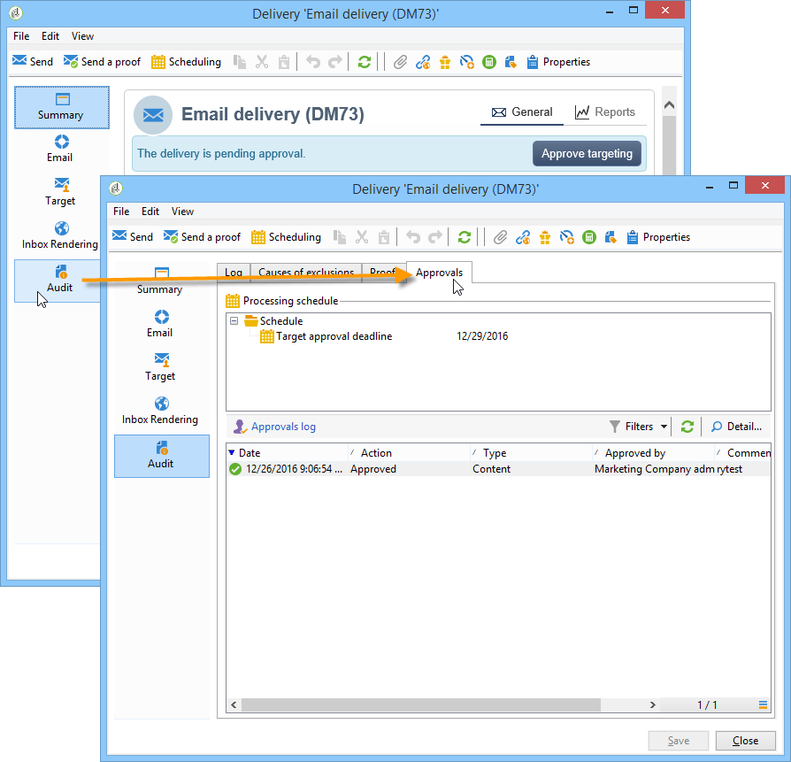

>[!NOTE]
>
>This tab is available once the content approval process has been started.

### Approve a content {#approving-content}

>[!CAUTION]
>
>To approve a content, a proof cycle is mandatory. Proofs let you approve the display of information, personalization data and check that links are working. Learn how to create a proof in [create a proof](../../delivery/using/steps-validating-the-delivery.md#sending-a-proof).
>
>The content approval functionalities detailed below relate to the proof delivery.

It is possible to configure a content approval cycle. To do this, select the **[!UICONTROL Enable content approval]** option in the approval settings window. The main steps of the content approval cycle are:

1. After creating a new delivery, the campaign manager clicks the **[!UICONTROL Submit content]** link on the campaign dashboard to start the content approval cycle. 

   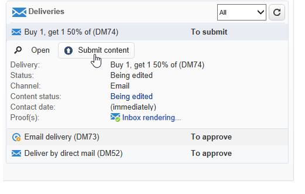

   >[!NOTE]
   >
   >If the **[!UICONTROL Enable the sending of proofs]** option (for email deliveries) or **[!UICONTROL Enable the sending and approval of proofs]** (for direct mail deliveries) options were selected in the approval settings window, proofs will be sent automatically.

1. A notification email is sent to the person responsible for content, who can choose whether to approve it or not:

    * via the notification email:
    
      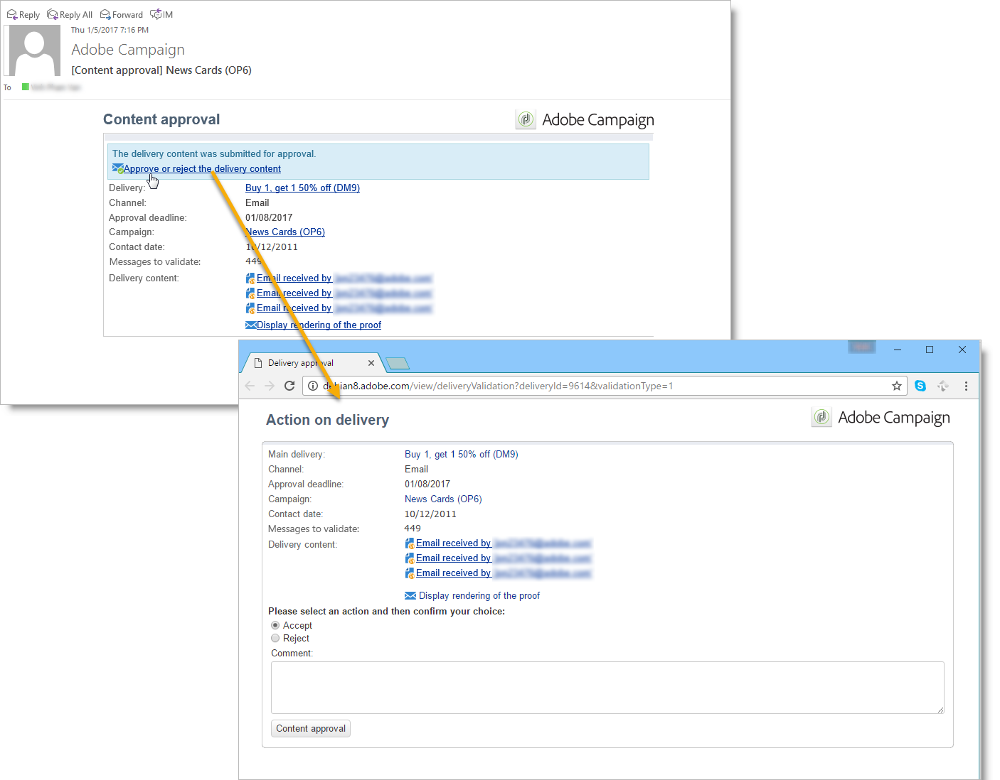

      >[!NOTE]
      >
      >The notification email contains a link to the proofs already sent, and possibly to a rendering of the message for the various webmails if the **Deliverability** option is enabled for this instance.

    * via the console or web interface, delivery tracking, the delivery dashboard or the campaign dashboard:
    
      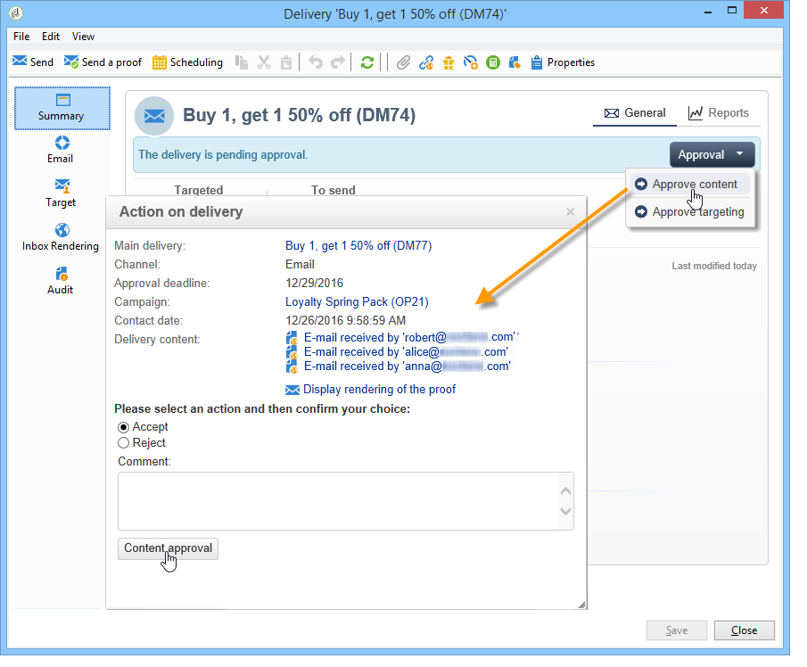

      >[!NOTE]
      >
      >This campaign dashboard lets you view the list of proofs that have been sent, by clicking the **[!UICONTROL Inbox rendering...]** link. To view their content, click the **[!UICONTROL Detail]** icon to the right of the list.
      
      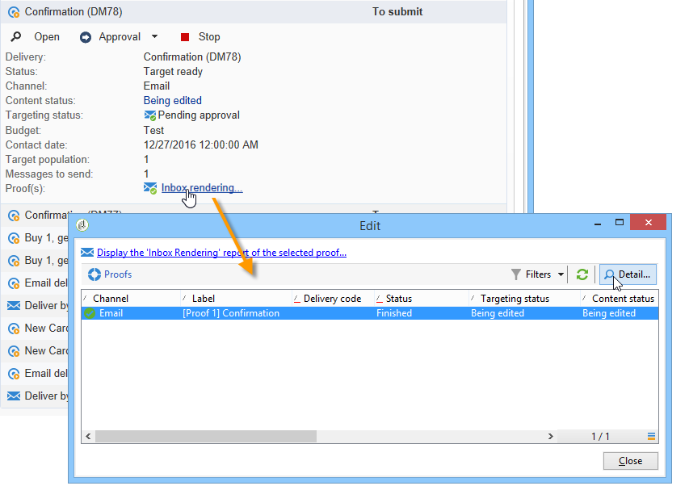

1. A notification email is sent to the person responsible for the campaign informing them of whether the content has been approved or not.

   >[!NOTE]
   >
   >The person responsible for the campaign can re-start the content approval cycle at any time. To do this, click the link on the **[!UICONTROL Content status]** line of the campaign dashboard (at delivery level), then click **[!UICONTROL Reset content approval to submit it again]**.

   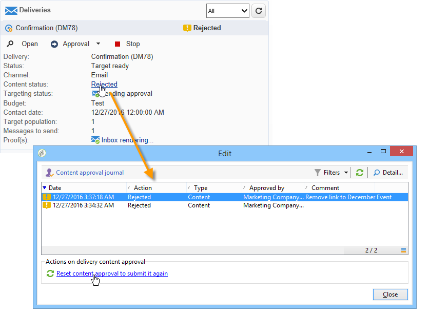

#### Assign content editing {#assign-content-editing}

This option lets you define someone in charge of content editing, such as a webmaster. If the **[!UICONTROL Assign content editing]** option is selected in the approval settings window, several approval steps are added between delivery creation and delivery of the notification email to the person in charge of content:

1. After creating a new delivery, the person responsible for the campaign clicks the **[!UICONTROL Submit content editing]** link in the campaign dashboard to start the content editing cycle. 

   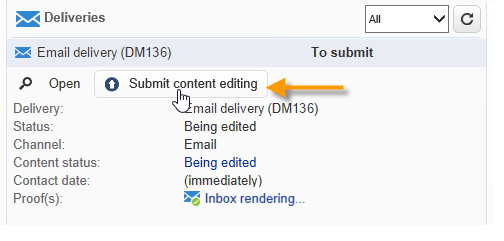

1. The person responsible for content editing will receive an email telling them that the content is available. 

   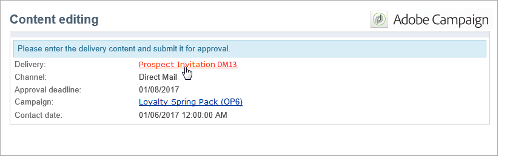

1. They can then log on to the console, open the delivery and edit it using a simplified assistant to change the subject, HTML and text content, and send proofs.

   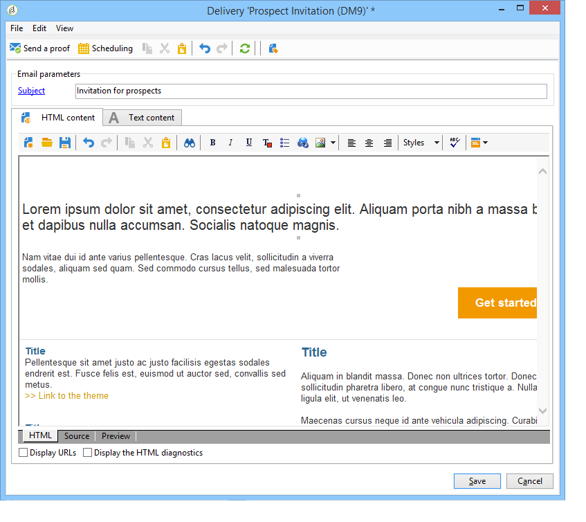

   >[!NOTE]
   >
   >If the **[!UICONTROL Enable the sending of proofs]** option (for email deliveries) or **[!UICONTROL Enable the sending and approval of proofs]** (for direct mail deliveries) options were selected in the approval settings window, proofs will be sent automatically.

1. Once the person in charge of content editing has finished making any changes to the delivery content, they can make the content available.

   To do this, they can:

    * click the **[!UICONTROL Available content]** link via the [!DNL Adobe Campaign] console.
    
      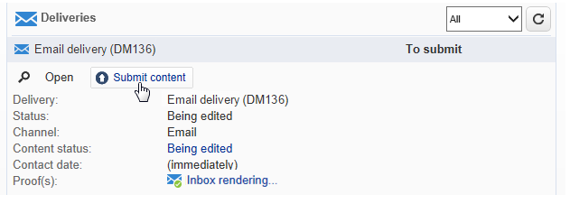

    * click the link in the notification message, then approve content availability.
    
      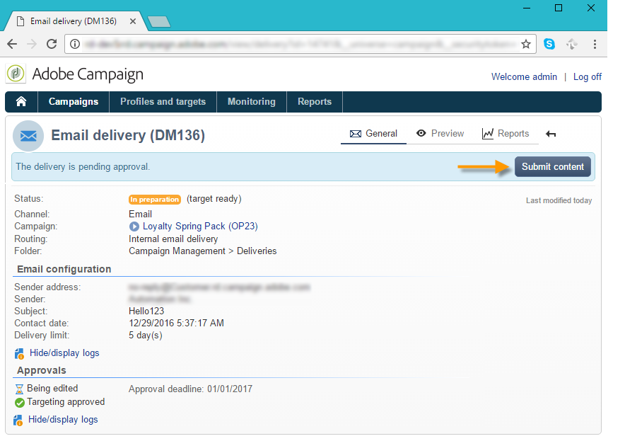

      The operator can add a comment before submitting the content to the person in charge of the campaign.
    
      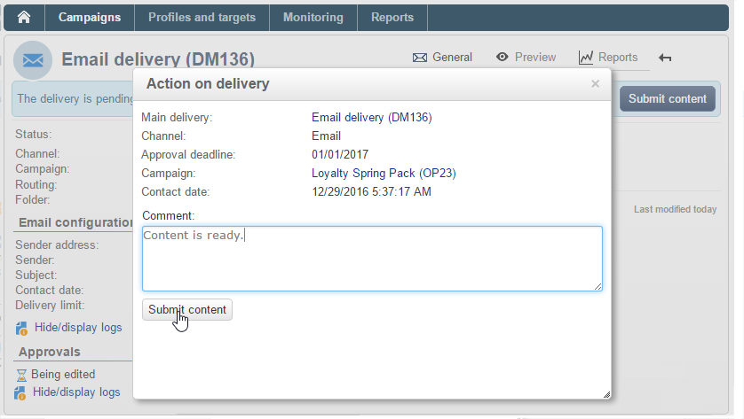

      The notification message lets the reviewer approve or reject the content.
    
      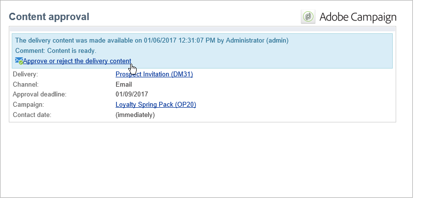

#### External content approval {#external-content-approval}

This option lets you define an external operator in charge of approving delivery rendering, such as brand communication consistency, rates, etc. When the **[!UICONTROL External content approval]** option is selected in the approval settings window, several approval steps are added between content approval and the delivery of the notification to the person in charge of the campaign:

1. The external content manager receives a notification email telling them that the content has been approved and requesting external approval.
1. The notification email contains links to the proofs sent, which lets you view delivery rendering, and a button for approving or rejecting the delivery content.

   >[!NOTE]
   >
   >These links are only available if one or more proofs have been sent. Otherwise, delivery rendering is only available via the console or the web interface.

   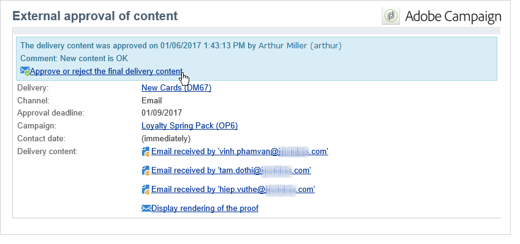

### Approve an extraction file {#approving-an-extraction-file}

For offline deliveries, [!DNL Adobe Campaign] generates an extraction file which, depending on how it is set up, is sent to the router. Its content depends on the export template used.

When the content, targeting and budget have been approved, the delivery changes to **[!UICONTROL Extraction pending]** until the extraction workflow for the campaigns is launched. 

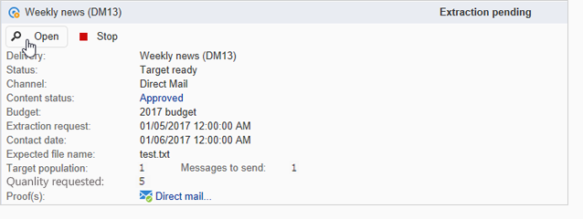

On the extraction request date, the extraction file is created and the delivery status changes to **[!UICONTROL File to approve]**. 

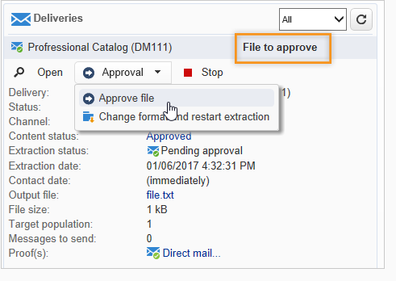

You can view the content of the extracted file (by clicking its name), approve it or, if necessary, change the format and re-launch the extraction using the links on the dashboard.

Once the file has been approved, you can send the notification email to the router. For more on this, refer to [Start an offline delivery](../../campaign/using/marketing-campaign-deliveries.md#starting-an-offline-delivery).
