# Manage associated documents {#managing-associated-documents}

You can associate various documents with a campaign: reports, photos, web pages, diagrams, etc. These documents can be in any format (Microsoft Word, PowerPoint, PNG, JPG, Acrobat PDF, etc).

>[!IMPORTANT]
>
>This capability is reserved for small assets and documents.

In a campaign you can also refer to other items, such as promotional coupons, special offers relating to a specific brand or store, etc. When these elements are included in an outline, they can be associated with a direct mail delivery. See [Associate and structure resources linked via a delivery outline](#associating-and-structuring-resources-linked-via-a-delivery-outline).

>[!NOTE]
>
>If you are using Campaign Marketing Resource Management module, you can also manage a library of marketing resources that are available for several users for collaborative work. [Learn more](../../mrm/using/managing-marketing-resources.md).

## Add documents {#adding-documents}

Documents can be associated at the campaign level (contextual documents) or the program level (general documents).

The **[!UICONTROL Documents]** tab contains:

* The list of all documents required for the content (template, images, etc.) that can be downloaded locally by Adobe Campaign operators with suitable rights,
* Documents containing information for the router, if any.

The documents are linked to the program or the campaign via the **[!UICONTROL Edit > Documents]** tab. 

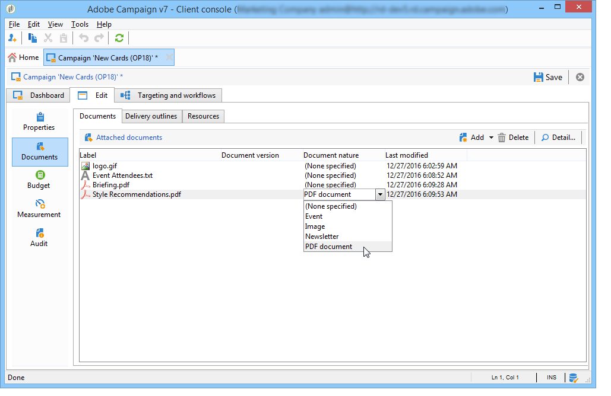

You can also add a document to a campaign via the link offered in its dashboard.

Click the **[!UICONTROL Details]** icon to view the content of a file and to add information:

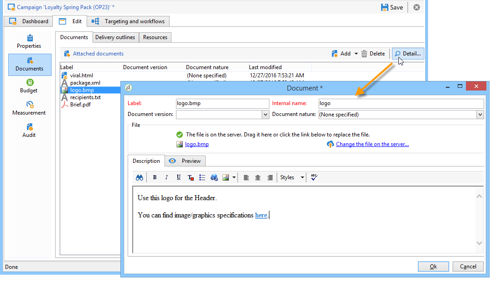

In the dashboard, documents associated with the campaign are grouped in the **[!UICONTROL Document(s)]** section, as in the following example:

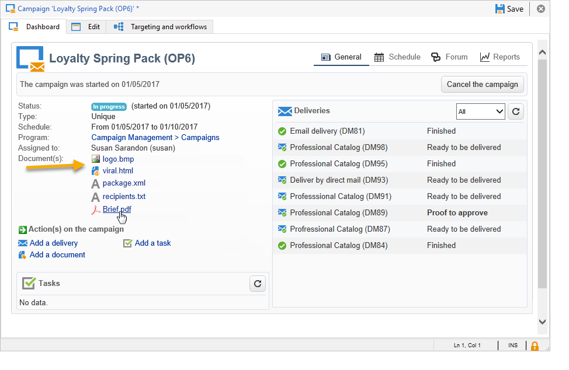

They can also be edited and modified from this view.

## Associate and structure resources linked via a delivery outline {#associating-and-structuring-resources-linked-via-a-delivery-outline}

>[!NOTE]
>
>Delivery outlines are exclusively used in the context of direct mail campaigns.

A delivery outline denotes a structured set of elements (documents, stores, promotional coupons, etc.) created by the company and for a particular campaign.

These elements are grouped in delivery outlines, and each delivery outline will be associated with a delivery; it will be referenced in the extraction file sent to the **service provider** in order to be attached to the delivery. For example, you can create a delivery outline that refers to a branch and the marketing brochures it uses.

For a campaign, delivery outlines let you structure external elements to be associated with the delivery according to certain criteria: related branch, promotional offer granted, invitation to a local event, etc.

### Create an outline {#creating-an-outline}

To create an outline, click the **[!UICONTROL Delivery outlines]** sub-tab in the **[!UICONTROL Edit > Documents]** tab of the concerned campaign.

>[!NOTE]
>
>If this tab is not present, then this feature is not available for this campaign. Refer to the campaign template configuration.
>   
>For more on templates, refer to [this section](../../campaign/using/marketing-campaign-templates.md#campaign-templates).

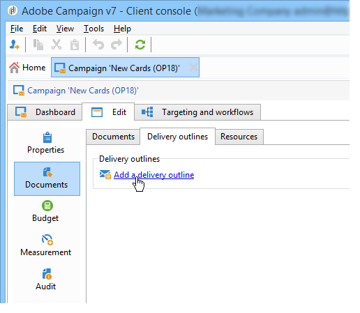

Next, click **[!UICONTROL Add a delivery outline]** and create the hierarchy of outlines for the campaign:

1. Right-click the root of the tree and select **[!UICONTROL New > Delivery outlines]**.
1. Right-click the outline you have just created and select **[!UICONTROL New > Item]** or **[!UICONTROL New > Personalization fields]**.

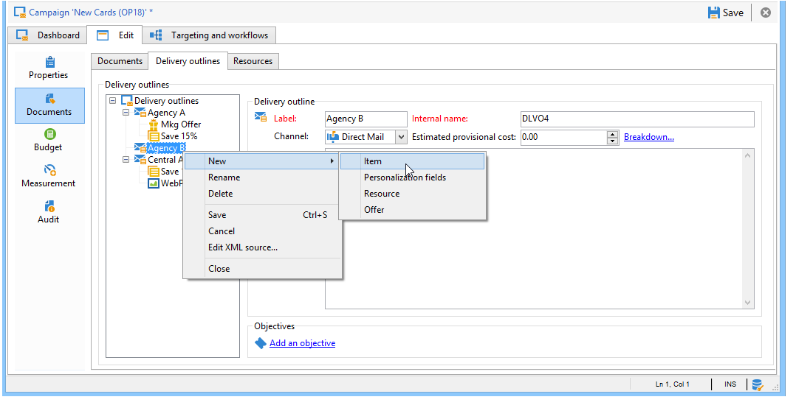

An outline can contain items and personalization fields, resources and offers:

* Items can be physical documents, for example, which are referenced and described here and will be attached to the delivery. 
* Personalization fields enable you to create personalization elements related to deliveries rather than recipients. It is thus possible to create values to be used in deliveries for a specific target (welcome offer, a discount, etc.) They are created in Adobe Campaign and imported into the outline via the **[!UICONTROL Import personalization fields...]** link. 

  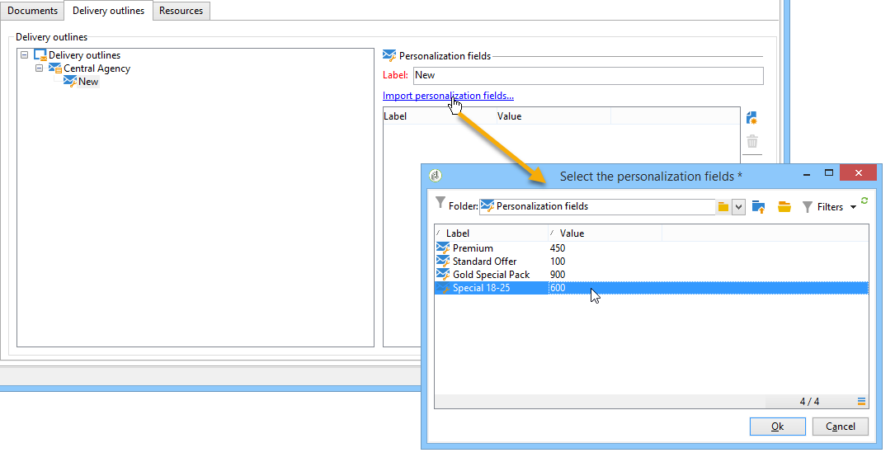

  They can also be created directly in the outline by clicking the **[!UICONTROL Add]** icon to the right of the list zone.

  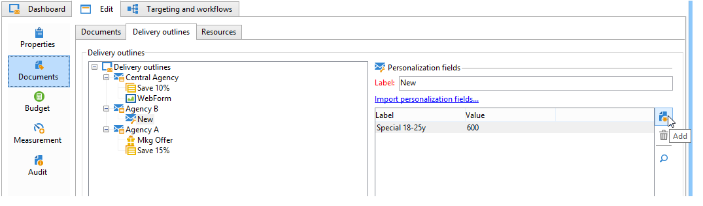

* The resources are marketing resources generated in the marketing resource dashboard accessed via the **[!UICONTROL Resources]** link of the **[!UICONTROL Campaigns]** tab.

  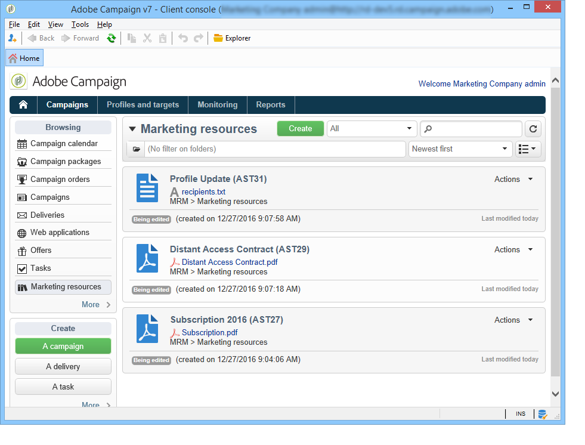

  >[!NOTE]
  >
  >For more on marketing resources, refer to [this section](../../mrm/using/managing-marketing-resources.md).

### Select an outline {#selecting-an-outline}

For each delivery, you can select the outline to associate from the section reserved for the extraction outline, as in the following example:

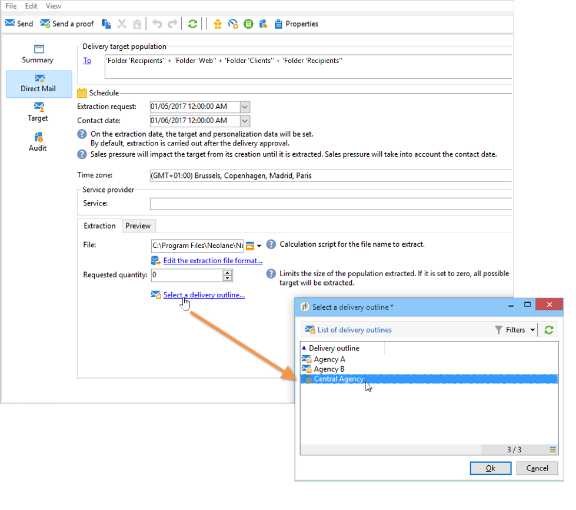

The selected outline is then displayed in the lower section of the window. It can be edited using the icon to the right of the field or altered using the drop-down list:

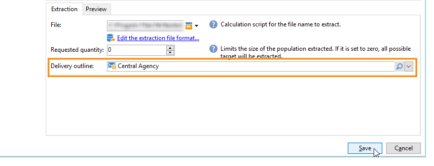

The **[!UICONTROL Summary]** tab of the delivery also displays this information:

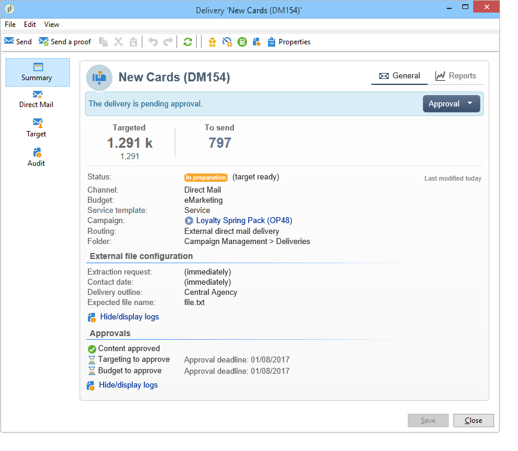

### Extraction result {#extraction-result}

In the file extracted and sent to the service provider, the name of the outline and, where appropriate, its characteristics (cost, description, etc.) are added to the content according to the information in the export template associated with the service provider.

In the following example, the label, estimated cost, and description of the outline associated with the delivery will be added to the extraction file. 

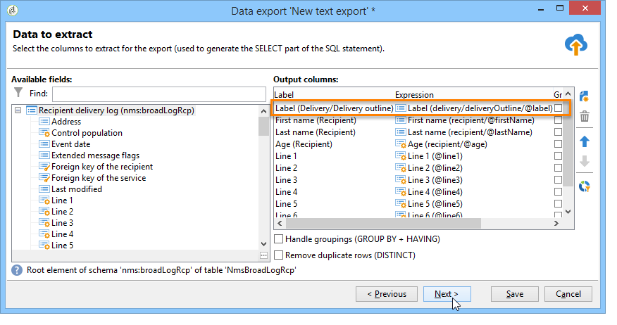

The export model must be associated with the service provider selected for the delivery concerned. See [this  section](../../campaign/using/providers--stocks-and-budgets.md#creating-service-providers-and-their-cost-structures).

>[!NOTE]
>
>For more on exports, refer to [this section](../../platform/using/get-started-data-import-export.md) section.
