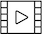
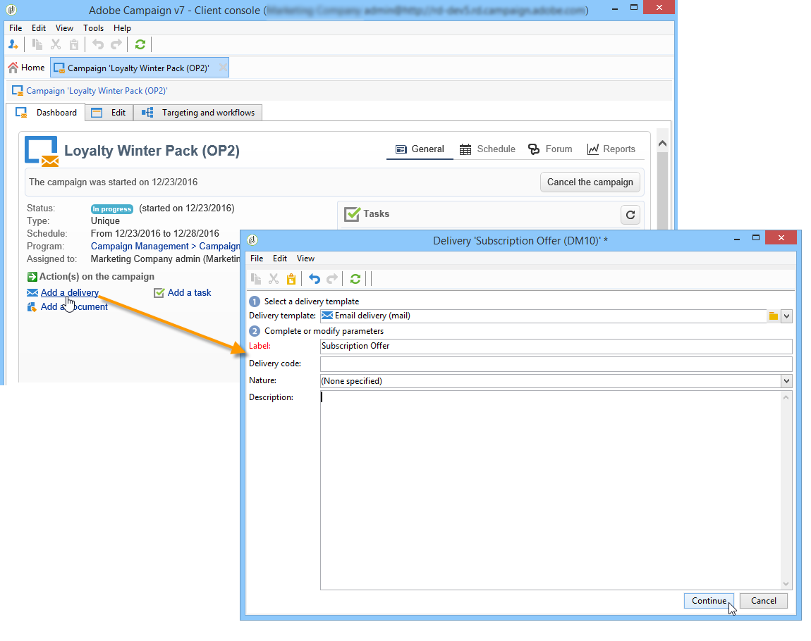
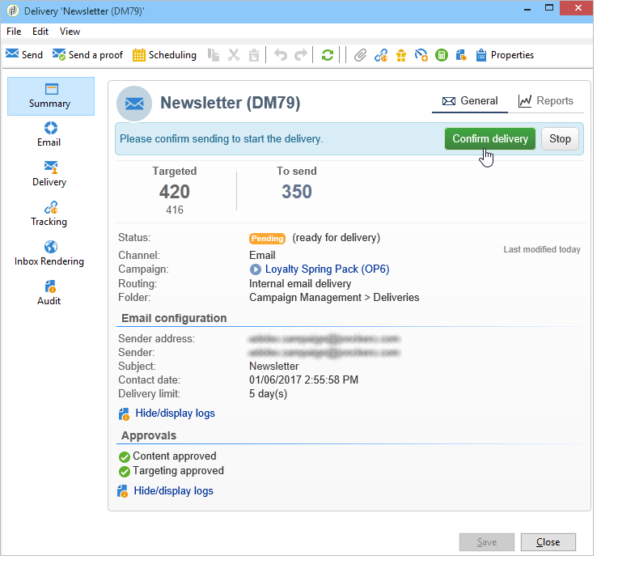
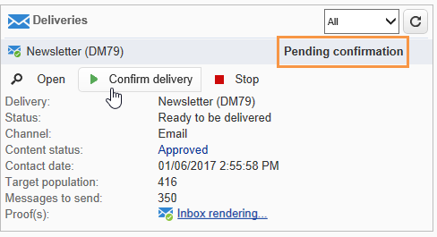
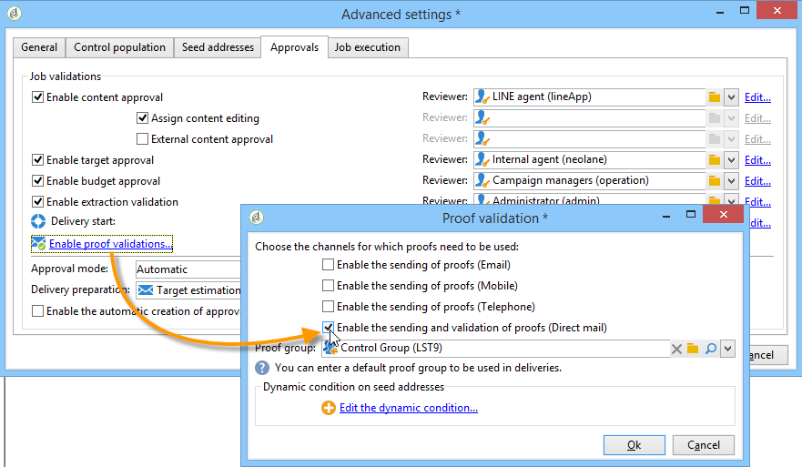
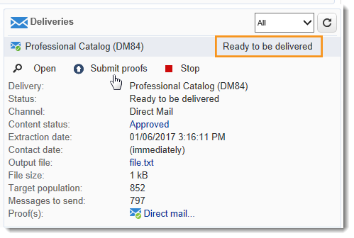
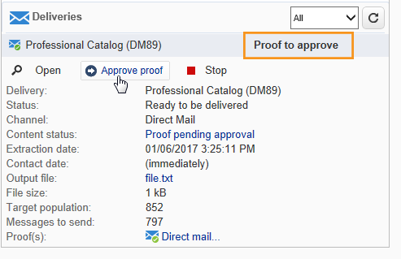
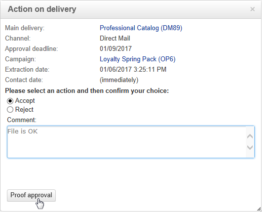

# Marketing campaign deliveries {#marketing-campaign-deliveries}

Deliveries can be created via the campaign dashboard, a campaign workflow or directly via the overview of deliveries.

When created from a campaign, deliveries will be linked to this campaign and consolidated at the campaign level.

[ Discover this feature in video](#create-email-video)

## Creating deliveries {#creating-deliveries}

To create a delivery linked to a campaign, click the **[!UICONTROL Add a delivery]** link in the campaign dashboard.

The suggested configurations are suited to the different types of delivery: direct mail, email, mobile channels. [Learn more](../../delivery/using/steps-about-delivery-creation-steps.md).

## Starting a delivery {#starting-a-delivery}

Once all approvals have been granted, the delivery is ready to be started. The delivery procedure then depends on the type of delivery. For email or mobile channel deliveries, see [Starting an online delivery](#starting-an-online-delivery), and for direct mail deliveries, see [Starting an offline delivery](#starting-an-offline-delivery).

### Starting an online delivery {#starting-an-online-delivery}

Once all approval requests have been granted, the delivery status changes to **[!UICONTROL Pending confirmation]** and can be started by an operator. Where appropriate, the Adobe Campaign operator (or group of operators) appointed as reviewer to start the delivery is notified that a delivery is ready to be started.

>[!NOTE]
>
>If a specific operator or group of operators is designated for starting a delivery in the delivery's properties, you can also allow the operator in charge of the delivery to confirm the send. To do this, activate the **NMS_ActivateOwnerConfirmation** option by entering **1** as the value. The options are managed from the **[!UICONTROL Administration]** > **[!UICONTROL Platform]** > **[!UICONTROL Options]** node in the Adobe Campaign explorer.
>  
>To deactivate this option, enter **0** as the value. The send confirmation process will then function as default: only the operator or group of operators designated for the send in the delivery properties (or an administrator) will be able to confirm and carry out the send.

The information also appears on the campaign dashboard. The **[!UICONTROL Confirm delivery]** link lets you start the delivery.

A confirmation message lets you secure this action.

### Starting an offline delivery {#starting-an-offline-delivery}

Once all approvals have been granted, the delivery status changes to **[!UICONTROL Pending extraction]**. The extraction files are created via a special workflow which, in a default configuration, starts automatically when a direct mail delivery is pending extraction. When a process is in progress, it is displayed in the dashboard and can be edited via its link.

>[!NOTE]
>
>The technical workflows related to the Campaign package are presented in [List of technical workflows](../../workflow/using/about-technical-workflows.md).

**Step 1 - File approval**

Once the extraction workflow has been successfully executed, the extraction file must be approved (provided that extraction file approval was selected in the delivery settings).

For more on this, refer to [Approving an extraction file](../../campaign/using/marketing-campaign-approval.md#approving-an-extraction-file).

**Step 2 - Approval of the message to the service provider**

* Once the extraction file is approved, you can generate the proof of the router notification e-mail. This e-mail message is constructed based on a delivery template. It must be approved.

  >[!NOTE]
  >
  >This step is only available if the sending and approval of proofs was enabled in the approvals window.

  

* Click the **[!UICONTROL Send a proof]** button to create the proofs.

  The proof target must be defined beforehand.

  You can create as many proofs as necessary. These are accessed via the **[!UICONTROL Direct mail...]** link of the delivery detail.

  

* The delivery status changes to **[!UICONTROL To submit]**. Click the **[!UICONTROL Submit proofs]** button to start the approval process.

  

* The delivery status changes to **[!UICONTROL Proof to validate]** and a button lets you accept or reject approval.

  

  You can either accept or reject this approval, or return to the extraction step.

  

* The extraction file is sent to the router and the delivery is finished.

### Calculation of costs and stocks {#calculation-of-costs-and-stocks}

The file extraction launches two operations: budget calculation and stock calculation. The budget entries are updated.

* The **[!UICONTROL Budget]** tab lets you manage the budgets for the campaign. The total of the cost entries is shown in the **[!UICONTROL Calculates cost]** field of the campaign's main tab and the program it belongs to. The amounts are also reflected in the campaign budget.

  The real cost will eventually be calculated from information supplied by the router. Only messages actually sent are invoiced.

* Stocks are defined in the **[!UICONTROL Administration > Campaign management > Stocks]** node of the tree, and cost structures in the **[!UICONTROL Administration > Campaign management > Service providers]** node.

  Stock lines are visible in the stock section. To define the initial stock, open a stock line. The stock is decremented each time a delivery takes place. You can define an alert level and notifications.

>[!NOTE]
>
>For further information about cost calculations and stock management, see [Providers, stocks and budgets](../../campaign/using/providers--stocks-and-budgets.md).

## Managing associated documents {#managing-associated-documents}

You can associate various documents with a campaign: report, photo, web page, diagram, etc. These documents can be in any format (Microsoft Word, PowerPoint, PNG, JPG, Acrobat PDF, etc). Learn how to link documents with a campaign [in this section](../../campaign/using/marketing-campaign-assets.md).

>[!IMPORTANT]
>
>This mode is reserved for small documents.

In a campaign you can also refer to other items, such as promotional coupons, special offers relating to a specific branch or store, etc. When these elements are included in an outline, they can be associated with a direct mail delivery. [Learn more](#associating-and-structuring-resources-linked-via-a-delivery-outline).

>[!NOTE]
>
>If you are using MRM, you can also manage a library of marketing resources that are available for several participants for collaborative work. See [Managing marketing resources](../../campaign/using/managing-marketing-resources.md).

### Adding documents {#adding-documents}

Documents can be associated at the campaign level (contextual documents) or the program level (general documents).

The **[!UICONTROL Documents]** tab contains:

* The list of all documents required for the content (template, images, etc.) that can be downloaded locally by Adobe Campaign operators with suitable rights,
* Documents containing information for the router, if any.

The documents are linked to the program or the campaign via the **[!UICONTROL Edit > Documents]** tab. 

You can also add a document to a campaign via the link offered in its dashboard.

Click the **[!UICONTROL Details]** icon to view the content of a file and to add information:

In the dashboard, documents associated with the campaign are grouped in the **[!UICONTROL Document(s)]** section, as in the following example:

They can also be edited and modified from this view.

### Associating and structuring resources linked via a delivery outline {#associating-and-structuring-resources-linked-via-a-delivery-outline}

>[!NOTE]
>
>Delivery outlines are exclusively used in the context of direct mail campaigns.

A delivery outline denotes a structured set of elements (documents, branches/stores, promotional coupons, etc.) created in the company and for a particular campaign.

These elements are grouped in delivery outlines, and a particular delivery outline will be associated with a delivery; it will be referenced in the extraction file sent to the **service provider** in order to be attached to the delivery. For example, you can create a delivery outline that refers to a branch and the marketing brochures it uses.

For a campaign, delivery outlines let you structure external elements to be associated with the delivery according to certain criteria: related branch, promotional offer granted, invitation to a local event, etc.

#### Creating an outline {#creating-an-outline}

To create an outline, click the **[!UICONTROL Delivery outlines]** sub-tab in the **[!UICONTROL Edit > Documents]** tab of the concerned campaign.

>[!NOTE]
>
>If this tab is not present, then this feature is not available for this campaign. Refer to the campaign template configuration.
>   
>For more on this, refer to [Campaign templates](../../campaign/using/marketing-campaign-templates.md#campaign-templates).

Next, click **[!UICONTROL Add a delivery outline]** and create the hierarchy of outlines for the campaign:

1. Right-click the root of the tree and select **[!UICONTROL New > Delivery outlines]**.
1. Right-click the outline you have just created and select **[!UICONTROL New > Item]** or **[!UICONTROL New > Personalization fields]**.

An outline can contain items and personalization fields, resources and offers:

* Items can be physical documents, for example, which are referenced and described here and will be attached to the delivery. 
* Personalization fields enable you to create personalization elements related to deliveries rather than recipients. It is thus possible to create values to be used in deliveries for a specific target (welcome offer, a discount, etc.) They are created in Adobe Campaign and imported into the outline via the **[!UICONTROL Import personalization fields...]** link. 

  

  They can also be created directly in the outline by clicking the **[!UICONTROL Add]** icon to the right of the list zone.

  

* The resources are marketing resources generated in the marketing resource dashboard accessed via the **[!UICONTROL Resources]** link of the **[!UICONTROL Campaigns]** tab.

  

  >[!NOTE]
  >
  >For more on marketing resources, refer to [Managing marketing resources](../../campaign/using/managing-marketing-resources.md).

#### Selecting an outline {#selecting-an-outline}

For each delivery, you can select the outline to associate from the section reserved for the extraction outline, as in the following example:

The selected outline is then displayed in the lower section of the window. It can be edited using the icon to the right of the field or altered using the drop-down list:

The **[!UICONTROL Summary]** tab of the delivery also displays this information:

#### Extraction result {#extraction-result}

In the file extracted and sent to the service provider, the name of the outline and, where appropriate, its characteristics (cost, description, etc.) are added to the content according to the information in the export template associated with the service provider.

In the following example, the label, estimated cost, and description of the outline associated with the delivery will be added to the extraction file. 

The export model must be associated with the service provider selected for the delivery concerned. See [Creating service providers and their cost structures](../../campaign/using/providers--stocks-and-budgets.md#creating-service-providers-and-their-cost-structures).

>[!NOTE]
>
>For more on exports, refer to the [Getting Started](../../platform/using/get-started-data-import-export.md) section.

#### Tutorial video {#create-email-video}

This video explains how to create a campaign and an email in Adobe Campaign.

>[!VIDEO](https://video.tv.adobe.com/v/25604?quality=12)

Additional Campaign how-to videos are available [here](https://experienceleague.adobe.com/docs/campaign-classic-learn/tutorials/overview.html).
