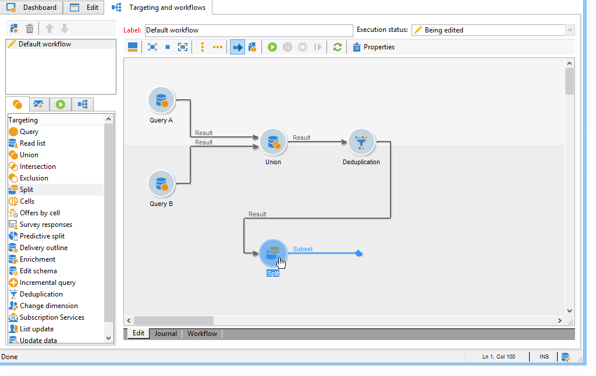

# Marketing campaign deliveries {#marketing-campaign-deliveries}

Deliveries can be created via the campaign dashboard, a campaign workflow or directly via the overview of deliveries.

## Creating deliveries {#creating-deliveries}

To create a delivery linked to a campaign, click the **[!UICONTROL Add a delivery]** link in the campaign dashboard.

The suggested configurations are suited to the different types of delivery: direct mail, email, mobile channels. 

>[!NOTE]
>
>For more on creating and configuring deliveries, refer to the [Sending Messages](../../delivery/using/communication-channels.md) section.

## Selecting the target population {#selecting-the-target-population}

For each delivery, the campaign manager will define:

* The main target. For more on this, refer to [Building the main target in a workflow](#building-the-main-target-in-a-workflow) and [Selecting the target population](#selecting-the-target-population).
* The control group. For more on this, refer to [Defining a control group](#defining-a-control-group).
* The seed addresses. For more on this, refer to [this section](../../delivery/using/about-seed-addresses.md).

Some of this information is inherited from the template.

>[!NOTE]
>
>Campaign templates are presented in [Campaign templates](../../campaign/using/marketing-campaign-templates.md#campaign-templates).

To build the delivery target, you can define filtering criteria for the recipients in the database. This recipient selection mode is presented in the [Sending Messages](../../delivery/using/steps-defining-the-target-population.md) section.

### Example: delivering to a group of recipients {#example--delivering-to-a-group-of-recipients}

You can import a population into a list, then target this list in deliveries.

1. To do this, edit the concerned delivery and click the **[!UICONTROL To]** link to change the targeted population.

1. In the **[!UICONTROL Main target]** tab, select the **[!UICONTROL Defined via the database]** option and click **[!UICONTROL Add]** to select recipients.

1. Choose **[!UICONTROL A list of recipients]** and click **[!UICONTROL Next]** to select it.

### Building the main target in a workflow {#building-the-main-target-in-a-workflow}

The main target of a delivery can also be defined in the targeting workflow: this graphical environment lets you build a target using queries, tests and operators: union, deduplication, sharing, etc.

The [Automating with workflows](../../workflow/using/executing-a-workflow.md#architecture) guide includes a detailed description of how the workflow module operates.

>[!IMPORTANT]
>
>In the same campaign, you cannot set up more than 28 workflows. Past this limit, additional workflows are not visible in the interface and can generate errors.

#### Creating a targeting workflow {#creating-a-targeting-workflow}

Targeting can be created via a combination of filtering conditions in a graphical sequence in a workflow. You can create populations and sub-populations which will be targeted according to your requirements. To display the workflow editor, click the **[!UICONTROL Targeting and workflows]** tab in the campaign dashboard.

The target population is extracted from the Adobe Campaign database via one or more queries placed in a workflow. To learn how to build a query, refer to [this section](../../workflow/using/query.md).

You can launch queries and share populations via boxes such as Union, Intersection, Sharing, Exclusion, etc.

Select the objects from the lists to the left of the workspace and link them to construct the target.

In the diagram, link up the targeting and scheduling queries required for target construction in the diagram. You can execute the targeting while construction is in progress in order to check the population extracted from the database.

>[!NOTE]
>
>Examples and procedure for defining queries are presented in [this section](../../workflow/using/query.md).

The left-hand section of the editor contains a library of graphical objects representing activities. The first tab contains the targeting activities, and the second tab contains the flow-control activities, which are used occasionally to coordinate targeting activities.

The targeting workflow execution and formatting functions are accessible via the diagram editor toolbar.

>[!NOTE]
>
>The activities available to build the diagram as well as all display and layout features are detailed in the [Automating with workflows](../../workflow/using/executing-a-workflow.md#architecture) guide.

You can create several targeting workflows for a single campaign. To add a workflow:

1. Go to the upper left-hand section of the workflow creation zone, right-click, and select **[!UICONTROL Add]**. You can also use the **[!UICONTROL New]** button located above this zone.

   

1. Select the **[!UICONTROL New workflow]** template and name this workflow.
1. Click **[!UICONTROL OK]** to confirm creation of the workflow, and then create the diagram for this workflow.

#### Executing a workflow {#executing-a-workflow}

Targeting workflows can be launched manually via the **[!UICONTROL Start]** button in the toolbar, provided that you have the appropriate rights.

The targeting can be programmed for automatic execution according to a schedule (scheduler) or an event (external signal, file import, etc.).

The actions related to executing the targeting workflow (launch, stop, pause, etc.) are **asynchronous** processes: the command is saved and will take effect as soon as the server is available to apply it.

The toolbar icons let you take action concerning the execution of the targeting workflow.

* Start or restart

    * The **[!UICONTROL Start]** icon lets you launch the targeting workflow. When you click on this icon, all activities without an input transition are activated (except end point jumps).
    
      

      The server takes the request into account, as shown by its status:
    
      

      The process status changes to **[!UICONTROL Started]**.
    
    * You can restart the targeting workflow via the appropriate toolbar icon. This command may be useful if the **[!UICONTROL Start]** icon is not available, for example when targeting workflow stopping is in progress. In this case, click the **[!UICONTROL Restart]** icon to anticipate the restart. The server takes the request into account, as its status shows:
    
      

      The process then enters **[!UICONTROL Started]** status.

* Stop or pause

    * The toolbar icons let you stop or pause a targeting workflow in progress.

      When you click **[!UICONTROL Pause]**, operations in progress **[!UICONTROL are not]** paused, but no other activity is launched until the next restart.
    
      

      The server takes the command into account, as its status shows: 
    
      

      You can also pause a targeting workflow automatically when its execution reaches a particular activity. To do this, right-click the activity from which targeting workflow is to be paused, and select **[!UICONTROL Enable but do not execute]**. 
    
      

      This configuration is shown by a special icon.
    
      

      >[!NOTE]
      >
      >This option is useful during advanced targeting campaign design and test phases.

      Click **[!UICONTROL Start]** to resume execution.
    
    * Click the **[!UICONTROL Stop]** icon to stop the execution in progress.
    
      

      The server takes the command into account, as its status shows: 
    
      

  You can also stop a targeting workflow automatically when the execution reaches an activity. To do this, right-click the activity from which targeting workflow will be stopped, and select **[!UICONTROL Do not activate]**. 

  

  

  This configuration is shown by a special icon.

  >[!NOTE]
  >
  >This option is useful during advanced targeting campaign design and test phases.

* Unconditional stop

  In the Explorer, select **[!UICONTROL Administration > Production > Object created automatically > Campaign workflows]** to access and act on every campaign workflows.

  You can unconditionally stop your workflow by clicking the **[!UICONTROL Actions]** icon and selecting **[!UICONTROL Unconditional]** stop. This action terminates your campaign workflow.

  

### Defining a control group {#defining-a-control-group}

A control group is a population which will not receive the delivery; it is used to track post-delivery behavior and campaign impact by making a comparison with the behavior of target population, which has received the delivery.

The control group can be extracted from the main target and/or come from a specific group or query.

#### Activating the control group for a campaign {#activating-the-control-group-for-a-campaign}

You can define a control group at campaign level, in which case the control group will be applied to each delivery of the campaign concerned.

1. Edit the campaign concerned and click the **[!UICONTROL Edit]** tab.
1. Click **[!UICONTROL Advanced campaign settings]**.

   

1. Select the **[!UICONTROL Enable and edit control group configuration]** option.
1. Click **[!UICONTROL Edit...]** to configure the control group.

   

The configuration procedure is presented in [Extracting the control group from the main target](#extracting-the-control-group-from-the-main-target) and [Adding a population](#adding-a-population).

#### Activating the control group for a delivery {#activating-the-control-group-for-a-delivery}

You can define a control group at delivery level, in which case the control group will be applied to each delivery of the campaign concerned.

By default, the control group configuration defined at the campaign level applies to every delivery of that campaign. You can, however, adapt the control group for an individual delivery.

>[!NOTE]
>
>If you have defined a control group for a campaign, and you also configure it for a delivery linked to this campaign, only the control group defined for the delivery will be applied.

1. Edit the delivery concerned and then click the **[!UICONTROL To]** link in the **[!UICONTROL Email parameters]** section.

   

1. Click the **[!UICONTROL Control group]** tab and then select **[!UICONTROL Enable and edit control group configuration]**.
1. Click **[!UICONTROL Edit...]** to configure the control group.

The configuration procedure is presented in [Extracting the control group from the main target](#extracting-the-control-group-from-the-main-target) and [Adding a population](#adding-a-population).

#### Extracting the control group from the main target {#extracting-the-control-group-from-the-main-target}

You can extract recipients from the main target of the delivery. In this case, recipients will be taken from the target of delivery actions affected by this configuration. This extraction can be random or can be the result of sorting the recipients. 

To extract a control group, enable the control group for the campaign or delivery and select one of the following options: **[!UICONTROL Activate random sampling]** or **[!UICONTROL Keep only the first records after sorting]**.

* **[!UICONTROL Activate random sampling]** : this option applies random sampling to the recipients in the targeted population. If you then set the threshold to 100, the control group will be made up of 100 recipients selected randomly from the targeted population. The random sampling depends on the database engine. 
* **[!UICONTROL Keep only the first records after sorting]** : this option enables you to define a limitation based on one or more sorting orders. If you select the **[!UICONTROL Age]** field as a sorting criterion and then define 100 as a threshold, the control group will be made up of the 100 youngest recipients. For instance, it could be interesting to define a control group that includes recipients who make few purchases, or recipients who make frequent purchases, and to compare their behavior with that of the contacted recipients.

Click **[!UICONTROL Next]** to define the sorting order (if necessary) and select the recipient limitation mode.

This configuration is equivalent to a sharing activity in the workflow, which lets you break the target up into subsets. The control group is one of these subsets. Refer to the [this section](../../workflow/using/executing-a-workflow.md#architecture) for more information.

### Adding a population {#adding-a-population}

You can define a new population to be used as a control group. This population can come from a group of recipients or you can create it via a specific query.

>[!NOTE]
>
>Adobe Campaign query editor is presented in [this section](../../workflow/using/query.md).

## Starting a delivery {#starting-a-delivery}

Once all approvals have been granted, the delivery is ready to be started. The delivery procedure then depends on the type of delivery. For e-mail or mobile channel deliveries, see [Starting an online delivery](#starting-an-online-delivery), and for direct mail deliveries, see [Starting an offline delivery](#starting-an-offline-delivery).

### Starting an online delivery {#starting-an-online-delivery}

Once all approval requests have been granted, the delivery status changes to **[!UICONTROL Pending confirmation]** and can be started by an operator. Where appropriate, the Adobe Campaign operator (or group of operators) appointed as reviewer to start the delivery is notified that a delivery is ready to be started.

>[!NOTE]
>
>If a specific operator or group of operators is designated for starting a delivery in the delivery's properties, you can also allow the operator in charge of the delivery to confirm the send. To do this, activate the **NMS_ActivateOwnerConfirmation** option by entering **1** as the value. The options are managed from the **[!UICONTROL Administration]** > **[!UICONTROL Platform]** > **[!UICONTROL Options]** node in the Adobe Campaign explorer.
>  
>To deactivate this option, enter **0** as the value. The send confirmation process will then function as default: only the operator or group of operators designated for the send in the delivery properties (or an administrator) will be able to confirm and carry out the send.

The information also appears on the campaign dashboard. The **[!UICONTROL Confirm delivery]** link lets you start the delivery.

A confirmation message lets you secure this action.

### Starting an offline delivery {#starting-an-offline-delivery}

Once all approvals have been granted, the delivery status changes to **[!UICONTROL Pending extraction]**. The extraction files are created via a special workflow which, in a default configuration, starts automatically when a direct mail delivery is pending extraction. When a process is in progress, it is displayed in the dashboard and can be edited via its link.

>[!NOTE]
>
>The technical workflows concerning campaign processes are presented in [List of campaign process workflows](../../workflow/using/campaign.md).

**Step 1 - File approval**

Once the extraction workflow has been successfully executed, the extraction file must be approved (provided that extraction file approval was selected in the delivery settings).

For more on this, refer to [Approving an extraction file](../../campaign/using/marketing-campaign-approval.md#approving-an-extraction-file).

**Step 2 - Approval of the message to the service provider**

* Once the extraction file is approved, you can generate the proof of the router notification e-mail. This e-mail message is constructed based on a delivery template. It must be approved.

  >[!NOTE]
  >
  >This step is only available if the sending and approval of proofs was enabled in the approvals window.

  

* Click the **[!UICONTROL Send a proof]** button to create the proofs.

  The proof target must be defined beforehand.

  You can create as many proofs as necessary. These are accessed via the **[!UICONTROL Direct mail...]** link of the delivery detail.

  

* The delivery status changes to **[!UICONTROL To submit]**. Click the **[!UICONTROL Submit proofs]** button to start the approval process.

  

* The delivery status changes to **[!UICONTROL Proof to validate]** and a button lets you accept or reject approval.

  

  You can either accept or reject this approval, or return to the extraction step.

  

* The extraction file is sent to the router and the delivery is finished.

### Calculation of costs and stocks {#calculation-of-costs-and-stocks}

The file extraction launches two operations: budget calculation and stock calculation. The budget entries are updated.

* The **[!UICONTROL Budget]** tab lets you manage the budgets for the campaign. The total of the cost entries is shown in the **[!UICONTROL Calculates cost]** field of the campaign's main tab and the program it belongs to. The amounts are also reflected in the campaign budget.

  The real cost will eventually be calculated from information supplied by the router. Only messages actually sent are invoiced.

* Stocks are defined in the **[!UICONTROL Administration > Campaign management > Stocks]** node of the tree, and cost structures in the **[!UICONTROL Administration > Campaign management > Service providers]** node.

  Stock lines are visible in the stock section. To define the initial stock, open a stock line. The stock is decremented each time a delivery takes place. You can define an alert level and notifications.

>[!NOTE]
>
>For further information about cost calculations and stock management, see [Providers, stocks and budgets](../../campaign/using/providers--stocks-and-budgets.md).

## Managing associated documents {#managing-associated-documents}

You can associate various documents with a campaign: report, photo, web page, diagram, etc. These documents can be in any format (Microsoft Word, PowerPoint, PNG, JPG, Acrobat PDF, etc). To link documents with a campaign, see [Adding documents](#adding-documents).

>[!IMPORTANT]
>
>This mode is reserved for small documents.

In a campaign you can also refer to other items, such as promotional coupons, special offers relating to a specific branch or store, etc. When these elements are included in an outline, they can be associated with a direct mail delivery. See [Associating and structuring resources linked via a delivery outline](#associating-and-structuring-resources-linked-via-a-delivery-outline).

>[!NOTE]
>
>If you are using MRM, you can also manage a library of marketing resources that are available for several participants for collaborative work. See [Managing marketing resources](../../campaign/using/managing-marketing-resources.md).

### Adding documents {#adding-documents}

Documents can be associated at the campaign level (contextual documents) or the program level (general documents).

The **[!UICONTROL Documents]** tab contains:

* The list of all documents required for the content (template, images, etc.) that can be downloaded locally by Adobe Campaign operators with suitable rights,
* Documents containing information for the router, if any.

The documents are linked to the program or the campaign via the **[!UICONTROL Edit > Documents]** tab. 

You can also add a document to a campaign via the link offered in its dashboard.

Click the **[!UICONTROL Details]** icon to view the content of a file and to add information:

In the dashboard, documents associated with the campaign are grouped in the **[!UICONTROL Document(s)]** section, as in the following example:

They can also be edited and modified from this view.

### Associating and structuring resources linked via a delivery outline {#associating-and-structuring-resources-linked-via-a-delivery-outline}

>[!NOTE]
>
>Delivery outlines are exclusively used in the context of direct mail campaigns.

A delivery outline denotes a structured set of elements (documents, branches/stores, promotional coupons, etc.) created in the company and for a particular campaign.

These elements are grouped in delivery outlines, and a particular delivery outline will be associated with a delivery; it will be referenced in the extraction file sent to the **service provider** in order to be attached to the delivery. For example, you can create a delivery outline that refers to a branch and the marketing brochures it uses.

For a campaign, delivery outlines let you structure external elements to be associated with the delivery according to certain criteria: related branch, promotional offer granted, invitation to a local event, etc.

#### Creating an outline {#creating-an-outline}

To create an outline, click the **[!UICONTROL Delivery outlines]** sub-tab in the **[!UICONTROL Edit > Documents]** tab of the concerned campaign.

>[!NOTE]
>
>If this tab is not present, then this feature is not available for this campaign. Refer to the campaign template configuration.
>   
>For more on this, refer to [Campaign templates](../../campaign/using/marketing-campaign-templates.md#campaign-templates).

Next, click **[!UICONTROL Add a delivery outline]** and create the hierarchy of outlines for the campaign:

1. Right-click the root of the tree and select **[!UICONTROL New > Delivery outlines]**.
1. Right-click the outline you have just created and select **[!UICONTROL New > Item]** or **[!UICONTROL New > Personalization fields]**.

An outline can contain items and personalization fields, resources and offers:

* Items can be physical documents, for example, which are referenced and described here and will be attached to the delivery. 
* Personalization fields enable you to create personalization elements related to deliveries rather than recipients. It is thus possible to create values to be used in deliveries for a specific target (welcome offer, a discount, etc.) They are created in Adobe Campaign and imported into the outline via the **[!UICONTROL Import personalization fields...]** link. 

  

  They can also be created directly in the outline by clicking the **[!UICONTROL Add]** icon to the right of the list zone.

  

* The resources are marketing resources generated in the marketing resource dashboard accessed via the **[!UICONTROL Resources]** link of the **[!UICONTROL Campaigns]** universe.

  

  >[!NOTE]
  >
  >For more on marketing resources, refer to [Managing marketing resources](../../campaign/using/managing-marketing-resources.md).

#### Selecting an outline {#selecting-an-outline}

For each delivery, you can select the outline to associate from the section reserved for the extraction outline, as in the following example:

The selected outline is then displayed in the lower section of the window. It can be edited using the icon to the right of the field or altered using the drop-down list:

The **[!UICONTROL Summary]** tab of the delivery also displays this information:

#### Extraction result {#extraction-result}

In the file extracted and sent to the service provider, the name of the outline and, where appropriate, its characteristics (cost, description, etc.) are added to the content according to the information in the export template associated with the service provider.

In the following example, the label, estimated cost, and description of the outline associated with the delivery will be added to the extraction file. 

The export model must be associated with the service provider selected for the delivery concerned. See [Creating service providers and their cost structures](../../campaign/using/providers--stocks-and-budgets.md#creating-service-providers-and-their-cost-structures).

>[!NOTE]
>
>For more on exports, refer to the [Getting Started](../../platform/using/generic-imports-and-exports.md) section.
