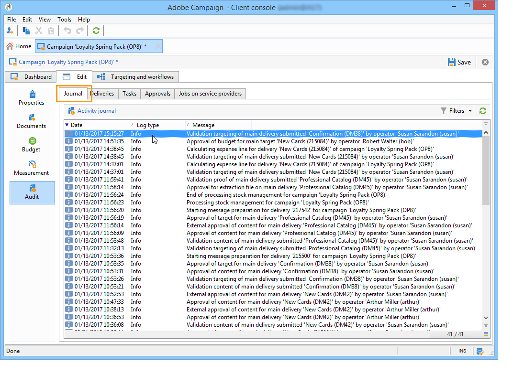
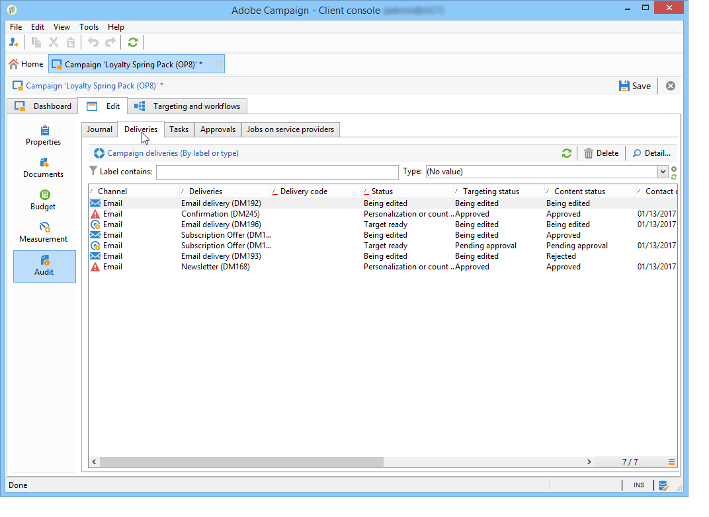
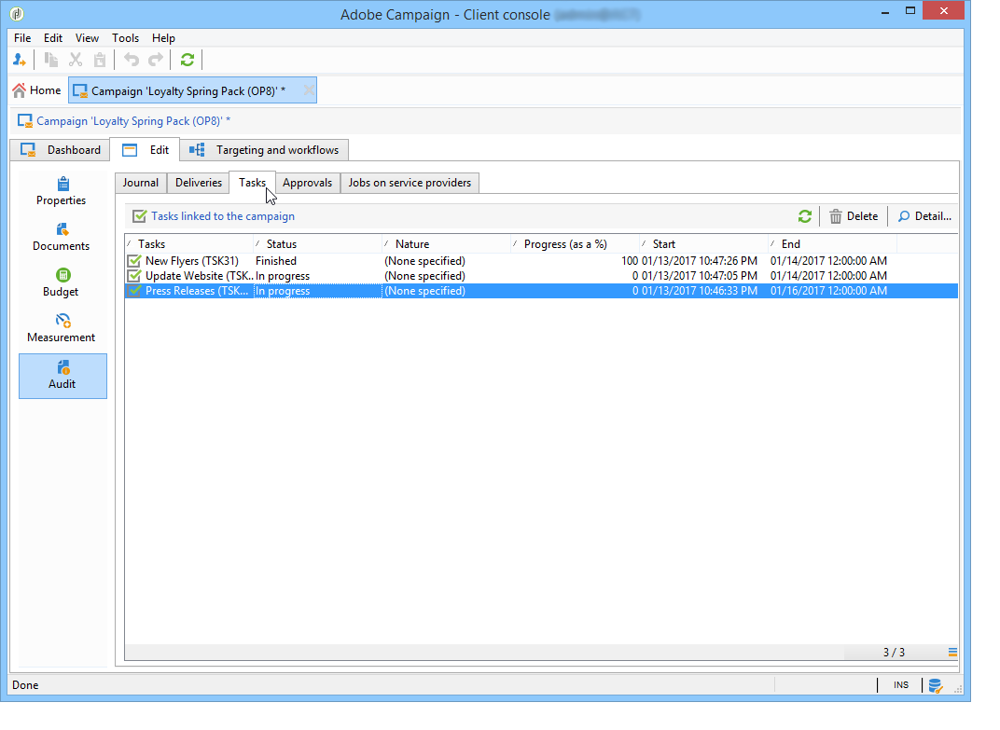
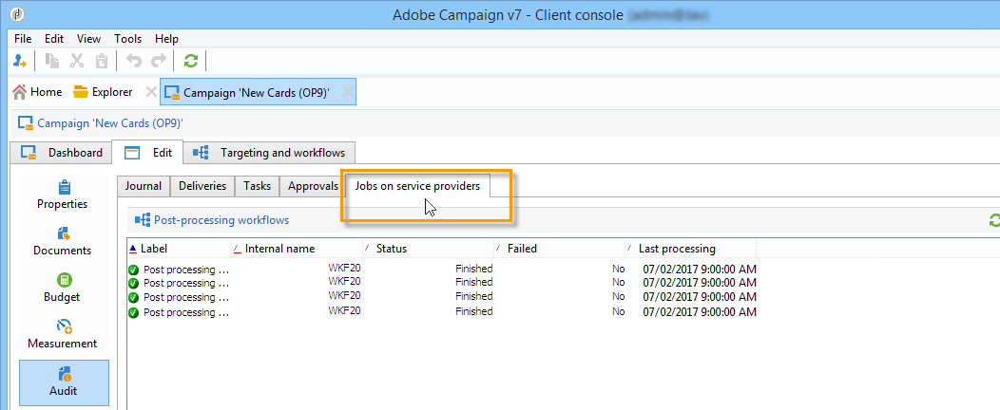

# Monitor marketing campaigns {#monitoring-marketing-campaigns}

## Track a campaign {#tracking-a-campaign}

For each campaign, the **[!UICONTROL Tracking]** tab lets you view all jobs and their statuses. The following information is accessible via this sub-tab:

* The activity journal shows the jobs carried out on the campaign in general: workflow creation or start, approval, extraction, etc.

  

* The **[!UICONTROL Deliveries]** sub-tab contains all the deliveries of the campaign which can be edited from this view. To do so, select the delivery and click the **[!UICONTROL Detail]** icon.

  

* The **[!UICONTROL Tasks]** sub-tab groups all tasks linked to the campaign. This view lets you edit them or delete them. Tasks are available with the MRM application. They are detailed in [this section](../../campaign/using/creating-and-managing-tasks.md).

  

* The workflows created to generate messages for service providers are displayed in the **[!UICONTROL Jobs on service providers]** sub-tab. Click the **[!UICONTROL Detail]** icon to display the selected workflow. 

  

## Delivery tracking {#delivery-tracking}

The list of deliveries is available via the **[!UICONTROL Deliveries]** link of the Campaign node.

For each delivery, this list lets you access the key indicators: status, number of recipients targeted, linked campaigns, etc.

To check the status of a delivery, edit it and view its dashboard and tabs.

>[!NOTE]
>
>Information concerning delivery details is available in [this section](../../delivery/using/about-message-tracking.md) section.

## Execution tracking {#execution-tracking}

You can look up the status of deliveries by clicking the **[!UICONTROL Deliveries]**, which is accessible via the Adobe Campaign home page. See [Delivery tracking](#delivery-tracking).

Information concerning the processes executed in a campaign are collected in the **[!UICONTROL Edit > Audit]** tab of the campaign. There, you can view the list of deliveries in the campaign. [Learn more](#tracking-a-campaign).
