# Select the audience of your campaigns {#marketing-campaign-deliveries}

In a marketing campaign, for each delivery, you can define:

* The audience - Learn more in [Building the audience in a workflow](#building-the-main-target-in-a-workflow) and [Selecting the target population](#selecting-the-target-population).
* A control group - Learn more in [this section](#defining-a-control-group).
* Seed addresses - Learn more in [this section](../../delivery/using/about-seed-addresses.md).

Some of this information can be inherited from the [campaign template](../../campaign/using/marketing-campaign-templates.md#campaign-templates).

To build the delivery target, you can define filtering criteria for the recipients in the database. This recipient selection mode is presented in [this section](../../delivery/using/steps-defining-the-target-population.md).

## Send to a group

You can import a population into a list, then target this list in deliveries. To do this, follow the steps below:

1. Edit the concerned delivery and click the **[!UICONTROL To]** link to change the targeted population.

1. In the **[!UICONTROL Main target]** tab, select the **[!UICONTROL Defined via the database]** option and click **[!UICONTROL Add]** to select recipients.

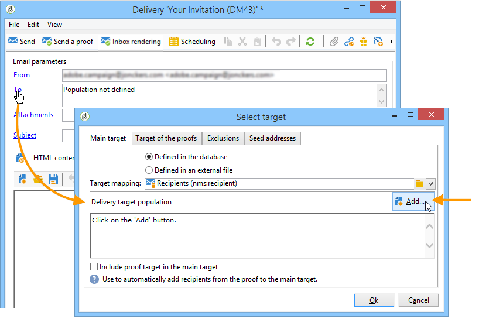

1. Choose **[!UICONTROL A list of recipients]** and click **[!UICONTROL Next]** to select it.

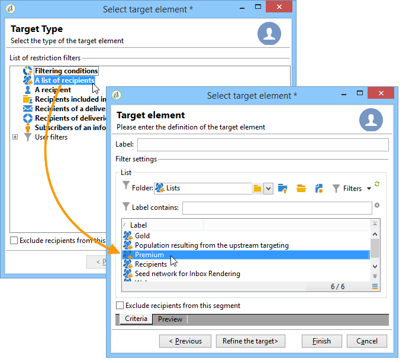

## Build the audience in a campaign workflow {#building-the-main-target-in-a-workflow}

The main target of a delivery can also be defined in the campaign workflow: this graphical environment lets you build a target using queries, tests and operators: union, deduplication, sharing, etc.

>[!IMPORTANT]
>
>You must not add more than 28 workflows in a campaign. Past this limit, additional workflows are not visible in the interface and can generate errors.

### Create the workflow {#creating-a-targeting-workflow}

Targeting can be created via a combination of filtering conditions in a graphical sequence in a workflow. You can create populations and sub-populations which will be targeted according to your requirements. To display the workflow editor, click the **[!UICONTROL Targeting and workflows]** tab in the campaign dashboard.

The target population is extracted from the Adobe Campaign database via one or more queries placed in a workflow. To learn how to build a query, refer to [this section](../../workflow/using/query.md).

You can launch queries and share populations via boxes such as Union, Intersection, Sharing, Exclusion, etc.

Select the objects from the lists to the left of the workspace and link them to construct the target.

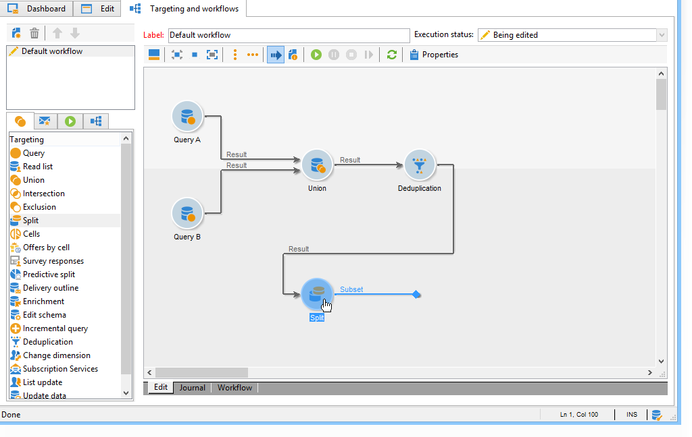

In the diagram, link up the targeting and scheduling queries required for target construction in the diagram. You can execute the targeting while construction is in progress in order to check the population extracted from the database.

>[!NOTE]
>
>Examples and procedure for defining queries are presented in [this section](../../workflow/using/query.md).

The left-hand section of the editor contains a library of graphical objects representing activities. The first tab contains the targeting activities, and the second tab contains the flow-control activities, which are used occasionally to coordinate targeting activities.

The targeting workflow execution and formatting functions are accessible via the diagram editor toolbar.

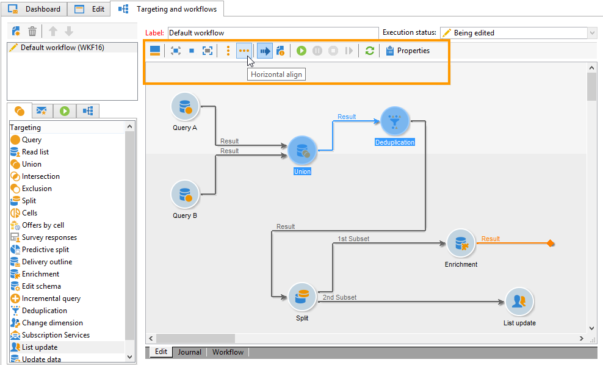

>[!NOTE]
>
>The activities available to build the diagram as well as all display and layout features are detailed in the [Automating with workflows](../../workflow/using/architecture.md) guide.

You can create several targeting workflows for a single campaign. To add a workflow:

1. Go to the upper left-hand section of the workflow creation zone, right-click, and select **[!UICONTROL Add]**. You can also use the **[!UICONTROL New]** button located above this zone.

   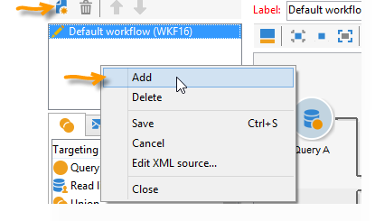

1. Select the **[!UICONTROL New workflow]** template and name this workflow.
1. Click **[!UICONTROL OK]** to confirm creation of the workflow, and then create the diagram for this workflow.

### Execute the workflow {#executing-a-workflow}

Targeting workflows can be launched manually via the **[!UICONTROL Start]** button in the toolbar, provided that you have the appropriate rights.

The targeting can be programmed for automatic execution according to a schedule (scheduler) or an event (external signal, file import, etc.).

The actions related to executing the targeting workflow (launch, stop, pause, etc.) are **asynchronous** processes: the command is saved and will take effect as soon as the server is available to apply it.

The toolbar icons let you take action concerning the execution of the targeting workflow.

* Start or restart

    * The **[!UICONTROL Start]** icon lets you launch the targeting workflow. When you click on this icon, all activities without an input transition are activated (except end point jumps).
    
      

      The server takes the request into account, as shown by its status:
    
      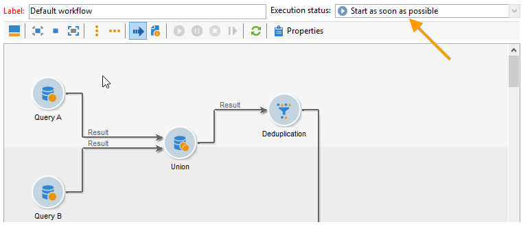

      The process status changes to **[!UICONTROL Started]**.
    
    * You can restart the targeting workflow via the appropriate toolbar icon. This command may be useful if the **[!UICONTROL Start]** icon is not available, for example when targeting workflow stopping is in progress. In this case, click the **[!UICONTROL Restart]** icon to anticipate the restart. The server takes the request into account, as its status shows:
    
      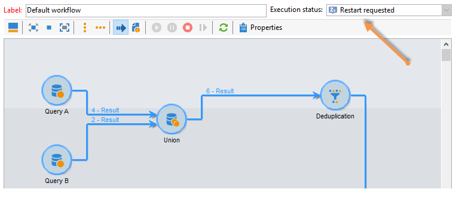

      The process then enters **[!UICONTROL Started]** status.

* Stop or pause

    * The toolbar icons let you stop or pause a targeting workflow in progress.

      When you click **[!UICONTROL Pause]**, operations in progress **[!UICONTROL are not]** paused, but no other activity is launched until the next restart.
    
      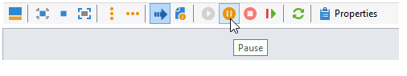

      The server takes the command into account, as its status shows: 
    
      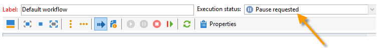

      You can also pause a targeting workflow automatically when its execution reaches a particular activity. To do this, right-click the activity from which targeting workflow is to be paused, and select **[!UICONTROL Enable but do not execute]**. 
    
      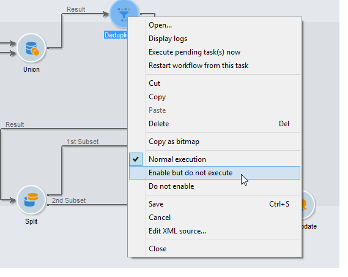

      This configuration is shown by a special icon.
    
      

      >[!NOTE]
      >
      >This option is useful during advanced targeting campaign design and test phases.

      Click **[!UICONTROL Start]** to resume execution.
    
    * Click the **[!UICONTROL Stop]** icon to stop the execution in progress.
    
      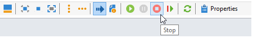

      The server takes the command into account, as its status shows: 
    
      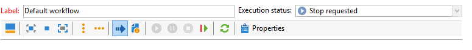

  You can also stop a targeting workflow automatically when the execution reaches an activity. To do this, right-click the activity from which targeting workflow will be stopped, and select **[!UICONTROL Do not activate]**. 

  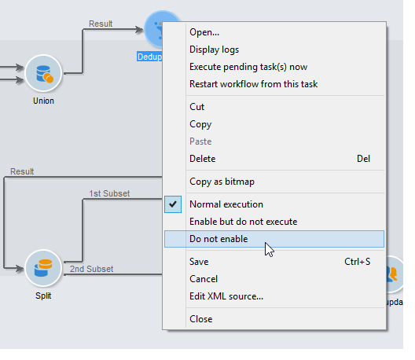

  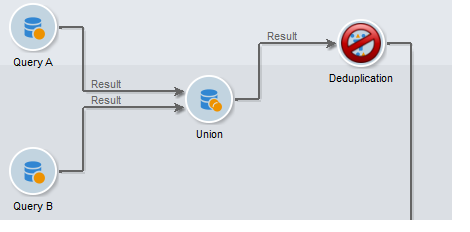

  This configuration is shown by a special icon.

  >[!NOTE]
  >
  >This option is useful during advanced targeting campaign design and test phases.

* Unconditional stop

  In the Explorer, select **[!UICONTROL Administration > Production > Object created automatically > Campaign workflows]** to access and act on every campaign workflows.

  You can unconditionally stop your workflow by clicking the **[!UICONTROL Actions]** icon and selecting **[!UICONTROL Unconditional]** stop. This action terminates your campaign workflow.

  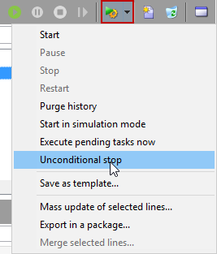

## Add a control group {#defining-a-control-group}

A control group is a population which will not receive the delivery; it is used to track post-delivery behavior and campaign impact by making a comparison with the behavior of target population, which has received the delivery.

The control group can be extracted from the main target and/or come from a specific group or query.

### Activate the control group for a campaign {#activating-the-control-group-for-a-campaign}

You can define a control group at campaign level, in which case the control group will be applied to each delivery of the campaign concerned.

1. Edit the campaign concerned and click the **[!UICONTROL Edit]** tab.
1. Click **[!UICONTROL Advanced campaign settings]**.

   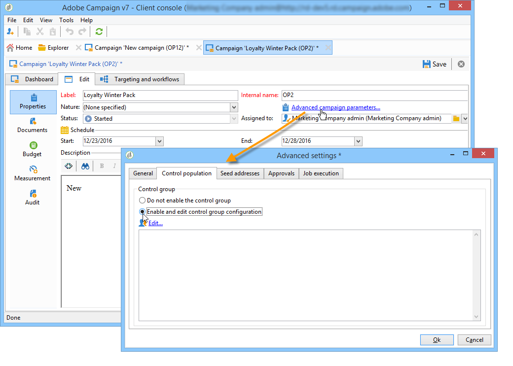

1. Select the **[!UICONTROL Enable and edit control group configuration]** option.
1. Click **[!UICONTROL Edit...]** to configure the control group.

   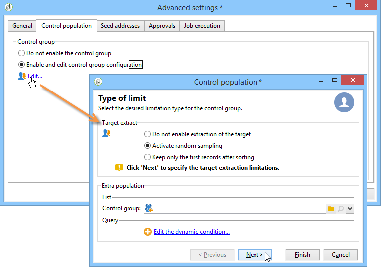

The configuration procedure is presented in [Extracting the control group from the main target](#extracting-the-control-group-from-the-main-target) and [Adding a control group](#adding-a-population).

### Activate the control group for a delivery {#activating-the-control-group-for-a-delivery}

You can define a control group at delivery level, in which case the control group will be applied to each delivery of the campaign concerned.

By default, the control group configuration defined at the campaign level applies to every delivery of that campaign. You can, however, adapt the control group for an individual delivery.

>[!NOTE]
>
>If you have defined a control group for a campaign, and you also configure it for a delivery linked to this campaign, only the control group defined for the delivery will be applied.

1. Edit the delivery concerned and then click the **[!UICONTROL To]** link in the **[!UICONTROL Email parameters]** section.

   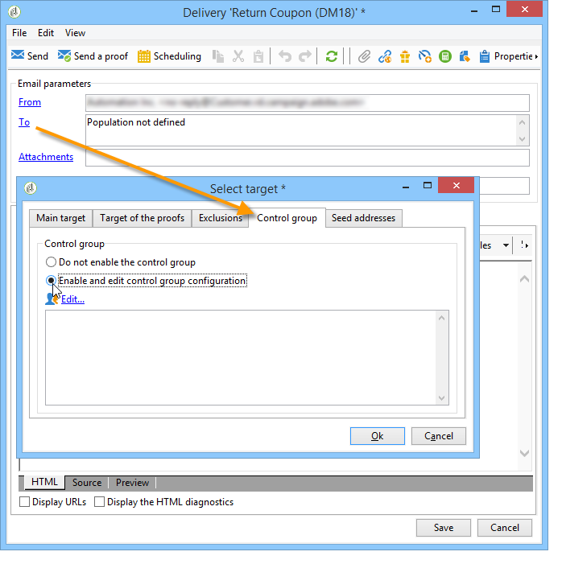

1. Click the **[!UICONTROL Control group]** tab and then select **[!UICONTROL Enable and edit control group configuration]**.
1. Click **[!UICONTROL Edit...]** to configure the control group.

The configuration procedure is presented in [Extracting the control group from the main target](#extracting-the-control-group-from-the-main-target) and [Adding a control group](#adding-a-population).

### Extract the control group from the main target {#extracting-the-control-group-from-the-main-target}

You can extract recipients from the main target of the delivery. In this case, recipients will be taken from the target of delivery actions affected by this configuration. This extraction can be random or can be the result of sorting the recipients. 

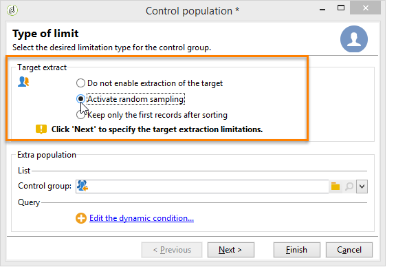

To extract a control group, enable the control group for the campaign or delivery and select one of the following options: **[!UICONTROL Activate random sampling]** or **[!UICONTROL Keep only the first records after sorting]**.

* **[!UICONTROL Activate random sampling]** : this option applies random sampling to the recipients in the targeted population. If you then set the threshold to 100, the control group will be made up of 100 recipients selected randomly from the targeted population. The random sampling depends on the database engine. 
* **[!UICONTROL Keep only the first records after sorting]** : this option enables you to define a limitation based on one or more sorting orders. If you select the **[!UICONTROL Age]** field as a sorting criterion and then define 100 as a threshold, the control group will be made up of the 100 youngest recipients. For instance, it could be interesting to define a control group that includes recipients who make few purchases, or recipients who make frequent purchases, and to compare their behavior with that of the contacted recipients.

Click **[!UICONTROL Next]** to define the sorting order (if necessary) and select the recipient limitation mode.

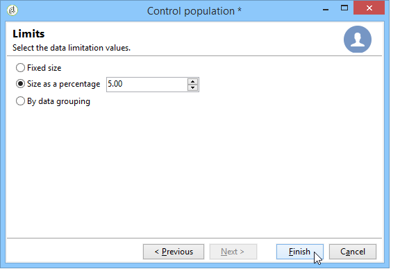

This configuration is equivalent to a sharing activity in the workflow, which lets you break the target up into subsets. The control group is one of these subsets. Refer to the [this section](../../workflow/using/architecture.md) for more information.

### Use a new population as a control group {#adding-a-population}

You can define a new population to be used as a control group. This population can come from a group of recipients or you can create it via a specific query.

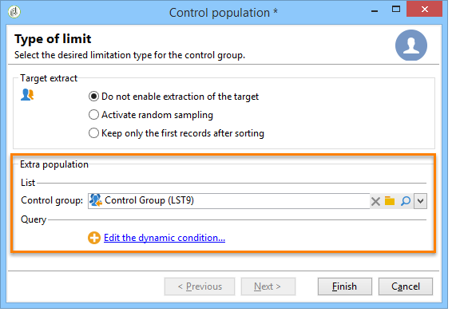

>[!NOTE]
>
>Adobe Campaign query editor is presented in [this section](../../workflow/using/query.md).

#### Tutorial video {#create-email-video}

This video explains how to create a campaign and an email in Adobe Campaign.

>[!VIDEO](https://video.tv.adobe.com/v/25604?quality=12)

Additional Campaign how-to videos are available [here](https://experienceleague.adobe.com/docs/campaign-classic-learn/tutorials/overview.html).
