# Create and configure campaign templates {#campaign-templates}

All marketing campaigns are based on a template, which stores main characteristics and capabilities. Campaign templates are centralized in the **[!UICONTROL Resources > Templates > Campaign templates]** node. A default template is supplied as standard. It lets you create a new campaign using all the available modules (Documents, Tasks, Seed addresses, etc.), but the modules offered depend on your rights and the configuration of your Adobe Campaign platform.

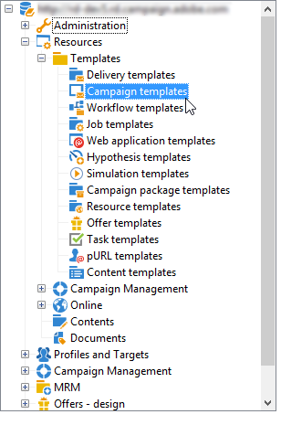

>[!NOTE]
>
>The tree is displayed when you click the **[!UICONTROL Explorer]** icon on the home page.

A built-in template is supplied in order to create a campaign for which no specific configuration has been defined. You can create and configure your campaign templates and then create campaigns from these templates.

 For more on campaign creation, refer to [this video](../../campaign/using/marketing-campaign-deliveries.md#create-email-video).

## Create a campaign template {#creating-or-duplicating-a-campaign-template}

To create a campaign template, follow the steps below:

1. Open Campaign **Explorer**.
1. In **Resources > Templates > Campaign templates**, click **New** in the toolbar above the list of templates. 

   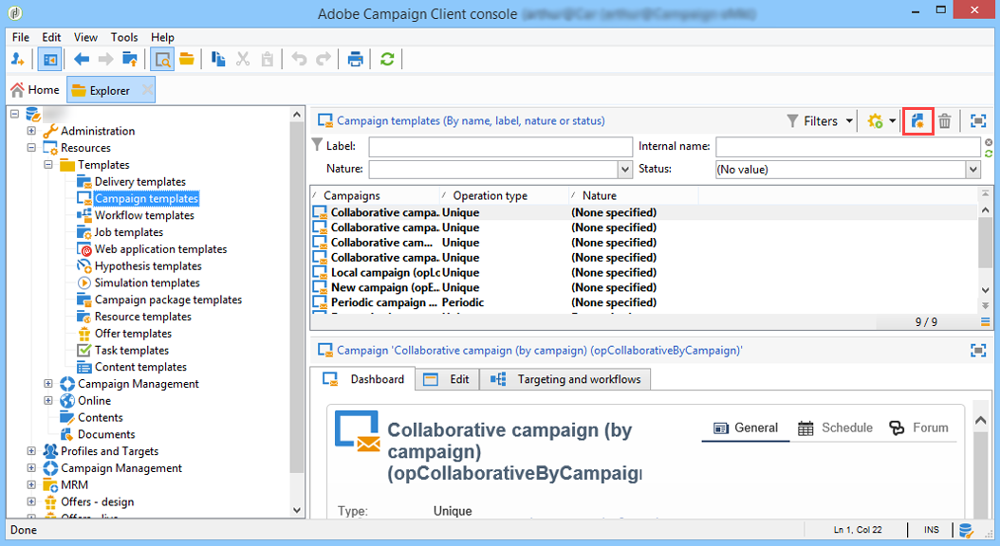

1. Enter the label of your new campaign template.
1. Click **Save** and reopen your template.
1. In the **Edit** tab, enter the **Internal name** and other values, if needed.
1. Select **Advanced campaign settings** to add a workflow to your campaign template.

   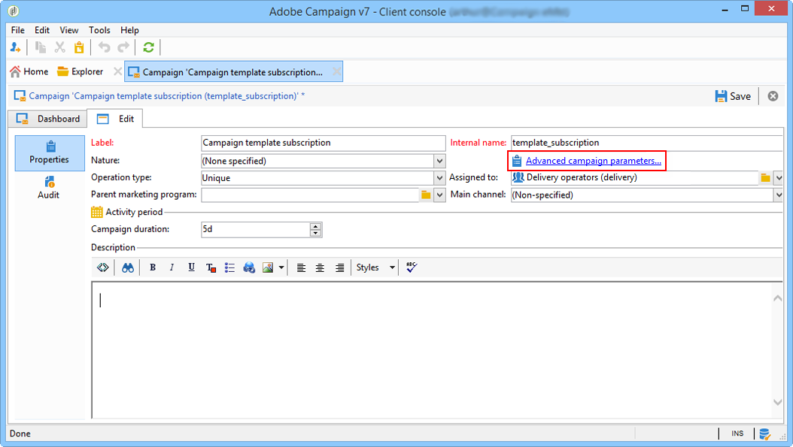

1. Change the **Targeting and workflows** value to **Yes**.

   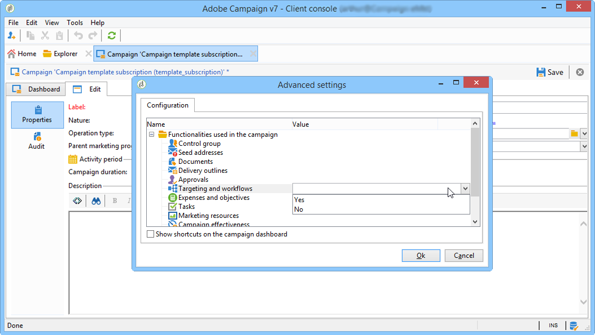

1. In the **Targeting and workflows** tab, click **Add a workflow...**.

   

1. Complete the **Label** field and click **Ok**.
1. Create your workflow according to your requirements.
1. Click **Save**. Your template is now ready to be used in a campaign.

You can also **duplicate** the default template to re-use and adapt its configuration.

The various tabs and sub-tabs of the campaign template allow you to access its settings, described in [General configuration](#general-configuration).

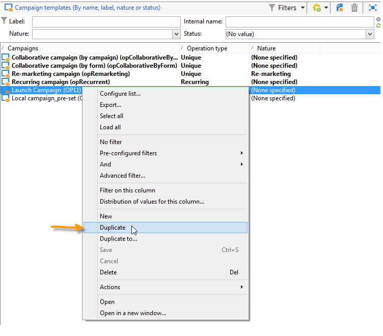

## Select modules {#select-modules}

The **[!UICONTROL Advanced campaign settings...]** link lets you enable and disable jobs for the campaigns based on this template. Select the capabilities you want to enable in the campaigns created based on this template.

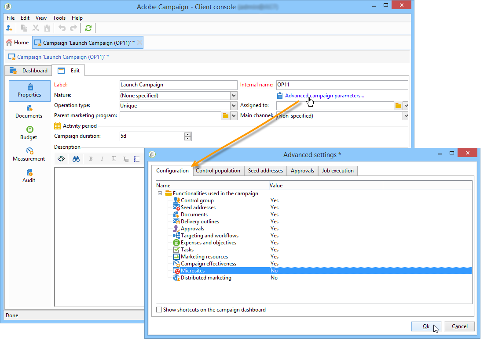

If a capability is not selected, the elements concerning the process (menus, icons, options, tabs, sub-tabs, etc.) will not appear in the interface of the template or in campaigns based on this template. The tabs to the left of the campaign details usually coincide with the processes selected in the template. For example, if **Expenses and objectives** is not selected, the corresponding **[!UICONTROL Budget]** tab will not be shown in campaigns based on this template.

Moreover, shortcuts to the configuration windows are added to the campaign dashboard. When a functionality is enabled, a direct link gives access to it from the campaign dashboard.

For example, with the configuration below:

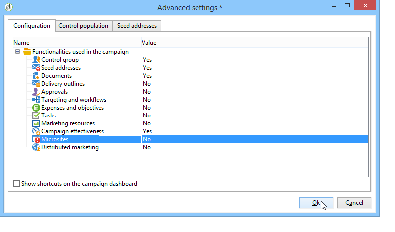

The following links are displayed in the campaign dashboard (the **[!UICONTROL Add a task]** link is missing):

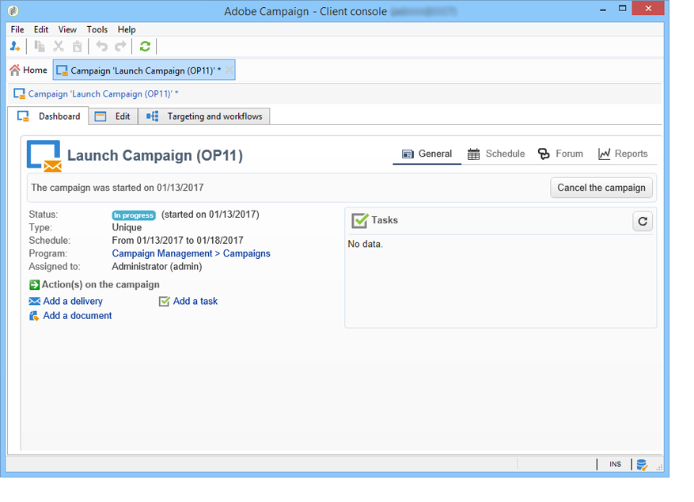

And only the following tabs will be displayed:

However, with this type of configuration:

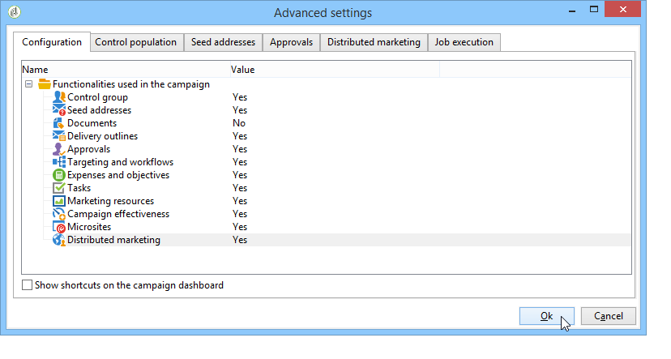

The following links and tabs will be displayed:

## Typology of modules {#typology-of-enabled-modules}

* **Control group**

  When this module is selected, an additional tab is added to the advanced settings of the template and the campaigns based on this template. The configuration can be defined via the template or individually for each campaign. Learn more about control groups in [this section](../../campaign/using/marketing-campaign-deliveries.md#defining-a-control-group).

  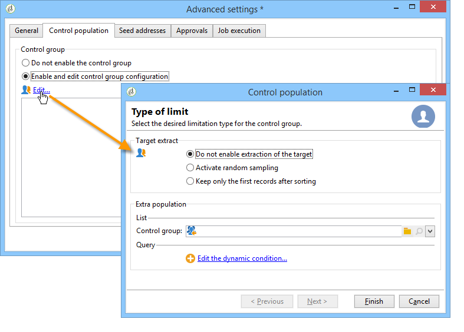

* **Seed addresses**

  When this module is selected, an additional tab is added to the advanced settings of the template and the campaigns based on this template. The configuration can be defined via the template or individually for each campaign. Learn more  about seed addresses in [this section](../../delivery/using/about-seed-addresses.md).

  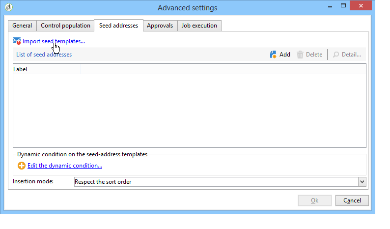

* **Documents**

  When this module is selected, an additional tab is added to the **[!UICONTROL Edition]** tab of the template and the campaigns based on this template. Attached documents can be added from the template or individually for each campaign. Learn more about documents in [this section](../../campaign/using/marketing-campaign-deliveries.md#managing-associated-documents).

  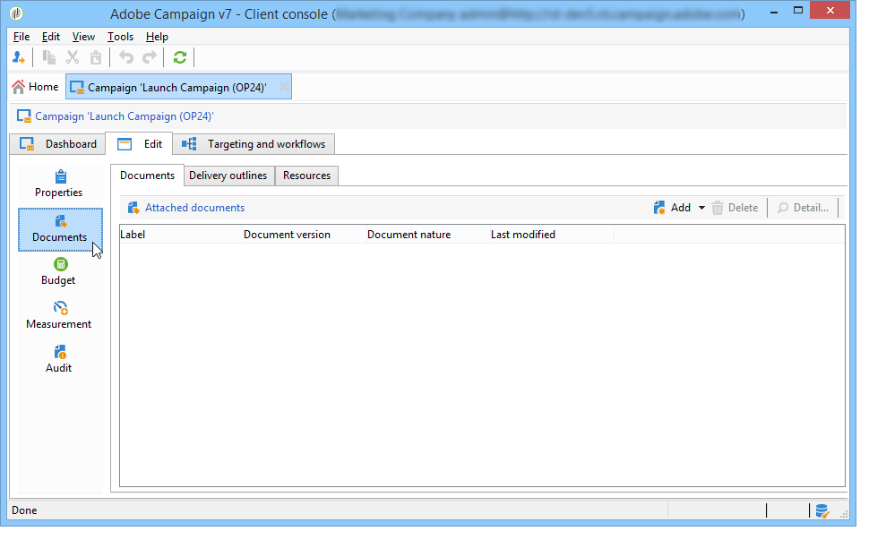

* **Outline**

  When this module is selected, a **[!UICONTROL Delivery outlines]** sub-tab is added to the **[!UICONTROL Documents]** tab in order to define delivery outlines for the campaign. Learn more about delivery outlines in [this section](../../campaign/using/marketing-campaign-deliveries.md#associating-and-structuring-resources-linked-via-a-delivery-outline).

  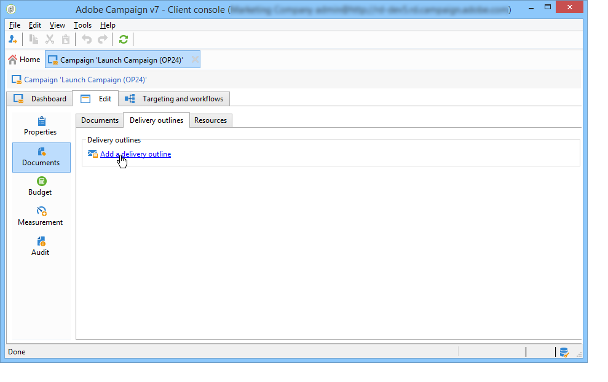

* **Targeting and workflows**

  When you select the **[!UICONTROL Targeting and workflows]** module, a tab is added to let you create one or more workflows for campaigns based on this template. Workflows can also be configured individually for each campaign based on this template.Learn more about campaign workflows in [this section](../../campaign/using/marketing-campaign-deliveries.md#building-the-main-target-in-a-workflow).

  

  When this module is enabled, a tab is added to the advanced settings of the campaign to define the process execution sequence.

  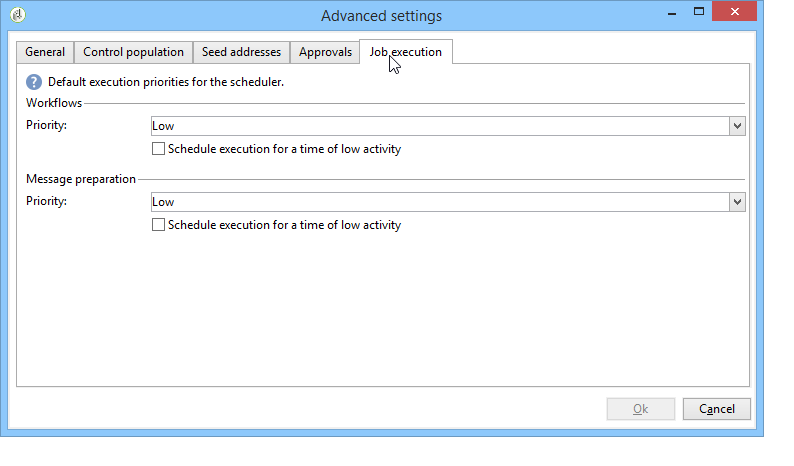

* **Approval**

  If you select the **[!UICONTROL Approval]**, you can select the processes to approve as well as the operators in charge of approvals. Learn more about approvals in [this section](../../campaign/using/marketing-campaign-approval.md#selecting-reviewers).

  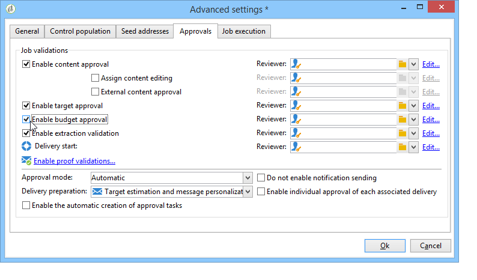

  You may choose whether or not to enable process approval via the **[!UICONTROL Approvals]** tab of the templates advanced settings section. The jobs for which approval is selected must be approved for message delivery to be authorized.

  You must associate a reviewer operator or group of operators to each enabled approval.

* **Expenses and objectives**

  When this module is selected, a **[!UICONTROL Budget]** tab is added to the details of the template and campaigns based on this template so that the associated budget can be selected.

  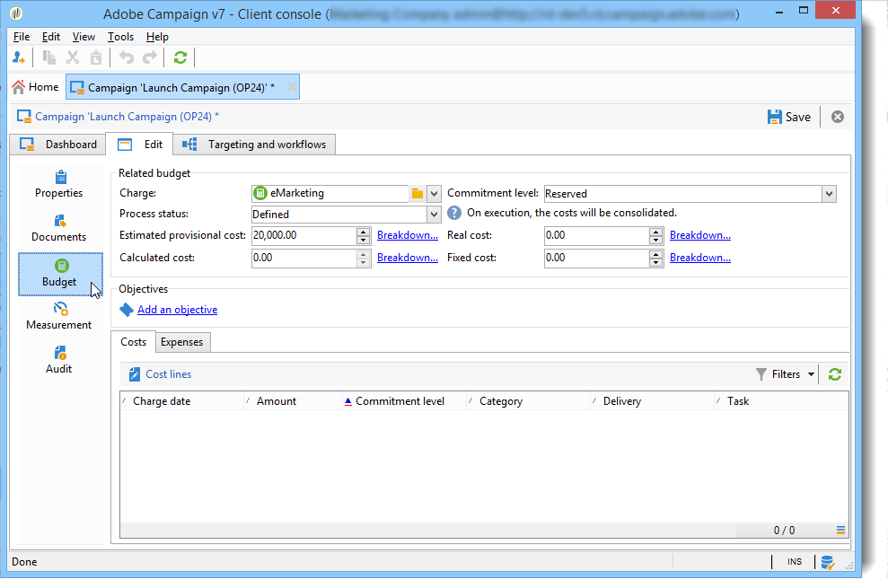

## Properties and execution {#general-configuration}

### Template properties {#template-properties}

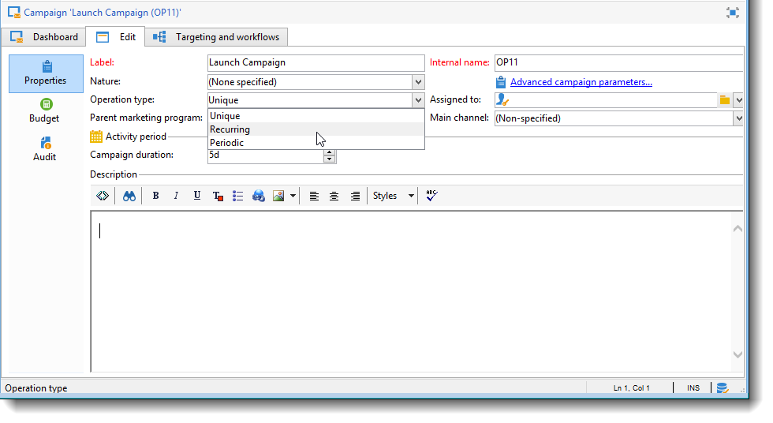

When you create a campaign template, you need to enter the following information:

* Enter the **label** of the template: this label will be assigned by default to all campaigns created via this template.
* Select the campaign **nature** from the drop-down list. The values available in this list are those saved in the **[!UICONTROL natureOp]** enumeration.

  >[!NOTE]
  >
  >For more information on enumerations, refer to the [Getting Started](../../platform/using/managing-enumerations.md) section.

* Select the **type of campaign**: unique, recurring, or periodic. By default, campaign templates apply to unique campaigns. Recurring and periodic campaigns are detailed in [this section](../../campaign/using/setting-up-marketing-campaigns.md#recurring-and-periodic-campaigns).
* Specify the duration of the campaign, i.e. the number of days over which the campaign will take place. When creating a campaign based on this template, the campaign start and end dates will be populated automatically.

  If the campaign is recurrent, you must specify the campaign start and end dates directly in the template. 

* Specify the **related program** of the template: campaigns based on this template will be linked to the selected program.

### Template execution parameters {#template-execution-parameters}

The **[!UICONTROL Advanced campaign settings...]** link lets you configure the advanced options of the template for processing the delivery target (control group, seed addresses, etc.) and the configuration of campaign measurement and workflow execution.

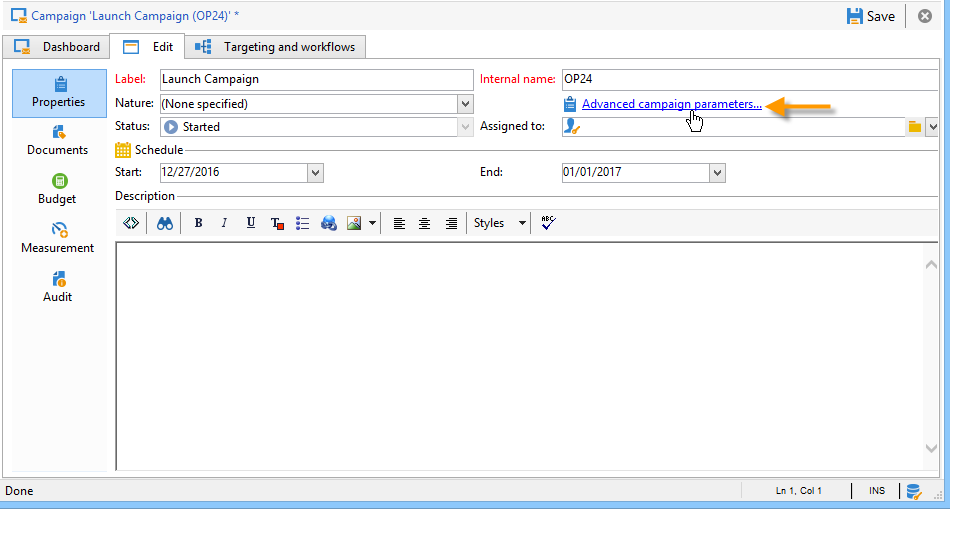

## Track campaign execution{#campaign-reverse-scheduling}

You can create a schedule for a campaign and track accomplishments, for instance to prepare an event schedule for a specific date. Campaign templates now let you calculate the start date of a task based on the end date of a campaign.

In the task configuration box, go to the **[!UICONTROL Implementation schedule]** area and check the **[!UICONTROL The start date is calculated based on the campaign end date]** box. (Here, "start date" is the task start date). Go to the **[!UICONTROL Start]** field and enter an interval: the task will start this long before the campaign end date. If you enter a period which is longer than the campaign is set to last, the task will begin before the campaign.

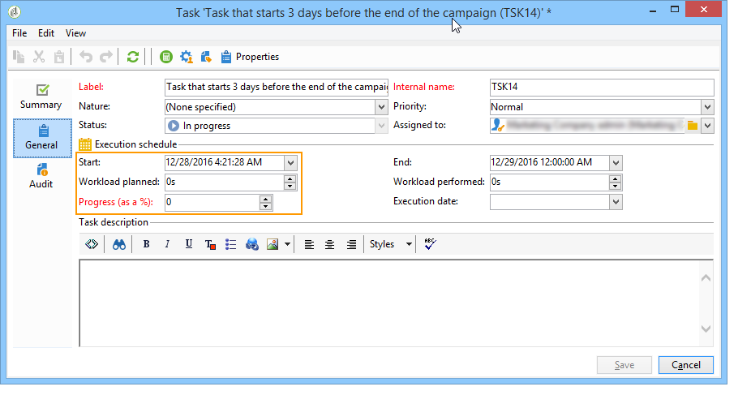

When you create a campaign using this template, the task start date will be calculated automatically. However, you can always change it later.
