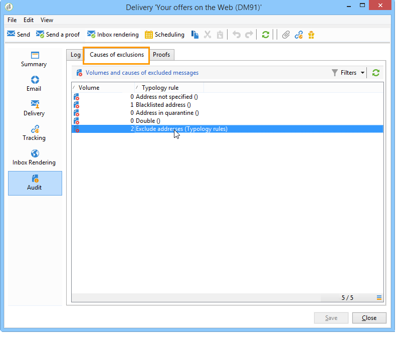
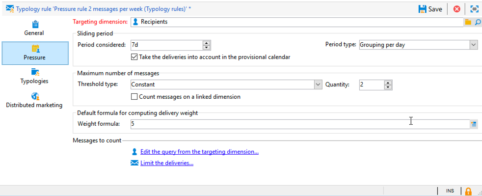

# Pressure rules{#pressure-rules}

## About marketing fatigue {#about-marketing-fatigue}

Implementing sales pressure management enables you to avoid over-soliciting the population in the database, also known as marketing fatigue. To do this, you can define a maximum number of messages per recipient. It also lets you implement arbitration rules between campaigns, in order to send the best message to the targeted audience.

**Pressure** rules, to manage marketing fatigue, for example, to restrict the number of letters to be sent to a population to two, to select the communication which best matches the interests of a group of subscribers, to avoid sending an SMS to a dissatisfied customer, etc.

Campaigns are selected based on defined thresholds and message weight.

* A threshold is the highest number of deliveries authorized for a given recipient within a given period. It can be either set or variable. It is set or calculated in the typology rule settings. Refer to [Maximum number of messages](#maximum-number-of-messages).
* Delivery weights let you identify top-priority deliveries within the framework of pressure management. Messages with the highest weight have priority. Refer to [Message weight](#message-weight).

Arbitration consists in making sure scheduled campaigns whose weight is greater than the campaign in progress won't lead to excessive profile solicitation: if this is the case, the profile is excluded from the delivery.

Arbitration criteria (message weight and/or threshold) can vary based on two types of information:

* recipient preference, which is declarative information: newsletter subscriptions, recipient status (customer or prospect), 
* recipient behavior: purchases, links visited, etc.

The arbitration rule for defining eligible messages is applied during the analysis stage. For each recipient and for the concerned period, the message will be sent if the following formula is true: **(number of messages sent) + (number of messages with a greater weight) < threshold**.

Otherwise, the recipient will be **[!UICONTROL Excluded by arbitration]**. For more on this, refer to [Exclusion after arbitration](#exclusion-after-arbitration).

## Creating a pressure rule {#creating-a-pressure-rule}

To set up arbitration between campaigns using Adobe Campaign, start by creating campaign typologies and defining linked typology rules (**Pressure** rules).

To create and configure a **[!UICONTROL Pressure]** typology rule, apply the following steps:

1. In the list of campaign typology rules, click the **[!UICONTROL New]** icon above the list.

   

1. In the **[!UICONTROL General]** tab of the new rule, select a **Pressure** type rule and enter a name and description for it.

   

1. Change the execution order if needed. When multiple typology rules are applied as a **[!UICONTROL Typology]** set, the lower ordered rules are applied first. For more on this, refer to [Execution order](../../campaign/using/applying-rules.md#execution-order).
1. In the **[!UICONTROL Calculation parameters]** section, define a frequency if you want to save targeting beyond the next daily re-arbitration execution. For more on this, refer to [Adjusting calculation frequency](../../campaign/using/applying-rules.md#adjusting-calculation-frequency).
1. Click the **[!UICONTROL Pressure]** tab and choose the calendar period during which the typology rule applies.

   

   The rule will be applied to deliveries whose contact date is included in the concerned period.

   >[!NOTE]
   >
   >Scheduled deliveries are only taken into account if the **[!UICONTROL Take the deliveries into account in the provisional calendar]** option is selected. For more on this, refer to [Setting the period](#setting-the-period).

1. Define the method for calculating the highest number of messages.

   The threshold represents the highest number of messages that can be sent to a recipient during the concerned period.

   By default, the threshold is constant and you need to indicate a maximum number of messages authorized by the rule.

   

   To define a variable threshold, select the **[!UICONTROL Depends on the recipient]** value in the **[!UICONTROL Type of threshold]** field and use the icon on the right to open the expression editor.

   

   For more on this, refer to [Maximum number of messages](#maximum-number-of-messages).

1. Specify the method for calculating delivery weight.

   Each delivery has a weight, i.e. a value which represents its priority level: this enables arbitration between campaigns. Weights are calculated using the formula defined in the typology rule and/or in its properties. For more on this, refer to [Message weight](#message-weight).

1. By default, all messages are taken into account for threshold calculation. The **[!UICONTROL Restriction]** tab lets you filter the messages concerned by the typology rule:

    * The upper section of this tab lets you restrict the concerned recipients.
    * The lower section of this tab lets you filter the messages to be counted.

      In the following example, only recipients saved in the **NewContacts** folder are taken into account and deliveries starting with **Newsletter** are concerned.

   

1. The **[!UICONTROL Typologies]** tab lets you view the campaign typologies which apply this rule or link the rule to one or more existing typologies. For more on this, refer to [Applying typologies](../../campaign/using/about-campaign-typologies.md#applying-typologies).

## Defining thresholds and weights {#defining-thresholds-and-weights}

### Maximum number of messages {#maximum-number-of-messages}

Each pressure rule defines a threshold, i.e. the maximum number of messages that can be sent to one recipient over a given time period. Once this threshold has been reached, no more deliveries can take place until the end of the period considered. This process lets you automatically exclude a recipient from a delivery if a message exceeds the set threshold, thus avoiding over-solicitation.

Threshold values can be either constant or calculated by a formula with variables. This means that for a given period, thresholds can vary from one recipient to another, or even for the same recipient. 

>[!CAUTION]
>
>Entering **0** as a threshold prevents all deliveries to the target population during the period considered.

**Example:**

You can index the number of authorized messages according to the segment to which the recipient belongs. This means that a recipient belonging to the web segment may receive more messages than other recipients. An **[!UICONTROL Iif (@origin='Web', 5, 3)]** type formula authorizes the delivery of 5 messages to recipients and 3 for other segments. Configuration will be as follows:

To define the threshold, you can use a dimension linked to the targeting dimension: for example, to include messages delivered to the recipient profiles stored in the visitors table (for more on the visitors table, refer to [this section](../../web/using/use-case--creating-a-refer-a-friend-form.md)) or to avoid sending more than one message per week to the same household, (which may refer to several email addresses) identified in a dimension linked to that of the recipients.

To do so, select the **[!UICONTROL Count messages on a linked dimension]** option, then select the visitor or the contact table.

### Message weight {#message-weight}

Each delivery has a weight which represents its level of priority. By default, the weight of a delivery is set to 5. Pressure rules let you define the weight of the deliveries which they will be applied to.

Weights can be either set or calculated via a formula to suit recipients. For example, you can define the weight of a delivery based on recipient interests.

>[!CAUTION]
>
>The weight defined in a typology rule can be overloaded individually for each delivery, in the **[!UICONTROL Properties]** tab. Click the **[!UICONTROL Typology]** tab to select the campaign typology and, if necessary, specify the weight to be applied.  
>However, the weight declared in an A typology rule won't be used for calculating a B typology rule: this weight will concern only deliveries that use the A rule.

**Example:**

In the following example, we want to link the weight of newsletters on music to the propensity score of their recipients. To do this:

1. Create a new field to store recipient propensity scores. The field, **@Music** in this case, will be enriched with answers to surveys and online polls, collected tracking data, etc.
1. Create a typology rule to calculate message weight based on this field.

   

1. Apply this rule to messages with the following topic: newsletters, special offers, etc. The weight of these deliveries, and therefore their level of priority, will depend on each recipients' propensity score.

## Setting the period {#setting-the-period}

Pressure rules are defined in **n**-day rolling periods.

The period is configured in the **[!UICONTROL Pressure]** tab of the rule. You can specify the number of days and, if necessary, select the type of grouping to apply (day, week, month, quarter, etc.).

The grouping type lets you extend the **[!UICONTROL Period considered]** field to the whole day, calendar week, calendar month or calendar year for dates for the period.

For example, a pressure rule which defines a threshold of 2 messages per week, with a grouping to each calendar month, will prevent the delivery of more than 2 messages within the same week AND within the same calendar month. Warning, if the period overlaps two months, the calculation threshold will take into account deliveries from these two calendar months and could therefore prevent all new deliveries during the second month.

>[!NOTE]
>
>By default, only deliveries already sent are taken into account when calculating the threshold. Check the **[!UICONTROL Take the deliveries into account in the provisional calendar]** option if you also want to consider the deliveries scheduled for the concerned period. In this case, the considered period is doubled to enable the integration of future deliveries as well as previous ones.  
>To restrict the deliveries taken into account to a 2-week period, you can either:  
>
>* Enter **15d** in the **[!UICONTROL Concerned period]** field: deliveries sent up to two weeks before the date of the delivery which the rule is applied to will be taken into account in the calculation,
>
>  or
>
>* Enter **7d** in the **[!UICONTROL Period considered]** field AND check the **[!UICONTROL Take the deliveries into account in the provisional calendar]**  
>option: deliveries sent up to 7 days before the delivery date and scheduled up to 7 days after the delivery date on which the rule is applied will be taken into account in the calculation.
>
>The period start date depends on how the database is configured.

For instance, if you apply a 15-day pressure rule without grouping to a delivery dated 12/11, deliveries will be taken into account between 11/27 and 12/12. If the pressure rule takes the deliveries in the provisional calendar into account, all deliveries scheduled between 11/27 and 12/27 will be taken into account. Finally, if you configure a grouping per calendar month in the rule, all deliveries in November and December will be taken into account for calculating the threshold (from 11/1 to 12/31).

>[!CAUTION]
>
>**Frequent cases** 
>To make sure that deliveries for the current calendar week are not taken into account, as well as not to risk also taking into account those from the previous week for the calculation threshold, specify the **[!UICONTROL Period considered]** at '0' and select 'Grouping per calendar week' as the **[!UICONTROL Period type]**. 
> 
>When a period is higher than 0 (1 for example), the calculation threshold may take the previous day's deliveries into account. Therefore, if the previous day corresponds to the previous calendar week and the period type selected is 'Grouping per calendar week', all of the previous week will then be taken into account for the calculation threshold.

**Example:**

We want to create a pressure rule which restricts solicitation to 3 messages per 2-week period, with a grouping to the calendar month.

Let's take 6 newsletters with the same weight, scheduled for 05/30, 06/3, 06/8, 06/12, 06/22 and 06/30. 

The deliveries scheduled for 12th and 30th of June will not be sent: the 06/12 delivery would exceed the threshold of 3 messages per 2-week period, and the 30th delivery would exceed the threshold of authorized communications per calendar month.

All recipients for these deliveries are excluded by arbitration during the analysis phase:

For the same rule, if you group deliveries per quarter, the recipients of **newsletter no.5** will also be excluded, and it will not be sent.

Finally, if no grouping is selected, only **newsletter no.4** will not be sent, since it was scheduled for the same 2-week period as the first three newsletters.

>[!NOTE]
>
>When you change the definition of a typology rule, you can create a **Simulation** to control its impact on the deliveries it is applied to and monitor the impact which the deliveries have on each other. For more on this, refer to [Campaign simulations](../../campaign/using/campaign-simulations.md).

## Exclusion after arbitration {#exclusion-after-arbitration}

Arbitration is re-applied every night via the **[!UICONTROL Forecasting]** technical workflow and the **[!UICONTROL Campaign jobs]** workflow.

The **[!UICONTROL Forecasting]** workflow pre-calculates the data for the period in progress (from its start date to the current date), which lets typology rules be applied during the analysis. It also re-calculates exclusion counters for arbitration every night.

Thus, for each recipient, Adobe Campaign checks that the number of messages to send does not exceed the threshold, taking into account the number of messages already sent for the concerned period. This information is an **indicator**, since all calculations are updated at the time of delivery.

If this number exceeds the threshold, the arbitration rules defined in the campaign typology are applied and recipients are excluded from campaigns with a lower weight.

>[!NOTE]
>
>If several deliveries have equal scores, the campaign scheduled for the earliest date will be sent.

## Use cases on pressure rules {#use-cases-on-pressure-rules}

### Adapting the threshold based on criterion {#adapting-the-threshold-based-on-criterion}

We want to create a typology rule to prevent the delivery of more than 4 messages per week to customers and 2 messages per week to prospects.

To identify customers and prospects, use the **[!UICONTROL Status]** field, which contains 0 for prospects and 1 for customers.

To create the rule, apply the following steps:

1. Create a new **Pressure** type typology rule.
1. Edit the **[!UICONTROL Pressure]** tab: in the **[!UICONTROL Maximum number of messages]** section, we want to create a formula to calculate the threshold depending on each recipient. Select the **[!UICONTROL Depends on the recipient]** value in the **[!UICONTROL Threshold type]** field, then click **[!UICONTROL Edit expression]** to the right of the **[!UICONTROL Formula]** field.

   Click the **[!UICONTROL Advanced parameters]** button to define the calculation formula.

   

1. Select the **[!UICONTROL Edit the formula using an expression]** option and click **[!UICONTROL Next]**.

   

1. In the list of functions, double-click the **Iif** function in the **[!UICONTROL Others]** node.

   Then select the recipients' **Status** in the **[!UICONTROL Available fields]** section.

   

   Enter the following formula: **Iif(@status=0,2,4)**

   

   This formula lets you assign the value 2 if the status equals 0, and the value 4 for all other statuses.

   Click **[!UICONTROL Finish]** to approve the formula. 

1. Indicate the period during which the rule will apply: 7 days in this case, to count the number of messages per week.

   

1. Save the rule to approve creation.

Now link the rule which you have just created to a typology in order to apply it to deliveries. To do this:

1. Create a campaign typology.
1. Go to the **[!UICONTROL Rules]** tab, click the **[!UICONTROL Add]** button and select the rule you have just created.

   

1. Save the typology: is it added to the list of existing typologies.

To use this typology in your deliveries, select it in the delivery properties, in the **[!UICONTROL Typology]** tab as shown below:

>[!NOTE]
>
>The typology can be defined in the delivery template, to be applied automatically to all deliveries created using this template.

During delivery analysis, delivery recipients are excluded from the delivery if applicable, depending on the number of deliveries already sent to them. To view this information, you can:

* View the analysis result:

  

* Edit the delivery and click the **[!UICONTROL Delivery]** tab and the **[!UICONTROL Exclusions]** sub-tab:

  

* Click the **[!UICONTROL Audit]** tab, then the **[!UICONTROL Causes of exclusions]** sub-tab to display the number of exclusions and the applied typology rules: 

  

### Calculating the delivery weight based on behavior {#calculating-the-delivery-weight-based-on-behavior}

You can define pressure rules based on recipient behavior: thus, the weight of a delivery can adapt to criteria which vary from one recipient to another. For instance, you can decide to send a message depending on whether or not a recipient visited your internet site, clicked in a specific section of the last newsletter, subscribed to an information service, or even based on answers to a survey, an online game, etc.

In the following example, we want to create a delivery with a weight of 5. This weight is enriched with propensity scores based on recipient behavior: customers who have already ordered from this site will have a score of 5, while customers who have never ordered online will have a score of 4.

To perform this type of configuration, you need to use a formula to define message weight. Information on propensity scores and survey answers must be accessible in the data model. In our example, the **Propensity** field has been added.

Apply the following configuration steps:

1. Create a new **Pressure** type typology rule.
1. Edit the **[!UICONTROL Pressure]** tab. We want to create a threshold formula which will be based on each individual recipient: click the **[!UICONTROL Edit expression]** icon to the right of the **[!UICONTROL Weight formula]** field.

   

1. By default, value **5** is shown in the upper section of the expression editor. We want to add the propensity score of each recipient to this weight: place your cursor to the right of the 5, enter the **+** character and select the **Propensity** field.

   

1. Then add a higher value for recipients who have already made a purchase. For them, the weight of the delivery must be increased by 5, while for others it increases by only 4.

   

1. Click **[!UICONTROL Finish]** to save this rule.
1. Link the rule to a campaign typology and reference this typology in a delivery to approve it.

### Sending only the highest-weighted messages {#sending-only-the-highest-weighted-messages}

You want to send no more than 2 messages within the same week, with a limit of 2 messages per day, to each of your recipients, and you only want the messages with higher weights to be delivered.

To do this, you need to schedule several deliveries with different weights for the same recipient and apply a pressure rule to exclude the deliveries with lower weights.

First, configure the pressure rule.

1. Create a pressure rule. For more on this, refer to [Creating a pressure rule](#creating-a-pressure-rule).
1. In the **[!UICONTROL General]** tab, select the **[!UICONTROL Re-apply the rule at the start of personalization]** option.

   

   This option overrules the value defined in the **[!UICONTROL Frequency]** field and automatically applies the rule during the personalization phase. For more on this, refer to [Adjusting calculation frequency](../../campaign/using/applying-rules.md#adjusting-calculation-frequency).

1. In the **[!UICONTROL Pressure]** tab, select **[!UICONTROL 7d]** as the **[!UICONTROL Period considered]** and **[!UICONTROL Grouping per day]** as the **[!UICONTROL Period type]**.
1. Select the **[!UICONTROL Take the deliveries into account in the provisional calendar]** option to include the scheduled deliveries.

   

   Deliveries sent up to 7 days before the delivery date and scheduled up to 7 days after the delivery date will be taken into account in the calculation. For more on this, refer to [Setting the period](#setting-the-period).

1. In the **[!UICONTROL Typologies]** tab, link the rule to a campaign typology.
1. Save your changes.

Now create and configure a workflow for each delivery you want the pressure rule to be applied on.

1. Create a campaign. For more on this, refer to [this section](../../campaign/using/setting-up-marketing-campaigns.md#creating-a-campaign).
1. In the **[!UICONTROL Targeting and workflows]** tab of your campaign, add a **Query** activity to your workflow. For more on using this activity, refer to [this section](../../workflow/using/query.md).
1. Add an **[!UICONTROL Email delivery]** activity to the workflow and open it. For more on using this activity, refer to [this section](../../workflow/using/delivery.md).
1. Go to the **[!UICONTROL Approvals]** tab of the **[!UICONTROL Delivery properties]** and disable all approvals.

   

1. In the **[!UICONTROL Typology]** tab of the **[!UICONTROL Delivery properties]**, reference the campaign typology to apply the rule on. Define a weight for the delivery.

   

1. In the delivery, click **[!UICONTROL Scheduling]** and select **[!UICONTROL Schedule delivery (automatic execution when the scheduled date is reached)]**. In this example, select the **[!UICONTROL Use a calculation formula]** option.
1. Set the extraction date to 10 minutes (current date + 10 minutes).
1. Set the contact date to the next day (current date + 1 day).

   

   For the pressure rule exclusions to be implemented successfully, make sure you set the extraction date and time before the contact date and time, as well as before the nightly arbitration is re-applied. For more on this, refer to [Exclusion after arbitration](#exclusion-after-arbitration).

1. Unselect the **[!UICONTROL Confirm the delivery before sending]** option and save your changes.
1. Proceed similarly for each delivery you want to send. Make sure you set the desired weight for each delivery.
1. Run the relevant workflows to prepare and send the deliveries.

When the nightly arbitration is applied, the deliveries with the lower weights for the same recipient will be excluded. Only the deliveries with the highest weight will be considered for send. For more on this, refer to [Message weight](#message-weight).

Considering that an email has already been sent to the concerned recipients earlier during the week, the table below shows an example of the configurations that can be applied for two more deliveries.

<table> 
 <thead> 
  <tr> 
   <th> Delivery  </th> 
   <th> Approvals  </th> 
   <th> Weight  </th> 
   <th> Extraction date/time  </th> 
   <th> Contact date  </th> 
   <th> Delivery start date/time  </th> 
   <th> Arbitration workflow execution date/time  </th> 
   <th> Delivery status  </th> 
   <th> Delivery sent (date/time)  </th> 
  </tr> 
 </thead> 
 <tbody> 
  <tr> 
   <td> Delivery 1  </td> 
   <td> Disabled  </td> 
   <td> 5  </td> 
   <td> 3pm  </td> 
   <td> 8am (next day)  </td> 
   <td> 2pm  </td> 
   <td> Nightly  </td> 
   <td> Excluded  </td> 
   <td> Excluded  </td> 
  </tr> 
  <tr> 
   <td> Delivery 2  </td> 
   <td> Disabled  </td> 
   <td> 10  </td> 
   <td> 4pm  </td> 
   <td> 9am (next day)  </td> 
   <td> 2pm  </td> 
   <td> Nightly  </td> 
   <td> Sent  </td> 
   <td> 9am (next day)  </td> 
  </tr> 
 </tbody> 
</table>

After the extraction date is past for the two deliveries, the nightly arbitration is re-applied before the contact dates of both deliveries. This enables to find all deliveries already sent (recipients for whom a delivery is processed, recorded through the broad logs) or scheduled to be sent (recipients eligible to receive a delivery, recorded through the forecast logs).

Once all sent and potential deliveries have been listed for the period defined in the pressure rule, Adobe Campaign sorts them by weight, with the highest weighted first. When the threshold set in the pressure rule is reached (here no more than 2 emails within the same week), the recipients are excluded from the delivery.
