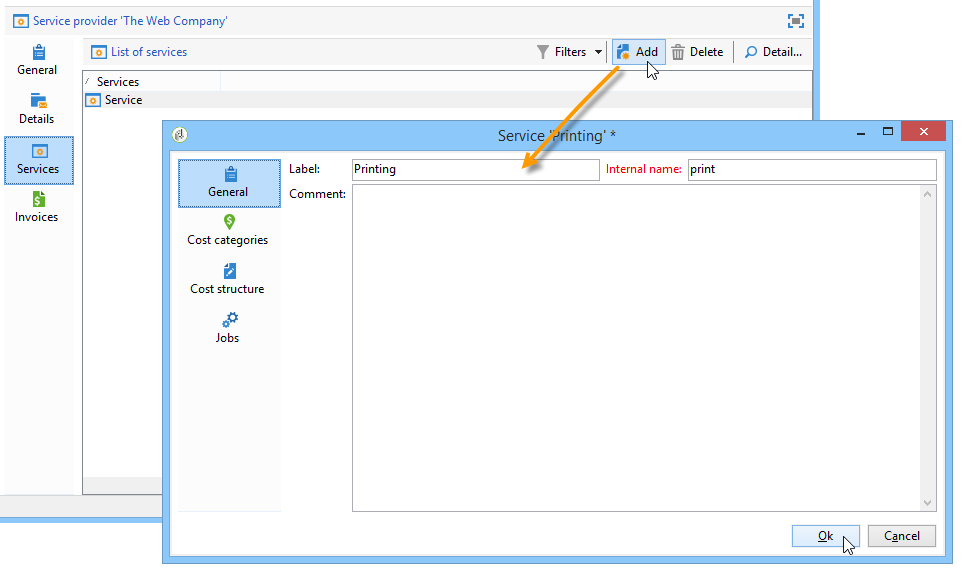
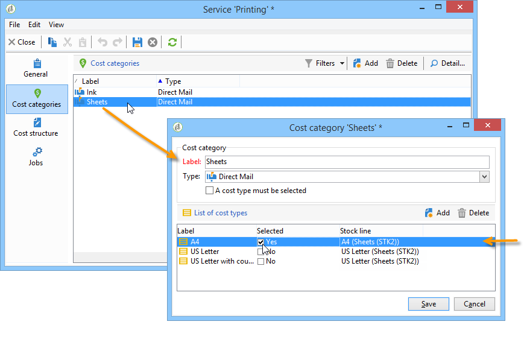
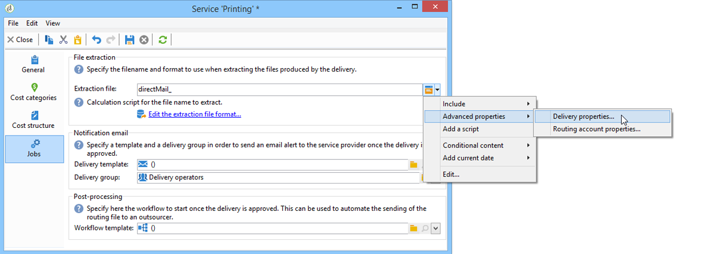

# Providers, stocks and budgets{#providers-stocks-and-budgets}

Adobe Campaign lets you define service providers who will be involved in the jobs carried out within the campaigns. Information concerning the service providers and the related cost structures are defined by the Adobe Campaign administrator from the main view. The service provider is referenced from the delivery, and its cost structures allow the calculation of costs associated with this delivery as well as the management of the stock concerned.

## Creating service providers and their cost structures {#creating-service-providers-and-their-cost-structures}

Each service provider is saved in a file with contact details, service templates, and related jobs.

Service providers are configured in the **[!UICONTROL Administration > Campaign management]** node of the tree.

The jobs carried out during deliveries are performed by service providers, particularly for direct mail and mobile channels. These service providers can, for example, be involved in printing or distributing messages. These jobs involve configurations and costs which are specific to each service provider. The configuration of service providers involves four stages:

1. Creation of a service provider in Adobe Campaign

   See [Adding a service provider](#adding-a-service-provider).

1. Defining cost categories and structures of associated service templates

   See [Defining cost categories](#defining-cost-categories) and [Defining the cost structure](#defining-the-cost-structure).

1. Configuration of processes

   See [Configuring processes associated with a service](#configuring-processes-associated-with-a-service).

1. Referencing the service provider at the campaign level

   See [Associating a service with a campaign](#associating-a-service-with-a-campaign).

### Creating a service provider and its cost categories {#creating-a-service-provider-and-its-cost-categories}

#### Adding a service provider {#adding-a-service-provider}

You can create as many service providers as necessary for your deliveries. The procedure for adding a service provider is as follows:

1. Right-click the list of service providers and select **[!UICONTROL New]**, or click the **[!UICONTROL New]** button above the list of service providers.
1. In the lower section of the window, specify the name and contact details of the service provider.

   

1. Click the **[!UICONTROL Save]** button to add the service provider to the list.

#### Defining cost categories {#defining-cost-categories}

You must associate service templates with each service provider. In these templates, you must first identify the cost categories and if necessary the stock concerned. You must then create the cost calculation rules for each category, via the cost structures.

>[!NOTE]
>
>For more on this, refer to [Defining the cost structure](#defining-the-cost-structure).

A cost category is an entity containing a set of costs eligible for a type of delivery (email, direct mail, etc.) or for a task. Cost categories are grouped in the templates of services associated with the service providers. Each service provider can reference one or more service templates.

To create a service template and define its content, apply the following steps:

1. In the **[!UICONTROL Services]** tab of the service provider, click the **[!UICONTROL Add]** button and name the service template.

   

1. Create the cost categories for each type of process (delivery by direct mail/e-mail/etc. or task). To do this, click the **[!UICONTROL Cost categories]** tab and then the **[!UICONTROL Add]** button, and enter the parameters of each cost category.

   

    * Enter a label for this cost category and select the type of process concerned: Delivery by **[!UICONTROL Direct mail]**, **[!UICONTROL E-mail]**, **[!UICONTROL Mobile]**, **[!UICONTROL Telephone]** or **[!UICONTROL Task]**. 
    * Click the **[!UICONTROL Add]** button to define the types of cost associated with this category.
    * If necessary, associated a stock line with each type of cost so that the quantities used will be related automatically to the existing stocks.

      >[!NOTE]
      >
      >The stock lines are defined in the **[!UICONTROL Stock management]** node.   
      >For more on this, refer to [Stock and order management](#stock-and-order-management).

1. You can pre-select a value for this cost category, which will be offered by default in the service provider cost categories (instead of a blank). To do this, select the option in the **[!UICONTROL Selected]** column for the type of category concerned:

   

   At the delivery level, the value will be selected by default:

   

### Defining the cost structure {#defining-the-cost-structure}

For each type of cost, a cost structure specifies the calculation rules to be applied.

Click the **[!UICONTROL Cost structure]** tab to configure the cost calculation for each cost category and type. Click **[!UICONTROL Add]** and input the cost structure.

* To create the cost structure, select the type of message and the cost category concerned from the drop-down lists, as well as the type of cost to which the calculation rule will apply. The content of these drop-down lists comes from the information entered via the **[!UICONTROL Cost categories]** tab.

  You must assign a label to the cost structure. By default, it has the following delivery outline: **Cost category - Type of cost**.

  You can, however, rename it: enter the desired value directly in the **[!UICONTROL Label]** field.

* The cost calculation formula is defined in the lower section of the window.

  This formula can be fixed (for any number of messages) or calculated according to the number of messages.

  When it depends on the number of messages, the cost calculation structure can be **[!UICONTROL Linear]**, **[!UICONTROL Linear by threshold]**, or **[!UICONTROL Constant by threshold]**.

#### Linear structure {#linear-structure}

If the amount is always the same for a message (or a batch of messages) irrespective of the total number of messages, select **[!UICONTROL Linear]** and enter the cost of each message.

If this amount applies to a batch of messages, specify the number of messages concerned in the **[!UICONTROL for]** field. 

#### Linear structure by threshold {#linear-structure-by-threshold}

If the amount applies by threshold for each message, you must define a **[!UICONTROL Linear by threshold]** calculation structure. In this type of cost structure, each message will cost 0.13, for example, if the total number of messages is between 1 and 100, and will cost 0.12 from 100 to 1000 messages sent, or 0.11 beyond 1000 messages.

The configuration will be as follows: 

To add a threshold, click the **[!UICONTROL Add]** button to the right of the list.

#### Constant structure by threshold {#constant-structure-by-threshold}

Finally, you can configure a cost calculation according to the total number of messages. To do this, select a **[!UICONTROL Constant by threshold]** calculation structure. For example, the cost will be set at a fixed amount of 12.00 for 1 to 100 messages, and at 100.00 for a delivery of 101 to 1000 messages, and 500.00 for any delivery over 1000 messages, whatever the total number. 

### Configuring processes associated with a service {#configuring-processes-associated-with-a-service}

You can associate information on the processes associated with the service via the **[!UICONTROL Processes]** tab.

To do this, click the **[!UICONTROL Processes]** tab to configure the sending of information to the router.

* The **[!UICONTROL File extraction]** section indicates the export template used for delivery when this service is selected. You can indicate the name of the output file in the **[!UICONTROL Extraction file]** field. The button to the right of the field lets you insert variables.

  

* The **[!UICONTROL Notification e-mail]** section lets you specify the template to notify service providers after files have been sent. Select the template used to create the alert message and the group of recipients.

  By default, delivery templates for notification messages are saved in the **[!UICONTROL Administration > Campaign management > Technical delivery templates]** node, which is accessible from the general view.

* The **[!UICONTROL Post-processing]** section lets you select the workflow to launch after the delivery has been approved. If a workflow template is entered, a workflow instance will automatically be created and then launched as soon as approval takes effect. This workflow can send the extraction file to an external service provider for processing, for example.

### Associating a service with a campaign {#associating-a-service-with-a-campaign}

Services are associated with campaigns via deliveries or tasks. Service providers are linked to delivery templates to offer their services in the deliveries created via this template.

When a service is selected, the cost categories corresponding to the type of delivery (direct mail, e-mail, etc.) are automatically indicated in the central table along with the processing options which have been defined.

>[!NOTE]
>
>If no cost category is displayed when a service is selected, it means that no cost category was defined for this type of process. For example, for an email delivery, if no **[!UICONTROL E-mail]** type cost category has been defined, no category will be displayed, and selecting the service will have no effect.

* For a direct mail delivery, you can select the service from the configuration window.

  

* For delivery on mobile channels or telephone, the same selection mode applies.
* For an email delivery, the service is selected from the **[!UICONTROL Advanced]** tab in the delivery properties, as in the following example:

  

The **[!UICONTROL Amount to surcharge]** column lets you add a cost for this category in the context of the delivery or task concerned.

You can impose mandatory selection of a cost type during the definition of cost categories for a delivery. To do this, select **[!UICONTROL A cost type must be selected]**.

## Stock and order management {#stock-and-order-management}

Cost types can be associated with stock lines in order to handle alerts, track supplies, and launch orders.

The procedure for setting up stock and order management in Adobe Campaign, and alerting operators in the event of insufficient supplies for a delivery to be carried out, is as follows:

1. Stock creation and referencing of associated service providers

   See [Creating a stock](#creating-a-stock).

1. Adding stock lines

   See [Adding stock lines](#adding-stock-lines).

1. Notifying operators in the event of an alert

   See [Alerting operators](#alerting-operators).

1. Orders and supply.

   Refer to [Orders](#orders).

### Stock management {#stock-management}

Adobe Campaign can alert a group of operators if stock has run out or reached a minimum threshold. Stock levels are accessible via the **[!UICONTROL Stocks]** link of the **[!UICONTROL Campaigns]** tab via the **[!UICONTROL Other choices]** link of the navigation area. 

#### Creating a stock {#creating-a-stock}

Apply the following steps to create a new stock:

1. Click the **[!UICONTROL Create]** button above the list of stocks.
1. Enter the label of the stock and select the service provider with which it is associated from the drop-down list.

   

   >[!NOTE]
   >
   >For more on this, refer to [Creating service providers and their cost structures](#creating-service-providers-and-their-cost-structures).

#### Adding stock lines {#adding-stock-lines}

A stock comprises various stock lines. A stock line contains an initial quantity of resources which will be consumed by deliveries. Each stock line indicates the quantity consumed, the quantity in stock, and the quantity ordered.

When you create a stock, click the **[!UICONTROL Stock lines]** tab to add new lines.

Once the stock is created, click it to edit and use its dashboard to create and view stock lines.

Click the **[!UICONTROL Create]** button to define the stock parameters. 

* Indicate the quantity initially in stock in the **[!UICONTROL Initial stock]** field. The **[!UICONTROL Consumed]** and **[!UICONTROL In stock]** fields are calculated automatically and updated as campaigns progress.

  

* Indicate the threshold from which operators should be alerted to order stock in the **[!UICONTROL Alert level]** field. When the alert level if reached, a warning message is displayed in the approval window of deliveries using this stock.

#### Associating a stock with cost categories {#associating-a-stock-with-cost-categories}

For a given service provider, in a service, a stock line can be referenced by one of the cost categories, as follows:

### Stock tracking {#stock-tracking}

#### Alerting operators {#alerting-operators}

An alert is displayed when a stock referenced in a delivery is insufficient. For example, the following alert will be displayed when an extraction file is approved:

#### Orders {#orders}

The **[!UICONTROL Orders]** sub-tab lets you view current orders and save new orders.

To save an order, edit the targeted stock line, click the **[!UICONTROL Add]** button and specify the delivery date and the quantity ordered.

>[!NOTE]
>
>Once the delivery date is reached, the ordered stock line disappears automatically and the quantity entered in the **[!UICONTROL Volume on order]** field is added to the **[!UICONTROL Tracking]** tab. This quantity is automatically added to the stock volume.

The **[!UICONTROL Consumptions]** tab contains the volume consumed per campaign. The information from this tab is automatically entered according to the deliveries performed. Click the **[!UICONTROL Edit]** button to open the campaign concerned.

## Calculating budgets {#calculating-budgets}

### Principle {#principle}

Costs are managed for deliveries and campaign. According to the progress, these costs are allocated to the budgets.

The delivery costs for a campaign are consolidated at the campaign level and the costs of all campaigns of a program are passed on to the program with which they are associated. Dedicated reports let you track the budgets for the entire platform or for each plan and each program.

### Implementation {#implementation}

In a campaign, when you select the budget you must enter the initial amount. The calculated costs will be updated automatically according to the commitment level of the amounts entered (expenses made, expected, reserved, committed). See [Calculating amounts](../../mrm/using/controlling-costs.md#calculating-amounts).

>[!NOTE]
>
>The procedure for creating budgets is presented in [Creating a budget](../../mrm/using/controlling-costs.md#creating-a-budget).
