# Get started with marketing campaigns{#setting-up-marketing-campaigns}

Campaigns include actions (deliveries) and processes (importing or extracting files), as well as resources (marketing documents, delivery outlines). They are used in marketing campaigns. Campaigns are part of a program, and programs are included in a campaign plan.

 Discover how to create a marketing plan, programs, and campaigns [in video](#video)

To create a marketing campaign:

1. Create a campaign: discover campaigns and their characteristics: label, type, start and end dates, budget, associated resources, manager(s) and participants. [Learn more](#creating-a-campaign).

1. Define target population(s): create a workflow with targeting queries. [Learn more](../../campaign/using/marketing-campaign-deliveries.md#selecting-the-target-population).

1. Create deliveries: select channel(s) and define the content to be sent. [Learn more](../../campaign/using/marketing-campaign-deliveries.md#creating-deliveries).

1. Approve deliveries. [Learn more](../../campaign/using/marketing-campaign-approval.md).

1. Monitor deliveries. [Learn more](../../campaign/using/marketing-campaign-monitoring.md).

1. Plan campaigns and associated costs. [Learn more](../../campaign/using/providers--stocks-and-budgets.md#creating-service-providers-and-their-cost-structures).

When these steps have been completed, you can start the deliveries (refer to [this section](../../campaign/using/marketing-campaign-deliveries.md#starting-a-delivery)), check the data, processes and information relating to the deliveries and, if necessary, manage the associated documents (refer to [this section](../../campaign/using/marketing-campaign-deliveries.md#managing-associated-documents)). You can also track the execution of the processing phases of campaigns and deliveries (refer to [this section](../../campaign/using/marketing-campaign-monitoring.md)).

## Create plan and program hierarchy {#creating-plan-and-program-hierarchy}

To configure your folder hierarchy for marketing plans and programs:

1. Click the **Explorer** icon on the home page.
1. Right-click the folder in which you want to create your plan.
1. Select **Add new folder > Campaign Management > Plan**.

   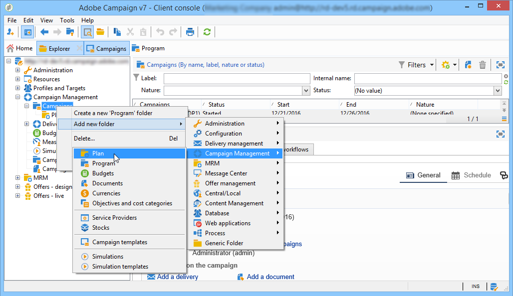

1. Rename the plan.
1. Right-click the newly created plan and select **Properties...**.

   

1. In the **General** tab, modify the **Internal name** to avoid duplicates during package exports.
1. Click **Save**.
1. Right-click the newly created plan and select **Create a new 'Program' folder**. 
1. Repeat the above steps to rename your new program folder and its internal name.

## Create a campaign {#creating-a-campaign}

### Add a campaign {#adding-a-campaign}

You can create a campaign via the list of campaigns. To display this view, select the **[!UICONTROL Campaigns]** menu in the **[!UICONTROL Campaigns]** dashboard.

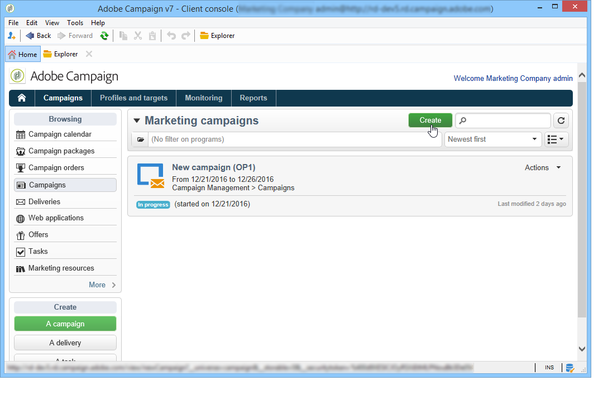

The **[!UICONTROL Program]** field lets you select the program to which the campaign will be attached. This information is mandatory.

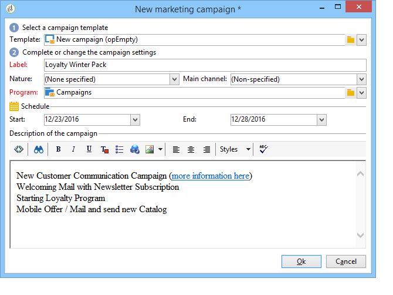

Campaigns can also be created via a program. To do this, click the **[!UICONTROL Add]** button in the **[!UICONTROL Schedule]** tab of the concerned program.

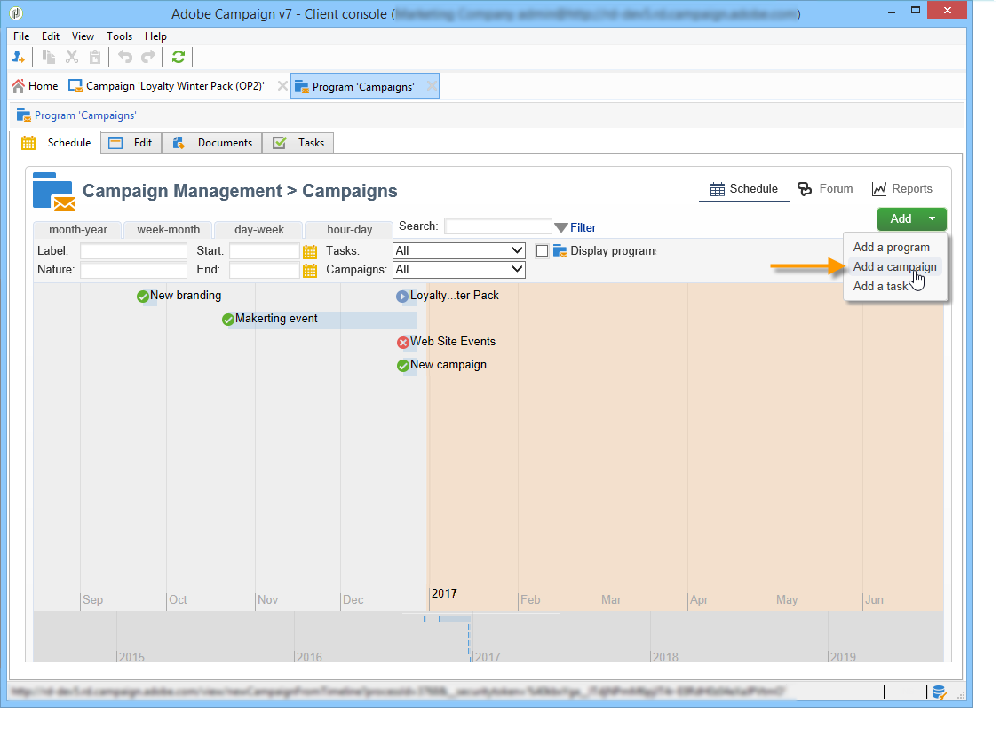

When you create a campaign via the **[!UICONTROL Schedule]** tab of a program, the campaign is automatically linked to the concerned program. The **[!UICONTROL Program]** field is hidden in this case.

In the campaign creation window, select the campaign template and add a name and a description of the campaign. You can also specify the campaign start and end dates.

Click **[!UICONTROL OK]** to create the campaign. It is added to the program schedule.

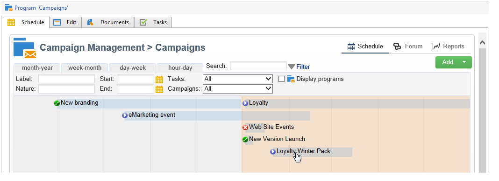

>[!NOTE]
>
>To filter the campaigns to display, click the **[!UICONTROL Filter]** link and select the status of campaigns to display.

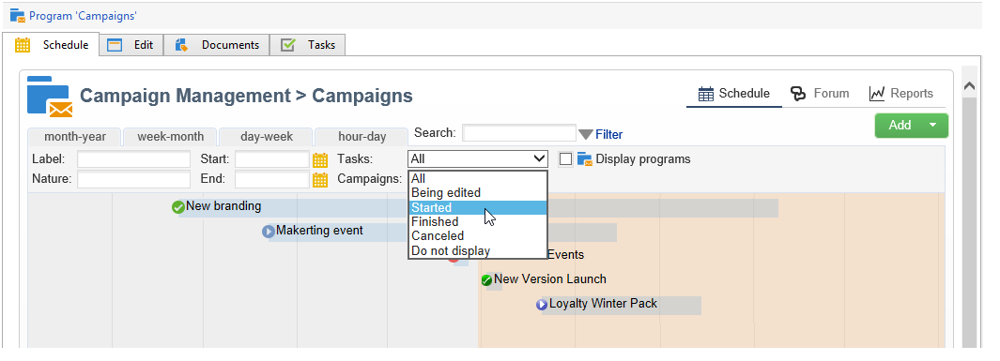

### Edit and configure a campaign {#editing-and-configuring-a-campaign}

You can then edit the campaign you have just created and define its parameters.

To open and configure a campaign, select it from the schedule and click **[!UICONTROL Open]**.

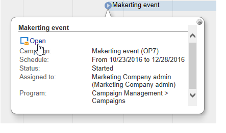

This takes you to the campaign dashboard.

## Recurring and periodic campaigns {#recurring-and-periodic-campaigns}

A recurring campaign is a campaign based on a specific template, whose workflows are configured to be executed according to an associated schedule. The workflows will therefore be recurring within a campaign. The targeting is duplicated on each execution and the various processes and target populations are tracked. It is also possible to execute future targetings in advance, via the coverage period during automatic workflow creation, in order to launch simulations with target estimates.

A periodic campaign is a campaign created automatically according to the execution schedule of its template.

### Create a recurring campaign {#creating-a-recurring-campaign}

Recurring campaigns are created from a specific template defining the workflow template to be executed and the execution schedule.

#### Create a template for recurring campaigns {#creating-the-campaign-template}

1. Create a **[!UICONTROL Recurring]** campaign template.

    >[!NOTE]
    >
    >It is recommended that you duplicate the default template instead of creating an empty template.

    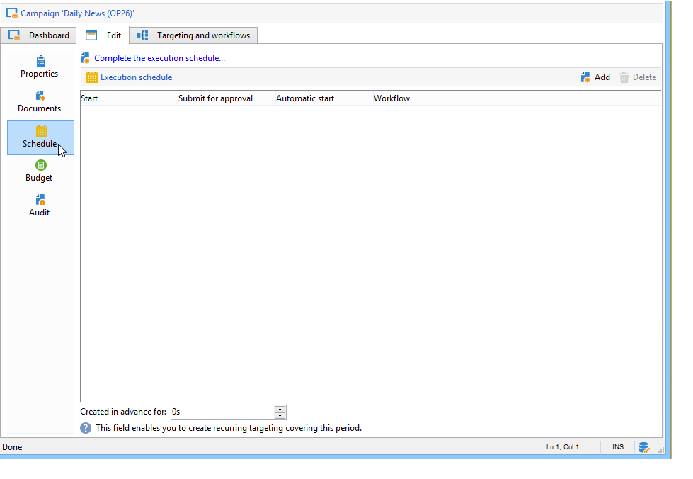 

1. Enter the name of the template and the duration of the campaign.

    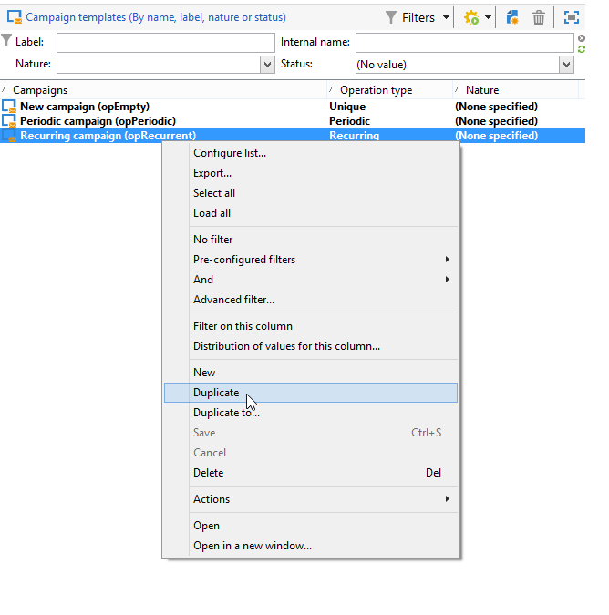

1. For this type of campaign, a **[!UICONTROL Schedule]** tab is added in order to create the template execution schedule.

  In this tab, specify the planned execution dates of the campaigns based on this template.

  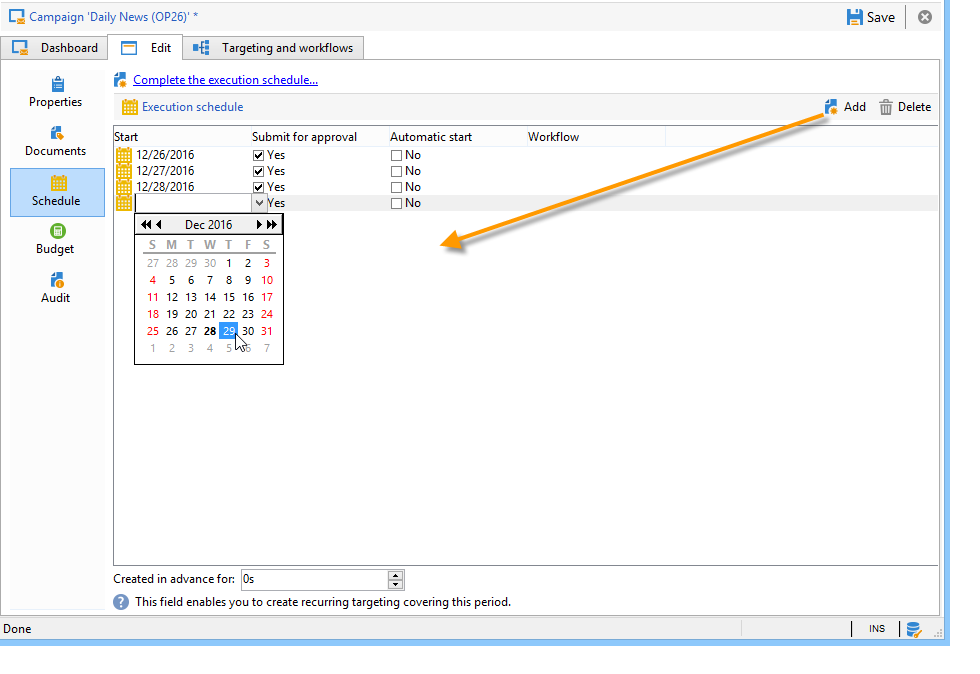

  The configuration mode of the execution schedule coincides with the **[!UICONTROL Scheduler]** object of the Workflow. For more on this, refer to [this section](../../workflow/using/architecture.md).

  >[!IMPORTANT]
  >
  >Execution schedule configuration must be performed carefully to avoid overloading the database. Recurring campaigns duplicate the workflow(s) of their template depending on the specified schedule. The implementation of excessively frequent workflow creation can hinder the operation of the database.

1. Specify a value in the **[!UICONTROL Create in advance for]** field in order to create the corresponding workflows for the period indicated.
1. Create the workflow template to be used in campaigns based on this template, with the targeting parameters and one or more generic deliveries.

    >[!NOTE]
    >
    >This workflow must be saved as a recurring workflow template. To do this, edit the workflow properties and select the **[!UICONTROL Recurring workflow template]** option in the **[!UICONTROL Execution]** tab.

    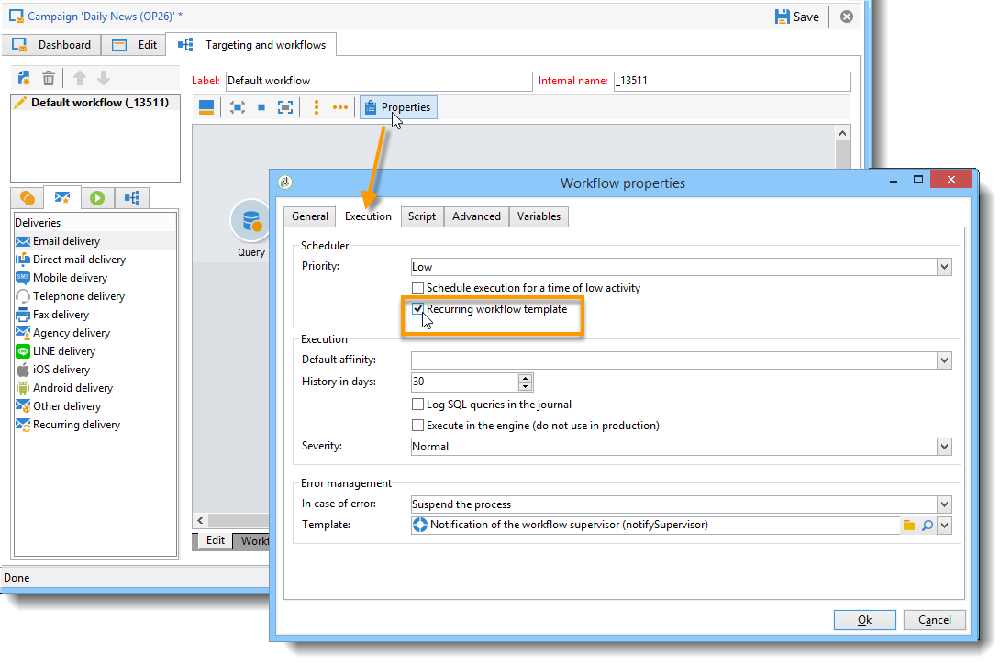

#### Create the recurring campaign {#create-the-recurring-campaign}

To create the recurring campaign and execute its workflows according to the schedule defined in the template, apply the following procedure:

1. Create a new campaign based on a recurring campaign template.
1. Fill in the workflow execution schedule.

   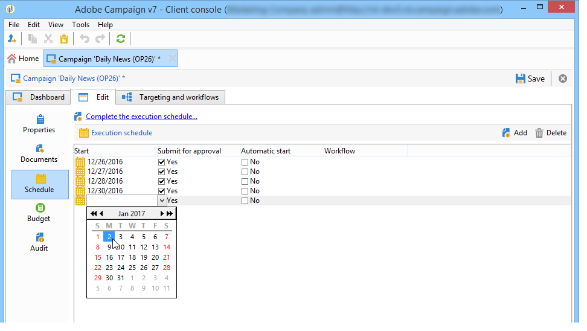

1. The campaign schedule lets you enter an automatic workflow creation or execution start date for each line.

   For each line, you can add the following additional options:

    * **[!UICONTROL To be approved]** : lets you force the delivery approval requests in the workflow.
    * **[!UICONTROL To be started]** : lets you start the workflow when the start date has been reached.

   The **[!UICONTROL Create in advance for]** field lets you create all the workflows covering the period entered.

   Upon execution of the **[!UICONTROL Jobs on campaigns]** workflow, the dedicated workflows are created based on the occurrences defined in the campaign schedule. A workflow is thus created for each execution date.

1. Recurring workflows are created automatically from the workflow template present in the campaign. They are visible from the **[!UICONTROL Targeting and workflows]** tab of the campaign. 

   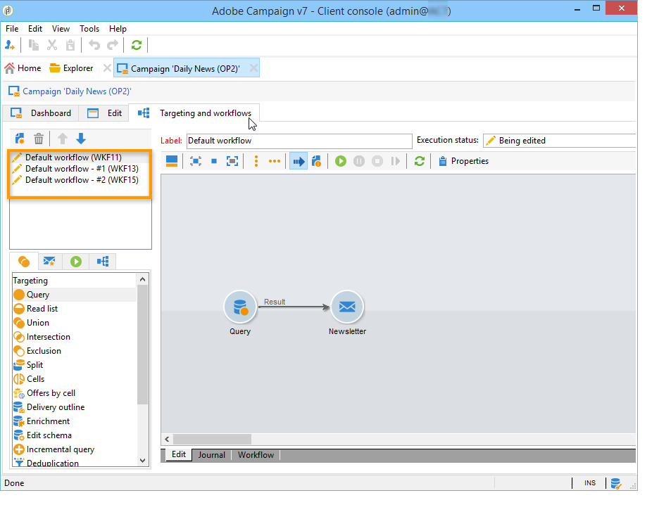

   The label of a recurring workflow instance consists of its template label and the workflow number, with the # character in between.

   Workflows created from the schedule are automatically associated with it in the **[!UICONTROL Workflow]** column of the **[!UICONTROL Schedule]** tab. 

   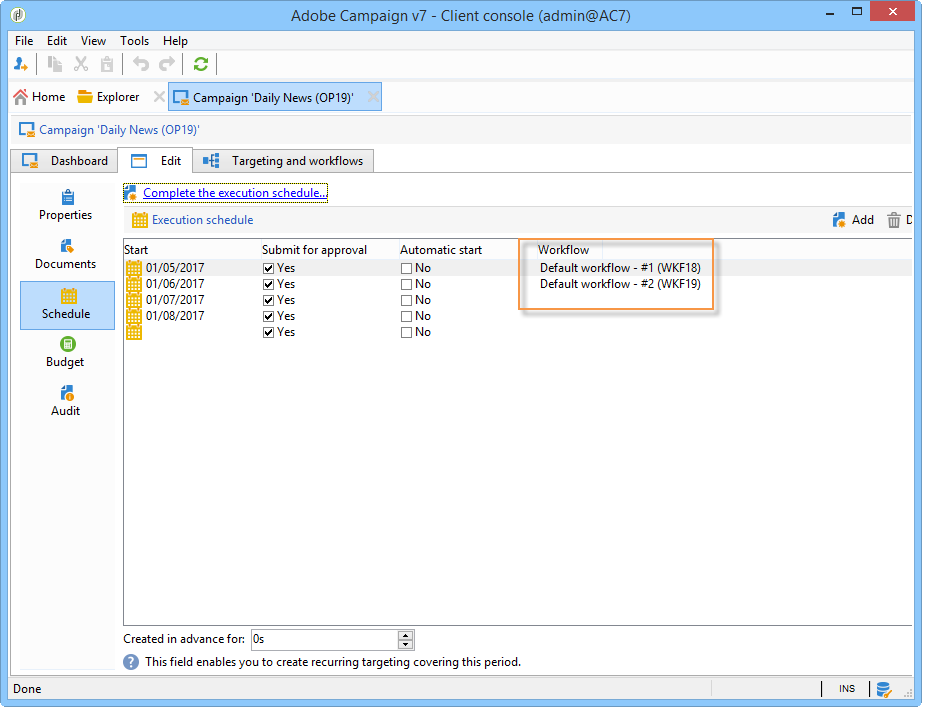

   Each workflow can be edited from this tab.

   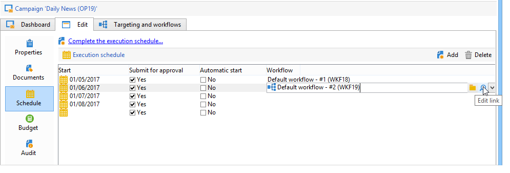

   >[!NOTE]
   >
   >The start date of the schedule line associated with the workflow is available from a variable of the workflow with the following syntax:   
   >`$date(instance/vars/@startPlanningDate)`

### Create a periodic campaign {#creating-a-periodic-campaign}

A periodic campaign is a campaign based on a specific template that lets you create campaign instances based on an execution schedule. Campaign instances are created automatically based on a periodic campaign template, depending on the frequency defined in the template schedule.

#### Create the campaign template {#creating-the-campaign-template-1}

1. Create a **[!UICONTROL Periodic]** campaign template, preferably by duplicating an existing campaign template.

    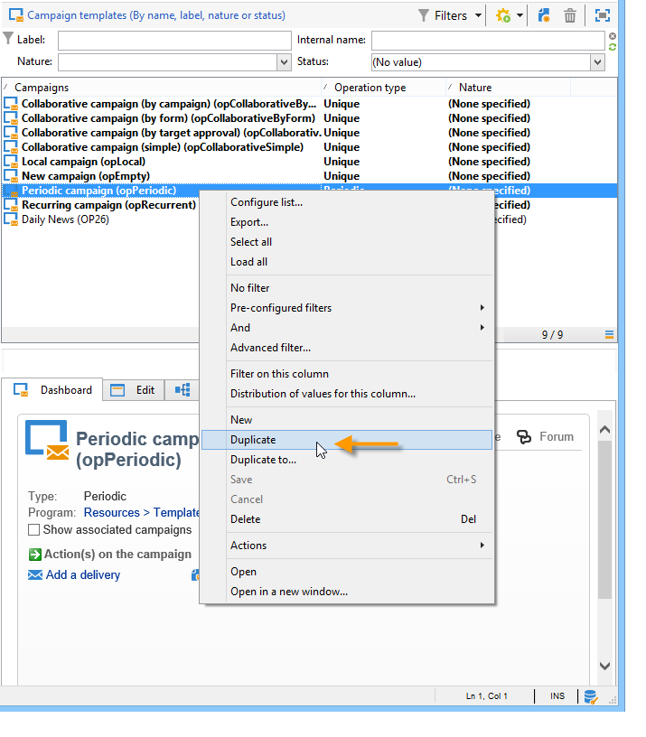

1. Enter the properties of the template.

     >[!NOTE]
     >
     >The operator whom the template is assigned to needs to have the appropriate rights to create campaigns in the selected program.

1. Create the workflow associated with this template. It will be duplicated in every periodic campaign created by the template.

    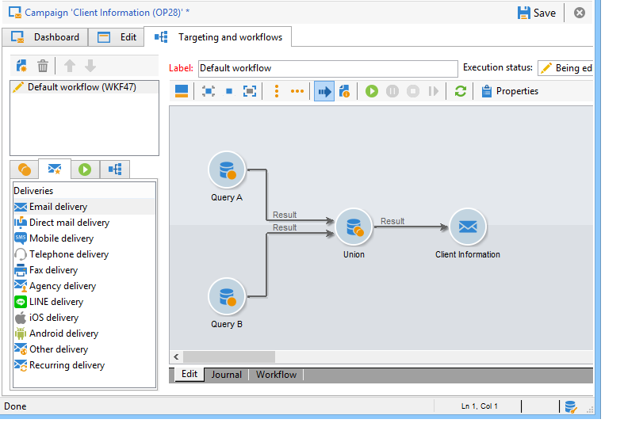

      >[!NOTE]
      >
      >This workflow is a workflow template. It cannot be executed from the campaign template.

1. Complete its execution schedule as for a recurring campaign template: click the **[!UICONTROL Add]** button and define the start and end dates, or fill in the execution schedule via the link.

    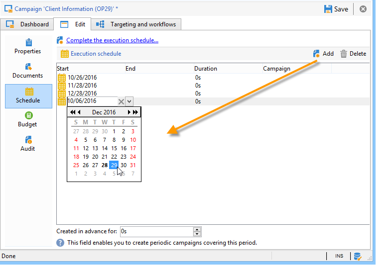

      >[!IMPORTANT]
      >
      >Periodic campaign templates create new campaigns according to the schedule defined above. It must therefore be completed carefully, to avoid overloading the Adobe Campaign database.

1. Once the execution start date is reached, the matching campaign is created automatically. It takes on all the characteristics of its template.

      Each campaign can be edited via the template schedule.

    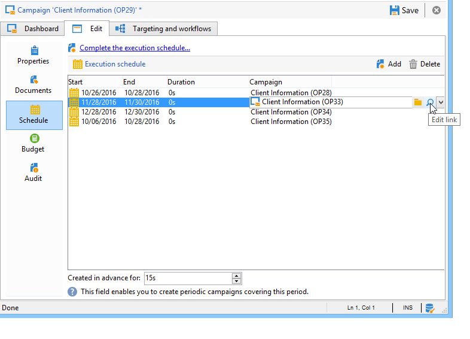

  Each periodic campaign contains the same elements. Once created, it is managed as a standard campaign.

## Tutorial video {#video}

This video shows how to create a marketing plan, programs, and campaigns.

>[!VIDEO](https://video.tv.adobe.com/v/35132?quality=12)

Additional Campaign how-to videos are available [here](https://experienceleague.adobe.com/docs/campaign-classic-learn/tutorials/overview.html).
