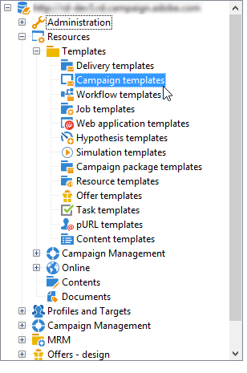
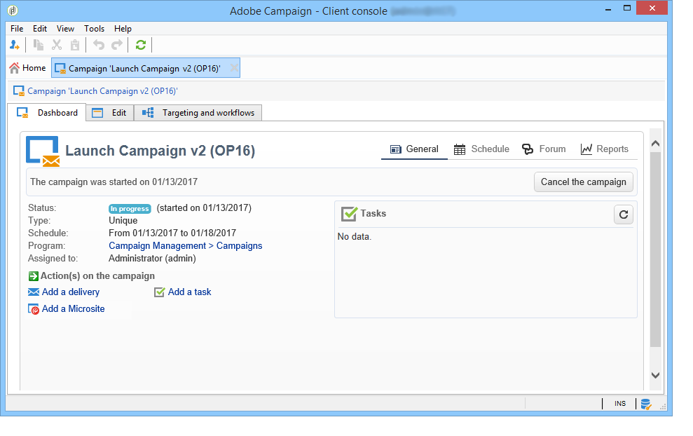

# Setting up marketing campaigns{#setting-up-marketing-campaigns}

## Overview {#overview}

Campaigns include actions (deliveries) and processes (importing or extracting files), as well as resources (marketing documents, delivery outlines). They are used in marketing campaigns. Campaigns are grouped together in a program, and programs are included in a campaign plan.

The steps to create a marketing campaign are as follows:

1. Creating a campaign: description of the campaign and its characteristics: label, type, start and end dates, budget, associated resources, manager(s) and participants.

   See [Creating a campaign](../../campaign/using/setting-up-marketing-campaigns.md#creating-a-campaign).

1. Defining target population(s): creating a workflow with targeting queries.

   See [Selecting the target population](../../campaign/using/marketing-campaign-deliveries.md#selecting-the-target-population).

1. Creating deliveries: choice of channel(s) and defining the content to be sent.

   See [Creating deliveries](../../campaign/using/marketing-campaign-deliveries.md#creating-deliveries).

1. Checking and approving deliveries.

   Refer to [Approval process](../../campaign/using/marketing-campaign-approval.md#approval-process).

1. Planning campaigns and associated costs.

   See [Creating service providers and their cost structures](../../campaign/using/providers--stocks-and-budgets.md#creating-service-providers-and-their-cost-structures).

When these steps have been completed, you can start the deliveries (see [Starting a delivery](../../campaign/using/marketing-campaign-deliveries.md#starting-a-delivery)), check the data, processes and information relating to the deliveries and, if necessary, manage the associated documents (see [Managing associated documents](../../campaign/using/marketing-campaign-deliveries.md#managing-associated-documents)). You can also track the execution of the processing phases of campaigns and deliveries (see [Tracking](../../campaign/using/marketing-campaign-monitoring.md#tracking)).

## Creating plan and program hierarchy {#creating-plan-and-program-hierarchy}

To configure your folder hierarchy for marketing plans and programs, follow these steps:

1. Click the **Explorer** icon on the home page.
1. Right-click the folder in which you want to create your plan.
1. Select **Add new folder > Campaign Management > Plan**.

   

1. Rename the plan.
1. Right-click the newly created plan and select **Properties...**.

   

1. In the **General** tab, modify the **Internal name** to avoid duplicates during package exports.
1. Click **Save**.
1. Right-click the newly created plan and select **Create a new 'Program' folder**. 
1. Repeat the above steps to rename your new program folder and its internal name.

## Creating a campaign {#creating-a-campaign}

### Configuring a campaign template {#configuring-a-campaign-template}

Campaigns are based on models that group together a set of predefined parameters.

In a default configuration, the campaign templates are centralized in the **[!UICONTROL Resources > Templates > Campaign templates]** node of the Adobe Campaign tree.

>[!NOTE]
>
>The tree is displayed when you click the **[!UICONTROL Explorer]** icon on the home page.

An empty template is supplied out of the box in order to create a campaign for which no specific configuration has been defined. You can create and configure your campaign templates and then create campaigns from these templates.

The creation and configuration of campaign templates are presented in [Campaign templates](../../campaign/using/setting-up-marketing-campaigns.md#campaign-templates).

For more on campaign creation, refer to the [Creating a campaign and an email](https://docs.campaign.adobe.com/doc/AC/en/Videos/Videos.html) video.

### Adding a campaign {#adding-a-campaign}

You can create a campaign via the list of campaigns. To display this view, select the **[!UICONTROL Campaigns]** menu in the **[!UICONTROL Campaigns]** dashboard.

The **[!UICONTROL Program]** field lets you select the program to which the campaign will be attached. This information is mandatory.

Campaigns can also be created via a program. To do this, click the **[!UICONTROL Add]** button in the **[!UICONTROL Schedule]** tab of the concerned program.

When you create a campaign via the **[!UICONTROL Schedule]** tab of a program, the campaign is automatically linked to the concerned program. The **[!UICONTROL Program]** field is hidden in this case.

The campaign creation window lets you choose the campaign template and name and describe the campaign. You can also specify the campaign start and end dates.

Click **[!UICONTROL OK]** to create the campaign. It is added to the program schedule.

>[!NOTE]
>
>To filter the campaigns to display, click the **[!UICONTROL Filter]** link and select the status of campaigns to display.

### Editing and configuring a campaign {#editing-and-configuring-a-campaign}

You can then edit the campaign you have just created and define its parameters.

To open and configure a campaign, select it from the schedule and click **[!UICONTROL Open]**.

This takes you to the campaign dashboard.

## Campaign templates {#campaign-templates}

Campaign templates are centralized in the **[!UICONTROL Resources > Templates > Campaign templates]** node. A default template is supplied as standard. It lets you create a new campaign using all the available modules (Documents, Tasks, Seed addresses, etc.), but the modules offered depend on your rights and the configuration of your Adobe Campaign platform.

### Creating or duplicating a campaign template {#creating-or-duplicating-a-campaign-template}

To create a new template, carry out the following steps:

1. Open Campaign **Explorer**.
1. In **Resources > Templates > Campaign templates**, click **New** in the toolbar above the list of templates. 

   

1. Enter the label of your new campaign template.
1. Click **Save** and reopen your template.
1. In the **Edit** tab, enter the **Internal name** and other values, if needed.
1. Select **Advanced campaign settings** to add a workflow to your campaign template.

   

1. Change the **Targeting and workflows** value to **Yes**.

   

1. In the **Targeting and workflows** tab, click **Add a workflow...**.

   

1. Complete the **Label** field and click **Ok**.
1. Create your workflow according to your requirements.
1. Click **Save**. Your template is now ready to be used in a campaign.

You can also duplicate the default template to re-use and adapt its configuration.

The various tabs and sub-tabs of the campaign template allow you to access its settings, described in [General configuration](../../campaign/using/setting-up-marketing-campaigns.md#general-configuration).

### Configuration of the available modules {#configuration-of-the-available-modules}

#### Module selection {#module-selection}

The **[!UICONTROL Advanced campaign settings...]** link lets you enable and disable jobs for the campaigns based on this template. Select the functions you want to enable in the campaigns created based on this template.

If a functionality is not selected, the elements concerning the process (menus, icons, options, tabs, sub-tabs, etc.) will not appear in the interface of the template or in campaigns based on this template. The tabs to the left of the campaign details usually coincide with the processes selected in the template. For example, if **Expenses and objectives** is not selected, the corresponding **[!UICONTROL Budget]** tab will not be shown in campaigns based on this template.

Moreover, shortcuts to the configuration windows are added to the campaign dashboard. When a functionality is enabled, a direct link gives access to it from the campaign dashboard.

For example, with the configuration below:

The following links are displayed in the campaign dashboard (the **[!UICONTROL Add a task]** link is missing):

An only the following tabs will be displayed:

However, with this type of configuration:

The following links and tabs will be displayed: 

#### Typology of enabled modules {#typology-of-enabled-modules}

* **Control group**

  When this module is selected, an additional tab is added to the advanced settings of the template and the campaigns based on this template. The configuration can be defined via the template or individually for each campaign.

  

* **Seed addresses**

  When this module is selected, an additional tab is added to the advanced settings of the template and the campaigns based on this template. The configuration can be defined via the template or individually for each campaign.

  

* **Documents**

  When this module is selected, an additional tab is added to the **[!UICONTROL Edition]** tab of the template and the campaigns based on this template. Attached documents can be added from the template or individually for each campaign.

  

* **Outline**

  When this module is selected, a **[!UICONTROL Delivery outlines]** sub-tab is added to the **[!UICONTROL Documents]** tab in order to define delivery outlines for the campaign.

  

* **Targeting and workflows**

  When you select the **[!UICONTROL Targeting and workflows]** module, a tab is added to let you create one or more workflows for campaigns based on this template. Workflows can also be configured individually for each campaign based on this template.

  

  When this module is enabled, a tab is added to the advanced settings of the campaign to define the process execution sequence.

  

* **Approval**

  If you select the **[!UICONTROL Approval]**, you can select the processes to approve as well as the operators in charge of approvals.

  

* **Expenditures and targets**

  When this module is selected, a **[!UICONTROL Budget]** tab is added to the details of the template and campaigns based on this template so that the associated budget can be selected.

  

#### Approval of jobs {#approval-of-jobs}

You may choose whether or not to enable process approval via the **[!UICONTROL Approvals]** tab of the templates advanced settings section. The jobs for which approval is selected must be approved for message delivery to be authorized.

You must associate a reviewer operator or group of operators to each enabled approval.

### General configuration {#general-configuration}

#### Template properties {#template-properties}

When you create a campaign template, you need to enter the following information:

* Enter the **label** of the template: this label will be assigned by default to all campaigns created via this template.
* Select the campaign **nature** from the drop-down list. The values available in this list are those saved in the **[!UICONTROL natureOp]** enumeration.

  >[!NOTE]
  >
  >For more information on enumerations, refer to the [Getting Started](../../platform/using/managing-enumerations.md) section.

* Select the **type of campaign**: unique, recurring, or periodic. By default, campaign templates apply to unique campaigns. Recurring and periodic campaigns are detailed here: [Recurring and periodic campaigns](../../campaign/using/setting-up-marketing-campaigns.md#recurring-and-periodic-campaigns).
* Specify the duration of the campaign, i.e. the number of days over which the campaign will take place. When creating a campaign based on this template, the campaign start and end dates will be populated automatically.

  If the campaign is recurrent, you must specify the campaign start and end dates directly in the template. 

* Specify the **related program** of the template: campaigns based on this template will be linked to the selected program.

#### Template execution parameters {#template-execution-parameters}

The **[!UICONTROL Advanced campaign settings...]** link lets you configure the advanced options of the template for processing the delivery target (control group, seed addresses, etc.) and the configuration of campaign measurement and workflow execution.

### Campaign reverse scheduling {#campaign-reverse-scheduling}

You can create a reverse schedule for a campaign, for instance to prepare an event whose date is known in advance. Campaign templates now let you calculate the start date of a task based on the end date of a campaign.

In the task configuration box, go to the **[!UICONTROL Implementation schedule]** area and check the **[!UICONTROL The start date is calculated based on the campaign end date]** box. (Here, "start date" is the task start date). Go to the **[!UICONTROL Start]** field and enter an interval: the task will start this long before the campaign end date. If you enter a period which is longer than the campaign is set to last, the task will begin before the campaign.

When you create a campaign using this template, the task start date will be calculated automatically. However, you can always change it later.

## Recurring and periodic campaigns {#recurring-and-periodic-campaigns}

A recurring campaign is a campaign based on a specific template, whose workflows are configured to be executed according to an associated schedule. The workflows will therefore be recurring within a campaign. The targeting is duplicated on each execution and the various processes and target populations are tracked. It is also possible to execute future targetings in advance, via the coverage period during automatic workflow creation, in order to launch simulations with target estimates.

A periodic campaign is a campaign created automatically according to the execution schedule of its template.

### Creating a recurring campaign {#creating-a-recurring-campaign}

Recurring campaigns are created from a specific template defining the workflow template to be executed and the execution schedule.

#### Creating the campaign template {#creating-the-campaign-template}

* Create a **[!UICONTROL Recurring]** campaign template.

  >[!NOTE]
  >
  >It is recommended that you duplicate the default template instead of creating an empty template.

    

* Enter the name of the template and the duration of the campaign.

  

* For this type of campaign, a **[!UICONTROL Schedule]** tab is added in order to create the template execution schedule.

  In this tab, specify the planned execution dates of the campaigns based on this template.

  

  You can use the schedule creation wizard to fill in all of the execution dates automatically. To do this, click the **[!UICONTROL Complete the execution schedule...]** link located above the table.

  

  The configuration mode of the execution schedule coincides with the **[!UICONTROL Scheduler]** object of the Workflow. For more on this, refer to [this section](../../workflow/using/executing-a-workflow.md#architecture).

  >[!CAUTION]
  >
  >Execution schedule configuration must be performed carefully to avoid overloading the database. Recurring campaigns duplicate the workflow(s) of their template depending on the specified schedule. The implementation of excessively frequent workflow creation can hinder the operation of the database.

* Specify a value in the **[!UICONTROL Create in advance for]** field in order to create the corresponding workflows for the period indicated.
* Create the workflow template to be used in campaigns based on this template, with the targeting parameters and one or more generic deliveries.

  >[!CAUTION]
  >
  >This workflow must be saved as a recurring workflow template. To do this, edit the workflow properties and select the **[!UICONTROL Recurring workflow template]** option in the **[!UICONTROL Execution]** tab.

   

#### Create the recurring campaign {#create-the-recurring-campaign}

To create the recurring campaign and execute its workflows according to the schedule defined in the template, apply the following procedure:

1. Create a new campaign based on a recurring campaign template.
1. Fill in the workflow execution schedule.

   

1. The campaign schedule lets you enter an automatic workflow creation or execution start date for each line.

   For each line, you can add the following additional options:

    * **[!UICONTROL To be approved]** : lets you force the delivery approval requests in the workflow
    * **[!UICONTROL To be started]** : lets you start the workflow when the start date has been reached.

   The **[!UICONTROL Create in advance for]** field lets you create all the workflows covering the period entered.

   Upon execution of the **[!UICONTROL Jobs on campaigns]** workflow, the dedicated workflows are created based on the occurrences defined in the campaign schedule. A workflow is thus created for each execution date.

1. Recurring workflows are created automatically from the workflow template present in the campaign. They are visible from the **[!UICONTROL Targeting and workflows]** tab of the campaign. 

   

   The label of a recurring workflow instance consists of its template label and the workflow number, with the # character in between.

   Workflows created from the schedule are automatically associated with it in the **[!UICONTROL Workflow]** column of the **[!UICONTROL Schedule]** tab. 

   

   Each workflow can be edited from this tab.

   

   >[!NOTE]
   >
   >The start date of the schedule line associated with the workflow is available from a variable of the workflow with the following syntax:   
   >`$date(instance/vars/@startPlanningDate)`

### Creating a periodic campaign {#creating-a-periodic-campaign}

A periodic campaign is a campaign based on a specific template that lets you create campaign instances based on an execution schedule. Campaign instances are created automatically based on a periodic campaign template, depending on the frequency defined in the template schedule.

#### Creating the campaign template {#creating-the-campaign-template-1}

* Create a **[!UICONTROL Periodic]** campaign template, preferably by duplicating an existing campaign template.

  

* Enter the properties of the template.

  >[!CAUTION]
  >
  >The operator whom the template is assigned to needs to have the appropriate rights to create campaigns in the selected program.

* Create the workflow associated with this template. It will be duplicated in every periodic campaign created by the template.

  

  >[!NOTE]
  >
  >This workflow is a workflow template. It cannot be executed from the campaign template.

* Complete its execution schedule as for a recurring campaign template: click the **[!UICONTROL Add]** button and define the start and end dates, or fill in the execution schedule via the link.

  

  >[!CAUTION]
  >
  >Periodic campaign templates create new campaigns according to the schedule defined above. It must therefore be completed carefully, to avoid overloading the Adobe Campaign database.

* Once the execution start date is reached, the matching campaign is created automatically. It takes on all the characteristics of its template.

  Each campaign can be edited via the template schedule.

  

  Each periodic campaign contains the same elements. Once created, it is managed as a standard campaign.

