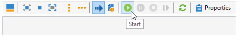
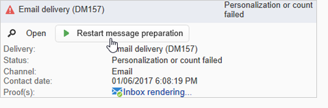
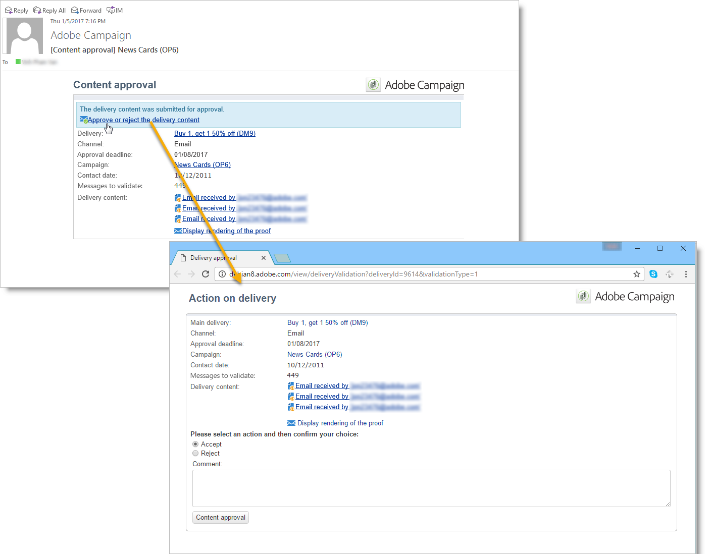
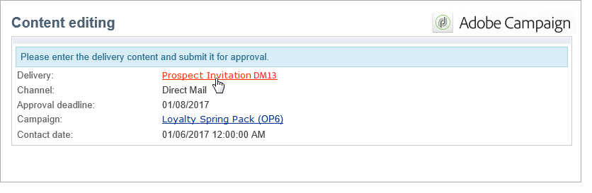

# Setting up marketing campaigns{#setting-up-marketing-campaigns}

## Overview {#overview}

Campaigns include actions (deliveries) and processes (importing or extracting files), as well as resources (marketing documents, delivery outlines). They are used in marketing campaigns. Campaigns are grouped together in a program, and programs are included in a campaign plan.

The steps to create a marketing campaign are as follows:

1. Creating a campaign: description of the campaign and its characteristics: label, type, start and end dates, budget, associated resources, manager(s) and participants.

   See [Creating a campaign](../../campaign/using/setting-up-marketing-campaigns.md#creating-a-campaign).

1. Defining target population(s): creating a workflow with targeting queries.

   See [Selecting the target population](../../campaign/using/setting-up-marketing-campaigns.md#selecting-the-target-population).

1. Creating deliveries: choice of channel(s) and defining the content to be sent.

   See [Creating deliveries](../../campaign/using/setting-up-marketing-campaigns.md#creating-deliveries).

1. Checking and approving deliveries.

   Refer to [Approval process](../../campaign/using/setting-up-marketing-campaigns.md#approval-process).

1. Planning campaigns and associated costs.

   See [Creating service providers and their cost structures](../../campaign/using/providers--stocks-and-budgets.md#creating-service-providers-and-their-cost-structures).

When these steps have been completed, you can start the deliveries (see [Starting a delivery](../../campaign/using/setting-up-marketing-campaigns.md#starting-a-delivery)), check the data, processes and information relating to the deliveries and, if necessary, manage the associated documents (see [Managing associated documents](../../campaign/using/setting-up-marketing-campaigns.md#managing-associated-documents)). You can also track the execution of the processing phases of campaigns and deliveries (see [Tracking](../../campaign/using/setting-up-marketing-campaigns.md#tracking)).

## Creating plan and program hierarchy {#creating-plan-and-program-hierarchy}

To configure your folder hierarchy for marketing plans and programs, follow these steps:

1. Click the **Explorer** icon on the home page.
1. Right-click the folder in which you want to create your plan.
1. Select **Add new folder > Campaign Management > Plan**.

   

1. Rename the plan.
1. Right-click the newly created plan and select **Properties...**.

   

1. In the **General** tab, modify the **Internal name** to avoid duplicates during package exports.
1. Click **Save**.
1. Right-click the newly created plan and select **Create a new 'Program' folder**. 
1. Repeat the above steps to rename your new program folder and its internal name.

## Creating a campaign {#creating-a-campaign}

### Configuring a campaign template {#configuring-a-campaign-template}

Campaigns are based on models that group together a set of predefined parameters.

In a default configuration, the campaign templates are centralized in the **[!UICONTROL Resources > Templates > Campaign templates]** node of the Adobe Campaign tree.

>[!NOTE]
>
>The tree is displayed when you click the **[!UICONTROL Explorer]** icon on the home page.

An empty template is supplied out of the box in order to create a campaign for which no specific configuration has been defined. You can create and configure your campaign templates and then create campaigns from these templates.

The creation and configuration of campaign templates are presented in [Campaign templates](../../campaign/using/setting-up-marketing-campaigns.md#campaign-templates).

For more on campaign creation, refer to the [Creating a campaign and an email](https://docs.campaign.adobe.com/doc/AC/en/Videos/Videos.html) video.

### Adding a campaign {#adding-a-campaign}

You can create a campaign via the list of campaigns. To display this view, select the **[!UICONTROL Campaigns]** menu in the **[!UICONTROL Campaigns]** dashboard.

The **[!UICONTROL Program]** field lets you select the program to which the campaign will be attached. This information is mandatory.

Campaigns can also be created via a program. To do this, click the **[!UICONTROL Add]** button in the **[!UICONTROL Schedule]** tab of the concerned program.

When you create a campaign via the **[!UICONTROL Schedule]** tab of a program, the campaign is automatically linked to the concerned program. The **[!UICONTROL Program]** field is hidden in this case.

The campaign creation window lets you choose the campaign template and name and describe the campaign. You can also specify the campaign start and end dates.

Click **[!UICONTROL OK]** to create the campaign. It is added to the program schedule.

>[!NOTE]
>
>To filter the campaigns to display, click the **[!UICONTROL Filter]** link and select the status of campaigns to display.

### Editing and configuring a campaign {#editing-and-configuring-a-campaign}

You can then edit the campaign you have just created and define its parameters.

To open and configure a campaign, select it from the schedule and click **[!UICONTROL Open]**.

This takes you to the campaign dashboard.

## Creating deliveries {#creating-deliveries}

Deliveries can be created via the campaign dashboard, a campaign workflow or directly via the overview of deliveries.

To create a delivery linked to a campaign, click the **[!UICONTROL Add a delivery]** link in the campaign dashboard.

The suggested configurations are suited to the different types of delivery (direct mail, email, mobile channels, fax, or telephone). 

>[!NOTE]
>
>For more on creating and configuring deliveries, refer to the [Sending Messages](../../delivery/using/communication-channels.md) section.

### Creating a recurring delivery in a targeting workflow {#creating-a-recurring-delivery-in-a-targeting-workflow}

In the following workflow, we are going to create a recurring delivery so that every day an email is sent to all recipients whose birthday it is.

To do this, create a campaign and click the **[!UICONTROL Targeting and workflows]** tab. For more on this, refer to the [Building the main target in a workflow](../../campaign/using/setting-up-marketing-campaigns.md#building-the-main-target-in-a-workflow) section.

Then follow these steps:

1. Drag and drop a **Query** activity and configure it so that it collects the recipients whose birthday is the current date.
1. Add a **Recurring delivery** activity based on the birthday email template that you want to send.

   

1. Finally, add a **Scheduler** to trigger sending the delivery every day. In the example below, the delivery is created every day at 6am.

   

   You can then start the workflow.

   

For more information, a detailed example of this workflow is presented in [this section](../../workflow/using/sending-a-birthday-email.md).

>[!CAUTION]
>
>For the workflows to execute, the technical workflows relating to the campaign process must be started. For more on this, refer to the [List of campaign process workflows](../../campaign/using/setting-up-marketing-campaigns.md#list-of-campaign-process-workflows) section.
>   
>If the approval steps are enabled for the campaign, the deliveries will only be sent once these steps have been confirmed. For more on this, refer to the [Choosing the processes to be approved](../../campaign/using/setting-up-marketing-campaigns.md#choosing-the-processes-to-be-approved) section.

## Selecting the target population {#selecting-the-target-population}

For each delivery, the campaign manager will define:

* The main target. For more on this, refer to [Building the main target in a workflow](../../campaign/using/setting-up-marketing-campaigns.md#building-the-main-target-in-a-workflow) and [Selecting the target population](../../campaign/using/setting-up-marketing-campaigns.md#selecting-the-target-population).
* The control group. For more on this, refer to [Defining a control group](../../campaign/using/setting-up-marketing-campaigns.md#defining-a-control-group).
* The seed addresses. For more on this, refer to [this section](../../delivery/using/about-seed-addresses.md).

Some of this information is inherited from the template.

>[!NOTE]
>
>Campaign templates are presented in [Campaign templates](../../campaign/using/setting-up-marketing-campaigns.md#campaign-templates).

### Selecting the target population {#selecting-the-target-population-1}

To build the delivery target, you can define filtering criteria for the recipients in the database. This recipient selection mode is presented in the [Sending Messages](../../delivery/using/identifying-target-populations.md) section.

#### Example: delivering to a group of recipients {#example--delivering-to-a-group-of-recipients}

You can import a population into a list, then target this list in deliveries.

To do this, edit the concerned delivery and click the **[!UICONTROL To]** link to change the targeted population.

In the **[!UICONTROL Main target]** tab, select the **[!UICONTROL Defined via the database]** option and click **[!UICONTROL Add]** to select recipients.

Choose **[!UICONTROL A list of recipients]** and click **[!UICONTROL Next]** to select it.

### Building the main target in a workflow {#building-the-main-target-in-a-workflow}

The main target of a delivery can also be defined in the targeting workflow: this graphical environment lets you build a target using queries, tests and operators: union, deduplication, sharing, etc.

The [Automating with workflows](../../workflow/using/executing-a-workflow.md#architecture) guide includes a detailed description of how the workflow module operates.

>[!CAUTION]
>
>In the same campaign, you cannot set up more than 28 workflows. Past this limit, additional workflows are not visible in the interface and can generate errors.

#### Creating a targeting workflow {#creating-a-targeting-workflow}

Targeting can be created via a combination of filtering conditions in a graphical sequence in a workflow. You can create populations and sub-populations which will be targeted according to your requirements. To display the workflow editor, click the **[!UICONTROL Targeting and workflows]** tab in the campaign dashboard.

The target population is extracted from the Adobe Campaign database via one or more queries placed in a workflow. To learn how to build a query, refer to [this section](../../workflow/using/designing-queries.md).

You can launch queries and share populations via boxes such as Union, Intersection, Sharing, Exclusion, etc.

Select the objects from the lists to the left of the workspace and link them to construct the target.

In the diagram, link up the targeting and scheduling queries required for target construction in the diagram. You can execute the targeting while construction is in progress in order to check the population extracted from the database.

>[!NOTE]
>
>Exemples and procedure for defining queries are presented in [this section](../../workflow/using/designing-queries.md).

The left-hand section of the editor contains a library of graphical objects representing activities. The first tab contains the targeting activities, and the second tab contains the flow-control activities, which are used occasionally to coordinate targeting activities.

The targeting workflow execution and formatting functions are accessible via the diagram editor toolbar.

>[!NOTE]
>
>The activities available to build the diagram as well as all display and layout features are detailed in the [Automating with workflows](../../workflow/using/executing-a-workflow.md#architecture) guide.

You can create several targeting workflows for a single campaign. To add a workflow:

1. Go to the upper left-hand section of the workflow creation zone, right-click, and select **[!UICONTROL Add]**. You can also use the **[!UICONTROL New]** button located above this zone.

   

1. Select the **[!UICONTROL New workflow]** template and name this workflow.
1. Click **[!UICONTROL OK]** to confirm creation of the workflow, and then create the diagram for this workflow.

#### Executing a workflow {#executing-a-workflow}

Targeting workflows can be launched manually via the **[!UICONTROL Start]** button in the toolbar, provided that you have the appropriate rights.

The targeting can be programmed for automatic execution according to a schedule (scheduler) or an event (external signal, file import, etc.).

The actions related to executing the targeting workflow (launch, stop, pause, etc.) are **asynchronous** processes: the command is saved and will take effect as soon as the server is available to apply it.

The toolbar icons let you take action concerning the execution of the targeting workflow.

* Start or restart

    * The **[!UICONTROL Start]** icon lets you launch the targeting workflow. When you click on this icon, all activities without an input transition are activated (except end point jumps).
    
      

      The server takes the request into account, as shown by its status:
    
      

      The process status changes to **[!UICONTROL Started]**.
    
    * You can restart the targeting workflow via the appropriate toolbar icon. This command may be useful if the **[!UICONTROL Start]** icon is not available, for example when targeting workflow stopping is in progress. In this case, click the **[!UICONTROL Restart]** icon to anticipate the restart. The server takes the request into account, as its status shows:
    
      

      The process then enters **[!UICONTROL Started]** status.

* Stop or pause

    * The toolbar icons let you stop or pause a targeting workflow in progress.

      When you click **[!UICONTROL Pause]**, operations in progress **[!UICONTROL are not]** paused, but no other activity is launched until the next restart.
    
      

      The server takes the command into account, as its status shows: 
    
      

      You can also pause a targeting workflow automatically when its execution reaches a particular activity. To do this, right-click the activity from which targeting workflow is to be paused, and select **[!UICONTROL Enable but do not execute]**. 
    
      

      This configuration is shown by a special icon.
    
      

      >[!NOTE]
      >
      >This option is useful during advanced targeting campaign design and test phases.

      Click **[!UICONTROL Start]** to resume execution.
    
    * Click the **[!UICONTROL Stop]** icon to stop the execution in progress.
    
      

      The server takes the command into account, as its status shows: 
    
      

  You can also stop a targeting workflow automatically when the execution reaches an activity. To do this, right-click the activity from which targeting workflow will be stopped, and select **[!UICONTROL Do not activate]**. 

  

  

  This configuration is shown by a special icon.

  >[!NOTE]
  >
  >This option is useful during advanced targeting campaign design and test phases.

* Unconditional stop

  In the Explorer, select **[!UICONTROL Administration > Production > Object created automatically > Campaign workflows]** to access and act on every campaign workflows.

  You can unconditionally stop your workflow by clicking the **[!UICONTROL Actions]** icon and selecting **[!UICONTROL Unconditional]** stop. This action terminates your campaign workflow.

  

### Defining a control group {#defining-a-control-group}

A control group is a population which will not receive the delivery; it is used to track post-delivery behavior and campaign impact by making a comparison with the behavior of target population, which has received the delivery.

The control group can be extracted from the main target and/or come from a specific group or query.

#### Activating the control group for a campaign {#activating-the-control-group-for-a-campaign}

You can define a control group at campaign level, in which case the control group will be applied to each delivery of the campaign concerned.

1. Edit the campaign concerned and click the **[!UICONTROL Edit]** tab.
1. Click **[!UICONTROL Advanced campaign settings]**.

   

1. Select the **[!UICONTROL Enable and edit control group configuration]** option.
1. Click **[!UICONTROL Edit...]** to configure the control group.

   

The configuration procedure is presented in [Extracting the control group from the main target](../../campaign/using/setting-up-marketing-campaigns.md#extracting-the-control-group-from-the-main-target) and [Adding a population](../../campaign/using/setting-up-marketing-campaigns.md#adding-a-population).

#### Activating the control group for a delivery {#activating-the-control-group-for-a-delivery}

You can define a control group at delivery level, in which case the control group will be applied to each delivery of the campaign concerned.

By default, the control group configuration defined at the campaign level applies to every delivery of that campaign. You can, however, adapt the control group for an individual delivery.

>[!NOTE]
>
>If you have defined a control group for a campaign, and you also configure it for a delivery linked to this campaign, only the control group defined for the delivery will be applied.

1. Edit the delivery concerned and then click the **[!UICONTROL To]** link in the **[!UICONTROL Email parameters]** section.

   

1. Click the **[!UICONTROL Control group]** tab and then select **[!UICONTROL Enable and edit control group configuration]**.
1. Click **[!UICONTROL Edit...]** to configure the control group

The configuration procedure is presented in [Extracting the control group from the main target](../../campaign/using/setting-up-marketing-campaigns.md#extracting-the-control-group-from-the-main-target) and [Adding a population](../../campaign/using/setting-up-marketing-campaigns.md#adding-a-population).

#### Extracting the control group from the main target {#extracting-the-control-group-from-the-main-target}

You can extract recipients from the main target of the delivery. In this case, recipients will be taken from the target of delivery actions affected by this configuration. This extraction can be random or can be the result of sorting the recipients. 

To extract a control group, enable the control group for the campaign or delivery and select one of the following options: **[!UICONTROL Activate random sampling]** or **[!UICONTROL Keep only the first records after sorting]**.

* **[!UICONTROL Activate random sampling]** : this option applies random sampling to the recipients in the targeted population. If you then set the threshold to 100, the control group will be made up of 100 recipients selected randomly from the targeted population. The random sampling depends on the database engine. 
* **[!UICONTROL Keep only the first records after sorting]** : this option enables you to define a limitation based on one or more sorting orders. If you select the **[!UICONTROL Age]** field as a sorting criterion and then define 100 as a threshold, the control group will be made up of the 100 youngest recipients. For instance, it could be interesting to define a control group that includes recipients who make few purchases, or recipients who make frequent purchases, and to compare their behavior with that of the contacted recipients.

Click **[!UICONTROL Next]** to define the sorting order (if necessary) and select the recipient limitation mode.

This configuration is equivalent to a sharing activity in the workflow, which lets you break the target up into subsets. The control group is one of these subsets. Refer to the [this section](../../workflow/using/executing-a-workflow.md#architecture) for more information.

#### Adding a population {#adding-a-population}

You can define a new population to be used as a control group. This population can come from a group of recipients or you can create it via a specific query.

>[!NOTE]
>
>Adobe Campaign query editor is presented in [this section](../../workflow/using/designing-queries.md).

## Checking and approving deliveries {#checking-and-approving-deliveries}

Campaign lets you set up approval processes for the main stages of the marketing campaign, in collaborative mode.

For direct mail deliveries, Adobe Campaign operators can view the extraction file before it is sent to the router, and if necessary they can change the format and re-launch extraction. See [Approving an extraction file](../../campaign/using/setting-up-marketing-campaigns.md#approving-an-extraction-file).

For each campaign you can approve the delivery target, contents (for more on this, refer to [Approving content](../../campaign/using/setting-up-marketing-campaigns.md#approving-content)), and costs. Adobe Campaign operators in charge of approval can be notified by e-mail and can accept or reject approval from the console or via a Web connection. See [Approving processes](../../campaign/using/setting-up-marketing-campaigns.md#approving-processes).

When these validation phases are complete, the delivery can be launched. See [Starting a delivery](../../campaign/using/setting-up-marketing-campaigns.md#starting-a-delivery).

>[!NOTE]
>
>For further information about approval modes and tracking, see [Approval process](../../campaign/using/setting-up-marketing-campaigns.md#approval-process).

### Approving processes {#approving-processes}

#### Overview {#overview-1}

The stages which require approval appear on the campaign dashboard (via the console of the web interface). They also appear in the delivery tracking table and on the delivery dashboard.

At this point, the status of the campaign is **[!UICONTROL To validate]**.

>[!NOTE]
>
>* To select the processes that will be subject to approval, modify the campaign template. For more on this, refer to [Campaign templates](../../campaign/using/setting-up-marketing-campaigns.md#campaign-templates).
>* Also refer to the section on the [Approval process](../../campaign/using/setting-up-marketing-campaigns.md#approval-process).
>

>[!NOTE]
>
>In a targeting workflow, if an error linked to a configuration issue occurs during message preparation, the **[!UICONTROL Restart message preparation]** link is shown on the dashboard. Correct the error and click this link to restart message preparation while bypassing the targeting stage.

For each delivery in the campaign, you can approve the following processes:

* Targeting, content and budget

  When the **[!UICONTROL Enable target approval]**, **[!UICONTROL Enable content approval]** or **[!UICONTROL Enable budget approval]** options are selected in the job approval settings window, the relevant links are shown in the campaign dashboard for the concerned deliveries.

  >[!NOTE]
  >
  >Budget approval is only available if targeting approval is enabled in the approval settings window. The link for budget approval is only displayed once the target has been analyzed. Also, this link is displayed along with the link for target approval.

  If the **[!UICONTROL Assign content editing]** or **[!UICONTROL External content approval]** options are selected in the approval settings window, the dashboard will show the **[!UICONTROL Available content]** and **[!UICONTROL External content approval]** links.

  Content approval lets you access the proofs sent.

* Extraction approval (direct mail delivery)

  When **[!UICONTROL Enable extraction approval]** is selected in the approval settings window, the extracted file must be approved before the router can be notified.

  An **[!UICONTROL Approve content]** link is available on the campaign dashboard as shown below:

  

  Extraction files can be previewed via the approval box, and then accepted or rejected.

  

  >[!NOTE]
  >
  >The extraction file preview concerns a data sample only. The entire output file is not loaded.

* Approving associated deliveries

  The **[!UICONTROL Enable individual approval of each associated delivery]** option is used for one main delivery associated with secondary deliveries. By default, this option is not selected so that an overall approval of the main delivery can be performed. If this option is selected, each delivery must be approved individually.

  

#### Choosing the processes to be approved {#choosing-the-processes-to-be-approved}

The approval phases are defined for the template associated with the campaign. You must select the elements to be approved from the template and specify the Adobe Campaign operators who will be responsible for these approvals. For more on this, refer to [Campaign templates](../../campaign/using/setting-up-marketing-campaigns.md#campaign-templates).

>[!NOTE]
>
>The approval configuration for the campaign or campaign template will be applied to all future deliveries linked to this campaign. Any configuration changes will not be applied to previous deliveries.

This information can be overridden for each campaign and each delivery.

For a campaign, click the **[!UICONTROL Edit > Properties]** tab, then the **[!UICONTROL Advanced campaign settings...]** link, and finally the **[!UICONTROL Approvals]** sub-tab to access the approvals configuration page.

You can select and deselect the processes to approve and appoint Adobe Campaign operators in charge of approval. These can be individual operators, a group of operators, or a list of operators.

To select a list of operators, click the **[!UICONTROL Edit...]** link to the right of the field designating the first reviewer and add as many operators as necessary, as shown below:

>[!NOTE]
>
>* If a list of reviewers is defined, a job is approved as soon as one reviewer has accepted it. The relevant approval link is then no longer offered in the dashboard. When the sending of notifications is enabled, if another reviewer clicks the approval link in the notification message, they are notified that another operator has already approved the job.
>* You can define an approval schedule for the campaign in the lower section of the reviewer editing window. By default, reviewers have three days starting from the submission date to approve a process. It's possible to configure a reminder which is automatically sent to the operators concerned before the approval deadline.
>* You can add reminders from this section.
>

For each delivery, click the **[!UICONTROL Audit]** button and the **[!UICONTROL Approvals]** tab to view and edit approval dates and automatic reminders.

>[!NOTE]
>
>This tab is available once the content approval process has been started.

### Approving content {#approving-content}

>[!CAUTION]
>
>To approve a content, a Proof cycle is mandatory. Proofs let you approve the display of information, personalization data and check that links are working. For more on creating a proof and its lifecycle, refer to the [Sending Messages](../../delivery/using/key-steps-when-creating-a-delivery.md#sending-a-proof) section.
>
>The content approval functionalities detailed below are designed to be added to the proof delivery.

It's possible to configure a content approval cycle. To do this, select the **[!UICONTROL Enable content approval]** option in the approval settings window. The main steps of the content approval cycle are:

1. After creating a new delivery, the campaign manager clicks the **[!UICONTROL Submit content]** link on the campaign dashboard to start the content approval cycle. 

   

   >[!NOTE]
   >
   >If the **[!UICONTROL Enable the sending of proofs]** option (for email deliveries) or **[!UICONTROL Enable the sending and approval of proofs]** (for direct mail deliveries) options were selected in the approval settings window, proofs will be sent automatically.

1. A notification email is sent to the person responsible for content, who can choose whether or not to approve it:

    * via the notification email:
    
      

      >[!NOTE]
      >
      >The notification email contains a link to the proofs already sent, and possibly to a rendering of the message for the various webmails if the **Deliverability** option is enabled for this instance.

    * via the console or web interface, delivery tracking, the delivery dashboard or the campaign dashboard:
    
      

      >[!NOTE]
      >
      >This campaign dashboard lets you view the list of proofs that have been sent, by clicking the **[!UICONTROL Inbox rendering...]** link. To view their content, click the **[!UICONTROL Detail]** icon to the right of the list.
      
      

1. A notification email is sent to the person responsible for the campaign telling them whether or not the content has been approved.

   >[!NOTE]
   >
   >The person responsible for the campaign can re-start the content approval cycle at any time. To do this, click the link on the **[!UICONTROL Content status]** line of the campaign dashboard (at delivery level), then click **[!UICONTROL Reset content approval to submit it again]**.

   

#### Assign content editing {#assign-content-editing}

This option lets you define someone in charge of content editing, such as a webmaster. If the **[!UICONTROL Assign content editing]** option is selected in the approval settings window, several approval steps are added between delivery creation and delivery of the notification email to the person in charge of content:

1. After creating a new delivery, the person responsible for the campaign clicks the **[!UICONTROL Submit content editing]** link in the campaign dashboard to start the content editing cycle. 

   

1. The person responsible for content editing will receive an email telling them that the content is available. 

   

1. They can then log on to the console, open the delivery and edit it using a simplified wizard to change the subject, HTML and text content, and send proofs.

   

   >[!NOTE]
   >
   >If the **[!UICONTROL Enable the sending of proofs]** option (for email deliveries) or **[!UICONTROL Enable the sending and approval of proofs]** (for direct mail deliveries) options were selected in the approval settings window, proofs will be sent automatically.

1. Once the person in charge of content editing has finished making any changes to the delivery content, they can make the content available.

   To do this, they can:

    * click the **[!UICONTROL Available content]** link via the Adobe Campaign console.
    
      

    * click the link in the notification message, then approve content availability.
    
      

      The operator can add a comment before submitting the content to the person in charge of the campaign.
    
      

      The notification message lets the reviewer approve or reject the content.
    
      

#### External content approval {#external-content-approval}

This option lets you define an external operator in charge of approving delivery rendering, such as brand communication consistency, rates, etc. When the **[!UICONTROL External content approval]** option is selected in the approval settings window, several approval steps are added between content approval and the delivery of the notification to the person in charge of the campaign:

1. The external content manager receives a notification email telling them that the content has been approved and requesting external approval.
1. The notification email contains links to the proofs sent, which lets you view delivery rendering, and a button for approving or rejecting the delivery content.

   >[!NOTE]
   >
   >These links are only available if one or more proofs have been sent. Otherwise, delivery rendering is only available via the console or the web interface.

   

### Approving an extraction file {#approving-an-extraction-file}

For offline deliveries, Adobe Campaign generates an extraction file which, depending on how it is set up, is sent to the router. Its content depends on the export template used.

When the content, targeting and budget have been approved, the delivery changes to **[!UICONTROL Extraction pending]** until the extraction workflow for the campaigns is launched. 

On the extraction request date, the extraction file is created and the delivery status changes to **[!UICONTROL File to approve]**. 

You can view the content of the extracted file (by clicking its name), approve it or, if necessary, change the format and re-launch the extraction using the links on the dashboard.

Once the file has been approved, you can send the notification e-mail to the router. For more on this, refer to [Starting an offline delivery](../../campaign/using/setting-up-marketing-campaigns.md#starting-an-offline-delivery).

## Starting a delivery {#starting-a-delivery}

Once all approvals have been granted, the delivery is ready to be started. The delivery procedure then depends on the type of delivery. For e-mail or mobile channel deliveries, see [Starting an online delivery](../../campaign/using/setting-up-marketing-campaigns.md#starting-an-online-delivery), and for direct mail deliveries, see [Starting an offline delivery](../../campaign/using/setting-up-marketing-campaigns.md#starting-an-offline-delivery).

### Starting an online delivery {#starting-an-online-delivery}

Once all approval requests have been granted, the delivery status changes to **[!UICONTROL Pending confirmation]** and can be started by an operator. Where appropriate, the Adobe Campaign operator (or group of operators) appointed as reviewer to start the delivery is notified that a delivery is ready to be started.

>[!NOTE]
>
>If a specific operator or group of operators is designated for starting a delivery in the delivery's properties, you can also allow the operator in charge of the delivery to confirm the send. To do this, activate the **NMS_ActivateOwnerConfirmation** option by entering **1** as the value. The options are managed from the **[!UICONTROL Administration]** > **[!UICONTROL Platform]** > **[!UICONTROL Options]** node in the Adobe Campaign explorer.
>  
>To deactivate this option, enter **0** as the value. The send confirmation process will then function as default: only the operator or group of operators designated for the send in the delivery properties (or an administrator) will be able to confirm and carry out the send.

The information also appears on the campaign dashboard. The **[!UICONTROL Confirm delivery]** link lets you start the delivery.

A confirmation message lets you secure this action.

### Starting an offline delivery {#starting-an-offline-delivery}

Once all approvals have been granted, the delivery status changes to **[!UICONTROL Pending extraction]**. The extraction files are created via a special workflow which, in a default configuration, starts automatically when a direct mail delivery is pending extraction. When a process is in progress, it is displayed in the dashboard and can be edited via its link.

>[!NOTE]
>
>The technical workflows concerning campaign processes are presented in [List of campaign process workflows](../../campaign/using/setting-up-marketing-campaigns.md#list-of-campaign-process-workflows).

**Step 1 - File approval**

Once the extraction workflow has been successfully executed, the extraction file must be approved (provided that extraction file approval was selected in the delivery settings).

For more on this, refer to [Approving an extraction file](../../campaign/using/setting-up-marketing-campaigns.md#approving-an-extraction-file).

**Step 2 - Approval of the message to the service provider**

* Once the extraction file is approved, you can generate the proof of the router notification e-mail. This e-mail message is constructed based on a delivery template. It must be approved.

  >[!NOTE]
  >
  >This step is only available if the sending and approval of proofs was enabled in the approvals window.

  

* Click the **[!UICONTROL Send a proof]** button to create the proofs.

  The proof target must be defined beforehand.

  You can create as many proofs as necessary. These are accessed via the **[!UICONTROL Direct mail...]** link of the delivery detail.

  

* The delivery status changes to **[!UICONTROL To submit]**. Click the **[!UICONTROL Submit proofs]** button to start the approval process.

  

* The delivery status changes to **[!UICONTROL Proof to validate]** and a button lets you accept or reject approval.

  

  You can either accept or reject this approval, or return to the extraction step.

  

* The extraction file is sent to the router and the delivery is finished.

### Calculation of costs and stocks {#calculation-of-costs-and-stocks}

The file extraction launches two operations: budget calculation and stock calculation. The budget entries are updated.

* The **[!UICONTROL Budget]** tab lets you manage the budgets for the campaign. The total of the cost entries is shown in the **[!UICONTROL Calculates cost]** field of the campaign's main tab and the program it belongs to. The amounts are also reflected in the campaign budget.

  The real cost will eventually be calculated from information supplied by the router. Only messages actually sent are invoiced.

* Stocks are defined in the **[!UICONTROL Administration > Campaign management > Stocks]** node of the tree, and cost structures in the **[!UICONTROL Administration > Campaign management > Service providers]** node.

  Stock lines are visible in the stock section. To define the initial stock, open a stock line. The stock is decremented each time a delivery takes place. You can define an alert level and notifications.

>[!NOTE]
>
>For further information about cost calculations and stock management, see [Providers, stocks and budgets](../../campaign/using/providers--stocks-and-budgets.md).

### Execution tracking {#execution-tracking}

You can look up the status of deliveries by clicking the **[!UICONTROL Deliveries]**, which is accessible via the Adobe Campaign home page. See [Delivery tracking](../../campaign/using/setting-up-marketing-campaigns.md#delivery-tracking).

Information concerning the processes executed in a campaign are collected in the **[!UICONTROL Edit > Audit]** tab of the campaign. There, you can view the list of deliveries in the campaign. See [Tracking a campaign](../../campaign/using/setting-up-marketing-campaigns.md#tracking-a-campaign).

### List of campaign process workflows {#list-of-campaign-process-workflows}

By default, the following workflows are available in the **Campaign process** folder but are created when the **Campaign** or **MRM** modules are installed:

* **Stocks: orders and warnings** (internal name:**stockMgt**): this workflow launches stock calculation on the order lines and manages warning thresholds.

  It is installed by default with the **Campaign** module.

* **Processes on service providers** (internal name: **supplierMgt**): this workflow launches service provider processes (email to the router and post-processing) once deliveries are approved.

  It is installed by default with the **Campaign** module.

* **Processes on campaigns** (internal name: **operationMgt**): this workflow manages processes on marketing campaigns (targeting, file extraction, etc.); It also creates the workflows related to recurring and periodic campaigns.

  It is installed by default with the **Campaign** module.

* **Processes on deliveries within campaigns** (internal name: **deliveryMgt**): this workflow sends approval notifications and reminders.

  It is installed by default with the **Campaign** module.

* **Task notification** (internal name: **taskMgt**: this workflow lets you send notification messages regarding tasks in marketing campaigns.

  It is installed by default with the **MRM** module.

* **Marketing resource notification** (internal name: **assetMgt**): this workflow manages notifications linked to approving and publishing marketing resources.

  It is installed by default with the **MRM** module.

* **Processes on distributed marketing** (internal name: **centralLocalMgt**): this workflow executes processes linked to using the distributed marketing module. It launches local campaign creation and manages notifications linked to orders and campaign package availability.

  It is installed by default with the **Central/local marketing campaign management** module.

* **Cost calculation** (internal name: **budgetMgt**): this workflow launches the calculation of expenditures and costs on budgets, plans, programs, campaigns, deliveries and tasks.

  It is installed by default with the **Campaign** module.

>[!CAUTION]
>
>These workflows MUST be started in order for the campaign processes to be executed at a campaign level.

## Managing associated documents {#managing-associated-documents}

You can associate various documents with a campaign: report, photo, web page, diagram, etc. These documents can be in any format (Microsoft Word, PowerPoint, PNG, JPG, Acrobat PDF, etc). To link documents with a campaign, see [Adding documents](../../campaign/using/setting-up-marketing-campaigns.md#adding-documents).

>[!CAUTION]
>
>This mode is reserved for small documents.

In a campaign you can also refer to other items, such as promotional coupons, special offers relating to a specific branch or store, etc. When these elements are included in an outline, they can be associated with a direct mail delivery. See [Associating and structuring resources linked via a delivery outline](../../campaign/using/setting-up-marketing-campaigns.md#associating-and-structuring-resources-linked-via-a-delivery-outline).

>[!NOTE]
>
>If you are using MRM, you can also manage a library of marketing resources that are available for several participants for collaborative work. See [Managing marketing resources](../../campaign/using/managing-marketing-resources.md).

### Adding documents {#adding-documents}

Documents can be associated at the campaign level (contextual documents) or the program level (general documents).

The **[!UICONTROL Documents]** tab contains:

* The list of all documents required for the content (template, images, etc.) that can be downloaded locally by Adobe Campaign operators with suitable rights,
* Documents containing information for the router, if any.

The documents are linked to the program or the campaign via the **[!UICONTROL Edit > Documents]** tab. 

You can also add a document to a campaign via the link offered in its dashboard.

Click the **[!UICONTROL Details]** icon to view the content of a file and to add information:

In the dashboard, documents associated with the campaign are grouped in the **[!UICONTROL Document(s)]** section, as in the following example:

They can also be edited and modified from this view.

### Associating and structuring resources linked via a delivery outline {#associating-and-structuring-resources-linked-via-a-delivery-outline}

>[!NOTE]
>
>Delivery outlines are used exclusively in the context of direct mail campaigns.

A delivery outline denotes a structured set of elements (documents, branches/stores, promotional coupons, etc.) created in the company and for a particular campaign.

These elements are grouped in delivery outlines, and a particular delivery outline will be associated with a delivery; it will be referenced in the extraction file sent to the **service provider** in order to be attached to the delivery. For example, you can create a delivery outline that refers to a branch and the marketing brochures it uses.

For a campaign, delivery outlines let you structure external elements to be associated with the delivery according to certain criteria: related branch, promotional offer granted, invitation to a local event, etc.

#### Creating an outline {#creating-an-outline}

To create an outline, click the **[!UICONTROL Delivery outlines]** sub-tab in the **[!UICONTROL Edit > Documents]** tab of the concerned campaign.

>[!NOTE]
>
>If this tab is not present, then this feature is not available for this campaign. Refer to the campaign template configuration.
>   
>For more on this, refer to [Campaign templates](../../campaign/using/setting-up-marketing-campaigns.md#campaign-templates).

Next, click **[!UICONTROL Add a delivery outline]** and create the hierarchy of outlines for the campaign:

1. Right-click the root of the tree and select **[!UICONTROL New > Delivery outlines]**.
1. Right-click the outline you have just created and select **[!UICONTROL New > Item]** or **[!UICONTROL New > Personalization fields]**.

An outline can contain items and personalization fields, resources and offers:

* Items can be physical documents, for example, which are referenced and described here and will be attached to the delivery. 
* Personalization fields enable you to create personalization elements related to deliveries rather than recipients. It is thus possible to create values to be used in deliveries for a specific target (welcome offer, a discount, etc.) They are created in Adobe Campaign and imported into the outline via the **[!UICONTROL Import personalization fields...]** link. 

  

  They can also be created directly in the outline by clicking the **[!UICONTROL Add]** icon to the right of the list zone.

  

* The resources are marketing resources generated in the marketing resource dashboard accessed via the **[!UICONTROL Resources]** link of the **[!UICONTROL Campaigns]** universe.

  

  >[!NOTE]
  >
  >For more on marketing resources, refer to [Managing marketing resources](../../campaign/using/managing-marketing-resources.md).

#### Selecting an outline {#selecting-an-outline}

For each delivery, you can select the outline to associate from the section reserved for the extraction outline, as in the following example:

The selected outline is then displayed in the lower section of the window. It can be edited using the icon to the right of the field or altered using the drop-down list:

The **[!UICONTROL Summary]** tab of the delivery also displays this information:

#### Extraction result {#extraction-result}

In the file extracted and sent to the service provider, the name of the outline and, where appropriate, its characteristics (cost, description, etc.) are added to the content according to the information in the export template associated with the service provider.

In the following example, the label, estimated cost, and description of the outline associated with the delivery will be added to the extraction file. 

The export model must be associated with the service provider selected for the delivery concerned. See [Creating service providers and their cost structures](../../campaign/using/providers--stocks-and-budgets.md#creating-service-providers-and-their-cost-structures).

>[!NOTE]
>
>For more on exports, refer to the [Getting Started](../../platform/using/generic-imports-and-exports.md) section.

## Approval process {#approval-process}

>[!NOTE]
>
>You need to check that the reviewers have the correct rights for approving. Also check that their security zone is correctly defined.

Each step of a delivery can be subject to approval in order to ensure full monitoring and control of the various processes of the campaign: targeting, content, budget, extraction, and sending a proof.

Notification e-mails are sent to the Adobe Campaign operators who are designated reviewers to inform them of an approval request.

The approval procedure is presented in [Checking and approving deliveries](../../campaign/using/setting-up-marketing-campaigns.md#checking-and-approving-deliveries).

>[!NOTE]
>
>Only the delivery owner can start a delivery. In order for another operator (or operator group) to be able to start a delivery, you have to add them as reviewers in the **[!UICONTROL Delivery start:]** field.  
>Also refer to [Selecting reviewers](../../campaign/using/setting-up-marketing-campaigns.md#selecting-reviewers).

### Operating principle {#operating-principle-}

For example, the standard e-mail for budget approval will be as follows:

The reviewer operators can then choose whether or not to approve the concerned step.

Once the operator approves their choice, approval or rejection of the job is forwarded to the delivery dashboard. 

The information is also available in the approval logs of the campaign (Accessed via the **[!UICONTROL Edit >Tracking>Approvals]** tab):

These notifications are sent to the operators affected to each process for which approval was enabled.

Approvals can be enabled for the campaign template, for each campaign individually, or for a delivery.

All jobs requiring approval are selected in the campaign template ( **[!UICONTROL Properties]** > **[!UICONTROL Advanced campaign settings...]** > **[!UICONTROL Approvals]** tab), as are the operators in charge of approval (they will receive notifications, unless this option is not enabled). For more on this, refer to [Approving processes](../../campaign/using/setting-up-marketing-campaigns.md#approving-processes).

These settings can be overridden for each campaign created using this template, and individually for each campaign delivery: click the **[!UICONTROL Properties]** button, then the **[!UICONTROL Approvals]** tab.

In the following example, the delivery content will not require approvals:

### Selecting reviewers {#selecting-reviewers}

For each type of approval, the operators or operator groups in charge of approval are selected from the drop-down list in the delivery. Additional operators can be added using the **[!UICONTROL Edit...]** link. This window also lets you edit the approval deadline. 

If no reviewer is specified, the campaign manager will be responsible for approval and will receive the notifications. The campaign manager is specified in the **[!UICONTROL Edit > Properties]** tab of the campaign: 

>[!NOTE]
>
>All other Adobe Campaign operators with **[!UICONTROL Administrator]** rights can also approve jobs, but they will not receive notifications.  
>By default, the campaign manager cannot carry out the approval or start the deliveries if approval operators have been defined. You can modify this behavior and authorize the campaign manager to approve/start deliveries by creating the**NmsCampaign_Activate_OwnerConfirmation** option with **1** as a value.

### Approval modes {#approval-modes}

#### Approval via the dashboard {#approval-via-the-dashboard}

To approve a job via the console or the web interface, click the appropriate link on the campaign dashboard. Jobs can also be approved via delivery tracking or via the delivery dashboard.

Check the information to be approved, choose whether to accept or reject approval and, if necessary, enter a comment. Click **[!UICONTROL Ok]** to save.

>[!NOTE]
>
>If a process has already been approved by another operator, the approval link is not available.

#### Approval via notification messages {#approval-via-notification-messages}

Click the link available in the notification message (see [Notifications](../../campaign/using/setting-up-marketing-campaigns.md#notifications)). You will be asked to identify yourself, as shown below:

Select **[!UICONTROL Accept]** or **[!UICONTROL Reject]** and enter a comment if necessary.

Click **[!UICONTROL Validate]**.

>[!NOTE]
>
>If warnings were raised during the process, a warning is displayed in the notification.

#### Approval tracking {#approval-tracking}

The information is available in several places:

* In the campaign approval log, **[!UICONTROL Approvals]** sub-tab of the **[!UICONTROL Edit > Tracking]** tab: 

  

* In the campaign delivery log, **[!UICONTROL Deliveries]** sub-tab of the **[!UICONTROL Edit > Tracking]** tab:

  

* The approval status for each delivery can be viewed by clicking the **[!UICONTROL Hide/show log]** option of the **[!UICONTROL Summary]** tab.

  

* This information can also be accessed via the **[!UICONTROL Tracking > Approvals]** tab of each delivery:

  

>[!NOTE]
>
>Once an operator has approved or rejected a job, the other reviewing operators can no longer act on the approval.

#### Automatic and manual approval {#automatic-and-manual-approval}

When creating a targeting workflow, if approval is automatic (default mode), Adobe Campaign displays the approval link or sends a notification as soon as an approval is required.

To choose the approval mode (manual or automatic), click the **[!UICONTROL Edit > Properties]** tab of the campaign or campaign template, then click **[!UICONTROL Advanced campaign settings...]** and finally the **[!UICONTROL Approvals]** tab.

>[!NOTE]
>
>The selected approval mode will apply to all deliveries of the campaign.

When a targeting workflow is being built, manual approval lets you avoid creating approval links or sending notifications automatically. The campaign dashboard then offers a **[!UICONTROL Submit targeting for approval]** link to launch the approval process manually.

A confirmation messages lets you authorize approvals on the jobs selected for this delivery.

The approval buttons are then displayed on the campaign dashboard (for this delivery), on the delivery dashboard and in delivery tracking. If notifications are enabled, they will be sent in parallel.

This method of enabling approvals lets you work on targeting without sending spurious notifications to reviewers.

### Notifications {#notifications}

Notifications are specific email messages sent to reviewers to inform them that a process is pending approval. When the operator clicks the link in the message, an authentication page appears and, after logging in, the operator can view the information and approve or reject the job. A comment can also be entered in the approval window.

The content of notification emails can be personalized. See [Notification content](../../campaign/using/setting-up-marketing-campaigns.md#notification-content).

#### Enabling/Disabling Notification {#enabling-disabling-notification}

By default, notification messages are sent if the approval of the related job is enabled in the campaign template, the campaign, or the delivery. Notifications can, however, be disabled in order to authorize approvals from the console only.

To do this, edit the approval window of the campaign or campaign template ( **[!UICONTROL Edit > Properties]** > **[!UICONTROL Advanced campaign settings...]** > **[!UICONTROL Approvals]** tab) and select **[!UICONTROL Do not enable notification sending]**.

#### Notification content {#notification-content}

Notification content is defined in a specific template: **[!UICONTROL Notification of validations for the marketing campaign]**. This template is saved in the **[!UICONTROL Administration>Campaign management>Technical delivery templates]** folder of the Adobe Campaign tree.

## Tracking {#tracking}

### Tracking a campaign {#tracking-a-campaign}

For each campaign, the **[!UICONTROL Tracking]** tab lets you view all jobs and their statuses. The following information is accessible via this sub-tab:

* The activity journal shows the jobs carried out on the campaign in general: workflow creation or start, approval, extraction, etc.

  

* The **[!UICONTROL Deliveries]** sub-tab contains all the deliveries of the campaign which can be edited from this view. To do so, select the delivery and click the **[!UICONTROL Detail]** icon.

  

* The **[!UICONTROL Tasks]** sub-tab groups all tasks linked to the campaign. This view lets you edit them or delete them. Tasks are available with the MRM application. They are detailed in [Creating and managing tasks](../../campaign/using/creating-and-managing-tasks.md).

  

* The workflows created to generate messages for service providers are displayed in the **[!UICONTROL Jobs on service providers]** sub-tab. Click the **[!UICONTROL Detail]** icon to display the selected workflow. 

  

### Delivery tracking {#delivery-tracking}

The list of deliveries is available via the **[!UICONTROL Deliveries]** link of the Campaign node.

For each delivery, this list lets you access the key indicators: status, number of recipients targeted, linked campaigns, etc.

To check the status of a delivery, edit it and view its dashboard and tabs.

>[!NOTE]
>
>Information concerning delivery details is available in the [Sending Messages](../../delivery/using/about-message-tracking.md) section.

## Campaign templates {#campaign-templates}

Campaign templates are centralized in the **[!UICONTROL Resources > Templates > Campaign templates]** node. A default template is supplied as standard. It lets you create a new campaign using all the available modules (Documents, Tasks, Seed addresses, etc.), but the modules offered depend on your rights and the configuration of your Adobe Campaign platform.

### Creating or duplicating a campaign template {#creating-or-duplicating-a-campaign-template}

To create a new template, carry out the following steps:

1. Open Campaign **Explorer**.
1. In **Resources > Templates > Campaign templates**, click **New** in the toolbar above the list of templates. 

   

1. Enter the label of your new campaign template.
1. Click **Save** and reopen your template.
1. In the **Edit** tab, enter the **Internal name** and other values, if needed.
1. Select **Advanced campaign settings** to add a workflow to your campaign template.

   

1. Change the **Targeting and workflows** value to **Yes**.

   

1. In the **Targeting and workflows** tab, click **Add a workflow...**.

   

1. Complete the **Label** field and click **Ok**.
1. Create your workflow according to your requirements.
1. Click **Save**. Your template is now ready to be used in a campaign.

You can also duplicate the default template to re-use and adapt its configuration.

The various tabs and sub-tabs of the campaign template allow you to access its settings, described in [General configuration](../../campaign/using/setting-up-marketing-campaigns.md#general-configuration).

### Configuration of the available modules {#configuration-of-the-available-modules}

#### Module selection {#module-selection}

The **[!UICONTROL Advanced campaign settings...]** link lets you enable and disable jobs for the campaigns based on this template. Select the functions you want to enable in the campaigns created based on this template.

If a functionality is not selected, the elements concerning the process (menus, icons, options, tabs, sub-tabs, etc.) will not appear in the interface of the template or in campaigns based on this template. The tabs to the left of the campaign details usually coincide with the processes selected in the template. For example, if **Expenses and objectives** is not selected, the corresponding **[!UICONTROL Budget]** tab will not be shown in campaigns based on this template.

Moreover, shortcuts to the configuration windows are added to the campaign dashboard. When a functionality is enabled, a direct link gives access to it from the campaign dashboard.

For example, with the configuration below:

The following links are displayed in the campaign dashboard (the **[!UICONTROL Add a task]** link is missing):

An only the following tabs will be displayed:

However, with this type of configuration:

The following links and tabs will be displayed: 

#### Typology of enabled modules {#typology-of-enabled-modules}

* **Control group**

  When this module is selected, an additional tab is added to the advanced settings of the template and the campaigns based on this template. The configuration can be defined via the template or individually for each campaign.

  

* **Seed addresses**

  When this module is selected, an additional tab is added to the advanced settings of the template and the campaigns based on this template. The configuration can be defined via the template or individually for each campaign.

  

* **Documents**

  When this module is selected, an additional tab is added to the **[!UICONTROL Edition]** tab of the template and the campaigns based on this template. Attached documents can be added from the template or individually for each campaign.

  

* **Outline**

  When this module is selected, a **[!UICONTROL Delivery outlines]** sub-tab is added to the **[!UICONTROL Documents]** tab in order to define delivery outlines for the campaign.

  

* **Targeting and workflows**

  When you select the **[!UICONTROL Targeting and workflows]** module, a tab is added to let you create one or more workflows for campaigns based on this template. Workflows can also be configured individually for each campaign based on this template.

  

  When this module is enabled, a tab is added to the advanced settings of the campaign to define the process execution sequence.

  

* **Approval**

  If you select the **[!UICONTROL Approval]**, you can select the processes to approve as well as the operators in charge of approvals.

  

* **Expenditures and targets**

  When this module is selected, a **[!UICONTROL Budget]** tab is added to the details of the template and campaigns based on this template so that the associated budget can be selected.

  

#### Approval of jobs {#approval-of-jobs}

You may choose whether or not to enable process approval via the **[!UICONTROL Approvals]** tab of the templates advanced settings section. The jobs for which approval is selected must be approved for message delivery to be authorized.

You must associate a reviewer operator or group of operators to each enabled approval.

### General configuration {#general-configuration}

#### Template properties {#template-properties}

When you create a campaign template, you need to enter the following information:

* Enter the **label** of the template: this label will be assigned by default to all campaigns created via this template.
* Select the campaign **nature** from the drop-down list. The values available in this list are those saved in the **[!UICONTROL natureOp]** enumeration.

  >[!NOTE]
  >
  >For more information on enumerations, refer to the [Getting Started](../../platform/using/managing-enumerations.md) section.

* Select the **type of campaign**: unique, recurring, or periodic. By default, campaign templates apply to unique campaigns. Recurring and periodic campaigns are detailed here: [Recurring and periodic campaigns](../../campaign/using/setting-up-marketing-campaigns.md#recurring-and-periodic-campaigns).
* Specify the duration of the campaign, i.e. the number of days over which the campaign will take place. When creating a campaign based on this template, the campaign start and end dates will be populated automatically.

  If the campaign is recurrent, you must specify the campaign start and end dates directly in the template. 

* Specify the **related program** of the template: campaigns based on this template will be linked to the selected program.

#### Template execution parameters {#template-execution-parameters}

The **[!UICONTROL Advanced campaign settings...]** link lets you configure the advanced options of the template for processing the delivery target (control group, seed addresses, etc.) and the configuration of campaign measurement and workflow execution.

### Campaign reverse scheduling {#campaign-reverse-scheduling}

You can create a reverse schedule for a campaign, for instance to prepare an event whose date is known in advance. Campaign templates now let you calculate the start date of a task based on the end date of a campaign.

In the task configuration box, go to the **[!UICONTROL Implementation schedule]** area and check the **[!UICONTROL The start date is calculated based on the campaign end date]** box. (Here, "start date" is the task start date). Go to the **[!UICONTROL Start]** field and enter an interval: the task will start this long before the campaign end date. If you enter a period which is longer than the campaign is set to last, the task will begin before the campaign.

When you create a campaign using this template, the task start date will be calculated automatically. However, you can always change it later.

## Recurring and periodic campaigns {#recurring-and-periodic-campaigns}

A recurring campaign is a campaign based on a specific template, whose workflows are configured to be executed according to an associated schedule. The workflows will therefore be recurring within a campaign. The targeting is duplicated on each execution and the various processes and target populations are tracked. It is also possible to execute future targetings in advance, via the coverage period during automatic workflow creation, in order to launch simulations with target estimates.

A periodic campaign is a campaign created automatically according to the execution schedule of its template.

### Creating a recurring campaign {#creating-a-recurring-campaign}

Recurring campaigns are created from a specific template defining the workflow template to be executed and the execution schedule.

#### Creating the campaign template {#creating-the-campaign-template}

* Create a **[!UICONTROL Recurring]** campaign template.

  >[!NOTE]
  >
  >It is recommended that you duplicate the default template instead of creating an empty template.

    

* Enter the name of the template and the duration of the campaign.

  

* For this type of campaign, a **[!UICONTROL Schedule]** tab is added in order to create the template execution schedule.

  In this tab, specify the planned execution dates of the campaigns based on this template.

  

  You can use the schedule creation wizard to fill in all of the execution dates automatically. To do this, click the **[!UICONTROL Complete the execution schedule...]** link located above the table.

  

  The configuration mode of the execution schedule coincides with the **[!UICONTROL Scheduler]** object of the Workflow. For more on this, refer to [this section](../../workflow/using/executing-a-workflow.md#architecture).

  >[!CAUTION]
  >
  >Execution schedule configuration must be performed carefully to avoid overloading the database. Recurring campaigns duplicate the workflow(s) of their template depending on the specified schedule. The implementation of excessively frequent workflow creation can hinder the operation of the database.

* Specify a value in the **[!UICONTROL Create in advance for]** field in order to create the corresponding workflows for the period indicated.
* Create the workflow template to be used in campaigns based on this template, with the targeting parameters and one or more generic deliveries.

  >[!CAUTION]
  >
  >This workflow must be saved as a recurring workflow template. To do this, edit the workflow properties and select the **[!UICONTROL Recurring workflow template]** option in the **[!UICONTROL Execution]** tab.

   

#### Create the recurring campaign {#create-the-recurring-campaign}

To create the recurring campaign and execute its workflows according to the schedule defined in the template, apply the following procedure:

1. Create a new campaign based on a recurring campaign template.
1. Fill in the workflow execution schedule.

   

1. The campaign schedule lets you enter an automatic workflow creation or execution start date for each line.

   For each line, you can add the following additional options:

    * **[!UICONTROL To be approved]** : lets you force the delivery approval requests in the workflow
    * **[!UICONTROL To be started]** : lets you start the workflow when the start date has been reached.

   The **[!UICONTROL Create in advance for]** field lets you create all the workflows covering the period entered.

   Upon execution of the **[!UICONTROL Jobs on campaigns]** workflow, the dedicated workflows are created based on the occurrences defined in the campaign schedule. A workflow is thus created for each execution date.

1. Recurring workflows are created automatically from the workflow template present in the campaign. They are visible from the **[!UICONTROL Targeting and workflows]** tab of the campaign. 

   

   The label of a recurring workflow instance consists of its template label and the workflow number, with the # character in between.

   Workflows created from the schedule are automatically associated with it in the **[!UICONTROL Workflow]** column of the **[!UICONTROL Schedule]** tab. 

   

   Each workflow can be edited from this tab.

   

   >[!NOTE]
   >
   >The start date of the schedule line associated with the workflow is available from a variable of the workflow with the following syntax:   
   >`$date(instance/vars/@startPlanningDate)`

### Creating a periodic campaign {#creating-a-periodic-campaign}

A periodic campaign is a campaign based on a specific template that lets you create campaign instances based on an execution schedule. Campaign instances are created automatically based on a periodic campaign template, depending on the frequency defined in the template schedule.

#### Creating the campaign template {#creating-the-campaign-template-1}

* Create a **[!UICONTROL Periodic]** campaign template, preferably by duplicating an existing campaign template.

  

* Enter the properties of the template.

  >[!CAUTION]
  >
  >The operator whom the template is assigned to needs to have the appropriate rights to create campaigns in the selected program.

* Create the workflow associated with this template. It will be duplicated in every periodic campaign created by the template.

  

  >[!NOTE]
  >
  >This workflow is a workflow template. It cannot be executed from the campaign template.

* Complete its execution schedule as for a recurring campaign template: click the **[!UICONTROL Add]** button and define the start and end dates, or fill in the execution schedule via the link.

  

  >[!CAUTION]
  >
  >Periodic campaign templates create new campaigns according to the schedule defined above. It must therefore be completed carefully, to avoid overloading the Adobe Campaign database.

* Once the execution start date is reached, the matching campaign is created automatically. It takes on all the characteristics of its template.

  Each campaign can be edited via the template schedule.

  

  Each periodic campaign contains the same elements. Once created, it is managed as a standard campaign.

