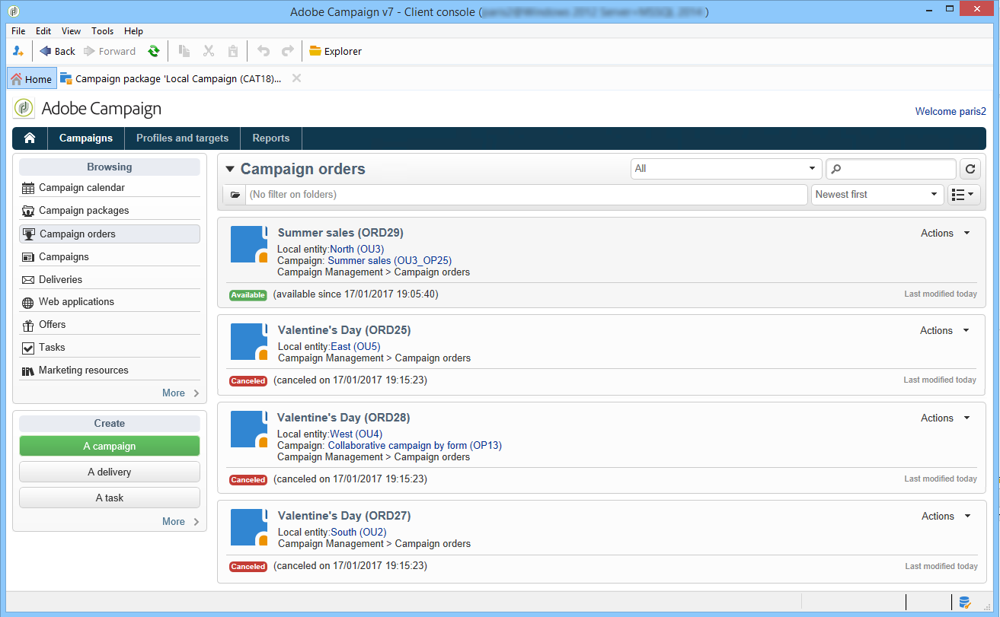
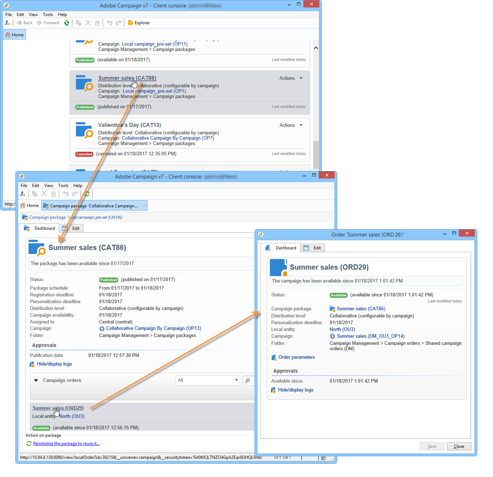
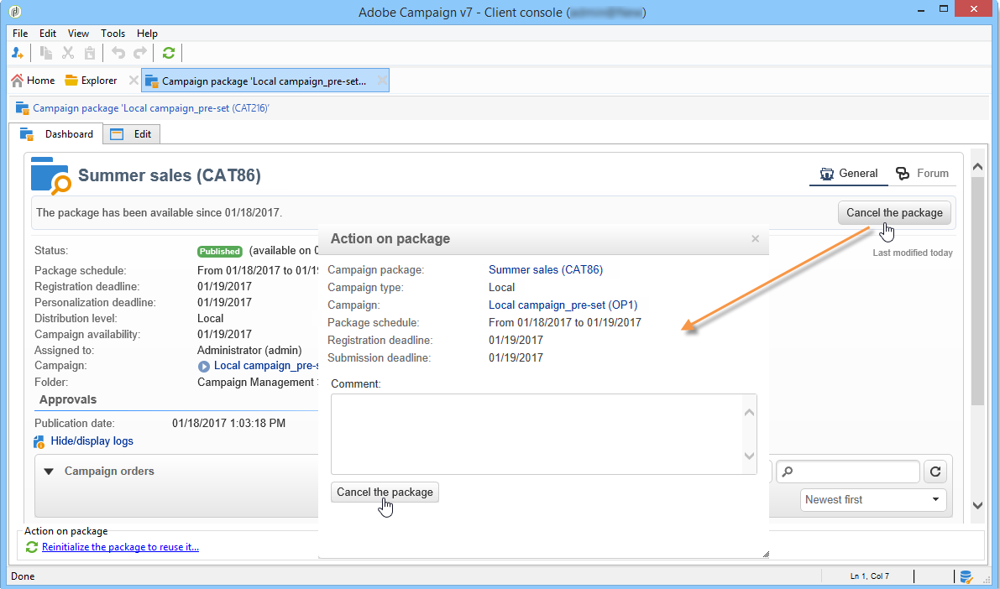
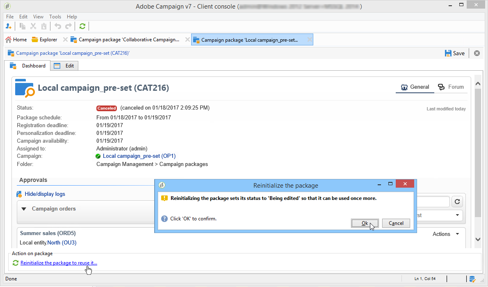

# Tracking a campaign{#tracking-a-campaign}

Central entity operators can track campaign orders in the list of campaign packages.

This lets them:

* [Filter packages](../../campaign/using/tracking-a-campaign.md#filter-packages),
* [Edit packages](../../campaign/using/tracking-a-campaign.md#edit-packages),
* [Cancel a package](../../campaign/using/tracking-a-campaign.md#cancel-a-package),
* [Reinitializing a package](../../campaign/using/tracking-a-campaign.md#reinitializing-a-package).

## Filter packages {#filter-packages}

From the **Campaigns universe**, you can display the list of **Campaign packages** which regroups all existing Distributed Marketing campaigns. You can filter this list so that it displays only campaigns that are either published, late, pending approval, etc. To do this, click the links in the upper section of this view, or use the **Filter list** link and select the campaign package status to display.

## Edit packages {#edit-packages}

The **Campaign packages** page lets you view the summary of each package.

This summary shows the following information: label, type of campaign, as well as the name of the campaign from which it was created, and the folder.

Click the package name to edit it. You can also view orders by their local entities and by their status.

This information is also offered in the **Campaign orders** view which lists all orders.

The central operator can edit the order. There are two ways of doing this:

1. The operator can click the order name to edit it: this displays the order detail.

   

   The **Edit > General** tab lets you view information entered by the local entity when it ordered the campaign.

   

1. The operator can click the campaign package label to edit it and change certain settings.

   

## Cancel a package {#cancel-a-package}

The central entity can cancel a campaign package at any time.

Click **Cancel** in the campaign package **Dashboard**.

The **Comment** field lets you justify the cancellation.

For **local campaigns**, canceling a package removes it from the list of available marketing campaigns.

For **collaborative campaigns**, canceling a package triggers numerous actions:

1. Any orders related to this package are canceled,

   

1. The reference campaign is canceled and all active processes (workflows, deliveries) are stopped,

   

1. A notification is sent to all local entities concerned.

   

Canceled packages can still be accessed and reinitialized by the central entity (see below) if necessary. They will only be offered to local entities again once they have been approved and started. The package reinitialization process is shown below.

## Reinitializing a package {#reinitializing-a-package}

Campaign packages which have already been published can be reinitialized, modified and made available to local entities.

1. Select the package concerned.
1. Click the **Reinitialize the package to reuse it** link and click **OK**.

   

1. Click the **Save** button to approve package re-initialization.

   

1. The package status changes to **Being edited**. Modify, approve and publish it again to restore it to the list of campaign package.

>[!NOTE]
>
>You can also reinitialize canceled campaign packages.

