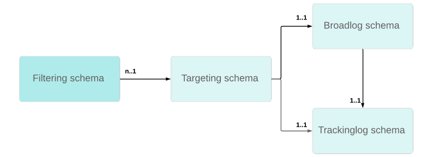

# Use a custom recipient table{#about-custom-recipient-table}

This section details the principles for using a non-standard recipient table.

By default, Adobe Campaign offers a standard recipient table to which out-of-the-box functions and processes are linked. The standard recipient table has a number of predefined fields and tables that can be easily extended using an extension table.

If this extension method offers good flexibility to extend a table, it does not allow the number of fields or links in it to be reduced. Using a non-standard table, or 'external recipient table', allows for a greater flexibility but requires certain precautions when implementing it.

## Precisions {#precisions}

This functionality allows Adobe Campaign to process data from an external database: this data will be used as a set of profiles for deliveries. Implementing this process involves several precisions that may be relevant according to the client's needs. Such as:

* No update stream to and from the Adobe Campaign database: data from this table can be updated directly via the database engine that hosts it.
* No changes in the processes operating on the existing database.
* Using a profile database with a non-standard structure: possibility of delivering to profiles saved in various tables with various structures, using a single instance.
* No changes or maintenance required when updating the Adobe Campaign database.
* The standard recipient table is useless if you do not need most of the table fields or if the database template is not centered on the recipients.
* In order to be efficient, a table with few fields is needed if you have a significant number of profiles. The standard recipient table has too many fields for this specific case.

This section describes the key points that let you map existing tables in Adobe Campaign and the configuration to apply to execute deliveries based on any table. Finally, it describes how to provide users with querying interfaces as practical as those available with the standard recipient table. To understand the material presented in this section, good knowledge of the principles of screen and schema design is required.

## Recommendations and limitations {#recommendations-and-limitations}

Using an external recipient table has the following limitations:

* Adobe Campaign does not support multiple recipient schemas, know as targeting schemas, linked to the same broadlog and/or trackinglog schemas. This can otherwise lead to anomalies in data reconciliation afterwards.
 
  The graphic below details the required relational structure for each custom recipient schema:
  

  We recommend:

  * Dedicating the **[!UICONTROL nms:BroadLogRcp]** and **[!UICONTROL nms:TrackingLogRcp]** schemas to the out-of-the-box **[!UICONTROL nms:Recipientschema]**. Those two log tables should not be linked to any additional custom recipient table.
  * Defining dedicated custom broadlog and trackinglog schemas for each new custom recipient schema. This can be automatically done when setting up the target mapping, see [Target mapping](../../configuration/using/target-mapping.md).

* You cannot use the standard **[!UICONTROL Services and Subscriptions]** offered in the product.

  This means the overall operation detailed in [this section](../../delivery/using/managing-subscriptions.md) is not applicable.

* The link with the **[!UICONTROL visitor]** table does not work.

  Thus, to use the **[!UICONTROL Social Marketing]** module you must configure the storage step to reference the correct table.

  Similarly, when using referral functions, the standard initial message transfer template must be adapted.

* You cannot manually add profiles in a list.

  Therefore, the procedure detailed in [this section](../../platform/using/creating-and-managing-lists.md) is not applicable without an additional configuration.

  >[!NOTE]
  >
  >You can still create recipient lists using workflows. For more on this, refer to [Creating a profile list with a workflow](../../configuration/using/creating-a-profile-list-with-a-workflow.md).

We also recommend checking the default values used in the different out-of-the-box configurations: depending on the functionalities used, several adaptations must be carried out.

For example:

* Certain standard reports, particularly those offered by **Interaction** and the **Mobile Applications** must be redeveloped. Refer to the [Managing reports](../../configuration/using/managing-reports.md) section.
* The default configurations for certain workflow activities reference the standard recipients table (**[!UICONTROL nms:recipient]**): these configurations must be changed when used for an external recipients table. Refer to the [Managing workflows](../../configuration/using/managing-workflows.md) section.
* The standard **[!UICONTROL Unsubscription link]** personalization block must be adapted.
* The target mapping of the standard delivery templates must be modified.
* V4 forms are not compatible for use with an external recipients table: you must use web applications.
