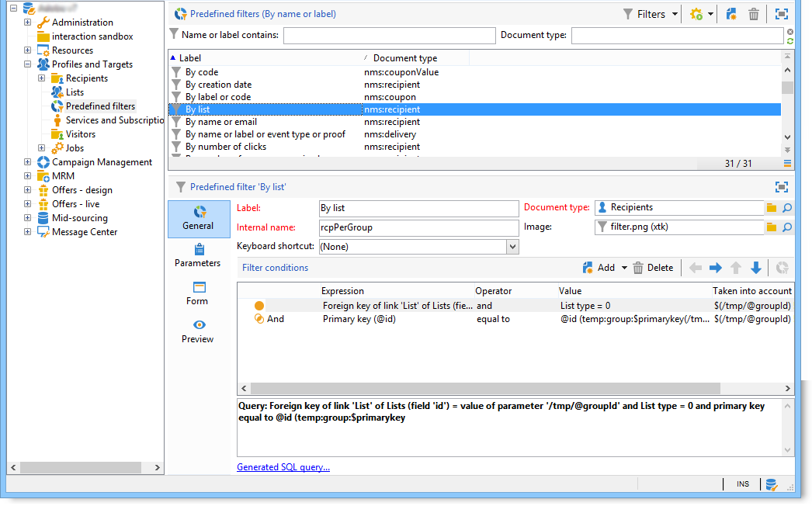

# About navigation hierarchy{#about-navigation-hierarchy}

The navigation hierarchy works like a file browser (e.g. Windows Explorer). Folders may contain sub-folders. Selecting a node displays the view corresponding to the node.

The view displayed is a list associated with a schema and an input form to edit the selected line.

To add a new folder to the tree, right-click the folder in the branch where you wish to insert a folder, and select **Add new folder**. In the shortcut menu, select the type of file to be created.

