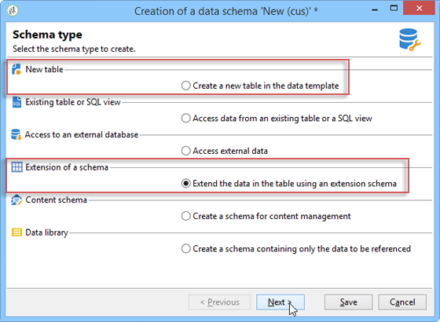
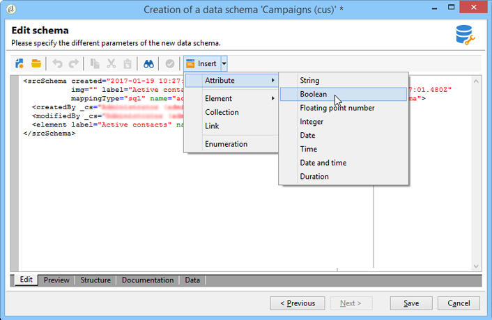
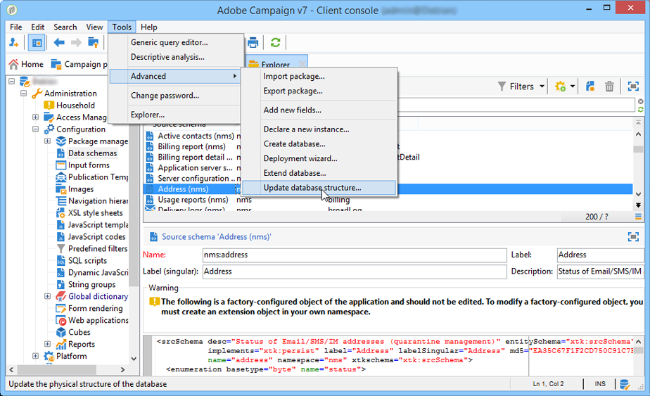

# About schema edition{#about-schema-edition}

Adobe Campaign employs Data Schemas to:

* Define how data objects within the application are tied to underlying database tables.
* Define links between the different data objects within the Campaign application.
* Define and describe the individual fields included in each object.

For a better understanding of Campaign built-in tables and their interaction, refer to [this section](https://helpx.adobe.com/campaign/kb/acc-datamodel.html).

## Extending or creating schemas {#extending-or-creating-schemas}

To add a field or index or other element to one of the core data schemas in Campaign, such as the recipient table (nms:recipient), you have to extend that schema. For more on this, refer to the [Extending a schema](../../configuration/using/extending-a-schema.md) section.

To add an entirely new type of data that does not exist out-of-the-box in Adobe Campaign (a table of contracts for example) you can create a custom schema directly. For more on this, refer to the [Data schemas](../../configuration/using/data-schemas.md) section.



Once you have extended or created a schema to work in, the best practice is to define its XML content elements in the same order they appear in below.

## Enumerations {#enumerations}

Enumerations are defined first, before the main element of the schema. They allow you to display values in a list in order to restrict the choices that the user has for a given field.

Example:

```
<enumeration basetype="byte" name="exTransactionTypeEnum" default="store">
<value label="Website" name="web" value="0"/>
<value label="Call Center" name="phone" value="1"/>
<value label="In Store" name="store" value="2"/>
</enumeration>
```

When defining fields, you can then use this enumeration like so:

```
<attribute desc="Type of Transaction" label="Transaction Type" name="transactionType" 
type="string" enum="exTransactionTypeEnum"/>
```

>[!NOTE]
>
>You can also employ user-managed enumerations (usually under **[!UICONTROL Administration]** > **[!UICONTROL Platform]** ) to specify the values for a given field. These are effectively global enumerations, and a better choice if your enumeration may be used outside of the specific schema you are working in.

To find out more about enumerations, refer to the [Enumerations](../../configuration/using/schema-structure.md#enumerations) and [`<enumeration>` element](../../configuration/using/schema/enumeration.md) sections.

## Index {#index} 

Indexes are the first elements declared in the main element of the schema.

They can be unique or not, and reference one or more fields.

Examples:

```
<dbindex name="email" unique="true">
  <keyfield xpath="@email"/>
</dbindex>
```

```
<dbindex name="lastNameAndZip">
  <keyfield xpath="@lastName"/>
  <keyfield xpath="location/@zipCode"/>
</dbindex>
```

The **xpath** attribute points to the field in your schema that you wish to index.

>[!IMPORTANT]
>
>It is important to remember that the SQL query read performance gains provided by indexes also come with a performance hit on writing records. The indexes should therefore be used with precaution.

For more on indexes, refer to the [Indexed fields](../../configuration/using/database-mapping.md#indexed-fields) section.

## Keys {#keys}

Every table must have at least one key, and often it is automatically established in the main element of the schema by using the **@autopk=true** attribute set to "true".

The primary key can also be defined using the **internal** attribute.

Example:

```
<key name="householdId" internal="true">
  <keyfield xpath="@householdId"/>
</key>
```

In this example, instead of letting the **@autopk** attribute create a default primary key named “id” we are specifying our own “householdId” primary key.

>[!IMPORTANT]
>
>When creating a new schema or during a schema extension, you need to keep the same primary key sequence value (@pkSequence) for the whole schema.

To find out more about keys, refer to the [Management of keys](../../configuration/using/database-mapping.md#management-of-keys) section.

## Attributes (Fields) {#attributes--fields-}

Attributes allow you to define the fields which make up your data object. You can use the **[!UICONTROL Insert]** button in the schema edition toolbar to drop empty attribute templates into your XML where your cursor is. For more on this, refer to the [Data schemas](../../configuration/using/data-schemas.md) section.



The full list of attributes is available in the [`<attribute>` element](../../configuration/using/schema/attribute.md) section. Here are some of the more commonly used attributes:

* **@advanced**
* **@dataPolicy**
* **@default**
* **@desc**
* **@enum**
* **@expr**
* **@label**
* **@length**
* **@name**
* **@notNull**
* **@required**
* **@ref**
* **@xml**
* **@type**

  To view a table listing the mappings for the data types generated by Adobe Campaign for the different database management systems, refer to the [Mapping the types of Adobe Campaign/DBMS data](../../configuration/using/schema-structure.md#mapping-the-types-of-adobe-campaign-dbms-data) section.

For more information on each attribute, refer to the [Attribute description](../../configuration/using/schema/attribute.md) section.

### Examples {#examples}

Example of defining a default value:

```
<attribute name="transactionDate" label="Transaction Date" type="datetime" default="GetDate()"/>
```

Example of using a common attribute as a template for a field also marked as mandatory:

```
<attribute name="mobile" label="Mobile" template="nms:common:phone" required="true" />
```

Example of a computed field that is hidden using the **@advanced** attribute:

```
<attribute name="domain" label="Email domain" desc="Domain of recipient email address" expr="GetEmailDomain([@email])" advanced="true" />
```

Example of an XML field also stored in an SQL field and which has an **@dataPolicy** attribute.

```
<attribute name="secondaryEmail" label="Secondary email address" length="100" xml="true" sql="true" dataPolicy="email" />
```

>[!IMPORTANT]
>
>Although most attributes are linked according to a 1-1 cardinality to a physical field of the database, this is not the case for the XML fields or the computed fields.   
>An XML field is stored in a memo field ("mData") of the table.   
>A computed field however is created dynamically each time a query is started, it therefore only exists in the applicative layer.

## Links {#links}

Links are some of the last elements in the main element of your schema. They define how all of the different schemas in your instance relate to one another.

Links are declared in the schema that contains the **foreign key** of the table to which it is linked.

There are three types of cardinality: 1-1, 1-N, and N-N. It is the 1-N type that is used by default.

### Examples {#examples-1}

An example of a 1-N link between the recipient table (out-of-the-box schema) and a table of custom transactions:

```
<element label="Recipient" name="lnkRecipient" revLink="lnkTransactions" target="nms:recipient" type="link"/>
```

An example of a 1-1 link between a custom schema "Car" (in the "cus" namespace) and the recipient table:

```
<element label="Car" name="lnkCar" revCardinality="single" revLink="recipient" target="cus:car" type="link"/>
```

Example of an external join between the recipient table and a table of addresses based on the email address and not a primary key:

```
<element name="emailInfo" label="Email Info" revLink="recipient" target="nms:address" type="link" externalJoin="true">
  <join xpath-dst="@address" xpath-src="@email"/>
</element>
```

Here "xpath-dst" corresponds to the primary key in the target schema and "xpath-src" corresponds to the foreign key in the source schema.

## Audit trail {#audit-trail}

One useful element you may want to include at the bottom of your schema is a tracking element (Audit trail).

Use the example below to include fields relating to the creation date, the user that created the data, the date, and the author of the last modification for all data in your table:

```
<element aggregate="xtk:common:auditTrail" name="auditTrail"/>
```

## Updating the database structure {#updating-the-database-structure}

Once your changes are completed and saved, any changes that may impact the SQL structure need to be applied to the database. To do this, use the database update wizard.



For more on this, refer to the [Updating the database structure](../../configuration/using/updating-the-database-structure.md) section.

>[!NOTE]
>
>When modifications do not impact the database structure, you just need to regenerate schemas. To do this, select the schema(s) to update, right click and choose **[!UICONTROL Actions > Regenerate selected schemas...]** . For more on this, refer to the [Regenerating schemas](../../configuration/using/regenerating-schemas.md) section.
