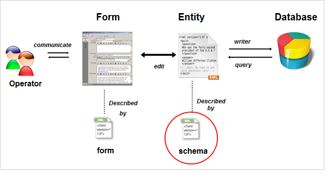
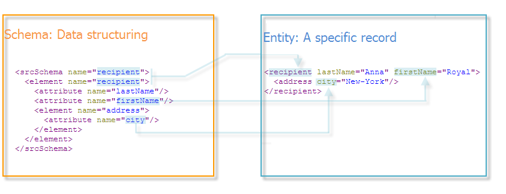

# About schema reference{#about-schema-reference}

This chapter describes how to configure extension schemas in order to extend the conceptual data model of the Adobe Campaign database.

For a better understanding of Campaign built-in tables and their interaction, refer to the [Campaign Classic data model](https://helpx.adobe.com/campaign/kb/acc-datamodel.html).

The physical and logical structure of the data carried in the application is described in XML. It obeys a grammar specific to Adobe Campaign, called a **schema**.

A schema is an XML document associated with a database table. It defines data structure and describes the SQL definition of the table:

* The name of the table
* Fields
* Indexes
* Links with other tables

It also describes the XML structure used to store data:

* Elements and attributes
* Hierarchy of elements
* Element and attribute types
* Default values
* Labels, descriptions, and other properties.

Schemas enable you to define an entity in the database. There is a schema for each entity.

The following illustration shows the location of schemas in the Adobe Campaign data system:



## Syntax of schemas {#syntax-of-schemas}

The root element of the schema is **`<srcschema>`**. It contains the **`<element>`** and **`<attribute>`** sub-elements.

The first **`<element>`** sub-element coincides with the root of the entity.

```
<srcSchema name="recipient" namespace="cus">
  <element name="recipient">  
    <attribute name="lastName"/>
    <attribute name="email"/>
    <element name="location">
      <attribute name="city"/>
   </element>
  </element>
</srcSchema>
```

>[!NOTE]
>
>The root element of the entity has the same name as the schema.



The **`<element>`** tags define the names of entity elements. **`<attribute>`** tags of the schema define the names of the attributes in the **`<element>`** tags which they have been linked to.

## Identification of a schema {#identification-of-a-schema}

A data schema is identified by its name and its namespace.

A namespace lets you group a set of schemas by area of interest. For example, the **cus** namespace is used for customer-specific configuration (**customers**).

The identification key of a schema is a string built using the namespace and the name separated by a colon; for example: **cus:recipient**.

>[!IMPORTANT]
>
>The name of the namespace must be concise and must contain only authorized characters in accordance with XML naming rules.
>
>Identifiers must not begin with numeric characters.
>
>The following namespaces are reserved for descriptions of the system entities required for the operation of the Adobe Campaign application and must not be used: **xtk**, **nl**, **nms**, **ncm**, **temp**, **ncl**, **crm**, **xxl**.

