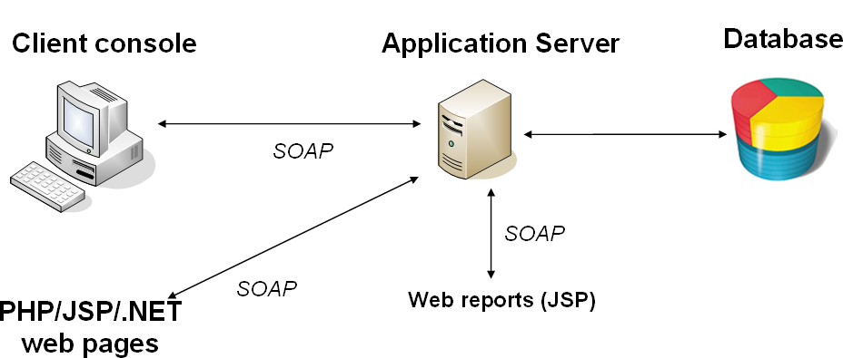
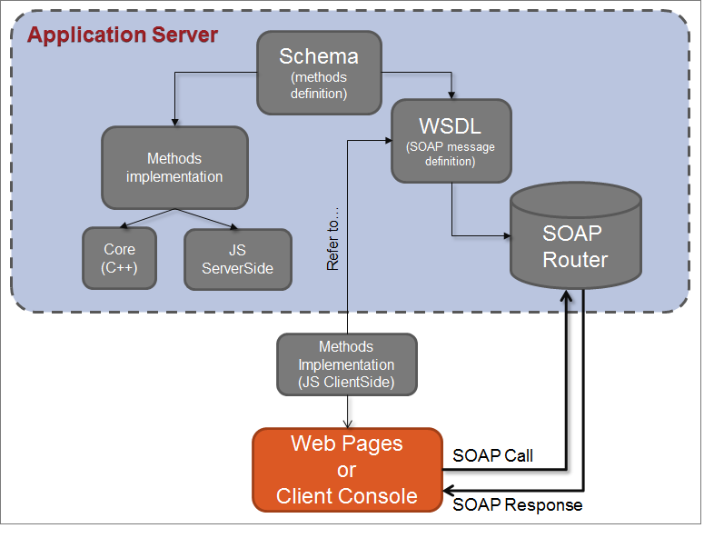

# About web services{#about-web-services}

## Definition of Adobe Campaign APIs {#definition-of-adobe-campaign-apis}

The Adobe Campaign application server was designed for openness and easy integration with increasingly diverse and complex company information systems.

Adobe Campaign APIs are used in JavaScript within the application and in SOAP outside of it. They make up a library of generic functions that can be enriched. For further information, refer to [Implementing SOAP methods](../../configuration/using/implementing-soap-methods.md).

>[!IMPORTANT]
>
>The number of authorized Engine Calls per day varies upon your license contract. For more on this, refer to [this page](https://helpx.adobe.com/legal/product-descriptions/adobe-campaign-classic---product-description.html).   
>A list of all the APIs including their full description is available in [this dedicated documentation](https://docs.adobe.com/content/help/en/campaign-classic/technicalresources/api/index.html).

## Prerequisites {#prerequisites}

Before using the Adobe Campaign APIs, you need to be familliar with the following topics:

* Javascript
* SOAP protocol
* Adobe Campaign datamodel

## Using Adobe Campaign APIs {#using-adobe-campaign-apis}

Adobe Campaign uses two types of APIs:

* Generic data acces APIs for querying the datamodel data. Refer to [Data oriented APIs](../../configuration/using/data-oriented-apis.md).
* Business specific APIs that let you act on each object: deliveries, workflows, subscriptions, etc. Refer to [Business oriented APIs](../../configuration/using/business-oriented-apis.md).

In order to develop APIs and interact with Adobe Campaign, you need to be familiar with your datamodel. Adobe Campaign lets you generate a complete description of the base. Refer to [Description of the model](../../configuration/using/data-oriented-apis.md#description-of-the-model).

## SOAP calls {#soap-calls}

The SOAP protocol lets you invoke API methods, via the rich client, third-party applications using webservices, or JSP using these methods natively.



The structure of a SOAP message is as follows:

* an envelope which defines the structure of the message,
* an optional header,
* a body containing the information about the call and the response,
* error management that defines the error condition.

## Resources and exchanges {#resources-and-exchanges}

The following schema shows the various resources involved in the use of Adobe Campaign APIs:



## Example of a SOAP message on the 'ExecuteQuery' method {#example-of-a-soap-message-on-the--executequery--method--}

In this example, a SOAP query invokes the "ExecuteQuery" method, which takes a character string as a parameter for authentication (session token) and an XML content for the description of the query to be executed.

For further information, refer to [ExecuteQuery (xtk:queryDef)](../../configuration/using/data-oriented-apis.md#executequery--xtk-querydef-).

>[!NOTE]
>
>The WSDL description of this service is completed in the example shown here: [Web service description: WSDL](../../configuration/using/web-service-calls.md#web-service-description--wsdl).

### SOAP query {#soap-query}

```
<?xml version='1.0' encoding='ISO-8859-1'?>
  <SOAP-ENV:Envelope xmlns:xsd='http://www.w3.org/2001/XMLSchema' xmlns:xsi='http://www.w3.org/2001/XMLSchema-instance' xmlns:ns='http://xml.apache.org/xml-soap' xmlns:SOAP-ENV='http://schemas.xmlsoap.org/soap/envelope/'>
    <SOAP-ENV:Body>
      <ExecuteQuery xmlns='urn:xtk:queryDef' SOAP-ENV:encodingStyle='http://schemas.xmlsoap.org/soap/encoding/'>
        <__sessiontoken xsi:type='xsd:string'/>
        <entity xsi:type='ns:Element' SOAP-ENV:encodingStyle='http://xml.apache.org/xml-soap/literalxml'>
          <queryDef firstRows="true" lineCount="200" operation="select" schema="nms:rcpGrpRel" startLine="0" startPath="/" xtkschema="xtk:queryDef">
          ...
          </queryDef>
        </entity>
      </ExecuteQuery>
  </SOAP-ENV:Body>
</SOAP-ENV:Envelope>

```

The `<soap-env:envelope>` element is the first element of the message representing the SOAP envelope.

The `<soap-env:body>` element is the first child element of the envelope. It contains the description of the message, i.e. the content of the query or the response.

The method to be invoked is entered in the `<executequery>` element from the body of the SOAP message.

In SOAP, the parameters are recognized by order of appearance. The first parameter, `<__sessiontoken>`, takes the authentication chain, the second parameter is the XML description of the query from the `<querydef>` element.

### SOAP response {#soap-response}

```
<?xml version='1.0' encoding='ISO-8859-1'?>
  <SOAP-ENV:Envelope xmlns:xsd='http://www.w3.org/2001/XMLSchema' xmlns:xsi='http://www.w3.org/2001/XMLSchema-instance' xmlns:ns='http://xml.apache.org/xml-soap' xmlns:SOAP-ENV='http://schemas.xmlsoap.org/soap/envelope/'>
    <SOAP-ENV:Body>
      <ExecuteQueryResponse xmlns='urn:xtk:queryDef' SOAP-ENV:encodingStyle='http://schemas.xmlsoap.org/soap/encoding/'>
        <pdomOutput xsi:type='ns:Element' SOAP-ENV:encodingStyle='http://xml.apache.org/xml-soap/literalxml'>
          <rcpGrpRel-collection><rcpGrpRel group-id="1872" recipient-id="1362"></rcpGrpRel></rcpGrpRel-collection>
        </pdomOutput>
      </ExecuteQueryResponse>
    </SOAP-ENV:Body>
</SOAP-ENV:Envelope>

```

The result of the query is entered from the `<pdomoutput>` element.

## Error management {#error-management}

Example SOAP error response:

```
<?xml version='1.0' encoding='ISO-8859-1'?>
<SOAP-ENV:Envelope xmlns:SOAP-ENV='http://schemas.xmlsoap.org/soap/envelope/'>
  <SOAP-ENV:Body>
    <SOAP-ENV:Fault>
      <faultcode>SOAP-ENV:Server</faultcode>
      <faultstring>Error while executing 'Write' of the 'xtk:persist'.</faultstring> service
      <detail>ODBC error: [Microsoft][ODBC SQL Server Driver][SQL Server]Cannot insert duplicate key row in object 'XtkOption' with unique index 'XtkOption_name'. SQLSTate: 23000
ODBC error: [Microsoft][ODBC SQL Server Driver][SQL Server]The statement has been terminated. SQLSTate: 01000 Cannot save the 'Options (xtk:option)' document </detail>
    </SOAP-ENV:Fault>
  </SOAP-ENV:Body>
</SOAP-ENV:Envelope>

```

The `<soap-env:fault>` element in the body of the SOAP message is used to convey the error signals arising during the processing of the web service. This is composed of the following sub-elements:

* `<faultcode>` : indicates the type of error. The error types are:

    * "VersionMismatch" in the event of incompatibility with the SOAP version used,
    * "MustUnderstand" in the event of a problem in the message header,
    * "Client" in the event that the client is missing some information,
    * "Server" in the event that the server has a problem executing the processing.

* `<faultstring>` : message describing the error
* `<detail>` : long error message

The success or failure of the service invocation is identified when the `<faultcode>` element is verified.

>[!IMPORTANT]
>
>All Adobe Campaign Web services handle errors. It is therefore strongly recommended to test each call in order to handle returned errors.

Example of error handling in C#:

```
try 
{
  // Invocation of method
  ...
}
catch (SoapException e)
{
  System.Console.WriteLine("Soap exception: " + e.Message);        
  if (e.Detail != null)
    System.Console.WriteLine(e.Detail.InnerText);
}

```

## URL of Web service server (or EndPoint) {#url-of-web-service-server--or-endpoint-}

To submit the Web service, the Adobe Campaign server that implements the corresponding service method must be contacted.

The server URL is as follows:

https://serverName/nl/jsp/soaprouter.jsp

With **`<server>`** the Adobe Campaign application server (**nlserver web**).
