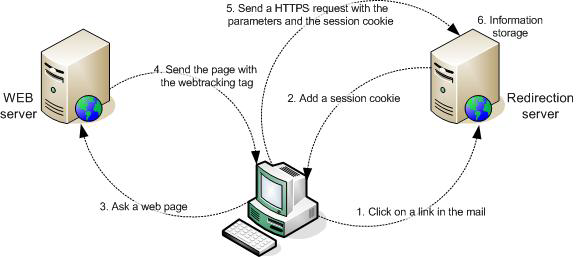

# About web tracking{#about-web-tracking}

In addition to standard tracking that shows the behavior of an internet user clicking on a link in an e-mail message, the Adobe Campaign platform lets you collect information on how internet users browse your website. This data collection is performed by the web tracking module.

When an internet user clicks a tracked link in an e-mail from a given delivery, the redirection server contacted deposits a session cookie containing the broadlog identifier (broadlogId) and the delivery identifier (deliveryId).

The web client then sends this cookie to the server each time the user visits a page containing a web tracking tag. This continues throughout the session, i.e. until the web client is closed.

The redirection server collects the following data in this way:

* URL of the page viewed, via an identifier sent as a parameter,
* the delivery from which the web page was visited, via the session cookie,
* identifier of the internet user who clicked, via the session cookie,
* additional information such as the business volume generated.

The following diagram shows the stages of the dialog between the client and the various servers.

