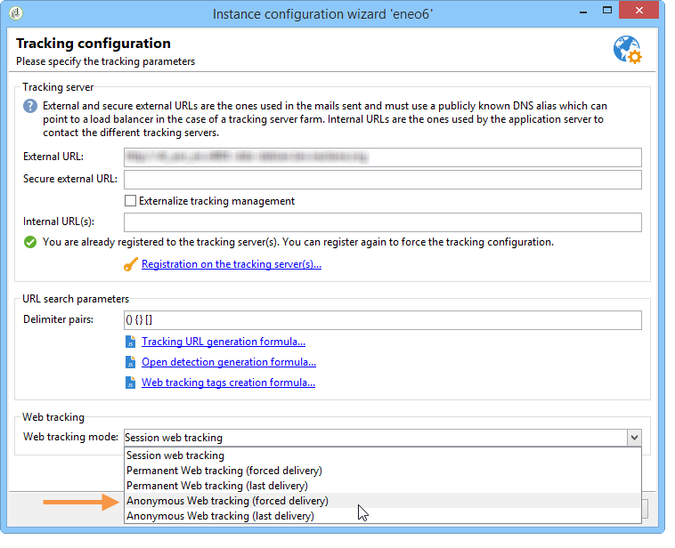
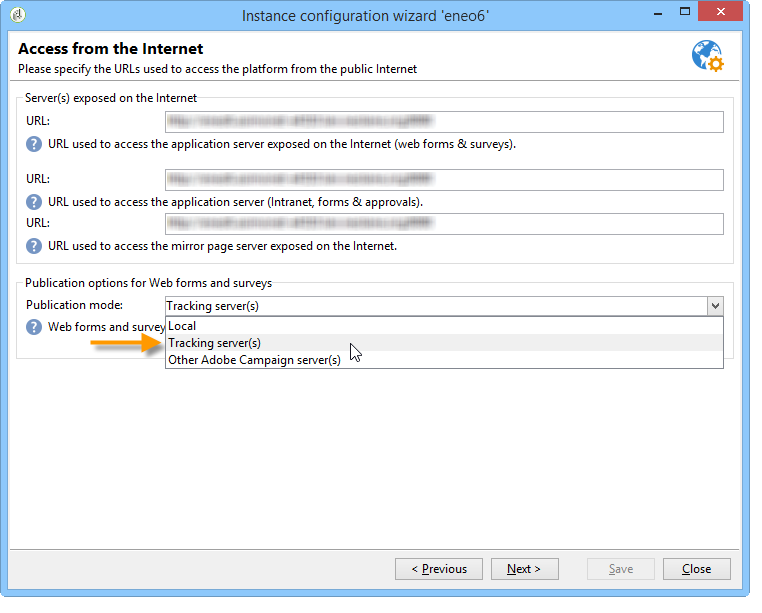

# Anonymous tracking{#anonymous-tracking}

Adobe Campaign lets you link collected Web tracking information to a recipient when they browse your site anonymously. When a user browses the tagged pages of your website this browsing information is collected, so that once they click in an email sent by Adobe Campaign, they are identified and the information is automatically linked to them.

>[!IMPORTANT]
>
>Setting up anonymous tracking on a website can trigger the collection of a significant amount of tracking logs, thereby impacting database operation. Configure it with care.   
>Tracking logs are saved in the database until the tracking data is purged. Use the deployment wizard to configure the purge frequency. For more on this, refer to [this section](../../installation/using/deploying-an-instance.md#purging-data).

To enable anonymous Web tracking on your instance, the following elements must be configured:

* The **trackWebVisitors** parameter of the **redirection** element of the **serverConf.xml** file of the tracking server must be set to '**true**', to place a permanent cookie (**uuid230**) in the browsers of unknown internet users who visit the site.
* The **Anonymous Web Tracking** mode must be selected in the tracking configuration screen of the deployment wizard.

  

* Web forms and surveys must be published and executed on the tracking server. The matching option must be selected in the deployment wizard.

  
