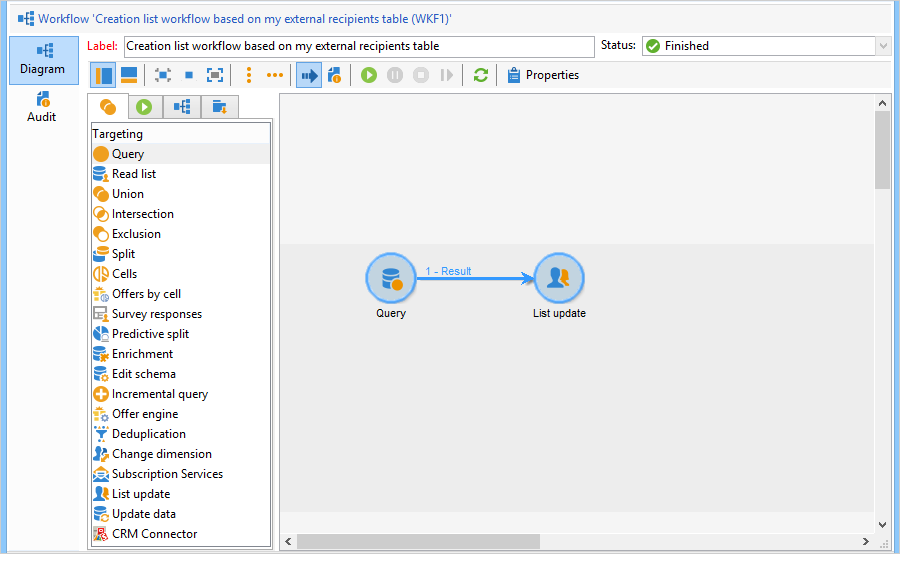
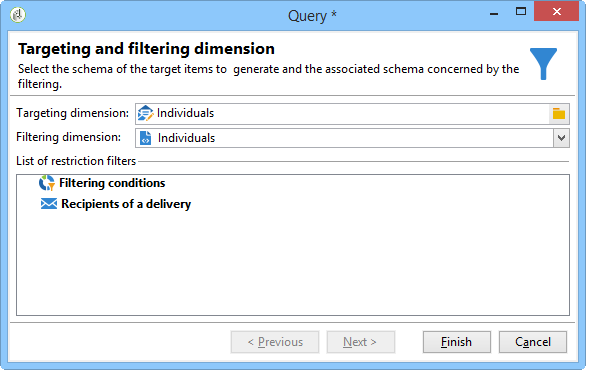
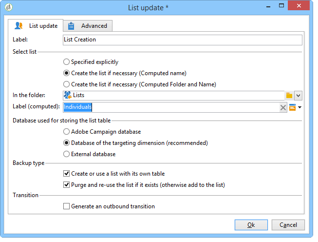
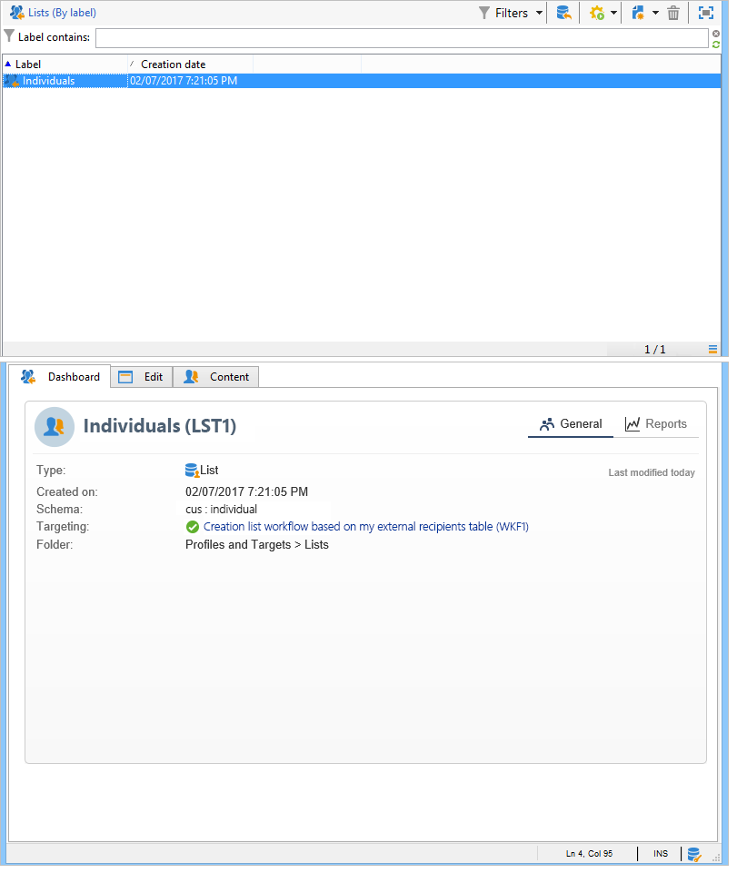

# Creating a profile list with a workflow{#creating-a-profile-list-with-a-workflow}

To create a **[!UICONTROL List]** type list based on the new recipient table, you need to create a targeting workflow which will generate the list. 

For more information about lists in Campaign, refer to [this section](../../platform/using/creating-and-managing-lists.md#about-lists-in-adobe-campaign).

 [Discover this feature in video](../../platform/using/creating-and-managing-lists.md#create-list-in-a-wf-video)

To create a targeting workflow and update recipients in a custom recipient table, follow the steps below: 

1. Go to the **[!UICONTROL Profiles and Targets > Jobs > Targeting workflows]** node of the explorer.
1. Create a new targeting workflow.
1. Place a **Query** activity followed by a **List update** activity.

   

1. Double-click the **Query** activity, then click **[!UICONTROL Edit the query]** to choose a targeting dimension based on the schema of the new recipient table (in our example: **Individual**). Click **[!UICONTROL Finish]** to confirm.

   

1. Double-click the **List update** activity, then select the **[!UICONTROL Create the list if necessary (Computed name)]** radio button.

   

1. Select the creation folder for the new list.
1. Execute the workflow to create the list.
1. View the result in the node of the tree which you selected during the **[!UICONTROL List update]** activity.

   The dashboard specifies the schema which the list is based on, as shown below:

   
