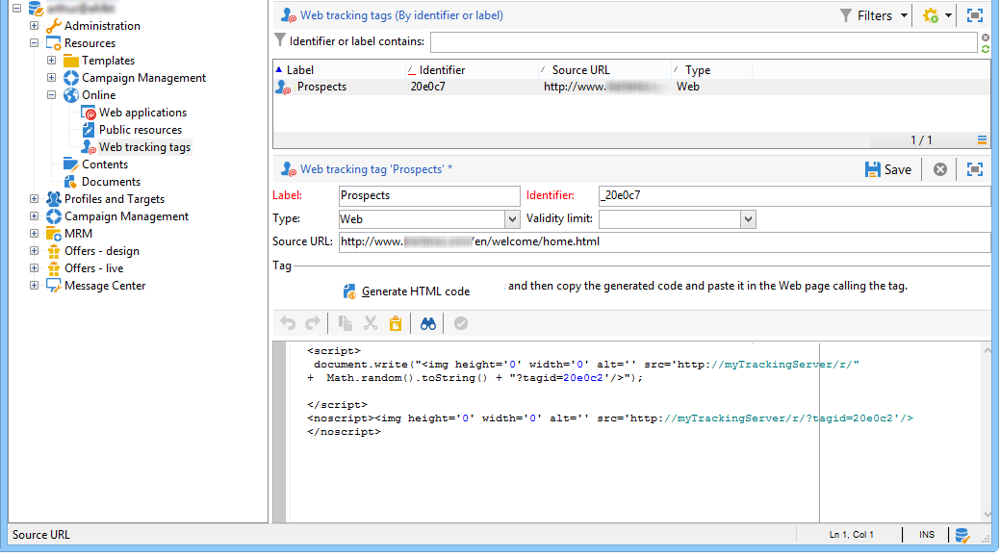

# Creating web tracking tags{#creating-web-tracking-tags}

Each page of the site that you wish to track must be referenced in your Adobe Campaign platform. This referencing can be performed in two ways:

1. Manual definition of URLs to be tracked,
1. On-the-fly creation of URLs to be tracked.

## Defining the URLs to be tracked in the application {#defining-the-urls-to-be-tracked-in-the-application}

This method lets you manually define the pages to be tracked and then generate an example of the associated web tracking tag. This operation is defined in the **Campaign execution>Resources>Web tracking tags** node of the client console.



To generate the HTML code to be inserted in the page:

* Enter the label of the tag: it will be shown in the tracking logs,
* Indicate the source URL: this field is for information purposes and lets you indicate the tracked page (optional),
* If needed, enter a validity period,
* Click **Generate** HTML code.

Then copy the generated code and paste it into the page to be tracked.

## On-the-fly creation of URLs to be tracked {#on-the-fly-creation-of-urls-to-be-tracked}

You can create the web tracking URLs on the fly by adding information to the value of the **tagid** parameter:

* Type of page tracked: 'w' for WEB or 't' for TRANSACTION,
* The internal name of the folder where the URL must be created.

These two pieces of information must be concatenated with the identifier of the tracked page by adding the character '|':

```
tagid=<identifier>|<type>|<foldername>
```

>[!CAUTION]
>
>Remember to encode the value of the **tagid** parameter when it is used as a URL parameter.

**Example**: creation of a transaction-type web tracking URL.

**http://myserver.adobe.com/r/a?tagid=home%7Ct%7CMyFolder**
