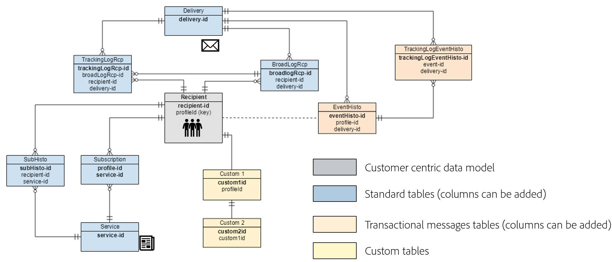

# Data model best practices{#data-model-best-practices}

This document outlines key recommendations while designing your Adobe Campaign data model.

## Overview {#overview}

Adobe Campaign system is extremely flexible and can be extended beyond the initial implementation. However, while possibilities are infinite, it is critical to make wise decisions and build strong foundations to start designing your data model.

This document provides common use cases and best practices to learn how to architect properly your Adobe Campaign tool.

## Data model architecture {data-model-architecture}

Adobe Campaign Standard is a powerful cross-channel campaign management system that can help you align your online and offline strategies to create personalized customer experiences.

### Customer-centric approach {#customer-centric-approach}

While most email service providers are communicating to customers via a list-centric approach, Adobe Campaign relies on a relational database in order to leverage a broader view of the customers and their attributes.

This customer-centric approach is shown on the chart below. The **Recipient** table in grey represents the main customer table around which everything is being built:

To access the description of each table, go to **[!UICONTROL Admin > Configuration > Data schemas]**, select a resource from the list and click the **[!UICONTROL Documentation]** tab.

The Adobe Campaign default data model is presented in this [document](https://final-docs.campaign.adobe.com/doc/AC/en/technicalResources/_Datamodel_Description_of_the_main_tables.html).

>[!NOTE]
>
>Adobe Campaign Classic allows to build a custom customer table. However, in most cases, it is recommended to leverage the standard [Recipient table](../../configuration/using/default-recipient-table.md) which already has pre-built additional tables and features.

### Data for Adobe Campaign {#data-for-campaign}

What data should be sent to Adobe Campaign? It is critical to determine the data required for your marketing activities.

>[!NOTE]
>
>Adobe Campaign is neither a data warehouse or a reporting tool. Therefore, do not try to import all possible customers and their associated information into Adobe Campaign, or import data which will only be used to build reports.

To make the decision whether an attribute would be needed or not in Adobe Campaign, ask yourself if it would fall under one of these categories:
* Attribute used for **segmentation**
* Attribute used for **data management processes** (aggregate calculation for example)
* Attribute used for **personalization**

If not falling into any of these, you are most likely not going to need this attribute in Adobe Campaign.

## Choice of data types {#data-types}

To ensure good architecture and performance of your system, follow the best practices below to set up data in Adobe Campaign.

* A large table should mostly have numeric fields and contain links to reference tables (when working with list of values).
* The **expr** attribute  allows to define a schema attribute as a calculated field rather than a physical set value in a table. This can enable to access information in a different format (as for age and birth date for example) without the need to store both values. This is a good way to avoid duplicating fields. For instance, the Recipient table uses an expression for the domain, which is already present in the email field.
* However, when the expression calculation is complex, it is not recommended to use the **expr** attribute as on-the-fly calculation may impact the performance of your queries.
* The **XML** type is a good way to avoid creating too many fields. But it also takes up disk space as it uses a CLOB column in the database. It also can lead to complex SQL queries and may impact performance.
* The length for a **string** field should always be defined with the column. By default, the maximum length in Adobe Campaign is 255, but Adobe recommends keeping the field shorter if you already know that the size will not exceed a shorter length.
* It is acceptable to have a field shorter in Adobe Campaign than it is in the source system if you are certain that the size in the source system was overestimated and would not be reached. This could mean a shorter string or smaller integer in Adobe Campaign.

## Identifiers {#identifiers}

Adobe Campaign resources have three identifiers, and it is possible to add an additional identifier.

The following table describe these identifiers and their purpose.

| Identifier | Description | Best practices |
|--- |--- |--- |
| Id | <ul><li>The id is the physical primary key of an Adobe Campaign table. For out-of-the-box tables, it is a generated 32-bit number from a sequence</li><li>This identifier is usually unique to a specific Adobe Campaign instance. </li><li>An auto-generated id can be visible in a schema definition. Search the *autopk="true"* attribute. | <ul><li>Auto-generated identifiers should not be used as a reference in a workflow or in a package definition.</li><li>No assumption should be made that the id will always be an increasing number.</li><li>The id in an out-of-the-box table is a 32-bit number and this type should not be changed. This number is taken from a “sequence” covered in the section with the same name.</li></ul> |
| Name (or internal name) | <ul><li>This information is a unique identifier of a record in a table. This value can be manually updated, usually with a generated name.</li><li>This identifier keeps its value when deployed in a different instance of Adobe Campaign and it should not be empty.</li></ul> | <ul><li>Rename the record name generated by Adobe Campaign if the object is meant to be deploy from an environment to another.</li><li>When an object has a namespace attribute (*schema* for example), this common namespace will be leveraged across all custom objects created. Some reserved namespaces should not be used: *nms*, *xtk*.</li><li>When an object does not have any namespace (*workflow* or *delivery* for example), this namespace notion would be added as a prefix of an internal name object: *namespaceMyObjectName*.</li><li>Do not use special characters such as space “ “, semi-column “:” or hyphen “-“. All these characters would be replaced by an underscore “_” (allowed character). For example, “abc-def” and “abc:def” would be stored as “abc_def” and overwrite each other. |
| Label | <ul><li>The label is the business identifier of an object or record in Adobe Campaign.</li><li>This object allows spaces and special characters.</li><li>It does not guarantee the uniqueness of a record.</li></ul>| <ul><li>It is recommended to determine a structure for your object labels.</li><li>This is the most user-friendly solution to identify a record or object for an Adobe Campaign user.</li></ul> |

## Custom internal keys {#custom-internal-keys}

Primary keys are required for every table created in Adobe Campaign.

Most organizations are importing records from external systems. While the physical key of the Recipient table is the "id" attribute, it is possible to determine a custom key in addition.

This custom key is the actual record primary key in the external system feeding Adobe Campaign.

When an out-of-the-box table has both an autopk and an internal key, the internal key will be set as a unique index in the physical database table.

When creating a custom table, you have two options:
* A combination of auto-generated key (id) and internal key (custom). This option is interesting if your system key is a composite key or not an integer. Integers will provide higher performances in big tables and joining with other tables.
* Using the primary key as the external system primary key. This solution is usually preferred as it simplifies the approach to import and export data, with a consistent key between different systems. Autopk should be disabled if the key is named “id” and expected to be filled with external values (not auto-generated).

>[!IMPORTANT]
>
>An autopk should not be used as a reference in workflows.

## Sequences {#sequences}

Adobe Campaign primary key is an auto-generated id for all out-of-the-box tables and can be the same for custom tables. For more on this, see [this section](#identifiers).

This value is taken from what is called a **sequence**, which is a database object used to generate a number sequence.

There are two types of sequences:
* **Shared**: more than one table would pick their id from the same sequence. It means that if an id 'X' is used by one table, no other table sharing the same sequence would have a record with that id 'X'. **XtkNewId** is the default shared sequence available in Adobe Campaign.
* **Dedicated**: only one table is picking its ids from the sequence. The sequence name would usually contain the table name.

The sequence is an integer 32-bit value, with a finite maximum number of available values: 2.14 billion. After reaching the maximum value, the sequence is going back to 0, in order to recycle ids. If the old data has not been purged, the result will be a unique-key violation, which becomes a blocker for the platform health and usage. Adobe Campaign would not be able to send out communications (when it impacts delivery log table) and performances would be highly impacted.

Therefore, a customer sending 6 billion emails annually with a retention period of 180 days for their logs would run out of ids in 4 months. To prevent such a challenge, make sure to have purge settings according to your volumes. For more on this, see [this section](#data-retention).

When a custom table is being created in Adobe Campaign with a primary key as an autoPK, a custom dedicated sequence should systematically be associated with that table.

By default, a custom sequence will have values ranging from +1,000 to +2.1BB. Technically, it is possible  to get a full range of 4BB by enabling negative ids. This should be used with care and one id will be lost when crossing from negative to positive numbers: the record 0 is typically ignored by Adobe Campaign Classic in generated SQL queries.

## Indexes {#indexes}

Indexes are essential for performance. When you declare a key in the schema, Adobe will automatically create an index on the fields of the key. You can also declare more indexes for queries that do not use the key.

Adobe recommends defining additional indexes as it may improve performance.

However, keep in mind the following:

* Index usage is bound to your access pattern. Optimizing indexing is often a key part in database design and have to be handled by experts. Adding indexes is often an iterative workflow attached to database maintenance. It is done over time, step by step, to address performance issues when happening.
* Indexes increase the overall table size (to store the index itself).
* Adding index on columns can improve the performance of data read access (SELECT), but it can decrease the performance of data write access (UPDATE).
* Because this impacts performance during the insertion of data, indexes should be limited in size and number.
* Do not add indexes when not necessary. Make sure it is required and it increases the overall performance of your queries (test and learn).
* Generally speaking, an index is efficient if you know that your queries will not bring back more than 10% of the records.
* Carefully select the indexes that need to be defined.
* Do not remove native indexes from out-of-the-box tables.

<!--When you are performing an initial import with very high volumes of data insert in Adobe Campaign database, it is recommended to run that import without custom indexes at first. It will allow to accelerate the insertion process. Once you’ve completed this important import, it is possible to enable the index(es).-->

## Links and cardinality {#links-and-cardinality}

### Links {#links}

Beware of the "own" integrity on large tables. Deleting records that have wide tables in "own" integrity can stop the instance. The table is locked and the deletions are made one by one. So it's best to use "neutral" integrity on child tables that have large volumes.

Declaring a link as an external join is not good for performance. The zero id record emulates the external join functionality. It is not necessary to declare external joins if the link uses the autopk.

While it is possible to join any table in a workflow, Adobe recommends defining common links between resources directly in the data structure definition.

Link should be defined in alignment with the actual data in your tables. A wrong definition could impact data retrieved via links, for example unexpectedly duplicating records.

Name your link consistently with the table name: the link name should help understand what the distant table is.

Do not name a link with “id” as a suffix. For example, name it “transaction” rather than “transactionId”.

By default, Adobe Campaign will create a link using the primary key of the external table. For more clarity, it is preferable to explicitly define the join in the link definition.

An index will be added to the attributes used in a link.

The   created-by and last-modified-by links are present in many tables. It is possible to disable the index by using the attribute noDbIndex on the link, if this information is not being used by the business.

### Cardinality {#cardinality}

When you design a link, make sure that the target record is unique when a 1-1 relationship has been declared. Otherwise the join may return multiple records when only one is expected. This results in errors during delivery preparation when "the query returns more rows than expected". Set the link name to the same name as the target schema.

Define a link with a cardinality (1-N) in the schema on the (1) side. For example, the relation Recipient (1) – (N) Transaction should be defined in the transaction schema.

Note that a reverse cardinality of a link is (N) by default. It is possible to define a link (1-1) by adding the attribute revCardinality='single' to the link definition.

If the reverse link should not be visible to the user, you can hide it with the link definition revLink='_NONE_'. A good use case for this is to define a link from recipient to the last transaction completed for example. You only need to see the link from recipient to the last transaction and no reverse link is required to be visible from the transaction table.

Links performing an external join (1-0..1) should be used with care as it will impact the system performance.
    
<!--* Cardinality “own” (deleting the source occurrence triggers the deletion of the target occurrence) should be used with care and not against table with very high volume. When distant table is expecting to have very high volumes, “neutral” cardinality should be preferred (deleting a record doesn’t have an impact on the distant table).-->

## Data retention - Cleanup and purge {#data-retention}

Adobe Campaign is neither a data warehouse or a reporting tool. Therefore, to ensure good performance of the Adobe Campaign solution, database growth should stay under control. To achieve this, following some of the best practices below may help.

By default, Adobe Campaign delivery and tracking logs have a retention duration of 180 days. A cleanup process runs to remove any log older than that.
* If you want to keep logs longer, this decision should be taken carefully depending on the database size and the volume of messages sent. As a reminder, Adobe Campaign sequence is a 32-bit integer.
* It is recommended not to have more than 1 billion records at a time in these tables (about 50% of the 2.14 billion ids available) to limit risks of consuming all the available ids. This will require for some customers to lower the retention duration below 180 days.

>[!IMPORTANT]
>
>Custom tables are not purged with the standard cleanup process. While this might not be required on day one, do not forget to build a purge process for your custom tables as this could lead to performance challenges.

There are a few solutions to minimize the need of records in Adobe Campaign:
* Export the data in a data warehouse outside of Adobe Campaign.
* Generate aggregated values that will use less space while being sufficient for your marketing practices. For example, you do not need the full customer transaction history in Adobe Campaign to keep track of the last purchases.

## Performance {#operational-best-practices}

In order to ensure better performance at any time, follow the best practices below.

### General recommendations {#general-recommendations}

* Avoid using operations like “CONTAINS” in queries. If you know what is expected and want to be filtered for, apply the same condition with an “EQUAL TO” or other specific filter operators.
* Avoid joining with non-indexed fields while building data in workflows.
* Try and make sure the processes like import and export happen off business hours.
* Make sure there is a schedule for all the daily activities and stick to the schedule.
* If one or few of the daily processes fail and if it is mandatory to run it on that same day, make sure there are no conflicting processes running when the manual process is kicked off as this could affect the system performance.
* Make sure none of the daily campaign is run during the import process or when any manual process is executed.
* Use one or several reference tables rather than duplicating a field in every row. When using key/value pairs, it is preferred to choose a numerical key.
* A short string remains acceptable. In case references tables are already in place in an external system, reusing the same will facilitate the data integration with Adobe Campaign.

### One-to-many relationships {#one-to-many-relationships}

* Data design impacts usability and functionality. If you design your data model with lots of one-to-many relationships, it makes it more difficult for users to construct meaningful logic in the application. One-to-many filter logic can be difficult for non-technical marketers to correctly construct and understand.
* It is good to have all the essential fields in one table because it makes it easier for users to build queries. Sometimes it is also good for performance to duplicate some fields across tables if it can avoid a join. 
* Certain built-in functionalities will not be able to reference one-to-many relationships, for example, Offer Weighting formula and Deliveries.

### Large tables {#large-tables}

Below are a few best practices that should be followed when designing your data model using large tables and complex joins.

* When using additional custom recipient tables, make sure you have a dedicated log table for each delivery mapping.
* Reduce the number of columns, particularly by identifying those that are unused.
* Optimize the data model relations by avoiding complex joins, such as joins on several conditions and/or several columns.
* For join keys, always use numeric data rather than character strings.
* Reduce as much as you can the depth of log retention. If your need deeper history, you can aggregate computation and/or handle custom log tables to store larger history.

For more detailed best practices on how to optimize the database design for larger volumes, see [Campaign Classic Data model Best practices](https://helpx.adobe.com/campaign/kb/acc-data-model-best-practices.html).