# Campaign data model description{#data-model-description}

Adobe Campaign comes with a pre-defined data model. This section gives some details on the built-in tables of the Adobe Campaign data model and their interaction.

To access the description of each table, go to **[!UICONTROL Admin > Configuration > Data schemas]**, select a resource from the list and click the **[!UICONTROL Documentation]** tab.

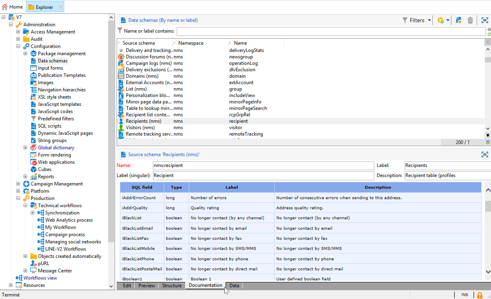

>[!NOTE]
>
>The physical and logical structure of the data carried in the application is described in XML. It obeys a grammar specific to Adobe Campaign, called a schema. For more on Adobe Campaign schemas, read out [this section](../../configuration/using/about-schema-reference.md).

## Description of the main tables {#description-main-tables}

Adobe Campaign relies on a relational database containing tables that are linked together.

The following diagram shows the joins between the main business tables of the Adobe Campaign data model with the main fields for each.

<!--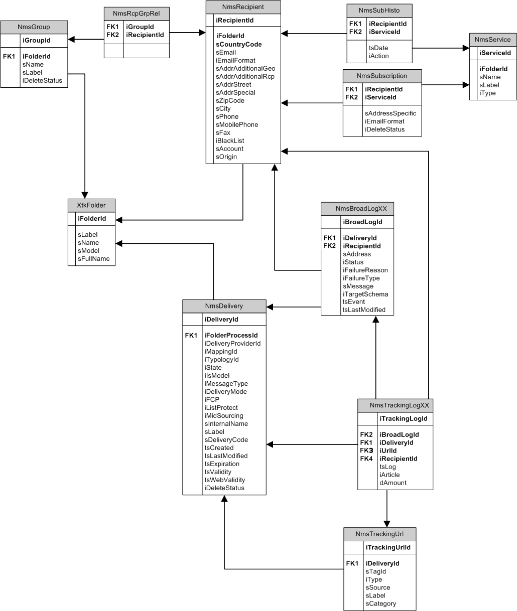-->

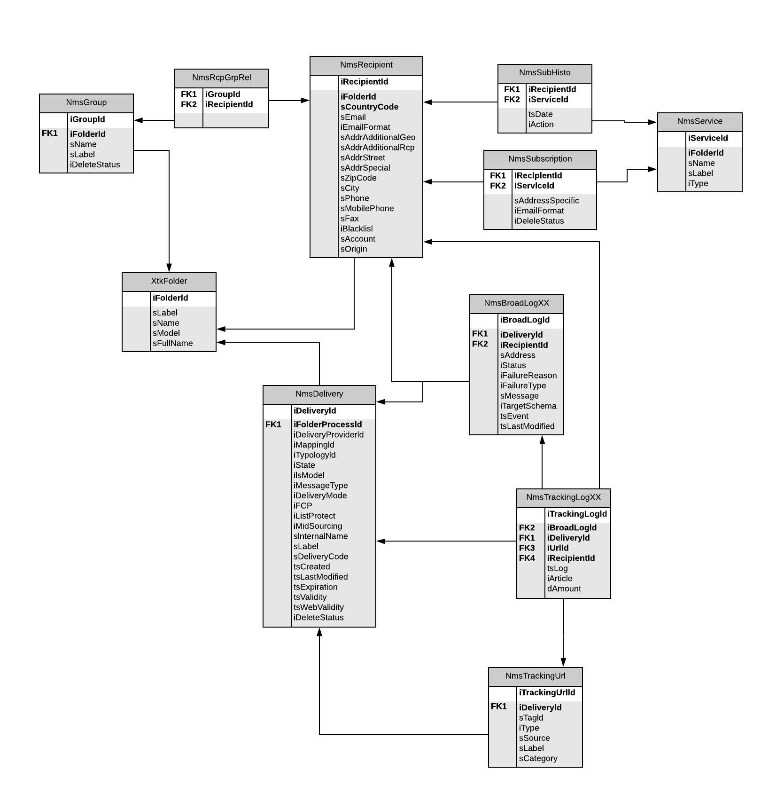

The pre-defined Adobe Campaign data model includes the main tables listed below.

### NmsRecipient {#NmsRecipient}

This table matches the **nms:recipient** schema.

It is the default table used for the **recipients of deliveries**. As a result, it contains the information required for deliveries via the various channels:

* sEmail: email address.
* iEmailFormat: preferred format for emails (1 for Text, 2 for HTML and 0 if undefined).
* sAddress1, sAddress2, sAddress3, sAddress4, sZipCode, sCity are used to build the postal address (in keeping with the XPZ 10-011 AFNOR standard from May 1997).
* sPhone, sMobilePhone, sFax contain the phone, mobile phone and fax numbers respectively.
* iBlackList is the default opt-out flag used for the profiles (1 means "unsubscribed", 0 otherwise).

The iFolderId field is the foreign key that links the recipient to its execution folder. For more on this, see [XtkFolder](#XtkFolder).

The sCountryCode field is the 3166-1 Alpha 2 ISO code (2 characters) of the country associated with the recipient. This field is actually a foreign key on the country reference table (NmsCountry), which contains the country labels and other country code data. If the country is not populated, the value 'XX' is stored (and is used in place of a zero ID record).

For more on the Recipient table, see [this section](../../configuration/using/about-data-model.md#default-recipient-table).

### NmsGroup {#NmsGroup}

This table matches the **nms:group** schema.

It enables you to create **statical groups of recipients**. There is a many-to-many relation between recipients and groups. For example, one recipient can belong to several groups and one group can contain several recipients. Groups can be created manually, via an import or via delivery targeting. Groups are often used as delivery targets. There is a unique index on the field representing the internal name of the sName group. The group is linked to a folder (The key is iFolderId. For more on this, see [XtkFolder](#XtkFolder)).

### NmsRcpGrpRel {#NmsRcpGrpRel}

The NmsRcpGrpRel relationship table only contains the two fields corresponding to the identifiers of the iRecipientId and iGroupId linked tables.

### NmsService {#NmsService}

This table matches the **nms:service** schema.

In Adobe Campaign, you can create and manage subscriptions to information services (topics). The NmsService table stores the definition of the information services (topics) that you offer your recipients to subscribe to (a newsletter for example).

Services are entities which are similar to groups (static recipient groupings), except that they circulate more information and enable easy management of subscriptions and unsubscriptions via forms.

There is a unique index on the field representing the internal name of the sName service. The service is linked to a folder (The key is iFolderId. For more on this, see [XtkFolder](#XtkFolder)). Finally, the iType field specifies the delivery channel of this service (0 for email, 1 for SMS, 2 for telephone, 3 for direct mail and 4 for fax).

### NmsSubscription {#NmsSubscription}

This table matches the **nms:subscription** schema.

It enables you to manage recipient subscriptions to information services.

### NmsSubHisto {#NmsSubHisto}

This table matches the **nms:subHisto** schema.

If the subscriptions are managed using web forms or the interface of the application, all susbcriptions and unsubscriptions are historized in the NmsSubHisto table. The iAction field specifies the action (0 for unsubscription and 1 for subscription) performed on the date stored in the tsDate field.

### NmsDelivery {#NmsDelivery}

This table matches the **nms:delivery** schema.

Each record in this table represents a **delivery action** or a **delivery template**. It contains all the necessary parameters for performing deliveries (the target, the content, etc.). Delivery (broadcast) logs (NmsBroadLog) and associated tracking URLs (NmsTrackingUrl) are created during the analysis phase (see below for further details on both of these tables).

There is a unique index on the field representing the internal name of the sInternalName delivery or scenario. The delivery is linked to an execution folder (The foreign key is iFolderProcessId. For more on this, see [XtkFolder](#XtkFolder)).

### XtkFolder {#XtkFolder}

It contains **all the folders in the tree** visible in the **Navigation** tab of the console.

The folders are typed: the value of the sModel field specifies the type of data that can be contained in the folder. This field also enables the client console to display the data correctly with the corresponding forms. The possible values for this field are defined in the navTree.

The tree is managed by the iParentId and iChildCount fields. The sFullName field gives the full path of the folder in the tree. Finally, there is a unique index on the field representing the internal name of the sName folder.

## Delivery and tracking {#delivery-and-tracking}

This set of tables is linked to the **Delivery** module, which allows to monitor deliveries and eventual issues encountered when messages are sent. For more on this, see [Monitoring deliveries](../../delivery/using/about-delivery-monitoring.md). For more on tracking, see [Tracking messages](../../delivery/using/about-message-tracking.md).

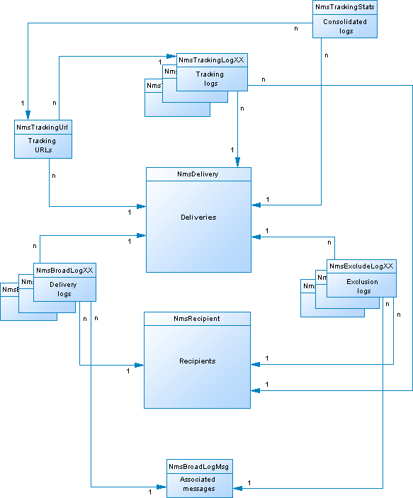

**NmsBroadLogMsg**: This table matches the **nms:broadLogMsg** schema. It is an extension of the delivery log table.

## Campaign management {#campaign-management}

This set of tables is linked to the **Marketing campaigns** module, which allows to define, optimize, execute and analyze communications and marketing campaigns. For more on this, see [About marketing campaigns](../../campaign/using/designing-marketing-campaigns.md).

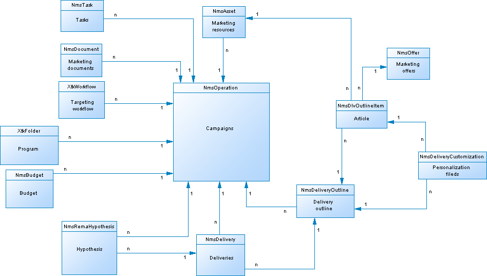

* **NmsOperation**: This table matches the **nms:operation** schema. It contains the data of marketing campaigns.
* **NmsDeliveryOutline**: This table matches the **nms:deliveryOutline** schema. It contains the extended properties of the delivery (delivery outline).
* **NmsDlvOutlineItem**: This table matches the **nms:dlvOutlineItem** schema. It contains the articles of a delivery outline.
* **NmsDeliveryCustomization**: This table matches the **nms:deliveryCustomization** schema. It contains the personalization fields of a delivery.
* **NmsBudget**: This table matches the **nms:budget** schema. It contains the data of a budget on a campaign, a plan, a program, a task and/or deliveries.
* **NmsDocument**: This table matches the **nms:document** schema. It contains the marketing documents of the campaign in the form of files (images, excel or word files, etc.)
* **XtkWorkflow**: This table matches the **xtk:workflow** schema. It contains campaign targeting.
* **NmsTask**: This table matches the **nms:task** schema. It contains the definition of a marketing task.
* **NmsAsset**: This table matches the **nms:asset** schema. It contains the definition of a marketing resource.

## Communication consistency {#communication-consistency}

This set of tables is linked to the **Campaign Optimization** module, which allows to control, filter and monitor the sending of deliveries. For more on this, see [About campaign typologies](../../campaign/using/about-campaign-typologies.md).

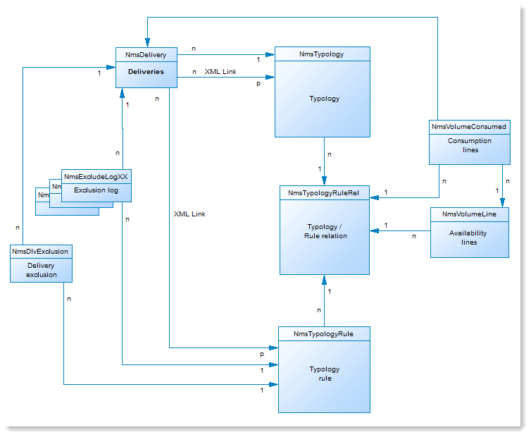

* **NmsTypologyRule**: This table matches the **nms:typologyRule** schema. It contains the rules which apply to deliveries depending on typologies.
* **NmsTypology**: This table matches the **nms:typology** schema. It contains the set of rules to be applied to deliveries which match the typology.
* **NmsTypologyRuleRel**: This table matches the **nms:typologyRuleRel** schema. It contains the relationships between typologies and their rules.
* **NmsVolumeLine**: This table matches the **nms:volumeLine** schema. It contains the set of availability lines of the capacity rules.
* **NmsVolumeConsumed**: This table matches the **nms:volumeConsumed** schema. It contains all the consumption lines of the capacity rules.

## Response management {#response-management}

This set of tables is linked to the **Response Manager** module, which allows to measure the success and profitability of marketing campaigns or offer propositions for all communication channels. For more on this, see [About response manager](../../campaign/using/about-response-manager.md).

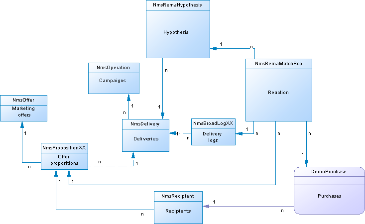

### NmsRemaHypothesis {#NmsRemaHypothesis}

This table coincides with the **nms:remaHypothesis** schema. It contains the definition of the measurement hypothesis.

This table contains significant information stored in XML, including:

**Execution context (information stored in XML)**

The execution context populates the tables and fields to be taken into account for measurement calculation, namely:
* The nms:remaMatchRcp reaction log storage schema.
* The transaction table schema (purchases for example).
* The querying schema, which enables you to define the start table of the hypothesis conditions.
* The links to individuals, which enable you to identify the individual based on the querying schema.
* The transaction date. This field is not mandatory but we recommend that you use it to restrict the calculation perimeter.
* The transaction amount: it is an optional field for automatically calculating revenue indicators.

**Hypothesis perimeter (information stored in XML)**

The hypothesis perimeter consists in the filtering of the hypothesis based on the table of the querying schema.

**Hypothesis overload script (information stored in XML)**

The hypothesis overload script is a JavaScript code which enables you to overload the content of the hypothesis during execution.

**Measurement indicators**

The following indicators are updated automatically during the hypothesis execution:

* Number of reactions: **iTransaction**. Number of lines in the reaction logs table.
* Number of contacted: **iContactReacted**. Distinct number of targeted contacts in the hypothesis.
* Control group count: **iProofReacted**. Distinct number of targeted control group contacts in the hypothesis.
* Contacted response rate: **dContactReactedRate**. Response rate of the targeted contacts in the hypothesis.
* Response rate of the control group: **dProofReactedRate**. Response rate of the hypothesis control group.
* Total revenue of population contacted: **dContactReactedTotalAmount**. Total revenue of the targeted contacts in the hypothesis.
* Average revenue of control group: **dContactReactedAvgAmount**. Average revenue of the targeted control group contacts in the hypothesis.
* Total revenue of the control group: **dProofReactedTotalAmount**. Total revenue of the hypothesis control group.
* Average revenue of control group: **dProofReactedAvgAmount**. Average revenue of the hypothesis control group.
* Total margin per contact: **dContactReactedTotalMargin**. Total margin per contact targeted in the hypothesis.
* Average margin per contact: **dContactReactedAvgMargin**. Average margin per contact targeted in the hypothesis.
* Total margin of control group: **dProofReactedTotalMargin**. Total margin of the control group targeted in the hypothesis.
* Average margin of control group: **dProofReactedAvgMargin**. Average margin of the control group targeted in the hypothesis.
* Additional revenue: **dAdditionnalAmount**. (Average revenue of contacted - Average revenue of control group) * Number of contacted.
* Additional margin: **dAdditionnalMargin**. (Average margin of contacted - Average margin of control group) / Number of contacted.
* Average cost per contact (SQL expression). Calculated cost of the delivery / Number of contacted.
* ROI (SQL expression). Calculated cost of the delivery / Total margin of contacted.
* Effective ROI (SQL expression). Calculated cost of the delivery / Additional margin.
* Significance: **iSignificativy** (SQL expression). Contains values from 0 to 3 depending on the significance of the campaign.

### NmsRemaMatchRcp {#NmsRemaMatchRcp}

This table matches the **nms:remaMatchRcp** schema.

It contains a record representing an individual's reaction to a given hypothesis. These records were created during hypothesis execution.

## Simulation and delivery {#simulation-and-delivery}

This set of tables is linked to the **Simulation** module, which allows to test the distribution of offers belonging to a category or an environment before sending your proposition to recipients. For more on this, see [About offers simulation](../../interaction/using/about-offers-simulation.md).

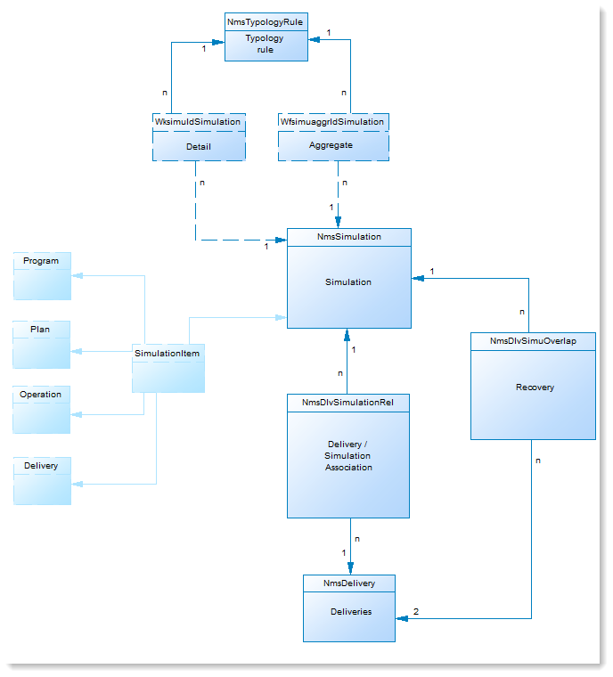

* **NmsSimulation**: This table matches the **nms:simulation** schema. It represents a simulation for a set of deliveries or offers on a given population.
* **NmsDlvSimulationRel**: This table matches the **nms:dlvSimulationRel** schema. It contains the list of deliveries taken into account in the simulation. The scope of the simulation is stored in XML.
* **NmsOfferSimulationRel**: This table matches the **nms:offerSimulationRel** schema. It lets you link up a simulation with an offer.

## Interaction Module {#interaction-module}

This set of tables is linked to the **Interaction** module, which allows to respond in real time during an interaction with a given contact by making them a single or several adapted offers. For more on this, see [Interaction and offer management](../../interaction/using/interaction-and-offer-management.md).

* **NmsOffer**: This table matches the **nms:offer** schema. It contains the definition of each marketing offer.
* **NmsPropositionRcp**: This table matches the **nms:propositionRcp** schema. It contains the cross-channel log of marketing propositions sent to each individual. The record is created when a proposition is prepared or effectively made to an individual.
* **NmsOfferSpace**: This table matches the **nms:offerSpace** schema. It contains the definition of locations on which propositions are made.
* **NmsOfferContext**: This table matches the **nms:offerContext** schema. It contains additional criteria on the applicability of the proposition as well as the definition of the weight calculation formula.
* **NmsOfferView**: This table matches the **nms:offerView**. It contains the offer representations.
* **NmsOfferCategory**: This table matches the **nms:offerCategory**. It contains the offer categories.
* **NmsOfferEnv**: This table matches the **nms:offerEnv**. It contains the offer environments.

## Message Center Module {#message-center-module}

The following set of tables is linked to the **Transactional messaging** (Message Center) module, which allows to manage individual and unique communications sent to a user and generated from events triggered from information systems. For more on this, see [About transactional messaging](../../message-center/using/about-transactional-messaging.md).

### NmsRtEvent {#NmsRtEvent}

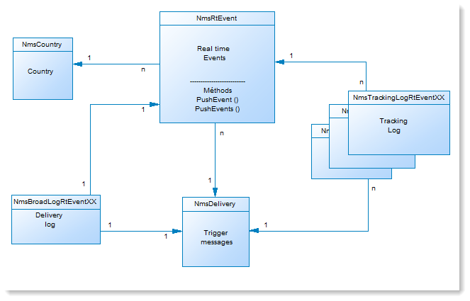

This table matches the **nms:rtEvent** schema. It contains a definition of real time events.

### NmsBatchEvent {#NmsBatchEvent}

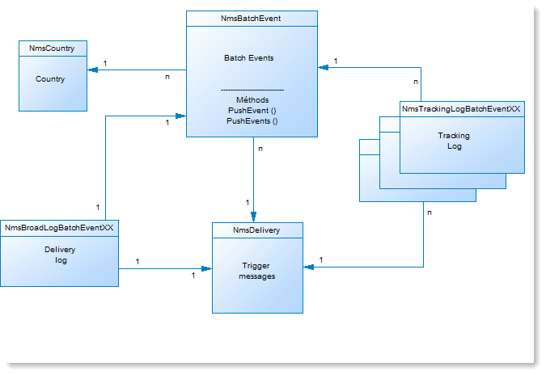

This table matches the **nms:batchEvent** schema. It contains the definition of events by batch.

<!--## Microsites Module {#microsites-module}

This set of tables is linked to the **Web applications** functionality, which allows to create and publish dynamic and interactive web applications with data from the database and content adapted to the rights of the connected user. For more on this, see [About web applications](../../web/using/about-web-applications.md).

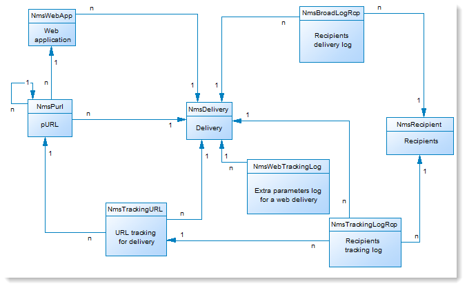

* **NmsTrackingUrl**: This table matches the **nms:trackingUrl** schema.

* **NmsPurl**: This table matches the **nms:purl** schema.-->

## NMAC Module {#nmac-module}

This set of tables is linked to the **Mobile App Channel**, which allows to send personalized notifications to iOS and Android terminals via apps. For more on this, see [About mobile app channel](../../delivery/using/about-mobile-app-channel.md).

* **NmsMobileApp**: This table matches the **nms:mobileApp** schema. It contains the mobile applications defined in Adobe Campaign.
* **NmsAppSubscription**: This table matches the **nms:appSubscription** schema. It contains the subscribers information regarding one or more applications.
* **NmsAppSubscriptionRcp**: This table matches the **nms:appSubscriptionRcp** schema. It enables you to link up visitors who subscribed to an application with the recipients table.
* **NmsExcludeLogAppSubRcp**: This table matches the **nms:excludeLogAppSubRcp** schema.
* **NmsTrackingLogAppSubRcp**: This table matches the **nms:trackingLogAppSubRcp** schema.
* **NmsBroadLogAppSubRcp**: This table matches the **nms:broadLogAppSubRcp** schema.

## Social Marketing Module {#social-marketing-module}

This set of tables is linked to the **Managing social networks** module, which allows to interact with customers and prospects via Facebook and Twitter. For more on this, see [About social marketing](../../social/using/about-social-marketing.md).

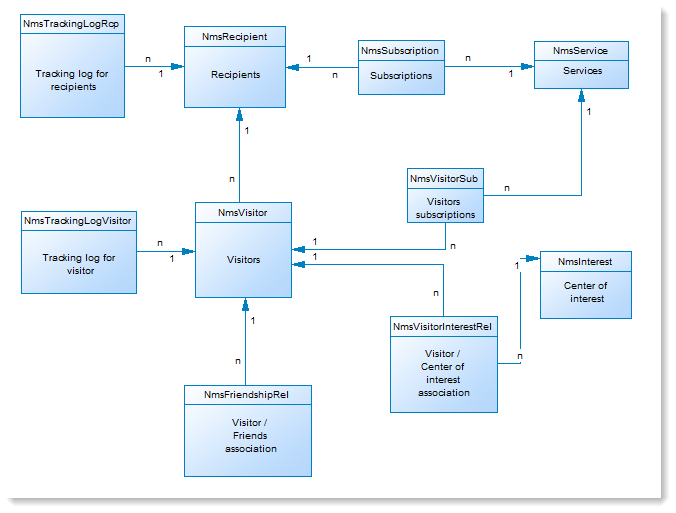

* **NmsVisitor**: This table matches the **nms:visitor** schema. It contains information on visitors.
* **NmsVisitorSub**: This table matches the **nms:visitorSub** schema. It enables you to link up a visitor to the services which they have subscribed to (Twitter or Facebook).
* **NmsFriendShipRel**: This table matches the **nms:friendshipRel** schema. It enables you to link up visitors with their friends within the context of the Facebook service.
* **NmsVisitorInterestRel**: This table matches the **nms:visitorInterestRel** schema. It enables you to link up visitors and their interests.
* **NmsInterest**: This table matches the **nms:interest** schema. It contains the list of interests for each visitor.
