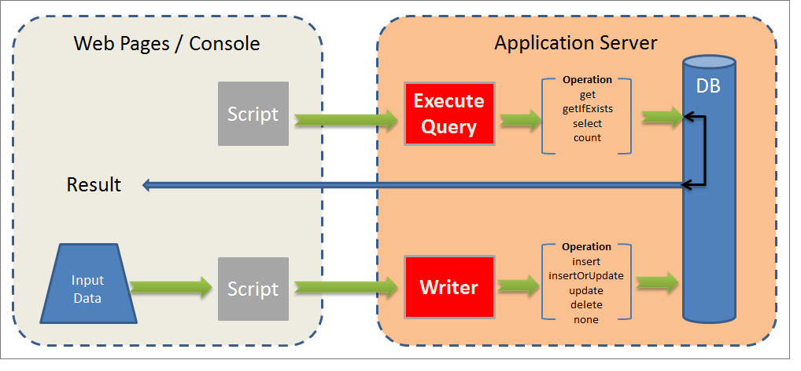
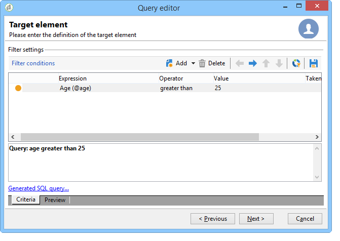
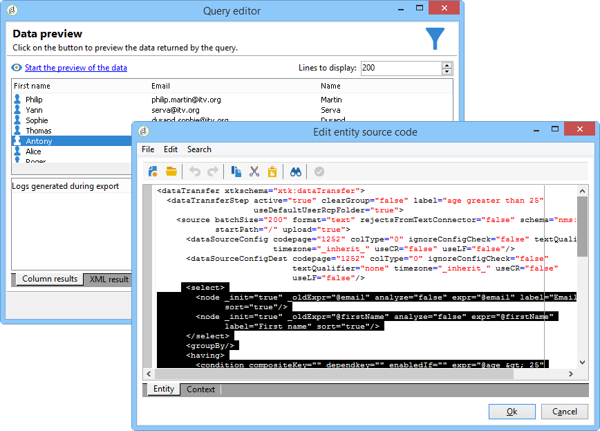

# Data oriented APIs{#data-oriented-apis}

Data oriented APIs let you address the entire datamodel.

## Overview of the datamodel {#overview-of-the-datamodel}

Adobe Campaign does not offer a dedicated read API per entity (no getRecipient or getDelivery function, etc.). Use the QUERY & WRITER data read and modification methods to access the data of the model.

Adobe Campaign lets you manage collections: queries enable you to recover a set of information collected throughout the base. Unlike access in SQL mode, Adobe Campaign APIs return an XML tree instead of data columns. Adobe Campaign thus creates composite documents with all the collected data.

This operating mode does not offer one-to-one mapping between the attributes and elements of the XML documents and the columns of the tables in the database.

XML documents are stored in MEMO type fields of the database.

## Description of the model {#description-of-the-model}

You must be familiar with the Adobe Campaign data model to be able to address the fields of the database in your scripts.

For a presentation of the data model, refer to the [Adobe Campaign Data model description](../../configuration/using/data-model-description.md).

In order to generate its structure, refer to this article: [How to generate a Data Model or Data Dictionary](https://helpx.adobe.com/campaign/kb/generate-data-model.html).

## Query and Writer {#query-and-writer}

The following introduction schema details low level exchanges for reading (ExecuteQuery) and writing (Writer) between database and customer (web pages or Adobe Campaign client console).



### ExecuteQuery {#executequery}

For columns and conditions, you can use Queries.

This lets you isolate the underlying SQL. The query language does not depend on the underlying engine: some functions will be re-mapped, which may generate several SELECT SQL orders.

For more on this, refer to [Example on the 'ExecuteQuery' method of schema 'xtk:queryDef'](../../configuration/using/web-service-calls.md#example-on-the--executequery--method-of-schema--xtk-querydef-).

The **ExecuteQuery** method is presented in [ExecuteQuery (xtk:queryDef)](#executequery--xtk-querydef-).

### Write {#write}

Write commands let you write simple or complex documents, with entries in one or more tables of the base.

Transactional APIs let you manage reconciliations via the **updateOrInsert** command: one command lets you create or update data. You can also configure modification merging (**merge**): this operating mode lets you authorize partial updates.

The XML structure offers a logical view of the data and lets you sidestep the physical structure of the SQL table.

The Write method is presented in [Write / WriteCollection (xtk:session)](#write---writecollection--xtk-session-).

## ExecuteQuery (xtk:queryDef) {#executequery--xtk-querydef-}

This method lets you perform queries from data associated with a schema. It takes an authentication string (must be logged in) and an XML document describing the query to be submitted as parameters. The return parameter is an XML document containing the result of the query in the format of the schema to which the query refers.

Definition of the "ExecuteQuery" method in the "xtk:queryDef" schema:

```
<method name="ExecuteQuery" const="true">
  <parameters>
    <param desc="Output XML document" name="output" type="DOMDocument" inout="out"/>
  </parameters>
</method>

```

>[!NOTE]
>
>This is a "const" method. The input parameters are included in an XML document in the format of the "xtk:queryDef" schema.

### Format of the XML document of the input query {#format-of-the-xml-document-of-the-input-query}

The structure of the XML document of the query is described in the "xtk:queryDef " schema. This document describes the clauses of a SQL query: "select", "where", "order by", "group by", "having".

```
<queryDef schema="schema_key" operation="operation_type">
  <select>
    <node expr="expression1">
    <node expr="expression2">
    ...
  </select>
  <where> 
    <condition expr="expression1"/> 
    <condition expr="expression2"/>
    ... 
  </where>
  <orderBy>
    <node expr="expression1">
    <node expr="expression2">
    ...
  </orderBy>
  <groupBy>
    <node expr="expression1">
    <node expr="expression2">
    ...
  </groupBy>
  <having>
    <condition expr="expression1"/> 
    <condition expr="expression2"/>
    ...
  </having>
</queryDef>
```

A sub-query ( `<subquery>`  ) can be defined in a  `<condition> `  element. The syntax for a   `<subquery> `   element is based on the syntax of a    `<querydef>`. 

Example of a `<subquery>  : </subquery>`

```

<condition setOperator="NOT IN" expr="@id" enabledIf="$(/ignored/@ownerType)=1">
  <subQuery schema="xtk:operatorGroup">
     <select>
       <node expr="[@operator-id]" />
     </select>
     <where>
       <condition expr="[@group-id]=$long(../@owner-id)"/>
     </where>
   </subQuery>
</condition>  
  
```

A query must reference a start schema from the **schema** attribute.

The type of operation desired is entered in the **operation** attribute and contains one of the following values:

* **get**: retrieves a record from the table and returns an error if the data does not exist,
* **getIfExists**: retrieves a record from the table and returns an empty document if the data does not exist,
* **select**: creates a cursor to return several records and returns an empty document if there is no data,
* **count**: returns a data count.

The **XPath** syntax is used to locate data based on the input schema. For further information about XPaths, refer to [Data schemas](../../configuration/using/data-schemas.md).

#### Example with the 'get' operation {#example-with-the--get--operation}

Retrieves the last name and first name of a recipient ("nms:recipient" schema) with a filter on the e-mail.

```
<queryDef schema="nms:recipient" operation="get">
  <!-- fields to retrieve -->
  <select>
    <node expr="@firstName"/>
    <node expr="@lastName"/>
  </select> 

  <!-- condition on email -->
  <where>  
    <condition expr="@email= 'john.doe@aol.com'"/>
  </where>
</queryDef>

```

#### Example with the 'select' operation {#example-with-the--select--operation}

Returns the list of recipients filtered on a folder and the e-mail domain with a sort in descending order on date of birth.

```
<queryDef schema="nms:recipient" operation="select">
  <select>
    <node expr="@email"/>
    <!-- builds a string with the concatenation of the last name and first name separated by a dash -->      
    <node expr="@lastName+'-'+@firstName"/>
    <!-- get year of birth date -->
    <node expr="Year(@birthDate)"/>
  </select> 

  <where>  
     <condition expr="[@folder-id] = 1234 and @domain like 'Adobe%'"/>
  </where>

  <!-- order by birth date -->
  <orderBy>
    <node expr="@birthDate" sortDesc="true"/> <!-- by default sortDesc="false" -->
  </orderBy>
</queryDef>
```

Expressions can be simple fields or complex expressions such as arithmetic operations or the concatenation of strings.

To limit the number of records to be returned, add the **lineCount** attribute to the `<querydef>` element.

To limit the number of records returned by the query to 100:

```
<queryDef schema="nms:recipient" operation="select" lineCount="100">
...
```

To retrieve the next 100 records, run the same query again, adding the **startLine** attribute.

```
<queryDef schema="nms:recipient" operation="select" lineCount="100" startLine="100">
...
```

#### Example with the 'count' operation {#example-with-the--count--operation}

To count the number of records on a query:

```
<queryDef schema="nms:recipient" operation="count"">
  <!-- condition on the folder and domain of the e-mail -->
  <where>  
    <condition expr="[@folder-id] = 1234" and @domain like 'Adobe%'"/>
  </where>
</queryDef>
```

>[!NOTE]
>
>Again we use the condition from the previous example. The `<select>` and clauses are not used. `</select>`

#### Data grouping {#data-grouping}

To retrieve e-mail addresses referenced more than once:

```
<queryDef schema="nms:recipient" operation="select">
  <select>
    <node expr="@email"/>
    <node expr="count(@email)"/>
  </select>

  <!-- e-mail grouping clause -->
  <groupby>
    <node expr="@email"/>
  </groupby>

  <!-- grouping condition -->
  <having>
    <condition expr="count(@email) > 1"/>
  </having>

</queryDef>

```

The query can be simplified by adding the **groupBy** attribute directly to the field to be grouped:

```
<select>
  <node expr="@email" groupBy="true"/>
</select>

```

>[!NOTE]
>
>It is no longer necessary to populate the `<groupby>` element.

#### Bracketing in conditions {#bracketing-in-conditions}

Here are two examples of bracketing on the same condition.

* The simple version in a single expression:

  ```
  <where>
    <condition expr="(@age > 15 or @age <= 45) and  (@city = 'Newton' or @city = 'Culver City') "/>
  </where>
  
  ```

* The structured version with `<condition>` elements:

  ```
  <where>
    <condition bool-operator="AND">
      <condition expr="@age > 15" bool-operator="OR"/>
      <condition expr="@age <= 45"/>
    </condition>
    <condition>
      <condition expr="@city = 'Newton'" bool-operator="OR"/>
      <condition expr="@city = 'Culver City'"/>
    </condition>
  </where>
  
  ```

It is possible to replace the 'OR' operator with the 'IN' operation when several conditions apply to the same field:

```
<where>
  <condition>
    <condition expr="@age IN (15, 45)"/>
    <condition expr="@city IN ('Newton', 'Culver City')"/>
  </condition>
</where>

```

This syntax simplifies the query when more than two data are used in the condition.

#### Examples on links {#examples-on-links}

* Links 1-1 or N1: when the table has the foreign key (the link starts from the table), the fields of the linked table can be filtered or retrieved directly.

  Example of a filter on the folder label:

  ```
  <where>
    <condition expr="[folder/@label] like 'Segment%'"/>
  </where>
  
  ```

  To retrieve the fields of the folder from the "nms:recipient" schema:

  ```
  <select>
    <!-- label of recipient folder -->
    <node expr="[folder/@label]"/>
    <!-- displays the string count of the folder -->
    <node expr="partition"/>
  </select>
  ```

* Collection links (1N): the filtering on the fields of a collection table must be performed via the **EXISTS** or **NOT EXISTS** operator.

  To filter the recipients who have subscribed to the 'Newsletter' information service:

  ```
  <where>
    <condition expr="subscription" setOperator="EXISTS">
      <condition expr="@name = 'Newsletter'"/>
    </condition>
  </where>
  
  ```

  Direct retrieval of the fields of a collection link from the `<select>` clause is not recommended because the query returns a cardinal product. It is used only when the linked table contains only one record (example `<node expr="">`).

  Example on the "subscription" collection link:

  ```
  <select>
    <node expr="subscription/@label"/>
  </select>
  ```

  It is possible to retrieve a sub-list containing the elements of a collection link in the `<select>` clause. The XPaths of the referenced fields are contextual from the collection element.

  The filtering ( `<orderby>`  ) and restriction (  `<where>`  ) elements can be added to the collection element.

  In this example, for each recipient the query returns the e-mail and list of information services to which the recipient subscribes:

  ```
  <queryDef schema="nms:recipient" operation="select">
    <select>
      <node expr="@email"/>
      
      <!-- collection table (unbound type) -->
      <node expr="subscription">  
        <node expr="[service/@label]"/>    
        <!-- sub-condition on the collection table -->
        <where>  
          <condition expr="@expirationDate >= GetDate()"/>
        </where>
        <orderBy>
          <node expr="@expirationDate"/> 
        </orderBy>
      </node>
    </select> 
  </queryDef>
  ```

#### Binding the parameters of the 'where' and 'select' clause {#binding-the-parameters-of-the--where--and--select--clause}

The binding of parameters lets the engine set the values of the parameters used in the query. This is very useful, since the engine is in charge of the escaping of values, and there is the additional benefit of a cache for the parameters to be retrieved.

When a query is constructed, the "bound" values are replaced by a character (? in ODBC, `#[index]#` in postgres...) in the body of the SQL query.

```
<select>
  <!--the value will be bound by the engine -->
  <node expr="@startDate = #2002/02/01#"/>                   
  <!-- the value will not be bound by the engine but visible directly in the query -->
  <node expr="@startDate = #2002/02/01#" noSqlBind="true"/> 
</select>

```

To avoid binding a parameter, the "noSqlBind" attribute must be populated with the value 'true'.

>[!IMPORTANT]
>
>If the query includes "order-by" or "group-by" instructions, the database engines will not be able to "bind" values. You must place the @noSqlBind="true" attribute on the "select" and/or "where" instructions of the query.

#### Query-building tip: {#query-building-tip-}

To help with the syntax of a query, you can write the query using the generic query editor in the Adobe Campaign client console ( **[!UICONTROL Tools/ Generic query editor...]** menu). To do this:

1. Select the data to be retrieved:

   

1. Define the filter condition:

   

1. Execute the query and press CTRL+F4 to view the query source code. 

   

### Output document format {#output-document-format}

The return parameter is an XML document in the format of the schema associated with the query.

Example of a return from the "nms:recipient" schema on a "get" operation:

```
<recipient email="john.doe@adobe.com" lastName"Doe" firstName="John"/>
```

On a "select" operation, the document returned is an enumeration of elements:

```
<!-- the name of the first element does not matter -->
<recipient-collection>   
  <recipient email="john.doe@adobe.com" lastName"Doe" firstName="John"/>
  <recipient email="peter.martinez@adobe.com" lastName"Martinez" firstName="Peter"/>
  <recipient...
</recipient-collection>  

```

Example of a document returned for "count" type operation:

```
<recipient count="3"/>
```

#### Alias {#alias}

An alias lets you modify the location of data in the output document. The **alias** attribute must specify an XPath on the corresponding field.

```
<queryDef schema="nms:recipient" operation="get">
  <select>
    <node expr="@firstName" alias="@firstName"/>
    <node expr="@lastName"/>
    <node expr="[folder/@label]" alias="@My_folder"/>
  </select> 
</queryDef>
```

Returns:

```
<recipient My_folder="Recipients" First name ="John" lastName="Doe"/>
```

Instead of:

```
<recipient firstName="John" lastName="Doe">
  <folder label="Recipients"/>
</recipient>

```

### Example of SOAP messages {#example-of-soap-messages}

* Query:

  ```
  <?xml version='1.0' encoding='ISO-8859-1'?>
  <SOAP-ENV:Envelope xmlns:xsd='http://www.w3.org/2001/XMLSchema' xmlns:xsi='http://www.w3.org/2001/XMLSchema-instance' xmlns:ns='http://xml.apache.org/xml-soap' xmlns:SOAP-ENV='http://schemas.xmlsoap.org/soap/envelope/'>
    <SOAP-ENV:Body>
      <ExecuteQuery xmlns='urn:xtk:queryDef' SOAP-ENV:encodingStyle='http://schemas.xmlsoap.org/soap/encoding/'>
        <__sessiontoken xsi:type='xsd:string'/>
        <entity xsi:type='ns:Element' SOAP-ENV:encodingStyle='http://xml.apache.org/xml-soap/literalxml'>
          <queryDef operation="get" schema="nms:recipient" xtkschema="xtk:queryDef">
            <select>
              <node expr="@email"/>
              <node expr="@lastName"/>
              <node expr="@firstName"/>
            </select>
            <where>
              <condition expr="@id = 3599"/>
            </where>
          </queryDef>
        </entity>
      </ExecuteQuery>
    </SOAP-ENV:Body>
  </SOAP-ENV:Envelope>
  
  ```

* Response:

  ```
  <?xml version='1.0' encoding='ISO-8859-1'?>
  <SOAP-ENV:Envelope xmlns:xsd='http://www.w3.org/2001/XMLSchema' xmlns:xsi='http://www.w3.org/2001/XMLSchema-instance' xmlns:ns='http://xml.apache.org/xml-soap' xmlns:SOAP-ENV='http://schemas.xmlsoap.org/soap/envelope/'>
    <SOAP-ENV:Body>
      <ExecuteQueryResponse xmlns='urn:xtk:queryDef' SOAP-ENV:encodingStyle='http://schemas.xmlsoap.org/soap/encoding/'>
        <pdomOutput xsi:type='ns:Element' SOAP-ENV:encodingStyle='http://xml.apache.org/xml-soap/literalxml'>
          <recipient email="john.doe@adobe.com" lastName"Doe" firstName="John"/>
        </pdomOutput>
      </ExecuteQueryResponse>
    </SOAP-ENV:Body>
  </SOAP-ENV:Envelope>
  
  ```

## Write / WriteCollection (xtk:session) {#write---writecollection--xtk-session-}

These services are used to insert, update, or delete an entity ("Write" method) or a collection of entities ("WriteCollection" method).

The entities to be updated are associated with a data schema. The input parameters are an authentication string (must be logged in) and an XML document containing the data to be updated.

This document is supplemented by instructions for configuring the write procedures.

The call does not return any data, except errors.

Definition of the "Write" and "WriteCollection" methods in the "xtk:session" schema:

```
<method name="Write" static="true">
  <parameters>
    <param name="doc" type="DOMDocument" desc="Difference document"/>
  </parameters>
</method>
<method name="WriteCollection" static="true">
  <parameters>
    <param name="doc" type="DOMDocument" desc="Difference collection document"/>
  </parameters>
</method>

```

>[!NOTE]
>
>This is a "static" method. The input parameters are included in an XML document in the format of the schema to be updated.

### Overview {#overview}

Data reconciliation operates based on the definition of the keys entered in the associated schema. The write procedure looks for the first eligible key based on the data entered in the input document. The entity is inserted or updated based on its existence in the database.

The key of the schema of the entity to be updated is completed based on the **xtkschema** attribute.

The reconciliation key can therefore be forced with the **_key** attribute containing the list of XPaths that make up the key (separated by commas).

It is possible to force the type of operation by populating the **_operation** attribute with the following values:

* **insert**: forces the insertion of the record (the reconciliation key is not used),
* **insertOrUpdate**: updates or inserts the record depending on the reconciliation key (default mode),
* **update**: updates the record; does nothing if the data does not exist,
* **delete**: deletes the records,
* **none**: used only for link reconciliation, without update or insertion.

### Example with the 'Write' method {#example-with-the--write--method}

Updating or inserting a recipient (implicit "insertOrUpdate" operation) with e-mail address, date of birth and town:

```
<recipient xtkschema="nms:recipient" email="john.doe@adobe.com" birthDate="1956/05/04" folder-id=1203 _key="@email, [@folder-id]">
  <location city="Newton"/>
</recipient>

```

Deleting a recipient:

```
<recipient xtkschema="nms:recipient" _operation="delete" email="rene.dupont@adobe.com" folder-id=1203 _key="@email, [@folder-id]"/>

```

>[!NOTE]
>
>For a deletion operation, the input document must contain only the fields that make up the reconciliation key.

### Example with the 'WriteCollection' method {#example-with-the--writecollection--method}

Update or insertion for several recipients:

```
<recipient-collection xtkschema="nms:recipient">    
  <recipient email="john.doe@adobe.com" firstName="John" lastName="Doe" _key="@email"/>
  <recipient email="peter.martinez@adobe.com" firstName="Peter" lastName="Martinez" _key="@email"/>
  <recipient ...
</recipient-collection>

```

### Example on links {#example-on-links}

#### Example 1 {#example-1}

Associating the folder with a recipient based on its internal name (@name).

```
<recipient _key="[folder/@name], @email" email="john.doe@adobe.net" lastName="Doe" firstName="John" xtkschema="nms:recipient">
  <folder name="Folder2" _operation="none"/>
</recipient>
```

The "_key" and "_operation" attributes can be entered on a linked element. The behavior on this element is the same as on the main element of the input schema.

The definition of the key of the main entity ("nms:recipient") consists of a field from a linked table (element `<folder>`  schema "xtk:folder") and the e-mail.

>[!NOTE]
>
>The operation "none" entered on the folder element defines a reconciliation on the folder without update or insert.

#### Example 2 {#example-2}

Updating the company (linked table in "cus:company" schema) from a recipient:

```
<recipient _key="[folder/@name], @email" email="john.doe@adobe.net" lastName="Doe" firstName="John" xtkschema="nms:recipient">
  <company name="adobe" code="ERT12T" _key="@name" _operation="update"/>
</recipient>
```

#### Example 3 {#example-3}

Adding a recipient to a group with the group relation table ("nms:rcpGrpRel"):

```
<recipient _key="@email" email="martin.ledger@adobe.net" xtkschema="nms:recipient">
  <rcpGrpRel _key="[rcpGroup/@name]">
    <rcpGroup name="GRP1"/>
  </rcpGrpRel>
</recipient>
```

>[!NOTE]
>
>The definition of the key is not entered in the `<rcpgroup>` element because an implicit key based on the group name is defined in the "nms:group" schema.

### XML collection elements {#xml-collection-elements}

By default, all the collection elements must be populated in order to update the XML collection elements. Data from the database will be replaced with data from the input document. If the document contains only the elements to be updated, you must populate the "_operation" attribute on all collection elements to be updated in order to force a merge with the XML data of the database.

### Example of SOAP messages {#example-of-soap-messages-1}

* Query:

  ```
  <?xml version='1.0' encoding='ISO-8859-1'?>
  <SOAP-ENV:Envelope xmlns:xsd='http://www.w3.org/2001/XMLSchema' xmlns:xsi='http://www.w3.org/2001/XMLSchema-instance' xmlns:ns='http://xml.apache.org/xml-soap' xmlns:SOAP-ENV='http://schemas.xmlsoap.org/soap/envelope/'>
    <SOAP-ENV:Body>
      <Write xmlns='urn:xtk:persist' SOAP-ENV:encodingStyle='http://schemas.xmlsoap.org/soap/encoding/'>
        <__sessiontoken xsi:type='xsd:string'/>
        <domDoc xsi:type='ns:Element' SOAP-ENV:encodingStyle='http://xml.apache.org/xml-soap/literalxml'>
          <recipient xtkschema="nms:recipient" email="rene.dupont@adobe.com" firstName="René" lastName="Dupont" _key="@email">
        </domDoc>
      </Write>
    </SOAP-ENV:Body>
  </SOAP-ENV:Envelope>
  
  ```

* Response:

  ```
  <?xml version='1.0' encoding='ISO-8859-1'?>
  <SOAP-ENV:Envelope xmlns:xsd='http://www.w3.org/2001/XMLSchema' xmlns:xsi='http://www.w3.org/2001/XMLSchema-instance' xmlns:ns='http://xml.apache.org/xml-soap' xmlns:SOAP-ENV='http://schemas.xmlsoap.org/soap/envelope/'>
    <SOAP-ENV:Body>
      <WriteResponse xmlns='urn:' SOAP-ENV:encodingStyle='http://schemas.xmlsoap.org/soap/encoding/'>
      </WriteResponse>
    </SOAP-ENV:Body>
  </SOAP-ENV:Envelope>
  
  ```

  Return with error:

  ```
  <?xml version='1.0'?>
  <SOAP-ENV:Envelope xmlns:xsd="http://www.w3.org/2001/XMLSchema" xmlns:xsi="http://www.w3.org/2001/XMLSchema-instance" xmlns:SOAP-ENV='http://schemas.xmlsoap.org/soap/envelope/'>
    <SOAP-ENV:Body>
      <SOAP-ENV:Fault>
        <faultcode>SOAP-ENV:Server</faultcode>
        <faultstring xsi:type="xsd:string">Error while executing the method 'Write' of service 'xtk:persist'.</faultstring>
        <detail xsi:type="xsd:string">PostgreSQL error: ERROR:  duplicate key violates unique constraint &quot;nmsrecipient_id&quot;Impossible to save document of type 'Recipients (nms:recipient)'</detail>
      </SOAP-ENV:Fault>
    </SOAP-ENV:Body>
  </SOAP-ENV:Envelope>
  ```
