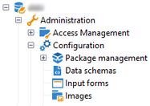
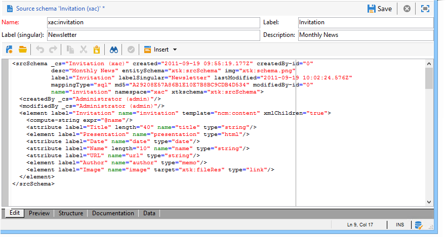
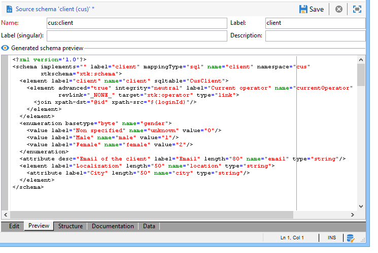
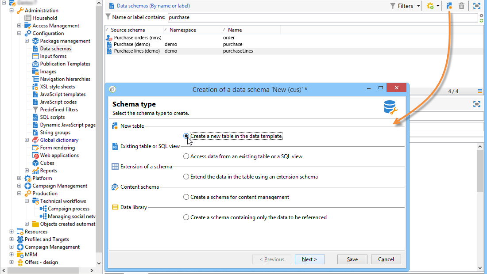
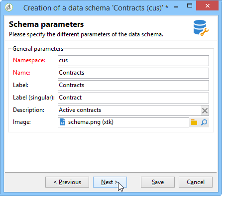
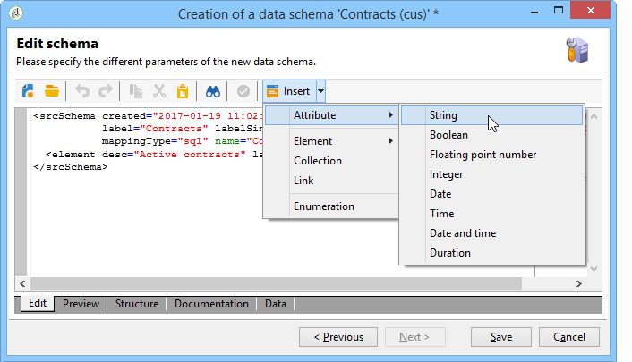
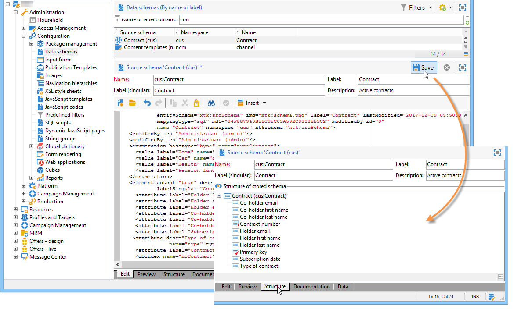

# Data schemas{#data-schemas}

## Principles {#principles}

To edit, create and configure the schemas, click the **[!UICONTROL Administration > Configuration > Data schemas]** node of the Adobe Campaign client console.

>[!NOTE]
>
>Out-of-the-box data schemas can only be deleted by an administrator of your Adobe Campaign Classic console.



The edit field shows the XML content of the source schema:



>[!NOTE]
>
>The "Name" edit control lets you enter the schema key made up of the name and namespace. The "name" and "namespace" attributes of the root element of the schema are automatically updated in the XML editing zone of the schema.

The preview automatically generates the extended schema:



>[!NOTE]
>
>When the source schema is saved, generation of the extended schema is automatically launched.

If you need to check the complete structure of a schema, you can use the preview tab. If the schema has been extended, you will then be able to visualize all its extensions. As a complement, the Documentation tab displays all the schema attributes and elements, and their properties (SQL Field, type/length, label, description). The Documentation tab only applies to generated schemas. For more on this, refer to the [Regenerating schemas](../../configuration/using/regenerating-schemas.md) section.

## Example: creating a contract table {#example--creating-a-contract-table}

In the following example, we want to create a new table for **contracts** in the database model of the Adobe Campaign database. This table lets you store first and last names and email addresses of holders and co-holders, for each contract.

To do this, you need to create the schema of the table and update the database structure to generate the corresponding table. Apply the following stages:

1. Edit the **[!UICONTROL Administration > Configuration > Data schemas]** node of the Adobe Campaign tree and click **[!UICONTROL New]** .
1. Choose the **[!UICONTROL Create a new table in the data model]** option and click **[!UICONTROL Next]** .

   

1. Specify a name for the table and a namespace.

   

   >[!NOTE]
   >
   >By default, schemas created by users are stored in the 'cus' namespace. For more on this, refer to [Identification of a schema](../../configuration/using/about-schema-reference.md#identification-of-a-schema).

1. Create the content of the table. We recommend using the entry wizard to make sure no settings are missing. To do this, click the **[!UICONTROL Insert]** button and choose the type of setting to be added.

   

1. Define the settings for the contract table:

   ```
   <srcSchema desc="Active contracts" img="ncm:channels.png" label="Contracts" labelSingular="Contract" mappingType="sql" name="Contracts" namespace="cus" xtkschema="xtk:srcSchema">
     <element desc="Active contracts" img="ncm:channels.png" label="Contracts" labelSingular="Contract"
              name="Contracts" autopk="true">
              <attribute name="holderName" label="Holder last name" type="string"/>
              <attribute name="holderFirstName" label="Holder first name" type="string"/>
              <attribute name="holderEmail" label="Holder email" type="string"/>
              <attribute name="co-holderName" label="Co-holder last name" type="string"/>           
              <attribute name="co-holderFirstName" label="Co-holder first name" type="string"/>           
              <attribute name="co-holderEmail" label="Co-holder email" type="string"/>    
              <attribute name="date" label="Subscription date" type="date"/>     
              <attribute name="noContract" label="Contract number" type="long"/>  
     </element>
   </srcSchema>
   ```

   Add the type of contract and place an index on the contract number.

   ```
   <srcSchema _cs="Contracts (cus)" desc="Active contracts" entitySchema="xtk:srcSchema" img="ncm:channels.png"
              label="Contracts" labelSingular="Contract" name="Contracts" namespace="cus" xtkschema="xtk:srcSchema">
     <enumeration basetype="byte" name="typeContract">
       <value label="Home" name="home" value="0"/>
       <value label="Car" name="car" value="1"/>
       <value label="Health" name="health" value="2"/>
       <value label="Pension fund" name="pension fund" value="2"/>
     </enumeration>
     <element autopk="true" desc="Active contracts" img="ncm:channels.png" label="Contracts"
              labelSingular="Contract" name="Contracts">
       <attribute label="Holder last name" name="holderName" type="string"/>
       <attribute label="Holder first name" name="holderFirstName" type="string"/>
       <attribute label="Holder email" name="holderEmail" type="string"/>
       <attribute label="Co-holder last name" name="co-holderName" type="string"/>
       <attribute label="Co-holder first name" name="co-holderFirstName" type="string"/>
       <attribute label="Co-holder email" name="co-holderEmail" type="string"/>
       <attribute label="Subscription date" name="date" type="date"/>
      <attribute desc="Type of contract" enum="cus:Contracts:typeContract" label="Type of contract"
                  name="type" type="byte"/>
       <attribute label="Contract number" name="noContract" type="long"/>
       <dbindex name="noContract" unique="true">
         <keyfield xpath="@noContract"/>
       </dbindex>
     </element>
   </srcSchema>
   ```

1. Save the schema to generate the structure:

   

1. Update the database structure to create the table which the schema will be linked to. For more on this, refer to [Updating the database structure](../../configuration/using/updating-the-database-structure.md).
