# Edit forms{#editing-forms}


## Overview

Marketers and operators use input forms to create, modify, and preview records. Forms show a visual representation of information.

You can create and modify input forms:

* You can modify the factory input forms that are delivered by default. The factory input forms are based on the factory data schemas.
* You can create custom input forms, based on data schemas that you define.

Forms are entities of `xtk:form` type. You can view the input form structure in the `xtk:form` schema. To view this schema, choose **[!UICONTROL Administration]** > **[!UICONTROL Configuration]** > **[!UICONTROL Data schemas]** from the menu. Read more about [form structure](form-structure.md).

To access input forms, choose **[!UICONTROL Administration] > [!UICONTROL Configuration] > [!UICONTROL Input forms]** from the menu:

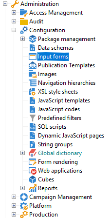

To design forms, edit the XML content in the XML editor:

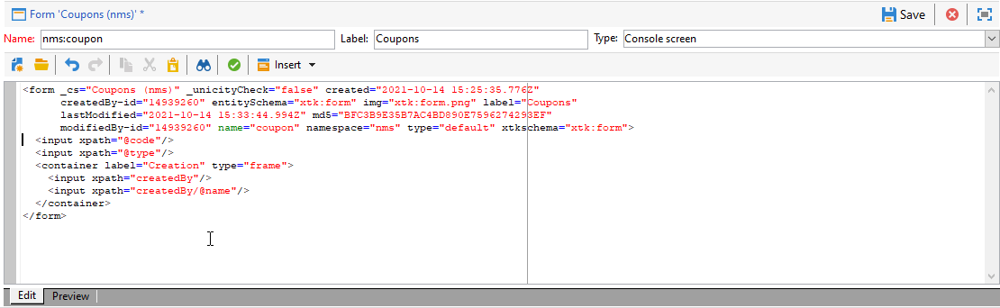

[Read more](form-structure.md#formatting).

To preview a form, click the **[!UICONTROL Preview]** tab:

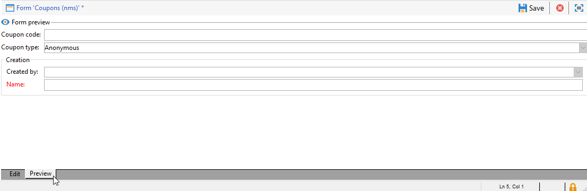

## Form types

You can create different types of input forms. The form type determines how users navigate the form:

* Console screen 

  This is the default form type. The form comprises a single page.

  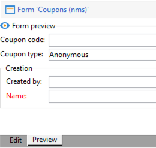

* Content Management

  Use this form type for content management. See this [use case](../../delivery/using/use-case--creating-content-management.md).

  

* Wizard

  This form comprises multiple floating screens that are ordered in a specific sequences. Users navigate from one screen to the next. [Read more](form-structure.md#wizards).

* Iconbox

  This form comprises multiple pages. To navigate the form, users select icons at the left of the form.

  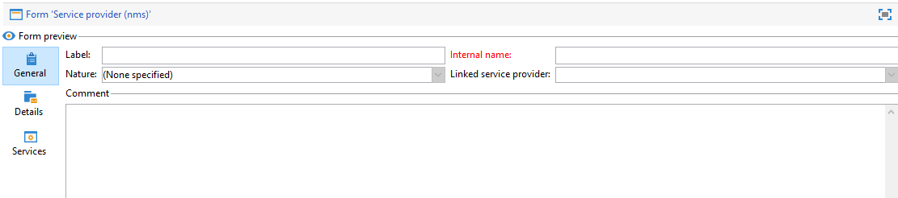

* Notebook

  This form comprises multiple pages. To navigate the form, users select tabs at the top of the form.

  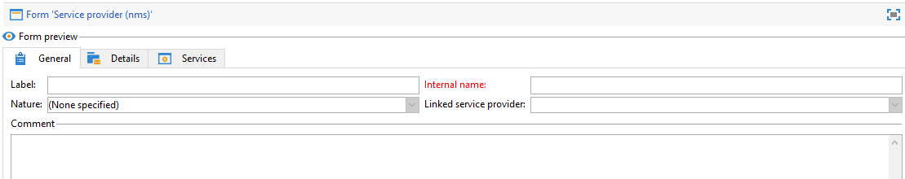

* Vertical pane

  This form shows a navigation tree.

* Horizontal pane

  This form shows a list of items.

## Containers

In forms, you can use containers for various purposes:

* Organize content within forms
* Define access to input fields
* Nest forms within other forms

[Read more](form-structure.md#containers).

### Organize content

Use containers to organize content within forms:

* You can group fields into sections.
* You can add pages to multipage forms.

To insert a container, use the `<container>` element. [Read more](form-structure.md#containers).

#### Group fields

Use containers to group input fields into organized sections.

To insert a section into a form, use this element: `<container type="frame">`. Optionally, to add a section title, use the `label` attribute.

Syntax: `<container type="frame" label="`*section_title*`"> […] </container>`

  In this example, a container defines the **Creation** section, which comprises the **[!UICONTROL Created by]** and **[!UICONTROL Name]** input fields:

```xml
<form _cs="Coupons (nms)" entitySchema="xtk:form" img="xtk:form.png" label="Coupons"
      name="coupon" namespace="nms" type="default" xtkschema="xtk:form">
  <input xpath="@code"/>
  <input xpath="@type"/>
  <container label="Creation" type="frame">
    <input xpath="createdBy"/>
    <input xpath="createdBy/@name"/>
  </container>
</form>
```


#### Add pages to multipage forms

For multipage forms, use a container to create a form page.

This example shows containers for the **General** and **Details** pages of a form:

```xml
<container img="ncm:book.png" label="General">
[…]
</container>
<container img="ncm:detail.png" label="Details">
[…]
</container>
```

### Define access to fields

Use containers to define what is visible and to define access to fields. You can turn on or off groups of fields.

### Nest forms

Use containers to nest forms within other forms. [Read more](#add-pages-to-multipage-forms).

## References to images

To find images, choose **[!UICONTROL Administration]** > **[!UICONTROL Configuration]** > **[!UICONTROL Images]** from the menu.

To associate an image with an element in the form, for example, an icon, you can add a reference to an image. Use the `img` attribute, for example, in the `<container>` element.

Syntax: `img="`*`namespace`*`:`*`filename`*`.`*`extension`*`"`

This example shows references to the `book.png` and `detail.png` images from the `ncm` namespace:

```xml
<container img="ncm:book.png" label="General">
[…]
</container>
<container img="ncm:detail.png" label="Details">
[…]
</container>
```

These images are used for icons that users click to navigate a multipage form:

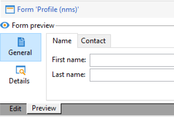


## Create a simple form {#create-simple-form}

To create a form, follow these steps:

1. From the menu, choose **[!UICONTROL Administration]** > **[!UICONTROL Configuration]** > **[!UICONTROL Input forms]**.
1. Click the **[!UICONTROL New]** button at the top right of the list.

    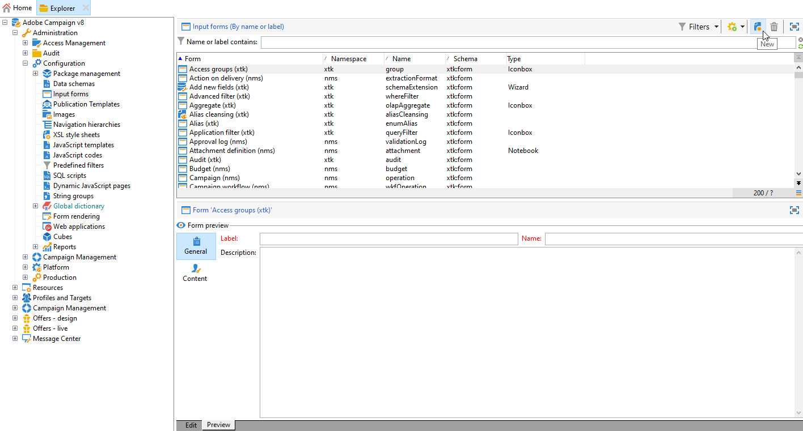

1. Specify the form properties:

   * Specify the form name and the namespace.
      
      The form name and the namespace can match the related data schema.  This example shows a form for the `cus:order` data schema:

      ```xml
      <form entitySchema="xtk:form" img="xtk:form.png" label="Order" name="order" namespace="cus" type="iconbox" xtkschema="xtk:form">
        […]
      </form>
      ```

     Alternatively, you can explicitly specify the data schema in the `entity-schema` attribute.
    
     ```xml
     <form entity-schema="cus:stockLine" entitySchema="xtk:form" img="xtk:form.png" label="Stock order" name="stockOrder" namespace="cus" xtkschema="xtk:form">
       […]
     </form>
     ```

   * Specify the label to be displayed on the form.
   * Optionally, specify the form type. If you do not specify a form type, the console screen type is used by default.

      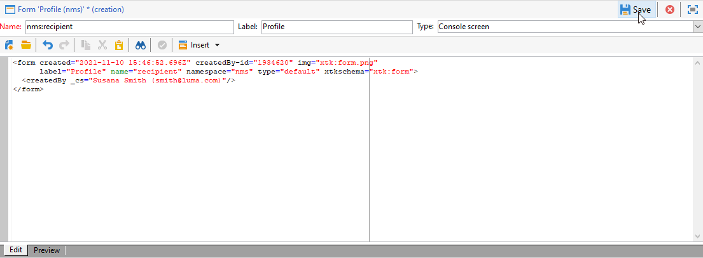

       If you are designing a multipage form, you can omit the form type in the `<form>` element and specify the type in a container.

1. Click **[!UICONTROL Save]**.

1. Insert the form elements.
   
   For example, to insert an input field, use the `<input>` element. Set the `xpath` attribute to the field reference as an XPath expression. [Read more](schema-structure.md#referencing-with-xpath).

   This example shows input fields based on the `nms:recipient` schema.

   ```xml
   <input xpath="@firstName"/>
   <input xpath="@lastName"/>
   ```

1. If the form is based on a specific schema type, you can look up the fields for this schema:

   1. Click **[!UICONTROL Insert]** > **[!UICONTROL Document fields]**.

      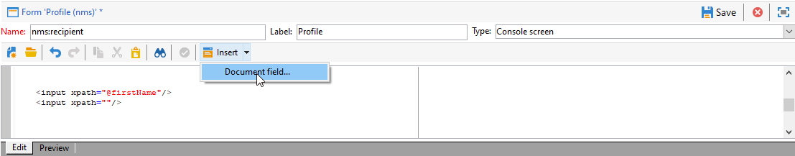

   1. Select the field and click **[!UICONTROL OK]**.
    
      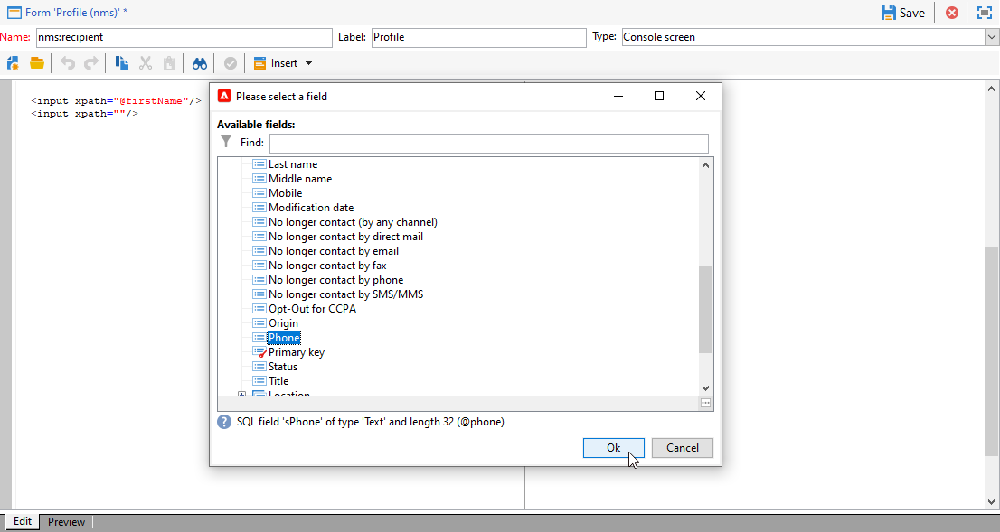

1. Optionally, specify the field editor.

   A default field editor is associated with each data type:
   * For a date-type field, the form shows an input calendar.
   * For an enumeration-type field, the form shows a selection list.

   You can use these field editor types:
  
   | Field editor | Form attribute |
   | --- | --- |
   | Radio button | `type="radiobutton"` |
   | Checkbox | `type="checkbox"` |
   | Edit tree | `type="tree"` |

    Read more about [memory list controls](form-structure.md#memory-list-controls).

1. Optionally, define access to the fields:

   | Element | Attribute | Description |
   | --- | --- | --- |
   | `<input>` | `read-only:"true"` | Provides read-only access to a field |
   | `<container>` | `type="visibleGroup" visibleIf="`*edit-expr*`"` | Conditionally displays a group of fields |
   | `<container>` | `type="enabledGroup" enabledIf="`*edit-expr*`"` | Conditionally enables a group of fields |

   Example:
   
   ```xml
   <container type="enabledGroup" enabledIf="@gender=1">
     […]
   </container>
   <container type="enabledGroup" enabledIf="@gender=2">
     […]
   </container>
   ```

1. Optionally, use containers to group fields into sections.

   ```xml
   <container type="frame" label="Name">
      <input xpath="@firstName"/>
      <input xpath="@lastName"/>
   </container>
   <container type="frame" label="Contact details">
      <input xpath="@email"/>
      <input xpath="@phone"/>
   </container>
   ```

   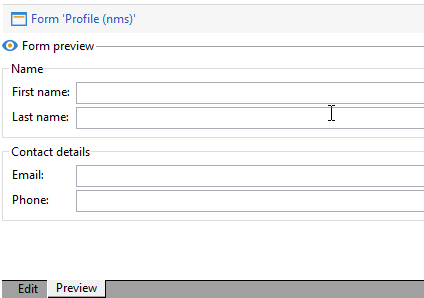

## Create a multipage form {#create-multipage-form}

You can create multipage forms. You can also nest forms within other forms.

### Create an `iconbox` form

Use the `iconbox` form type to show icons at the left of the form, which take users to different pages in the form.


To change the type of an existing form to `iconbox`, follow these steps:

1. Change the `type` attribute of the `<form>` element to `iconbox`: 
   
   ```xml
   <form […] type="iconbox">
   ```

1. Set a container for each form page:

   1. Add a `<container>` element as a child of the `<form>` element.
   1. To define a label and an image for the icon, use the `label` and `img` attributes.

      ```xml
      <form entitySchema="xtk:form" name="Service provider" namespace="nms" type="iconbox" xtkschema="xtk:form">
          <container img="xtk:properties.png" label="General">
              <input xpath="@label"/>
              <input xpath="@name"/>
              […]
          </container>
          <container img="nms:msgfolder.png" label="Details">
              <input xpath="@address"/>
              […]
          </container>
          <container img="nms:supplier.png" label="Services">
              […]
          </container>
      </form>
      ```

     Alternatively, remove the `type="frame"` attribute from the existing `<container>` elements.

### Create a notebook form

Use the `notebook` form type to show tabs at the top of the form, which take users to different pages.


To change the type of an existing form to `notebook`, follow these steps:

1. Change the `type` attribute of the `<form>` element to `notebook`:

   ```xml
   <form […] type="notebook">
   ```

1. Add a container for each form page:

    1. Add a `<container>` element as a child of the `<form>` element.
    1. To define the label and the image for the icon, use the `label` and `img` attributes.

    ```xml
      <form entitySchema="xtk:form" name="Service provider" namespace="nms" type="notebook" xtkschema="xtk:form">
          <container label="General">
              <input xpath="@label"/>
              <input xpath="@name"/>
              […]
          </container>
          <container label="Details">
              <input xpath="@address"/>
              […]
          </container>
          <container label="Services">
              […]
          </container>
      </form>
    ```

   Alternatively, remove the `type="frame"` attribute from the existing `<container>` elements.

### Nest forms {#nest-forms}

You can nest forms within other forms. For example, you can nest notebook forms within iconbox forms.

The level of nesting controls navigation. Users can drill down to subforms. 