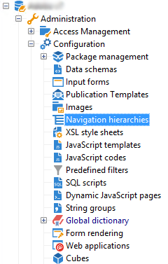
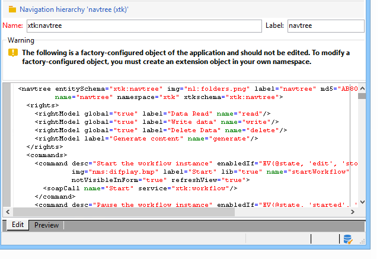
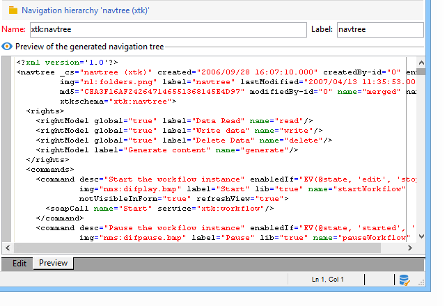

# Edit Campaign Explorer navigation tree{#edition}

The screen for creating and configuring the navigation hierarchy configuration documents is accessible via the **[!UICONTROL Administration > Configuration > Navigation hierarchies]** node:

The navigation hierarchy configuration is divided over several XML documents. It operates on a similar principle to schema extension: all documents are merged to generate a single document containing the whole configuration. This document cannot be edited, and is displayed via the "Preview" tab.

The edit field provides the content of the XML document:

>[!NOTE]
>
>The "Name" edit control lets you enter the document key consisting of the name and namespace. The "name" and "namespace" attributes of the **`<navtree>`** element are automatically updated in the XML edit field of the schema.

The preview automatically generates the merged document containing the complete configuration:

