# Form structure{#form-structure}

The description of a form is a structured XML document that observes the grammar of the form schema **xtk:form**.

The XML document of the input form must contain the `<form>` root element with the  **name** and  **namespace** attributes to populate the form name and namespace.

```
<form name="form_name" namespace="name_space">
...
</form>
```

By default, a form is associated with the data schema with the same name and namespace. To associate a form with a different name, set the **entity-schema** attribute of the `<form>` element to the name of the schema key. To illustrate the structure of an input form, let us describe an interface using the "cus:recipient" example schema:

```
<srcSchema name="recipient" namespace="cus">
  <enumeration name="gender" basetype="byte">    
    <value name="unknown" label="Not specified" value="0"/>    
    <value name="male" label="Male" value="1"/>   
    <value name="female" label="Female" value="2"/>   
  </enumeration>

  <element name="recipient">
    <attribute name="email" type="string" length="80" label="Email" desc="E-mail address of recipient"/>
    <attribute name="birthDate" type="datetime" label="Date"/>
    <attribute name="gender" type="byte" label="Gender" enum="gender"/>
  </element>
</srcSchema>
```

The input form based on the example schema:

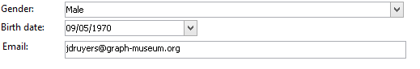

```
<form name="recipient" namespace="cus">
  <input xpath="@gender"/>
  <input xpath="@birthDate"/>
  <input xpath="@email"/>
</form>
```

The description of the edit controls starts from the `<form>` root element. An edit control is entered in an **`<input>`** element with the **xpath** attribute containing the path of the field in its schema.

The edit control automatically adapts to the corresponding data type and uses the label defined in the schema.

>[!NOTE]
>
>You can overload the label defined in its data schema by adding the **label** attribute to the `<input>` element:  
>`<input label="E-mail address" xpath="@name" />`

By default, each field is displayed on a single line and occupies all available space depending on the type of data.

## Formatting {#formatting}

The layout of the controls looks like the layout used in HTML tables, with the possibility of dividing a control into several columns, interlacing elements, or specifying the occupation of available space. Remember, however, that formatting only lets you divide the area up by proportions; you cannot specify fixed dimensions for an object.

To display the controls of the above example in two columns:

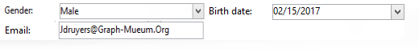

```
<form name="recipient" namespace="cus">
  <container colcount="2">
    <input xpath="@gender"/>
    <input xpath="@birthDate"/>
    <input xpath="@email"/>
  </container>
</form>
```

The **`<container>`** element with the **colcount** attribute lets you force the display of child controls onto two columns.

The **colspan** attribute on a control extends the control by the number of columns entered in its value:

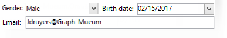

```
<form name="recipient" namespace="cus">
  <container colcount="2">
    <input xpath="@gender"/>
    <input xpath="@birthDate"/>
    <input xpath="@email" colspan="2"/>
  </container>
</form> 
```

By populating the **type="frame"** attribute, the container adds a frame around the child controls with the label contained in the **label** attribute:

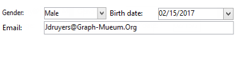

```
<form name="recipient" namespace="cus">
  <container colcount="2" type="frame" label="General">
    <input xpath="@gender"/>
    <input xpath="@birthDate"/>
    <input xpath="@email" colspan="2"/>
  </container>
</form>
```

A **`<static>`** element can be used to format the input form:

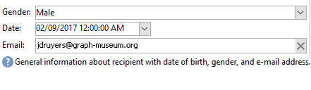

```
<form name="recipient" namespace="cus">
  <static type="separator" colspan="2" label="General"/>
  <input xpath="@gender"/>
  <input xpath="@birthDate"/>
  <input xpath="@email" colspan="2"/>
  <static type="help" label="General information about recipient with date of birth, gender, and e-mail address." colspan="2"/>
</form>
```

The **`<static>`** tag with the **separator** type lets you add a separator bar with a label contained in the **label** attribute.

A help text was added using the `<static>` tag with help type. The content of the text is entered in the **label** attribute.

## Containers {#containers}

Containers let you group a set of controls. They are represented by the **`<container>`** element. They were used above to format controls over several columns.

The **xpath** attribute on a `<container>` lets you simplify the referencing of child controls. The referencing of controls is then relative to the parent `<container>` parent.

Example of a container without "xpath":

```
<container colcount="2">
  <input xpath="location/@zipCode"/>
  <input xpath="location/@city"/>
</container>
```

Example with the addition of "xpath" to the element called "location":

```
<container colcount="2" xpath="location">
  <input xpath="@zipCode"/>
  <input xpath="@city"/>
</container>
```

### Types of container {#types-of-container}

Containers are used to construct complex controls using a set of fields formatted in pages.

#### Tab container {#tab-container}

A tab container formats data in pages that are accessible from tabs.

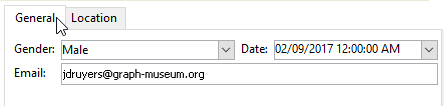

```
<container type="notebook">
  <container colcount="2" label="General">
    <input xpath="@gender"/>
    <input xpath="@birthDate"/>
    <input xpath="@email" colspan="2"/>
  </container>
  <container colcount="2" label="Location">
    ...
  </container>
</container>
```

The main container is defined by the **type="notebook"** attribute. Tabs are declared in the child containers, and the label of the tabs is populated from the **label** attribute.

>[!NOTE]
>
>A **style="down|up**(by default)**"** feature forces the vertical positioning of tab labels below or above the control. This feature is optional. 
>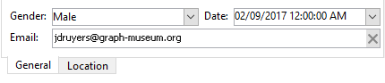 
>`<container style="down" type="notebook">  ... </container>`

#### Icon list {#icon-list}

This container displays a vertical icon bar that lets you select the pages to be displayed.

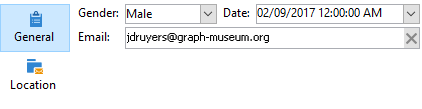

```
<container type="iconbox">
  <container colcount="2" label="General" img="xtk:properties.png">
    <input xpath="@gender"/>
    <input xpath="@birthDate"/>
    <input xpath="@email" colspan="2"/>
  </container>
  <container colcount="2" label="Location" img="nms:msgfolder.png">
    ...
  </container>
</container>
```

The main container is defined by the **type="iconbox"** attribute. The pages associated with the icons are declared in the child containers. The label of the icons is populated from the **label** attribute.

The icon of a page is populated from the `img="<image>"` attribute, where `<image>` is the name of the image corresponding to its key made up of the name and namespace (e.g., "xtk:properties.png").

The images are available from the **[!UICONTROL Administration > Configuration > Images]** node.

#### Visibility container {#visibility-container}

You can mask a set of controls via a dynamic condition.

This example illustrates the visibility of controls on the value of the "Gender" field:

```
<container type="visibleGroup" visibleIf="@gender=1">
  ...
</container>
<container type="visibleGroup" visibleIf="@gender=2">
  ...
</container>
```

A visibility container is defined by the attribute **type="visibleGroup"**. The **visibleIf** attribute contains the visibility condition.

Examples of condition syntax:

* **visibleIf="@email='peter.martinezATneeolane.net'"**: tests equality on string-type data. The comparison value must be in quotes.
* **visibleIf="@gender >= 1 and @gender != 2"**: condition on a numeric value.
* **visibleIf="@boolean1=true or @boolean2=false"**: test on Boolean fields.

#### Enabling container {#enabling-container}

This container lets you enable or disable a set of data from a dynamic condition. Disabling a control prevents it from being edited. The following example illustrates the enabling of controls from the value of the "Gender" field:

```
<container type="enabledGroup" enabledIf="@gender=1">
  ...
</container>
<container type="enabledGroup" enabledIf="@gender=2">
  ...
</container>
```

An enabling container is defined by the **type="enabledGroup"** attribute. The **enabledIf** attribute contains the activation condition.

## Editing a link {#editing-a-link}

Remember that a link is declared in the data schema as follows:

```
<element label="Company" name="company" target="cus:company" type="link"/>
```

The edit control of the link in its input form is as follows:

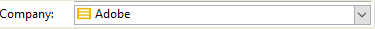

```
<input xpath="company"/>
```

Target selection is accessible via the edit field. Entry is assisted by type-ahead so that a target element can easily be found from the first few characters entered. The search is then based on the **Compute string** defined in the targeted schema. If the schema does not exist after validation in the control, a confirmation message of on-the-fly target creation is displayed. The confirmation creates a new record in the target table and associates it with the link.

A drop-down list is used to select a target element from the list of records already created.

The **[!UICONTROL Modify the link]** (folder) icon launches a selection form with the list of targeted elements and a filter zone:

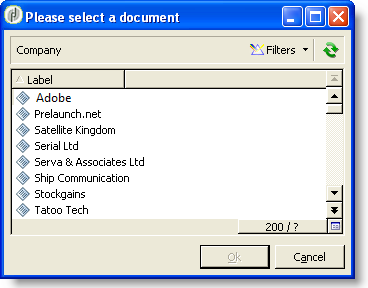

The **[!UICONTROL Edit link]** (magnifier) icon launches the edit form of the linked element. The form used is deduced by default on the key of the targeted schema. The **form** attribute lets you force the name of the edit form (e.g. "cus:company2").

You can restrict the choice of target elements by adding the **`<sysfilter>`** element from the link definition in the input form:

```
<input xpath="company">
  <sysFilter>
    <condition expr="[location/@city] =  'Newton"/>
  </sysFilter>
</input>
```

You can also sort the list with the **`<orderby>`** element:

```
<input xpath="company">
  <orderBy>
    <node expr="[location/@zipCode]"/>
  </orderBy>
</input>
```

### Control properties {#control-properties}

* **noAutoComplete**: disables type-ahead (with the value "true")
* **createMode**: creates the link on the fly if it does not exist. Possible values are:

    * **none**: disables creation. An error message is displayed if the link does not exist
    * **inline**: creates the link with the content in the edit field
    * **edition**: displays the edit form on the link. When the form is validated, the data is saved (default mode)

* **noZoom**: no edit form on the link (with the value "true")
* **form**: overloads the edit form of the targeted element

## List of links {#list-of-links}

A link entered in the data schema as a collection element (unbound="true") must go through a list in order to view all the elements associated with it.

The principle consists in displaying the list of linked elements with optimized data loading (downloading by data batch, execution of the list only if it is visible).

Example of a collection link in a schema:

```
<element label="Events" name="rcpEvent" target="cus:event" type="link" unbound="true">
...
</element>
```

The list in its input form:

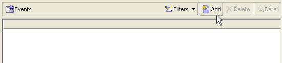

```
 <input xpath="rcpEvent" type="linklist">
  <input xpath="@label"/>
  <input xpath="@date"/>
</input>
```

List control is defined by the **type="linklist"** attribute. The list path must refer to the collection link.

The columns are declared via the **`<input>`** elements of the list. The **xpath** attribute refers to the path of the field in the target schema.

A toolbar with a label (defined on the link in the schema) is automatically placed above the list.

The list can be filtered via the **[!UICONTROL Filters]** button and configured to add and sort the columns.

The **[!UICONTROL Add]** and **[!UICONTROL Delete]** buttons let you add and delete collection elements on the link. By default, adding an element launches the edit form of the target schema.

The **[!UICONTROL Detail]** button is automatically added when the **zoom="true"** attribute is completed on the **`<input>`** tag of the list: it lets you launch the edit form of the selected line.

Filtering and sorting can be applied when the list is being loaded:

```
 <input xpath="rcpEvent" type="linklist">
  <input xpath="@label"/>
  <input xpath="@date"/>
  <sysFilter>
    <condition expr="@type = 1"/>
  </sysFilter>
  <orderBy>
    <node expr="@date" sortDesc="true"/>
  </orderBy>
</input>
```

### Relationship table {#relationship-table}

A relationship table lets you link two tables with N-N cardinality. The relationship table contains only the links to the two tables.

Adding an element to the list should therefore let you complete a list from one of the two links in the relationship table.

Example of a relationship table in a schema:

```
<srcSchema name="subscription" namespace="cus">
  <element name="recipient" type="link" target="cus:recipient" label="Recipient"/>
  <element name="service" type="link" target="cus:service" label="Subscription service"/>
</srcSchema>
```

For our example, we start with the input form of the "cus:recipient" schema. The list must display the associations with subscriptions to services and must allow you to add a subscription by selecting an existing service.

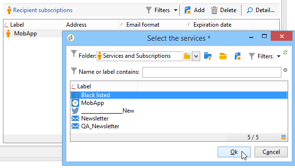

```
<input type="linklist" xpath="subscription" xpathChoiceTarget="service" xpathEditTarget="service" zoom="true">
  <input xpath="recipient"/>
  <input xpath="service"/>
</input>
```

The **xpathChoiceTarget** attribute lets you launch a selection form from the link entered. Creating the relationship table record will automatically update the link to the current recipient and the selected service.

>[!NOTE]
>
>The **xpathEditTarget** attribute lets you force editing of the selected line on the link entered.

### List properties {#list-properties}

* **noToolbar**: hides the toolbar (with value "true")
* **toolbarCaption**: overloads the toolbar label
* **toolbarAlign**: modifies the vertical or horizontal geometry of the toolbar (possible values: "vertical"|"horizontal") 
* **img**: displays the image associated with the list
* **form**: overloads the edit form of the targeted element
* **zoom**: adds the **[!UICONTROL Zoom]** button to edit the targeted element
* **xpathEditTarget**: sets editing on the link entered
* **xpathChoiceTarget**: for addition, launches the selection form on the link entered

## Memory list controls {#memory-list-controls}

Memory lists let you edit the collection elements using list data preloading. This list cannot be filtered or configured.

These lists are used on XML mapped collection elements or on low-volume links.

### Column list {#column-list}

This control displays an editable column list with a toolbar containing Add and Delete buttons.

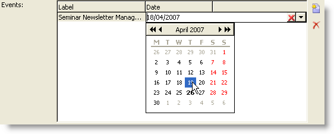

```
<input xpath="rcpEvent" type="list">
  <input xpath="@label"/>
  <input xpath="@date"/>
</input>
```

The list control must be filled in with the **type="list"** attribute, and the path of the list must refer to the collection element.

The columns are declared in the child **`<input>`** tags of the list. Column label and size can be forced with the **label** and **colSize** attributes.

>[!NOTE]
>
>Sort-order arrows are added automatically when the **ordered="true"** attribute is added to the collection element in the data schema.

The toolbar buttons can be aligned horizontally:

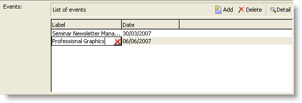

```
<input nolabel="true" toolbarCaption="List of events" type="list" xpath="rcpEvent" zoom="true">
  <input xpath="@label"/>
  <input xpath="@date"/>
</input>
```

The **toolbarCaption** attribute forces the horizontal alignment of the toolbar and enters the title above the list.

#### Zoom in a list {#zoom-in-a-list}

Insertion and editing of the data in a list can be entered in a separate edit form.


```
<input nolabel="true" toolbarCaption="List of events" type="list" xpath="rcpEvent" zoom="true" zoomOnAdd="true">
  <input xpath="@label"/>
  <input xpath="@date"/>

  <form colcount="2" label="Event">
    <input xpath="@label"/>
    <input xpath="@date"/>
  </form>
</input>
```

The edit form is completed from the `<form>`  element under list definition. Its structure is identical to that of an input form. The **[!UICONTROL Detail]** button is added automatically when the **zoom="true"** attribute is completed on the **`<input>`** tag of the list. This attribute lets you launch the edit form of the selected line.

>[!NOTE]
>
>Adding the **zoomOnAdd="true"** attribute forces the edit form to be called up when a list element is inserted.

### List properties {#list-properties-1}

* **noToolbar**: hides the toolbar (with value "true")
* **toolbarCaption**: overloads the toolbar label
* **toolbarAlign**: modifies the positioning of the toolbar (possible values: "vertical"|"horizontal") 
* **img**: displays the image associated with the list
* **form**: overloads the edit form of the targeted element
* **zoom**: adds the **[!UICONTROL Zoom]** button to edit the targeted element
* **zoomOnAdd**: launches the edit form on the addition
* **xpathChoiceTarget**: for addition, launches the selection form on the link entered

## Non-editable fields {#non-editable-fields}

To display a field and prevent it from being edited, use the **`<value>`** tag or complete the **readOnly="true"** attribute on the **`<input>`** tag.

Example on the "Gender" field:

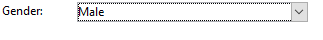

```
<value value="@gender"/>
<input xpath="@gender" readOnly="true"/>

```

## Radio button {#radio-button}

A radio button lets you choose from several options. The **`<input>`** tags are used to list the possible options, and the **checkedValue** attribute specifies the value associated with the choice.

Example on the "Gender" field:

```
<input type="RadioButton" xpath="@gender" checkedValue="0" label="Choice 1"/>
<input type="RadioButton" xpath="@gender" checkedValue="1" label="Choice 2"/>
<input type="RadioButton" xpath="@gender" checkedValue="2" label="Choice 3"/>
```

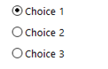

## Checkbox {#checkbox}

A checkbox reflects a Boolean state (selected or not). By default, this control is used by "Boolean" (true/false) fields. A variable taking a default value of 0 or 1 can be associated with this button. This value can be overloaded via the **checkValue** attributes.

```
<input xpath="@boolean1"/>
<input xpath="@field1" type="checkbox" checkedValue="Y"/>
```

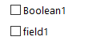

## Navigation hierarchy edit {#navigation-hierarchy-edit}

This control builds a tree on a set of fields to be edited.

The controls to be edited are grouped in a **`<container>`** entered under the **`<input>`** tag of the tree control:

```
<input nolabel="true" type="treeEdit">
  <container label="Text fields">
    <input xpath="@text1"/>
    <input xpath="@text2"/>
  </container>
  <container label="Boolean fields">
    <input xpath="@boolean1"/>
    <input xpath="@boolean2"/>
  </container>
</input>
```

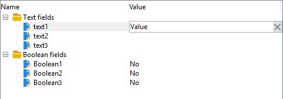

## Expression field {#expression-field}

An expression field updates a field dynamically from an expression; the **`<input>`** tag is used with an **xpath** attribute to enter the path of the field to be updated and an **expr** attribute containing the update expression.

```
<!-- Example: updating the boolean1 field from the value contained in the field with path /tmp/@flag -->
<input expr="Iif([/tmp/@flag]=='On', true, false)" type="expr" xpath="@boolean1"/>
<input expr="[/ignored/@action] == 'FCP'" type="expr" xpath="@launchFCP"/>
```

## Context of forms {#context-of-forms}

The execution of an input form initializes an XML document containing the data of the entity being edited. This document represents the context of the form, and can be used as a workspace.

### Updating the context {#updating-the-context}

To modify the context of the form, use the `<set expr="<value>" xpath="<field>"/>` tag, where `<field>` is the destination field, and `<value>` is the update expression or value.

Examples of use of the `<set>` tag:

* **`<set expr="'Test'" xpath="/tmp/@test" />`**: positions the 'Test' value at temporary location /tmp/@test1
* **`<set expr="'Test'" xpath="@lastName" />`**: updates the entity on the "lastName" attribute with the 'Test' value
* **`<set expr="true" xpath="@boolean1" />`**: sets the value of the "boolean1" field to "true"
* **`<set expr="@lastName" xpath="/tmp/@test" />`**: updates with the content of the "lastName" attribute

The context of the form can be updated when initializing and closing the form via the **`<enter>`** and **`<leave>`** tags.

```
<form name="recipient" namespace="cus">
  <enter>
    <set...
  </enter>
  ...
  <leave>
    <set...
  </leave>
</form>
```

>[!NOTE]
>
>The `<enter>`  and  `<leave>`   tags can be used on the `<container>` of pages ("notebook" and "iconbox" types).    

### Expression language {#expression-language-}

A macro-language can be used in form definition in order to perform conditional tests.

The **`<if expr="<expression>" />`** tag executes the instructions specified under the tag if the expression is verified:

```
<if expr="([/tmp/@test] == 'Test' or @lastName != 'Doe') and @boolean2 == true">
  <set xpath="@boolean1" expr="true"/>
</if>
```

The **`<check expr="<condition>" />`** tag combined with the **`<error>`** tag prevents validation of the form and displays an error message if the condition is not satisfied:

```
<leave>
  <check expr="/tmp/@test != ''">
    <error>You must populate the 'Test' field!</error> 
  </check>
</leave>
```

## Wizards {#wizards}

A wizard guides you through a set of data entry steps in the form of pages. The data entered is saved when you validate the form.

A wizard has the following structure:

```
<form type="wizard" name="example" namespace="cus" img="nms:rcpgroup32.png" label="Wizard example" entity-schema="nms:recipient">
  <container title="Title of page 1" desc="Long description of page 1">
    <input xpath="@lastName"/>
    <input xpath="comment"/>
  </container>
  <container title="Title of page 2" desc="Long description of page 2">
    ...
  </container>
  ...
</form>

```

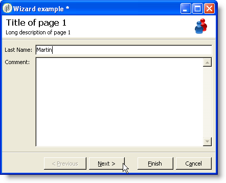

The presence of the **type="wizard"** attribute on the `<form>` element lets you define the wizard mode in the construction of the form. The pages are completed from `<container>` elements, which are children of the `<form>` element. The `<container>` element of a page is populated with the title attributes for the title and desc to display the description under the page title. The **[!UICONTROL Previous]** and **[!UICONTROL Next]** buttons are automatically added to allow browsing between pages.

The **[!UICONTROL Finish]** button saves the data entered and closes the form.

### SOAP methods {#soap-methods}

SOAP method execution can be launched from a populated **`<leave>`** tag at the end of a page.

The **`<soapcall>`** tag contains the call for the method with the following input parameters:

```
<soapCall name="<name>" service="<schema>">
  <param type="<type>" exprIn="<xpath>"/>  
  ...
</soapCall>
```

The name of the service and its implementation schema are entered via the **name** and **service** attributes of the **`<soapcall>`** tag.

The input parameters are described on the **`<param>`** elements under the **`<soapcall>`** tag.

The parameter type must be specified via the **type** attribute. The possible types are as follows:

* **string**: character string
* **boolean**: Boolean
* **byte**: 8-bit integer
* **short**: 16-bit integer
* **long**: 32-bit integer
* **short**: 16-bit integer
* **double**: double-precision floating point number
* **DOMElement**: element-type node

The **exprIn** attribute contains the location of the data to be passed as a parameter.

**Example**:

```
<leave>
  <soapCall name="RegisterGroup" service="nms:recipient">         
    <param type="DOMElement" exprIn="/tmp/entityList"/>         
    <param type="DOMElement" exprIn="/tmp/choiceList"/>         
    <param type="boolean"    exprIn="true"/>       
  </soapCall>
</leave>
```
