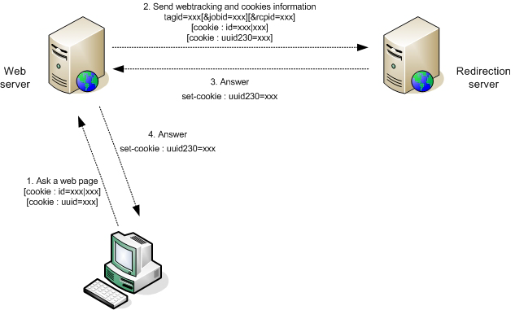

# Inserting tags in your site{#inserting-tags-in-your-site}

## Simple method {#simple-method}

This method consists of sending an HTTP call to the redirection server by inserting an **``** HTML tag in the HTML source code of the web page you wish to track.

>[!IMPORTANT]
>
>This method uses the cookies sent by the web browser to identify the recipient, and is not 100% reliable.

**Example**:

```

  <...>
  <body>
  <script>
      document.write("");
    </script>
    <noscript>
     
    </noscript>
    <h1>My site</h1>
    <form action="http://localhost/amount.md">
      Quantity: <input type="text" name="quantity"/><br/><br/>
      Amount: <input type="text" name="amount"/><br/><br/>
      <input value="Save" type="submit">
    </form>
  </body>
</html>
```

Insertion of a TRANSACTION-type web tracking tag in the confirmation page ("amount.md").

```
<html>
  <body>
    <script>
      function getURLparam(name) 
      {
        var m = location.search.match new RegExp("[?&]" + name + "=([^&]+)"));
        return m ? unescape(m[1]) : "";
      }
 
       var params = "https://localhost/r/" + Math.random().toString() + "?tagid=amount&amount="
                      +getURLparam("amount")+"&article="+getURLparam("quantity");
       document.write("");
    </script>

    <h1>Approval confirmation</h1>
  </body>
</html>
```

### Dynamic generation of web tracking tags {#dynamic-generation-of-web-tracking-tags}

When your web pages are generated dynamically, you can add the web tracking tag at page generation time.

**Example**: Web tracking added to JSPs.

```
<%@page import="java.util.Random" %>
<html>
  <body>
    ?tagid=home'>
    <h1>My site</h1>
    <form action="https://localhost/amount.md">
      Quantity: <input type="text" name="quantity"/><br/><br/>
      Amount: <input type="text" name="amount"/><br/><br/>
      <input value="Save" type="submit">
    </form>
  </body>
</html>
```

```
<%@page import="java.util.Random" %>
<html>
  <body>
    <%  
      String strParams = new Random().nextInt() + "?tagid=amount";
      strParams += "&amount="+request.getParameter("amount");
      strParams += "&article="+request.getParameter("quantity");
    %>
    '>
    <h1>Approval confirmation</h1>
    </body>
</html>
```

## Optimum method {#optimum-method-}

If you wish to control the information sent to the redirection server, the most reliable way is to perform the HTTP query synchronously yourself using a page generating language.

The URL you construct must obey the syntax rules defined in [Web tracking tag: definition](../../configuration/using/web-tracking-tag--definition.md).



>[!NOTE]
>
>Redirection and web tracking use cookies, and it is important that the web server performing the synchronous HTTP call be in the same domain as the redirection server. The various HTTP exchanges must convey the 'id', 'uuid', and 'uuid230' cookies.

**Example**: Dynamic generation in Java, with recipient authentication using their account number.

```
[...]
  // Recipient account, amount and articles
  String strAccount = request.getParameter("account");
  String strAmount = request.getParameter("amount");
  String strArticle = request.getParameter("article");

  StringBuffer strCookies = new StringBuffer();
  String strSetCookie = null;

  // Get cookies from client request
  Cookie[] cookies = request.getCookies();
  for(int i=0; i< cookies.length; i++ )
  {
    Cookie c = cookies[i];
    String strName = c.getName();
    if( strName.equals("id") || strName.equals("uuid") || strName.equals("uuid230") )
      // Helper function to add cookies in string
      AddCookie(strCookies, c);
  }
  // Now perform a synchronous HTTP request to inform redirection server
  // Add a tagid in auto-discover mode, and a default jobId to use (in hexa)
  StringBuffer strURL = new StringBuffer("https://www.adobe.com/r/a?tagid=cmd_page%7Ct&jobid=27EE");
  if( strAccount != null )
    AddParameter(strURL, "rcpid", "saccount="+strAccount);
  if( strAmount != null )
    AddParameter(strURL, "amount", strAmount);
  if( strArticle != null )
    AddParameter(strURL, "article", strArticle);
  
  URL url = new URL(strURL.toString());
  HttpURLConnection connection = (HttpURLConnection)url.openConnection();
  // Add the client cookies
  if( strCookies.length() > 0 )
    connection.setRequestProperty("Cookie", strCookies.toString());

  int errcode = connection.getResponseCode();

  // Now add the Adobe Campaign cookies if the server returned one :
  if( errcode == 200 )
  {
    strSetCookie = connection.getHeaderField("Set-Cookie");
    if( strSetCookie != null && strSetCookie.length() > 0 )
      response.addHeader("Set-Cookie", strSetCookie);
  }
  [...]
```
