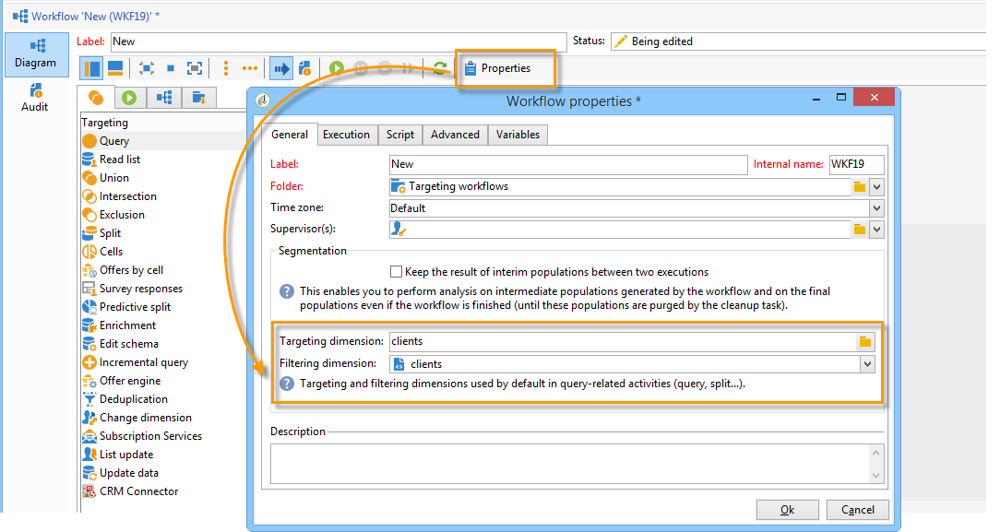

# Managing workflows{#managing-workflows}

By default, your new workflows are based on a workflow template that is been pre-configured and based on a recipient table (nms:recipient). In order for them to be automatically based on the custom table of recipients referenced in the **Nms_DefaultRcpSchema** option (see [Configuring the interface](../../configuration/using/configuring-the-interface.md) section), you must create a new workflow template.

Create a new template via the **Resources > Templates > Workflow templates** node. In the template's properties, the dimensions provided match your external recipients table.

By basing your new workflows on a recently created template, your personalized table will be selected by default for the workflow's global targeting and filtering dimensions.

All the activities used in your workflow will thus use your custom table without needing any additional manual configuration.

For more information on workflows, refer to [this section](../../workflow/using/about-workflows.md).

