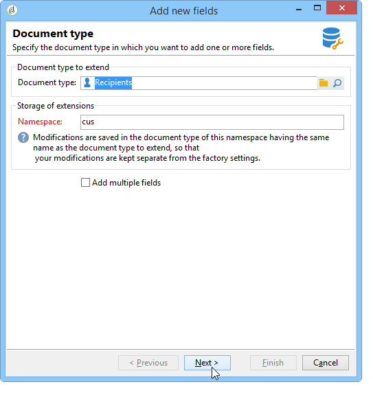
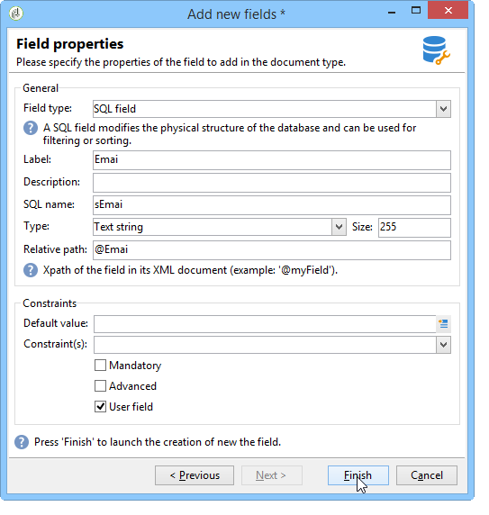

# New field wizard{#new-field-wizard}


A wizard accessible via **[!UICONTROL Tools > Advanced > Add new fields]** lets you add one or more fields to a table in the database.

Validating the wizard updates the extension schema of the table to be extended and launches the SQL script to modify the physical structure of the database.

This assistant has the advantage of quickly adding a field without needing to know the structure of a data schema.

The main disadvantage is the limitation of the data and the properties to be extended.

The wizard screens contain the following steps:

1. The first page lets you enter the name of the schema to be extended and the namespace of the extension schema where the modifications will be saved: 

   

1. The next page lets you enter the properties of the field to be added.

   

1. To confirm the changes, click the **[!UICONTROL Finish]** button.

An extension file, called "cus:recipient" in our example, is automatically created and the corresponding SQL script is executed:

```
<srcSchema extendedSchema="nms:recipient" label="Recipients" name="recipient"  namespace="cus">  
  <element name="recipient">    
    <attribute belongsTo="cus:recipient" dataPolicy="email" label="Email" length="80" name="email1" sqlname="sEmail1" type="string" user="true"/>  
  </element>
</srcSchema>
```

>[!NOTE]
>
>By default, the added fields are declared with the property **user** (with the value "true"). This lets you display and edit the field in the input form of the extended schema using a "treeEdit"-type control (refer to Input Form).
