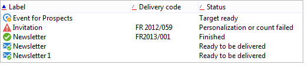

# Schema characteristics{#schema-characteristics}

The characteristics of a schema that references an existing table are as follows:

* Adobe Campaign must not modify SQL objects relative to existing tables,
* The names of tables and columns must be specified explicitly,
* Indexes must be declared.

>[!IMPORTANT]
>
>Do not delete fields in the standard recipient table, even if they are useless. This may cause behavioural errors in the Adobe Campaign database.

## The view attribute {#the-view-attribute}

Source schemas accept the **view** attribute for the **srcSchema** root element. It must be used when Adobe Campaign is manipulated in custom tables. The **view="true"** attribute tells the database structure update wizard to ignore this schema. The application is therefore prohibited from synchronizing the table, its columns and its indexes with the corresponding schema.

When this attribute is set to **true**, the schema is used only to generate SQL queries to access the data of this table.

## Names of tables and columns {#names-of-tables-and-columns}

When tables are created by the table update wizard, the names of tables and columns are generated automatically based on the names of the respective schemas and attributes. It is however possible to force the SQL names to be used by entering the following attributes:

* **sqltable** within the main element of the schema, to specify the table,
* **sqlname** within each attribute, to specify the columns.

**Example**:

```

<element label="Individual" name="individual" sqltable="individual">
    <key internal="true" name="id">
      <keyfield xpath="@id"/>
    </key> 
    <attribute name="id" type="long" length="32" />
    <attribute name="lastName" type="string" length="100" sqlname="Last_Name"/>
    <attribute name="firstName" type="string" length="100" sqlname="First_Name"/>
    <attribute name="email" type="string" length="100"/>
    <attribute name="mobile" type="string" length="100"/>
</element>

```

In this example, if the names of the tables and columns had not been explicitly specified, the application would have used **CusIndividual** for the table, **lastName** and **firstName** for the columns.

In a schema, it is possible to populate only part of the columns of an existing table. Unpopulated columns will not be user-accessible.

## Indexed fields {#indexed-fields}

When sorting the records of a list from the client console, better performance is obtained by sorting on indexed fields. Declaring an index in a schema makes the console display the indexed fields with a red line under the sort-order arrow to the left of the column label, as shown below:



In a schema, an index is defined as follows:

```
<dbindex name="name_of_index" unique="true/false"
  <keyfield xpath="xpath_1st_field"/
  <keyfield xpath="xpath_2nd_field"/
  ...
</dbindex
```

That's why it is important to declare existing indexes of the custom table in the matching schema.

An index is implicitly declared for each key and link declaration of the source schema. Index declaration can be prevented by specifying the **noDbIndex="true"** attribute:

**Example**:

```
<key internal="true" name="customer" noDbIndex="true">
  <keyfield xpath="@customerId"/>
</key>
```
