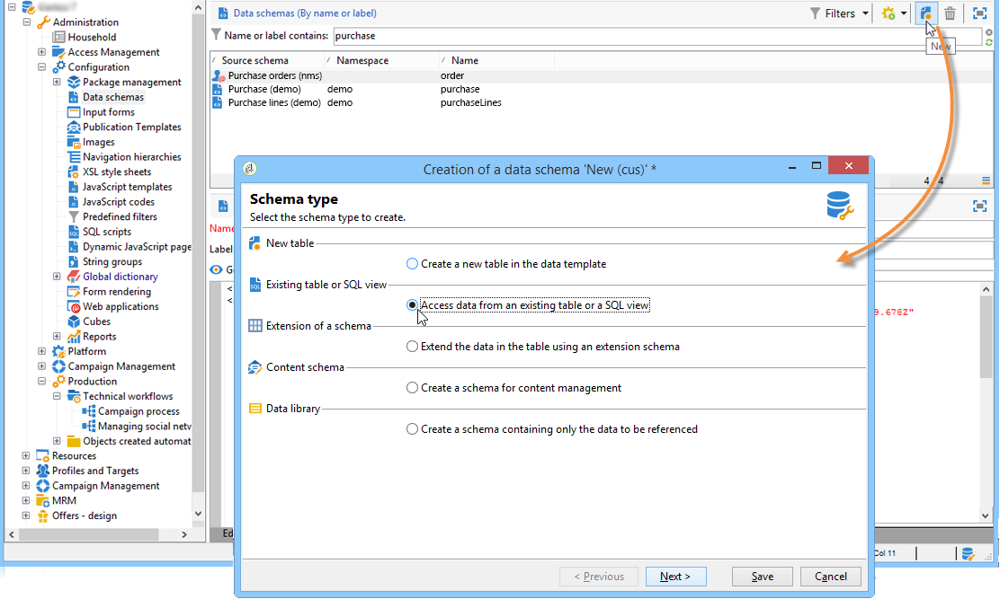
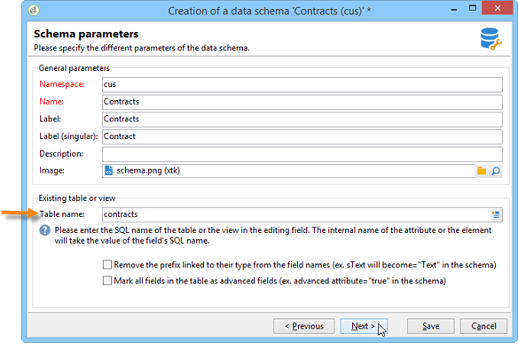
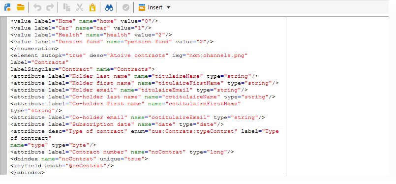

# Schema of an existing table{#schema-of-an-existing-table}

## Overview {#overview}

When the application needs to access the data of an existing table, an SQL view, or data from a remote database, create its schema in Adobe Campaign with the following data:

* Name of table: enter the name of the table (with its alias when a dblink is used) with the "sqltable" attribute, 
* schema key: reference the reconciliation field(s),
* indexes: used to generate queries,
* The fields and their location in the XML structure: fill in only the fields used in the application,
* links: if there are joins with the other tables of the base.

## Implementation {#implementation}

To create the corresponding schema, apply the following stages:

1. Edit the **Administration>Configuration>Data schemas** node of the Adobe Campaign tree and click **New**.
1. Select the **Access data from an existing table or an SQL view** option and click **Next**.

   

1. Choose the table or the existing view:

   

1. Adapt the schema content to suit your needs.

   

   >[!CAUTION]
   >

**Example** :

```
<srcSchema name="recipient" namespace="cus" view="true">
  <element name="recipient" sqltable="dbsrv.recipient">
    <key name="email">
      <keyfield xpath="@email"/>
    </key>   
    <attribute name="email" type="string" length="80" sqlname="email"/>
  </element>
</srcSchema>
```

## Accessing an external database {#accessing-an-external-database}

The **Federated Data Access - FDA** option give you access to the data stored in an external database.

The configuration to be carried on the schemas to access data in an external database is detailed in [this page](../../platform/using/accessing-an-external-database.md#creating-the-data-schema).
